# Smart Home Kit for Arduino Project


## 1.Overview:

This Smart Home Learning Kit based on the Arduino platform is newly rolled out by Keyestudio DIY Robot Co. Ltd.

It simulates the real smart home and demonstrates the cozy and comfortable life for people.

In fact, the logic programming, an invisible hand, controls everything in smart home: it turns on the air conditioner, boots up the water heater, secures your home with an electronic lock, and sets your LED lights and smart curtains to turn on automatically when you get home. Meanwhile, the intelligent lighting system allows you to create a comfortable, tranquil atmosphere. Everything is finished by a remote control or your own cellphone.

As Bill Gates puts it, "In the near future, a house without a smart home system will be as unfashionable as a home without Internet access today."

So, go ahead and get started; let's build this amazing analog smart home.


## 2.Kit list

After getting this smart home kit, we need to make sure that there are not missing components.

| # | Name                                                           | QTY | Picture                                          |
|----|----------------------------------------------------------------|-----|--------------------------------------------------|
| 1  | Keyestudio PLUS Control Board （Compatible with Arduino UNO ） | 1   |  |
| 2  | Keyestudio Sensor Shield V 5.2                                 | 1   |  |
| 3  | Wooden Board*10 T=3MM                                          | 1   |   |
| 4  | White LED Module                                               | 1   |  |
| 5  | Yellow LED Module                                              | 1   | 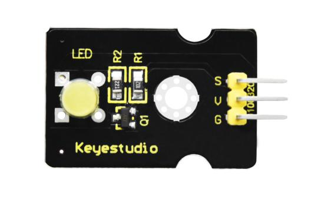 |
| 6  | Button Sensor                                                  | 2   | 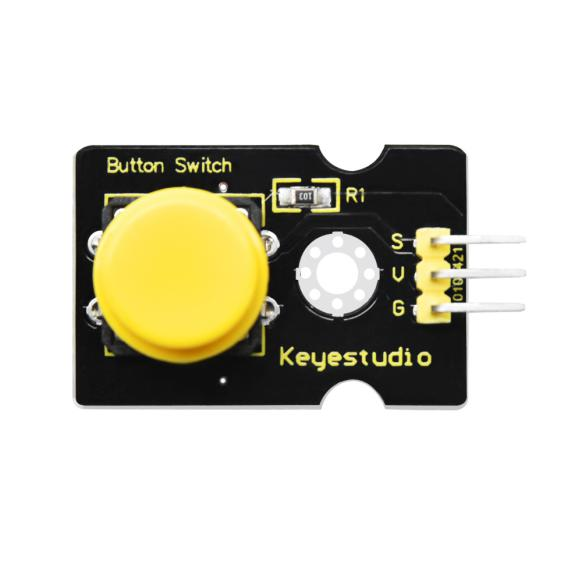 |
| 7  | Photocell Sensor                                               | 1   |  |
| 8  | PIR Motion Sensor                                              | 1   |  |
| 9  | MQ-2 Gas Sensor                                                | 1   | 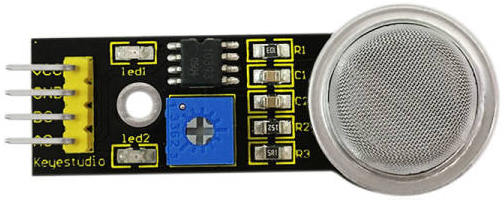  |
| 10 | Relay Module                                                   | 1   |  |
| 11 | Bluetooth HM-10 Module                                         | 1   | 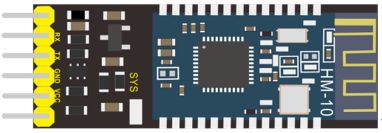  |
| 12 | Passive Buzzer Sensor                                          | 1   |  |
| 13 | Fan module                                                     | 1   |  |
| 14 | Steam Sensor                                                   | 1   |  |
| 15 | Servo Motor                                                    | 2   |   |
| 16 | LCD1602 Display Module                                         | 1   |  |
| 17 | Soil Humidity Sensor                                           | 1   | 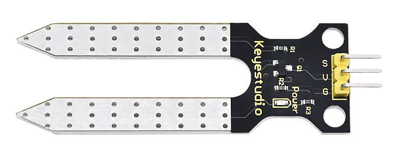 |
| 18 | USB Cable                                                      | 1   |  |
| 19 | Female to Female Dupont Cables                                 | 40  | 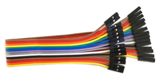  |
| 20 | Male to female Dupont Cables                                   | 6   |   |
| 21 | M3 Nickel Plated Nuts                                          | 25  |   |
| 22 | M2*12MM Round Head Screws                                      | 6   |   |
| 23 | M2 Nickel Plated Nuts                                          | 6   |   |
| 24 | M3*10MM Dual-pass  Copper Bush                                 | 4   |   |
| 25 | M3*6MM Round Head Screws                                       | 8   |   |
| 26 | M3 304 Stainless Steel Self-locking Nuts                       | 4   | 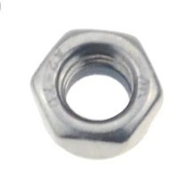  |
| 27 | M3*10MM Round Head Screws                                      | 20  |   |
| 28 | M2.5*10MM Round Head Screws                                    | 6   |   |
| 29 | M2.5 Nickel Plated Nuts                                        | 6   |   |
| 30 | M3*12MM Round Head Screws                                      | 6   |   |
| 31 | M3*10MM Flat Head Screws                                       | 2   |   |
| 32 | M1.2*5MM Round Head Self-tapping Screws                        | 10  |   |
| 33 | 6-Slot AA Battery Holder with DC Head and 15cm Dew Line        | 1   | 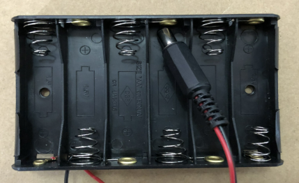  |
| 34 | Black-yellow  Handle 3*40MM Cross Screwdriver                  | 1   | 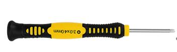 |
| 35 | 20cm 2.54 3Pin F-F Jumper Wire                                 | 13  | 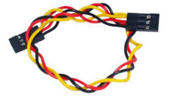  |
| 36 | 20cm 2.54 4Pin F-F Jumper Wire                                 | 2   | 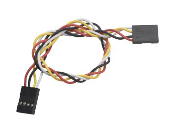 |              |

## 3.Download Software & Install Driver

**Installing Arduino IDE**

When you get control board, you need to download Arduino IDE and driver firstly.

You could download Arduino IDE from the official website:

<https://www.arduino.cc/>, click the **SOFTWARE** on the browse bar to enter download page, as shown below:

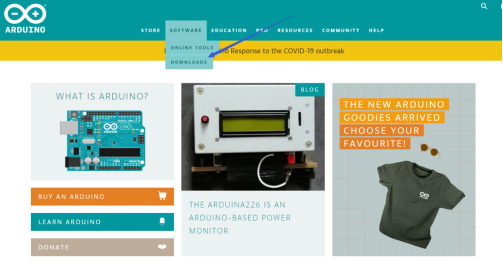

There are various versions of IDE for Arduino. Just download a version compatible with your system. Here we will show you how to download and install the windows version of Arduino IDE.

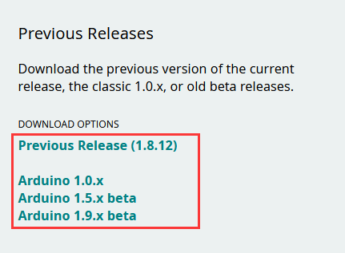


You can choose between the Installer (.exe) and the Zip packages. We suggest you use the first one that installs directly everything you need to use the Arduino Software (IDE), including the drivers. With the Zip package you need to install the drivers manually. The Zip file is also useful if you want to create a portable installation.

You just need to click **JUST DOWNLOAD**.

**Keyestudio PLUS Development Board**

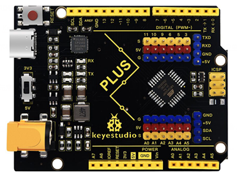

Now, let’s get to know Keyestudio PLUS development board. It is the core of the whole kit.

Keyestudio PLUS Control Board is fully compatible with Arduino UNO R3 board. Its functions is as same as Arduino UNO R3 board. Moreover, some improvements made highly strengthen its function. Alternatively, it is the best choice to learn building the circuit and designing codes.


- Serial communication interface: D0 is RX, D1 is TX

- PWM interface (pulse width modulation): D3 D5 D6 D9 D10 D11

- External interrupt interface: D2 (interrupt 0) and D3 (interrupt 1)

- SPI communication interface: D10 is SS, D11 is MOSI, D12 is MISO, D13 is SCK

- IIC communication port: A4 is SDA, A5 is SCL


**Installing the driver for Windows system**

Let’s install the driver of Keyestudio PLUS Control Board. The USB-TTL chip on PLUS board adopts CP2102 serial chip. The driver program of this chip is included in Arduino 1.8 version and above, which is convenient. 

You can download the driver of the CP2101 in the following link.

<https://www.silabs.com/developers/usb-to-uart-bridge-vcp-drivers?tab=downloads>

For Windows system, you can select the first driver to download and upzip it.

Then open the device manager of computer. Right click Computer----- Properties----- Device Manager

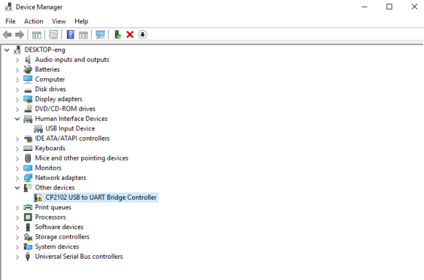

The yellow exclamation mark on the page implies that the driver of CP2101 isn’t installed. Next, you should double-click the hardware to update the driver.

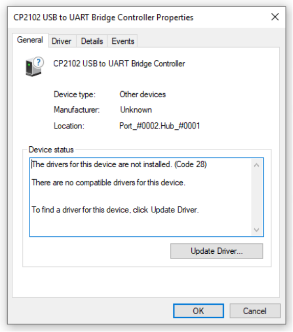

Click“OK”to enter the following page, click“browse my computer for updated driver software”. As shown below:

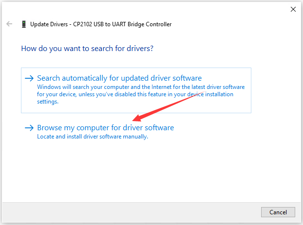

Navigate to the CP210x_Universal_Windows_Driver unzip folder that you have downloaded and click Next.

There is a DRIVERS folder in Arduino software installed package（), open driver folder and check the driver of CP210X series chips.

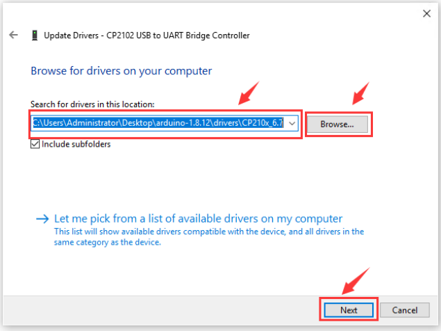

Open device manager, you will find the yellow exclamation mark disappear. The driver of CP2102 is installed successfully.

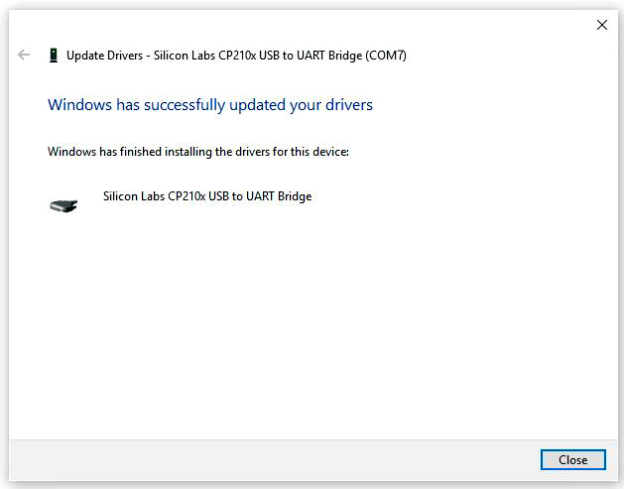

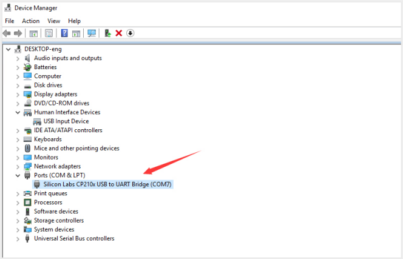

**Installing the driver for MAC system**


1.You can download the driver of the CP2101 in the following link.

<https://www.silabs.com/developers/usb-to-uart-bridge-vcp-drivers?tab=downloads>

2.For MacOS system, you can select the this driver to download and upzip it.


3.Open the driver folder and double-click SiLabsUSBDriverDisk.dmg file.


4.You will view following files as follows:


5\. Double-click Install CP210x VCP Driver, tick Don’t warn me and click Open


6.Click Continue


7.Click Continue and Agree


8.Click Continue and enter your user password.


9.Select Open Security Preferences

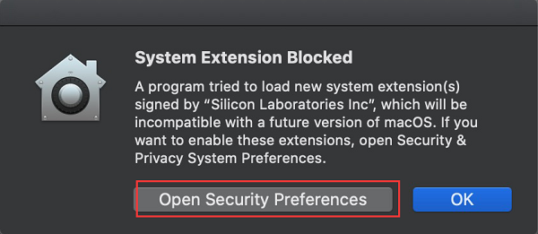

10.Click the lock then enter your user’s password to authorize.


11.Then click Allow

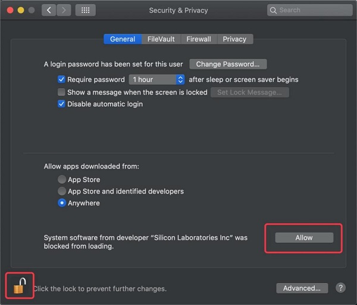

12.Back to installation page, and wait to install.

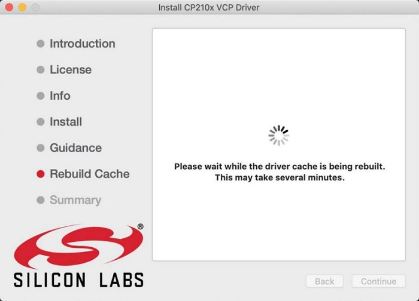

Successfully installed 

**Arduino IDE Setting**

Clickicon，open Arduino IDE.


To avoid the errors when uploading the program to the board, you need to select the correct Arduino board that matches the board connected to your computer.

Then come back to the Arduino software, you should click Tools→Board, select the board. (as shown below)


Then select the correct COM port (you can see the corresponding COM port after the driver is successfully installed)


Before uploading the program to the board, let’s demonstrate the function of each symbol in the Arduino IDE toolbar.


- Used to verify whether there is any compiling mistakes or not.

- Used to upload the sketch to your Arduino board.

- Used to send the serial data received from board to the serial plottle.

- Used to send the serial data received from board to the serial monitor.

**Start First Program**

Open the file to select Example, choose BLINK from BASIC, as shown below:


Set board and COM port, the corresponding board and COM port are shown on the lower right of IDE.

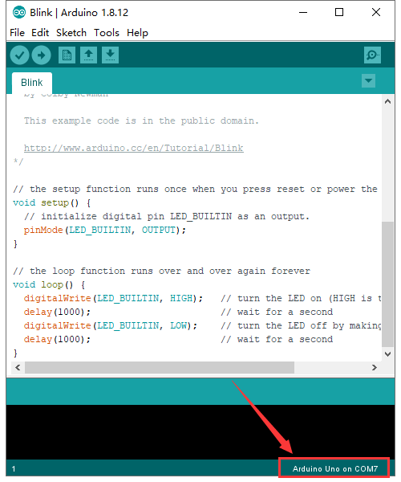


Clickto start compiling the program, check errors.


Clickto upload the program, upload successfully.


Upload the program successfully, the onboard LED lights on for 1s, lights off for 1s. Congratulation, you have finished the first program.

## 4. Add Libraries

**What are Libraries ?**

[Libraries](https://www.arduino.cc/en/Reference/Libraries) are a collection of code that makes it easy for you to drive a sensor,display, module, etc.

For example, the built-in LiquidCrystal library helps talk to LCD displays. There are hundreds of additional libraries available on the Internet for download.

The built-in libraries and some of these additional libraries are listed in the reference.

<https://www.arduino.cc/en/Reference/Libraries>

**Add ZIP Libraries**

When you want to add a zip library, you need to download it as a ZIP file, put in the proper directory. The Libraries needed to run the mini tank can be found on：<https://fs.keyestudio.com/KS0085>

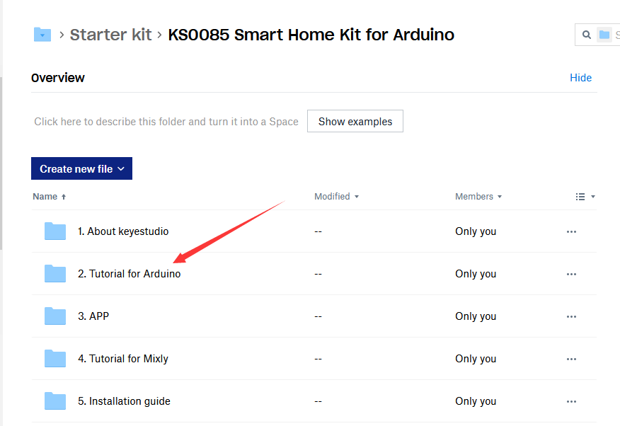


Click Sketch----\>Include Library—\>Add.ZIP Library，then Then navigate to the library file you downloaded and click "open."

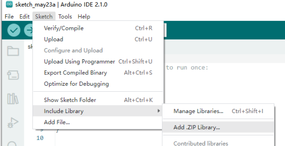

Import the library. You can find it in the include library list.

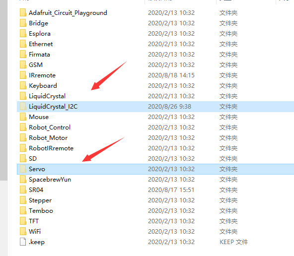


Then, the libraries of home smart are successfully installed.


## 5. Projects


Alright, let’s get straight to our projects. In this kit, there are 14 sensors and modules. We will make you know the smart home deeply from the simple sensor.

However, if you are professional with Arduino. You can skip theses steps and assemble the smart home kit directly(there is assembly video in the folder)

**Note: In this course, the interface of each sensor / module marked with (G,-, GND) indicates the negative pole, G is connected to G, - or GND of sensor shield or control board; “V” is positive pole and connected with V, VCC or 5V.**

### Project 1: LED Blink

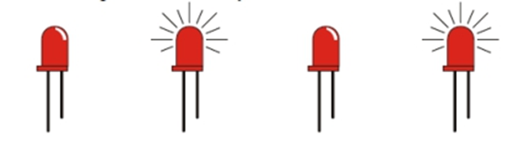

**1.1 Description**

We’ve installed the driver of Keyestudio V4.0 development board.

In this lesson, we will conduct an experiment to make LED blink.

Let’s connect GND and VCC to power. The LED will be on when signal end S is high level, on the contrary, LED will turn off when signal end S is low level.

In addition, the different blinking frequency can be presented by adjusting the delayed time.

**1.2 Specifications**

- Control interface: digital port

- Working voltage: DC 3.3-5V

- Pin pitch: 2.54mm

- LED display color: white

- Display color: white

**1.3 What You Need**

| PLUS control board\*1                           | Sensor shield\*1                                 | White LED module \*1                             | USB cable\*1                                    | 3pin F-F Dupont line\*1                         |
|-------------------------------------------------|--------------------------------------------------|--------------------------------------------------|-------------------------------------------------|-------------------------------------------------|
|  | 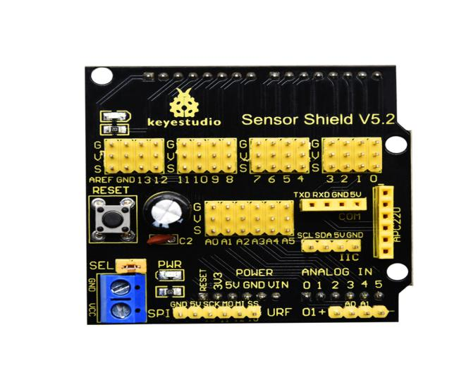 |  |  |  |

**1.4 Sensor Shield**

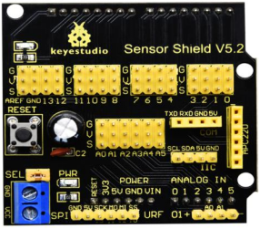

We usually combine Arduino control board with a large number of sensors and modules. However, the pins and ports are limited on control board.

To cope with this disadvantage, we just need to stack V5 sensor board on Keyestudio PLUS control board.

This V5 shield can be directly attached to sensors with 3 pin connectors, and be extended the commonly used communication ports as well, such as serial communication, IIC communication and SPI communication ports. What’s more, the shield comes with a reset button and 2 signal lights.

**1.5 Pins Description**


**1.6 Wiring Diagram**

Connect LED module with D13 of shield.


Note: pin G, V and S of white LED module are connected with G, V and 13 of V5 board.

**1.7 Test Code**

```c
/*
Keyestudio smart home Kit for Arduino
Project 1
Blink
http://www.keyestudio.com
*/
void setup() {
  // initialize digital pin 13 as an output.
  pinMode(13, OUTPUT);
}
// the loop function runs over and over again forever
void loop() {
  digitalWrite(13, HIGH);   // turn the LED on (HIGH is the voltage level)
  delay(1000);              // wait for a second
  digitalWrite(13, LOW);    // turn the LED off by making the voltage LOW
  delay(1000);              // wait for a second
}
```

**1.8 Test Result：**

After the code is uploaded, the white LED flashes for 1000ms, alternately.

**1.9 Code Explanation**

The code looks long and clutter, but most of which are comments. The grammar of Arduino is based on C.

Comments generally have two forms of expression:

/\* .......\*/ : suitable for long paragraph comments

// : suitable for mono line comments

The code contains many vital information, such as the author, the issued agreement, etc.

Starter must develop a good habit of looking through code.

The comments, major part of the whole code, are inclusive of significant information and do help you understand test code quickly.

```c
// the setup function runs once when you press reset or power the board
void setup() {
  // initialize digital pin 13 as an output.
  pinMode(13, OUTPUT);
}
```

According to comments, we will find that author define the D13 pin mode as digital output in setup() function.

Setup() is the basic function of Arduino and executes once when running program.

```c
// the loop function runs over and over again forever
void loop() {
  digitalWrite(13, HIGH);   // turn the LED on (HIGH is the voltage level)
  delay(1000);              // wait for a second
  digitalWrite(13, LOW);    // turn the LED off by making the voltage LOW
  delay(1000);              // wait for a second
}
```

Loop() is the necessary function of Arduino, it can run and loop all the time after “setup()” executes once

In the loop()function, author uses: 

```c
digitalWrite(13, HIGH); // turn the LED on (HIGH is the voltage level)
```

digitalWrite(): set the output voltage of pin to high or low level. We make D13 output high level, then the LED lights on.

```c
delay(1000); // wait for a second
```

Delay function is used for delaying time, 1000ms is 1s, unit is ms

```c
digitalWrite(13, LOW); // turn the LED off by making the voltage LOW
```

Similarly, we make D13 output low level, LED will turn off.

```c
delay(1000); // wait for a second
```

Delay for 1s, light on LED--keep on 1s--light off LED--stay on 1s, iterate the process. LED flashes with 1-second interval.

What if you want to make LED flash rapidly? You only need to modify the value of delay block. Reducing the delay value implies that the time you wait is shorter, that is, flashing rapidly. Conversely, you could make LED flash slowly.

**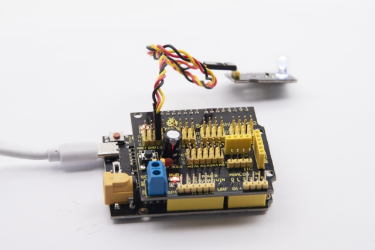**

### Project 2：Breathing Light


**2.1 Description**

In the previous lesson, we control LED on and off and make it blink.

In this project, we will control LED brightness through PWM to simulate breathing effect. Similarly, you can change the step length and delay time in the code so as to demonstrate different breathing effect.

PWM is a means of controlling the analog output via digital means. Digital control is used to generate square waves with different duty cycles (a signal that constantly switches between high and low levels) to control the analog output.In general, the input voltage of port are 0V and 5V. What if the 3V is required? Or what if switch among 1V, 3V and 3.5V? We can’t change resistor constantly. For this situation, we need to control by PWM.


For the Arduino digital port voltage output, there are only LOW and HIGH, which correspond to the voltage output of 0V and 5V. You can define LOW as 0 and HIGH as 1, and let the Arduino output five hundred 0 or 1 signals within 1 second.

If output five hundred 1, that is 5V; if all of which is 1, that is 0V. If output 010101010101 in this way then the output port is 2.5V, which is like showing movie. The movie we watch are not completely continuous. It actually outputs 25 pictures per second. In this case, the human can’t tell it, neither does PWM. If want different voltage, need to control the ratio of 0 and 1. The more 0,1 signals output per unit time, the more accurately control.

**2.2 What You Need**

| PLUS control board\*1                           | Sensor shield\*1                                 | Yellow LED module\*1                             | USB cable\*1                                    | 3pin F-F Dupont line\*1                         |
|-------------------------------------------------|--------------------------------------------------|--------------------------------------------------|-------------------------------------------------|-------------------------------------------------|
|  |  |  |  |  |

**2.3 Wiring Diagram**


Note: on sensor shield, the G, V and S pins of yellow LED module are connected with G, V and 5.

**2.4 Test Code**

```c
/*
Keyestudio smart home Kit for Arduino
Project 2
PWM
http://www.keyestudio.com
*/
int ledPin = 5; // Define the LED pin at D5
void setup () {
      pinMode (ledPin, OUTPUT); // initialize ledpin as an output.
}
void loop () {
for (int value = 0; value<255; value = value + 1) {
     analogWrite (ledPin, value); // LED lights gradually light up
     delay (5); // delay 5MS
   }
   for (int value = 255; value>0; value = value-1) {
     analogWrite (ledPin, value); // LED gradually goes out
     delay (5); // delay 5MS
   }}
```

LED smoothly changes its brightness from dark to bright and back to dark, continuing to do so, which is similar to a lung breathing in and out.


**2.5 Code Analysis**

When we need to repeat some statements, we have to use “for” statement

For statement format as follows:

 

“for” cyclic sequence:

Round 1：1 → 2 → 3 → 4

Round 2：2 → 3 → 4

…

Until number 2 is not established, “for”loop is over,

After knowing this order, go back to code:

```c
for (int value = 0; value < 255; value=value+1){
        ...
}
for (int value = 255; value >0; value=value-1){
       ...
}
```

The two “for”statement make value increase from 0 to 255, then reduce from 255 to 0, then increase to 255,....infinite loop

There is a new function in “for” statement ----- analogWrite()

We know that digital port only has two state of 0 and 1. So how to send an analog value to a digital value? Here, we need this function, observe the Arduino board and you will find 6 pins with “\~”. They are different from other pins and can output PWM signals.

Function format as follows:

```c
analogWrite(pin,value)
```

analogWrite() is used to write an analog value from 0\~255 for PWM port, so the value is in the range of 0\~255, attention that you only write the digital pins with PWM function, such as pin 3, 5, 6, 9, 10, 11.

PWM is a technology to obtain analog quantity through digital method. Digital control forms a square wave, and the square wave signal only has two states of switching (that is, high or low levels of our digital pins). By controlling the ratio of the duration of on and off, a voltage varying from 0 to 5V can be simulated. The time taken(academically referred to as high level) is called pulse width, so PWM is also called pulse width modulation.

Through the following five square waves, let’s know more about PWM.


In the above figure, the green line represents a period, and value of analogWrite() corresponds to a percentage which is called Duty Cycle as well. Duty cycle implies that high-level duration is divided by low-level duration in a cycle. From top to bottom, the duty cycle of first square wave is 0% and its corresponding value is 0. The LED brightness is lowest, that is, turn off. The more time high level lasts, the brighter the LED. Therefore, the last duty cycle is 100%, which correspond to 255, LED is brightest. 25% means darker.

PWM mostly is used for adjusting the LED brightness or rotation speed of motor.

### Project 3：Passive Buzzer

**3.1 Description**

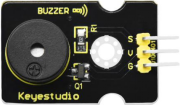

There are prolific interactive works completed by Arduino. The most common one is sound and light display. We always use LED to make experiments. For this lesson, we design circuit to emit sound. The universal sound components are buzzer and horns. Buzzer is easier to use. And buzzer includes about active buzzer and passive buzzer. In this experiment, we adopt passive buzzer.

While using passive buzzer, we can control different sound by inputting square waves with distinct frequency. During the experiment, we control code to make buzzer sound, begin with “tick, tick” sound, then make passive buzzer emit “do re mi fa so la si do”, and play specific songs.

**3.2 What You Need**

| PLUS control board\*1                           | Sensor shield\*1                                 | Passive buzzer\*1                                | USB cable\*1                                    | 3pin F-F Dupont line\*1                         |
|-------------------------------------------------|--------------------------------------------------|--------------------------------------------------|-------------------------------------------------|-------------------------------------------------|
|  |  |  |  |  |

**3.2 Wiring Diagram**


The G, V and S pins of passive buzzer are connected to G, V and 3.

**3.4 Test Code**

```c
/*
Keyestudio smart home Kit for Arduino
Project 3.1
Buzzer
http://www.keyestudio.com
*/
int tonepin = 3; // Set the Pin of the buzzer to the digital D3
     void setup ()
     {
       pinMode (tonepin, OUTPUT); // Set the digital IO pin mode to output
     }
     void loop ()
     {
       unsigned char i, j;
       while (1)
       {
         for (i = 0; i <80; i ++) // output a frequency sound
         {
           digitalWrite (tonepin, HIGH); // Sound
           delay (1); // Delay 1ms
           digitalWrite (tonepin, LOW); // No sound
           delay (1); // Delay 1ms
         }
         for (i = 0; i <100; i ++) // output sound of another frequency
         {
           digitalWrite (tonepin, HIGH); // Sound
           delay (2); // delay 2ms
           digitalWrite (tonepin, LOW); // No sound
           delay (2); // delay 2ms
         }
       }
     }
```

From the above code, number 80 and 100 decide frequency in “for” statement. Delay time controls duration, like the beat in music.


We will play fabulous music if control ling frequency and beats well, so let’s figure out the frequency of tones. As shown below:

Bass：

| Tone Note | 1# | 2# | 3# | 4# | 5# | 6# | 7# |
|-----------|-----|-----|-----|-----|-----|-----|-----|
| A         | 221 | 248 | 278 | 294 | 330 | 371 | 416 |
| B         | 248 | 278 | 294 | 330 | 371 | 416 | 467 |
| C         | 131 | 147 | 165 | 175 | 196 | 221 | 248 |
| D         | 147 | 165 | 175 | 196 | 221 | 248 | 278 |
| E         | 165 | 175 | 196 | 221 | 248 | 278 | 312 |
| F         | 175 | 196 | 221 | 234 | 262 | 294 | 330 |
| G         | 196 | 221 | 234 | 262 | 294 | 330 | 371 |

Alto：

| Tone Note | 1   | 2   | 3   | 4   | 5   | 6   | 7   |
|-----------|-----|-----|-----|-----|-----|-----|-----|
| A         | 441 | 495 | 556 | 589 | 661 | 742 | 833 |
| B         | 495 | 556 | 624 | 661 | 742 | 833 | 935 |
| C         | 262 | 294 | 330 | 350 | 393 | 441 | 495 |
| D         | 294 | 330 | 350 | 393 | 441 | 495 | 556 |
| E         | 330 | 350 | 393 | 441 | 495 | 556 | 624 |
| F         | 350 | 393 | 441 | 495 | 556 | 624 | 661 |
| G         | 393 | 441 | 495 | 556 | 624 | 661 | 742 |

Treble：

| Tone Note | 1# | 2#  | 3#  | 4#  | 5#  | 6#  | 7#  |
|-----------|-----|------|------|------|------|------|------|
| A         | 882 | 990  | 1112 | 1178 | 1322 | 1484 | 1665 |
| B         | 990 | 1112 | 1178 | 1322 | 1484 | 1665 | 1869 |
| C         | 525 | 589  | 661  | 700  | 786  | 882  | 990  |
| D         | 589 | 661  | 700  | 786  | 882  | 990  | 1112 |
| E         | 661 | 700  | 786  | 882  | 990  | 1112 | 1248 |
| F         | 700 | 786  | 882  | 935  | 1049 | 1178 | 1322 |
| G         | 786 | 882  | 990  | 1049 | 1178 | 1322 | 1484 |

Next, we need to control the time the note plays. The music will be produced when every note plays a certain amount of time. The note rhythm is divided into one beat, half beat, 1/4 beat, 1/8 beat,.

The time for a note is stipulated as half beat( 0.5), 1/4 beat(0.250, 1/8 beat( 0.125)....., therefore, the music is played.

We will take an example of “Ode to joy”


From notation, the music is 4/4 beat.

There are special notes we need to explain:

1.  Normal note, like the first note 3, correspond to 350(frequency), occupy 1 beat
2.  The note with underline means 0.5 beat
3.  The note with dot()means that 0.5 beat is added, that is 1+0.5 beat
4.  The note with”—” represents that 1 beat is added, that is 1+1 beat.
5.  The two successive notes with arc imply legato, you could slightly modify the frequency of the note behind legato(need to debug it yourself), such like reducing or increasing some values, the sound will be more smoother.

```c
/*
Keyestudio smart home Kit for Arduino
Project 3.2
Buzzer music
http://www.keyestudio.com
*/
#define NTD0 -1
#define NTD1 294
#define NTD2 330
#define NTD3 350
#define NTD4 393
#define NTD5 441
#define NTD6 495
#define NTD7 556
 
#define NTDL1 147
#define NTDL2 165
#define NTDL3 175
#define NTDL4 196
#define NTDL5 221
#define NTDL6 248
#define NTDL7 278
 
#define NTDH1 589
#define NTDH2 661
#define NTDH3 700
#define NTDH4 786
#define NTDH5 882
#define NTDH6 990
#define NTDH7 112
// List all D-tuned frequencies
#define WHOLE 1
#define HALF 0.5
#define QUARTER 0.25
#define EIGHTH 0.25
#define SIXTEENTH 0.625
// List all beats
int tune [] = // List each frequency according to the notation
{
  NTD3, NTD3, NTD4, NTD5,
  NTD5, NTD4, NTD3, NTD2,
  NTD1, NTD1, NTD2, NTD3,
  NTD3, NTD2, NTD2,
  NTD3, NTD3, NTD4, NTD5,
  NTD5, NTD4, NTD3, NTD2,
  NTD1, NTD1, NTD2, NTD3,
  NTD2, NTD1, NTD1,
  NTD2, NTD2, NTD3, NTD1,
  NTD2, NTD3, NTD4, NTD3, NTD1,
  NTD2, NTD3, NTD4, NTD3, NTD2,
  NTD1, NTD2, NTDL5, NTD0,
  NTD3, NTD3, NTD4, NTD5,
  NTD5, NTD4, NTD3, NTD4, NTD2,
  NTD1, NTD1, NTD2, NTD3,
  NTD2, NTD1, NTD1
};
float durt [] = // List the beats according to the notation
{
  1,1,1,1,
  1,1,1,1,
  1,1,1,1,
  1 + 0.5,0.5,1 + 1,
  1,1,1,1,
  1,1,1,1,
  1,1,1,1,
  1 + 0.5,0.5,1 + 1,
  1,1,1,1,
  1,0.5,0.5,1,1,
  1,0.5,0.5,1,1,
  1,1,1,1,
  1,1,1,1,
  1,1,1,0.5,0.5,
  1,1,1,1,
  1 + 0.5,0.5,1 + 1,
};
int length;
int tonepin = 3; // Use interface 3
void setup ()
{
  pinMode (tonepin, OUTPUT);
  length = sizeof (tune) / sizeof (tune [0]); // Calculate length
}
void loop ()
{
  for (int x = 0; x <length; x ++)
  {
    tone (tonepin, tune [x]);
    delay (350* durt [x]); // This is used to adjust the delay according to the beat, 350 can be adjusted by yourself.
    noTone (tonepin);
  }
  delay (2000); // delay 2S
}
```

Upload test code on the development board.

Do you hear “Ode to joy”?

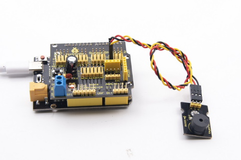

### Project 4：Button module

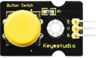

**4.1 Description**

In this lesson, we will use the input function of I/O port, that is, reading the output value of external device. Also, we will do an experiment with a button and an LED to know more about I/O.

The button switch is ordinary in our life. It belongs to switch quantity( digital quantity)components. Composed of normally open contact and normally closed contact, it is similar to ordinary switch.

When the normally open contact bears pressure, the circuit will be on state ; however, when this pressure disappears, the normally open contact will go back to be the initial state, that is, off state.

**4.2 What You Need**

| PLUS control board\*1                                    | Sensor shield\*1                                 | Yellow LED module\*1                             | Button sensor\*1                                 | USB cable\*1                                    | 3pin F-F Dupont line\*2                         |
|----------------------------------------------------------|--------------------------------------------------|--------------------------------------------------|--------------------------------------------------|-------------------------------------------------|-------------------------------------------------|
|           |  |  |  |  |  |

**4.3 Wiring Diagram**

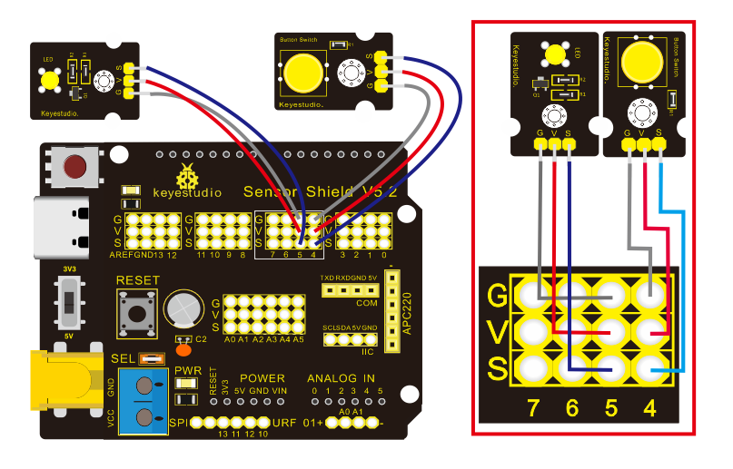

Note: The G, V, and S pins of button sensor module are separately connected to G, V, and 4 on the shield, and the G, V, and S pins of the yellow LED module are connected with G, V, and 5 on the shield.

**4.4 Test Code**

Then, we will design the program to make LED on by button. Comparing with previous experiments, we add a conditional judgement statement --- “if” statement. The written sentences of Arduino is based on C language, therefore, the condition judgement statement of C is suitable for Arduino, like while, swich, etc.

For this lesson, we take simple “if” statement as example to demonstrate:

If button is pressed, digital 4 is low level, then we make digital 5 output high level , then LED will be on; conversely, if the button is released, digital 4 is high level, we make digital 5 output low level, then LED will go off.

As for your reference：

```c
/*
Keyestudio smart home Kit for Arduino
Project 4
Button
http://www.keyestudio.com
*/
int ledpin = 5; // Define the led light in D5
int inpin = 4; // Define the button in D4
int val; // Define variable val
void setup ()
{
pinMode (ledpin, OUTPUT); // The LED light interface is defined as output
pinMode (inpin, INPUT); // Define the button interface as input
}
void loop ()
{
val = digitalRead (inpin); // Read the digital 4 level value and assign it to val
if (val == LOW) // Whether the key is pressed, the light will be on when pressed
{digitalWrite (ledpin, HIGH);}
else
{digitalWrite (ledpin, LOW);}
}
```

This experiment is pretty simple, and widely applied to various of circuits and electrical appliances.

The back-light will be on when the button is pressed.

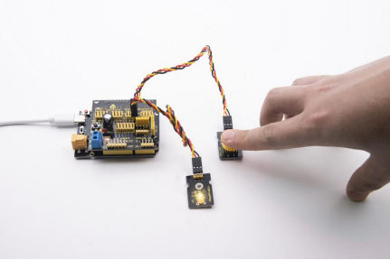

### Project 5：1-channel Relay Module

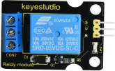

**5.1 Description：**

This module is an Arduino dedicated module, compatible with Arduino sensor expansion board. It has a control system (also called an input loop) and a controlled system (also called an output loop).

Commonly used in automatic control circuits, the relay module is an "automatic switch" that controls a larger current and a lower voltage with a smaller current and a lower voltage.

Therefore, it plays the role of automatic adjustment, safety protection and conversion in the circuit. It allows Arduino to drive loads below 3A, such as LED light strips, DC motors, miniature water pumps, solenoid valve interface.

The main internal components of the relay module are electromagnet A, armature B, spring C, moving contact D, static contact (normally open contact) E, and static contact (normally closed contact) F, (as shown in the figure ).


As long as a certain voltage is applied to both ends of the coil, a certain current will flow through the coil to generate electromagnetic effects, and the armature will attract the iron core against the pulling force of the return spring under the action of electromagnetic force attraction, thereby driving the moving contact and the static contact (normally open contact) to attract. When the coil is disconnected, the electromagnetic suction will also disappear, and the armature will return to the original position under the reaction force of the spring, releasing the moving contact and the original static contact (normally closed contact). 

This pulls in and releases, thus achieving the purpose of turning on and off in the circuit. The "normally open and closed" contacts of the relay can be distinguished in this way: the static contacts on disconnected state when the relay coil is powered off are called "normally open contacts"; the static contacts on connected state are called "normally closed contact". The module comes with 2 positioning holes for you to fix the module to other equipment.

**5.2 Specifications：**

- Working voltage: 5V (DC)

- Input signal: digital signal (high level 1, low level 0)

- Contacts: static contacts (normally open contacts, normally closed contacts) and moving contacts

- Rated current: 10A (NO) 5A (NC)

- Maximum switching voltage: 150 V (AC) 24 V (DC)

- Electric shock current: less than 3A

- Contact action time: 10ms

  

**5.3 What You Need**

| PLUS control board\*1                                                                                                                             | Sensor shield\*1                                                                                  | USB cable\*1                                    |
|---------------------------------------------------------------------------------------------------------------------------------------------------|---------------------------------------------------------------------------------------------------|-------------------------------------------------|
|                                                                                                    |                                                   |  |
| Relay module\*1                                                                                                                                   | White LED\*1                                                                                      | 3pin F-F Dupont Line\*1                         |
|                                                                                                   |                                                   |  |
| Female to Female Dupont Lines\*2                                                                                                                  | Male to Female Dupont Line\*2                                                                     |                                                 |
|   |   |                                                 |

**5.4 Wiring Diagram：**

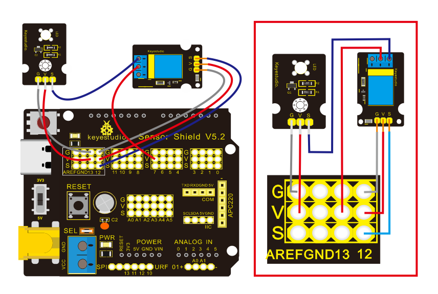

Note: On the shield, the G, V, and S pins of 1-channel relay module are connected to G, V, and 12 respectively. The NO is connected with V; the G, V, and S pins of white LED are respectively connected to G, V, and the static contact of NO on relay module.

**5.5 Test Code：**

```c
/*
Keyestudio smart home Kit for Arduino
Project 5
Relay
http://www.keyestudio.com
*/
int Relay = 12; // Define the relay pin at D12
void setup ()
{
pinMode (13, OUTPUT); // Set Pin13 as output
digitalWrite (13, HIGH); // Set Pin13 High
pinMode (Relay, OUTPUT); // Set Pin12 as output
}
void loop ()
{
digitalWrite (Relay, HIGH); // Turn off relay
delay (2000);
digitalWrite (Relay, LOW); // Turn on relay
delay (2000);
}
```

**5.6 Test Result：**

When the relay is connected(“NO” is on , NC is off) for 0.5s, the white LED will be on; conversely, when it is disconnected, the white LED will go off.


### Project 6：Photocell Sensor

**6.1 Description：**


The photocell sensor (photoresistor) is a resistor made by the photoelectric effect of a semiconductor. As highly sensitive to ambient light, its resistance value vary with different light intensity.

Its signal end is connected to the analog port of the microcontroller. When the light intensity increases, the resistance will decrease, but the analog value of the microcontroller won’t. On the contrary, when the light intensity decreases, the analog value of the microcontroller will go down.

Therefore, we can use the photoresistor sensor module to read the corresponding analog value and sense the light intensity in the environment.

It is commonly applied to light measurement, control and conversion, light control circuit as well.

**6.2 What You Need**

| PLUS control board\*1                           | Sensor shield\*1                                 | Photocell sensor\*1                              | Yellow LED module\*1                             | USB cable\*1                                    | 3pin F-F Dupont line\*2                         |
|-------------------------------------------------|--------------------------------------------------|--------------------------------------------------|--------------------------------------------------|-------------------------------------------------|-------------------------------------------------|
|  |  |  |  |  |  |

**6.3 Wiring Diagram：**

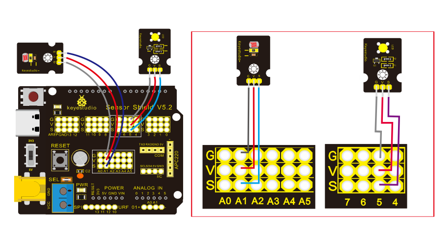

Note: On the expansion board, the G, V, and S pins of the photocell sensor module are connected to G, V, and A1; the G, V, and S pins of the yellow LED module are connected with G, V, and 5 separately.

**6.4 Test Code**：

```c
/*
Keyestudio smart home Kit for Arduino
Project 6
photocell
http://www.keyestudio.com
*/
int LED = 5; // Set LED pin at D5
int val = A1; // Read the voltage value of the photodiode
void setup () {
       pinMode (LED, OUTPUT); // LED is output
       Serial.begin (9600); // The serial port baud rate is set to 9600
}
void loop () {
       val = analogRead (A1); // Read the voltage value of A1 Pin
       Serial.println (val); // Serial port to view the change of voltage value
       if (val <900)
       {// Less than 900, the LED lights up
       digitalWrite (LED, HIGH);
       } 
       else 
       {// Otherwise,LED light is off
       digitalWrite (LED, LOW);
       }
       delay (10); // Delay 10ms
} 
```


LED will be on after uploading test code. If you use a flashlight to point at the photocell, LED will be automatically off. However, if you turn off flashlight, LED will be on again.

**6.5 Result**

For this code string, it is simple. We read value through analog port and attention that analog quantity doesn’t need input and output mode. You can read the analog value of photocell sensor by analog port.

The analog value will gradually decrease if there is light. When the value is up to 900, this value can be set up according to the brightness you choose


### Project 7：Adjusting Servo Angle

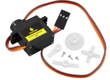

**7.1 Description：**

Servo can control doors and windows. In this course, we’ll introduce its principle and demonstrate how to use it.

Servo motor is a position control rotary actuator. It mainly consists of housing, circuit board, core-less motor, gear and position sensor. Its working principle is that the servo receives the signal sent by MCU or receiver, and produces a reference signal with a period of 20ms and width of 1.5ms, then compares the acquired DC bias voltage to the voltage of the potentiometer and obtains the voltage difference output.

When the motor speed is constant, the potentiometer is driven to rotate through the cascade reduction gear, which leads 0 voltage difference, and the motor stops rotating. Generally, the angle range of servo rotation is 0° --180 °

The rotation angle of servo motor is controlled by regulating the duty cycle of PWM (Pulse-Width Modulation) signal. The standard cycle of PWM signal is 20ms (50Hz). Theoretically, the width is distributed between 1ms-2ms, but in fact, it's between 0.5ms-2.5ms. The width corresponds to the rotation angle from 0° to 180°. But note that for different brand motor, the same signal may have different rotation angle.

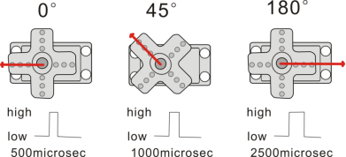

One way is using a common digital sensor port of Arduino to produce square wave with different duty cycle and to simulate PWM signal and use that signal to control the positioning of the motor.

Another one is using the Servo function of the Arduino to control the motor. In this way, the program will be easier to design, but it can only control two-channel motor because the servo function only uses digital pin 9 and 10.

The Arduino drive capacity is limited. So if you need to control more than one motor, you will need external power.

Note that don’t supply power through USB cable, there is possibility to damage the USB cable if the current demand is greater than 500MA. We recommend the external power.

**7.2 Specifications:**

-   Working voltage: DC 4.8V \~ 6V
-   Operating angle range: about 180 ° (at 500 → 2500 μsec)
-   Pulse width range: 500 → 2500 μsec
-   No-load speed: 0.12 ± 0.01 sec / 60 (DC 4.8V) 0.1 ± 0.01 sec / 60 (DC 6V)
-   No-load current: 200 ± 20mA (DC 4.8V) 220 ± 20mA (DC 6V)
-   Stopping torque: 1.3 ± 0.01kg · cm (DC 4.8V) 1.5 ± 0.1kg · cm (DC 6V)
-   Stop current: ≦ 850mA (DC 4.8V) ≦ 1000mA (DC 6V)
-   Standby current: 3 ± 1mA (DC 4.8V) 4 ± 1mA (DC 6V)
-   Lead length: 250 ± 5 mm
-   Appearance size: 22.9 \* 12.2 \* 30mm
-   Weight: 9 ± 1 g (without servo horn)

**7.3 What You Need**

| PLUS control board\*1                           | Sensor shield\*1                                 | Servo\*1                                        | USB cable\*1                                    |
|-------------------------------------------------|--------------------------------------------------|-------------------------------------------------|-------------------------------------------------|
|  |  | 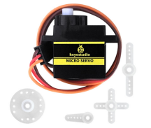 |  |

**7.4 Wiring Diagram：**

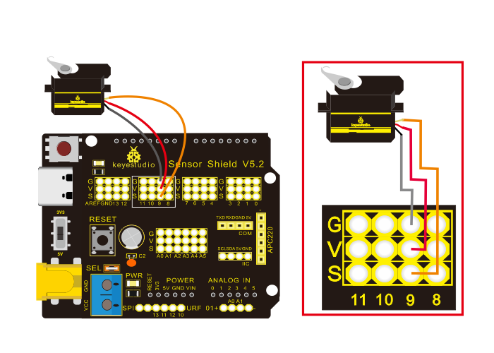

Note: The servo is connected to G (GND), V (VCC), 9. The brown wire of the servo is connected to Gnd (G), the red wire is connected with 5v (V), and the orange wire is connected to digital pin 9.

**7.5 Test Code：**

```c
/*
Keyestudio smart home Kit for Arduino
Project 7
Sevro
http://www.keyestudio.com
*/
#include <Servo.h> // Servo function library
Servo myservo;
int pos = 0; // Start angle of servo
void setup ()
{
myservo.attach (9); // Define the position of the servo on D9
}
void loop ()
{
for(pos = 0; pos < 180; pos += 1)// angle from 0 to 180 degrees
{
myservo.write (pos); // The servo angle is pos
delay (15); // Delay 15ms
}
for(pos = 180; pos>=1; pos-=1) // Angle from 180 to 0 degrees
{
myservo.write (pos); // The angle of the servo is pos
delay (15); // Delay 15ms
}
}
```

**7.6 Test Result：**

Upload code, wire up components according to connection diagram, and power on. The servo rotates from 0° to 180° then from 180°\~0°

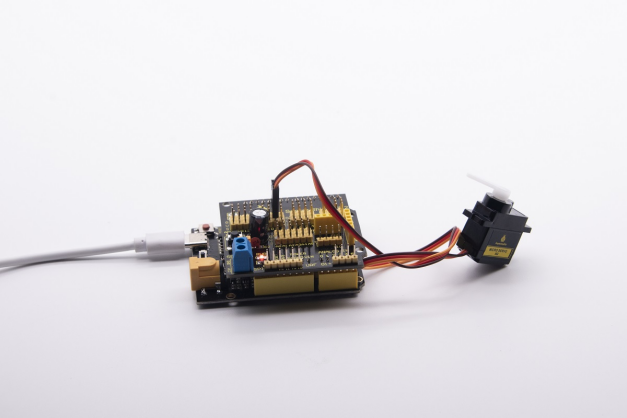

### Project 8：Fan Module

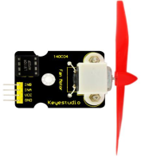

**8.1 Description**

The L9110 fan module adopts L9110 motor control chip, and controls the rotation direction and speed of the motor. Moreover, this module is efficient, with high quality fan, which can put out the flame within 20cm distance. Similarly, it is an important part of fire robot as well.

**8.2 Specifications:**

-   Working voltage: 5V
-   Working current: 0.8A
-   TTL / CMOS output level compatible,
-   Control and drive integrate in IC
-   Have pin high pressure protection function
-   Working temperature: 0-80 °

**8.3 What You Need**

| PLUS control board\*1                           | Sensor shield\*1                                 | Fan module\*1                                    | USB cable\*1                                    | Female to Female Dupont lines\*4                |
|-------------------------------------------------|--------------------------------------------------|--------------------------------------------------|-------------------------------------------------|-------------------------------------------------|
|  |  |  |  | 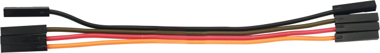 |

**8.4 Wiring Diagram：**

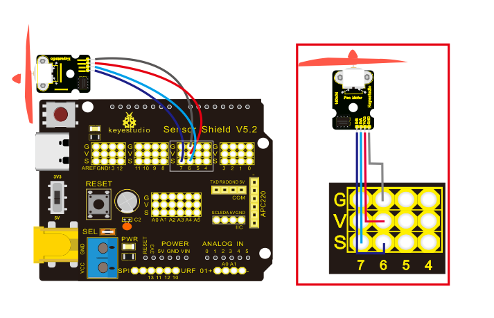

Note: On the shield, the GND, VCC, INA, and INB pins of the fan module are respectively connected to G, V, 7, 6.

**8.5 Test Code：**

```c
/*
Keyestudio smart home Kit for Arduino
Project 8
Fan
http://www.keyestudio.com
*/
void setup () {
   pinMode (7, OUTPUT); //define D7 pin as output
   pinMode (6, OUTPUT); //define  D6 pin as output
}
void loop () {
   digitalWrite (7, LOW);
   digitalWrite (6, HIGH); // Reverse rotation of the motor
   delay (3000); // delay 3S
   digitalWrite (7, LOW);
   digitalWrite (6, LOW); // The motor stops rotating
   delay (1000); //delay 1S
   digitalWrite (7, HIGH);
   digitalWrite (6, LOW); // The motor rotates in the forward direction
   delay (3000); // delay 3S
}
```

**8.6 Test Result：**

Upload test code, hook up the components according to connection diagram, and dial the DIP switch to right side and power on. The fan rotates counterclockwise for 3000ms, stops for 1000ms, then rotates clockwise for 3000ms.

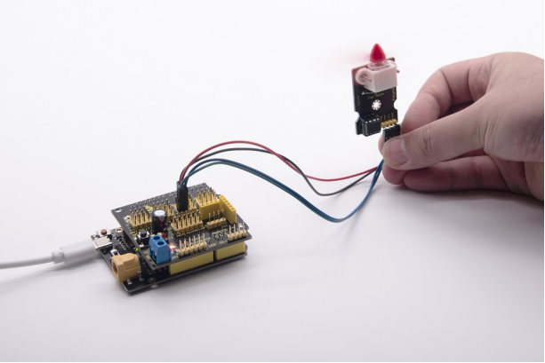

### Project 9: Steam Sensor

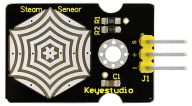

**9.1 Description：**

This is a commonly used steam sensor. Its principle is to detect the amount of water by bare printed parallel lines on the circuit board. The more the water content is, the more wires will be connected. As the conductive contact coverage increases, the output voltage will gradually rise. It can detect water vapor in the air as well. The steam sensor can be used as a rain water detector and level switch. When the humidity on the sensor surface surges, the output voltage will increase.

The sensor is compatible with various microcontroller control boards, such as Arduino series microcontrollers. When using it, we provide the guide to operate steam sensor and Arduino control board.

First, connect the sensor to the analog port of the microcontroller, and display the corresponding analog value on the serial monitor.

Note: the connection part is not waterproof, therefore, don’t immerse it in the water please.

**9.2 Specifications:**

-   Working voltage: DC 3.3-5V
-   Working current: \<20mA
-   Operating temperature range: -10 ℃ ～ ＋ 70 ℃;
-   Control signal: analog signal output
-   Interface: 3pin interface with 2.54mm in pitch

**9.3 What You Need**

| PLUS control board\*1                           | Sensor shield\*1                                 | Steam sensor\*1                                 | USB  cable\*1                                   | 3pinF-F Dupont  line\*1                         |
|-------------------------------------------------|--------------------------------------------------|-------------------------------------------------|-------------------------------------------------|-------------------------------------------------|
|  |  | 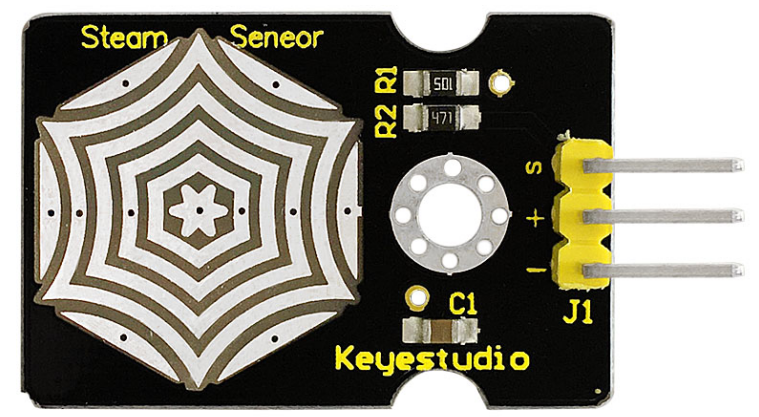 |  |  |

**9.4 Wiring Diagram：**


Note: On the sensor shield, the pins G，V and S of steam sensor are connected to G, V and A3

**9.5 Test Code：**

```c
/*
Keyestudio smart home Kit for Arduino
Project 9
Steam
http://www.keyestudio.com
*/
void setup()
{
Serial.begin(9600); //open serial port, and set baud rate at 9600bps
}
void loop()
{
int val;
val=analogRead(3); //plug vapor sensor into analog port 3
Serial.print("Moisture is ");
Serial.println(val,DEC); //read analog value through serial port printed
delay(100); //delay 100ms
}
```

**9.6 Test Result：**

When detecting different humidity, the sensor will get the feedback of different current value. As shown below;

When the sensor detects the steam of boiled water, the moisture value is displayed on serial monitor of ARDUINO software.


### Project 10: PIR Motion Sensor

**10.1 Description：**


The Pyroelectric infrared motion sensor can detect infrared signals from moving objects, and output switching signals. Applied to a variety of occasions, it can detect movement of human body.

Conventional pyroelectric infrared sensors are much more bigger, with complex circuit and lower reliability. Yet, this new pyroelectric infrared motion sensor, is more practical. It integrates a digital pyroelectric infrared sensor and connecting pins. It features higher sensibility and reliability, lower power consumption, light weight, small size, lower voltage working mode and simpler peripheral circuit.

**10.2 Specifications:**

- Input voltage: DC 3.3V ~ 18V

- Working current: 15uA

- Working temperature: -20 ~ 85 degrees Celsius

- Output voltage: high 3 V, low 0 V

- Output delay time (high level): about 2.3 to 3 seconds

- Detection angle: about 100 °

- Detection distance: 3-4 meters

- Output indicator LED (high-level )

- Pin limit current: 100mA

**Note：**

1\. The maximum distance is 3-4 meters during testing.

2\. In the test, open the white lens to check rectangular sensing part. When the long line of the sensing part is parallel to the ground, the distance is the best.

3\. In the test, covering the sensor with white lens can sense the distance precisely.

4\. The distance is best at 25℃, and the detection distance value will reduce when temperature exceeds 30℃.

5\. After powering up and uploading the code, you can start testing after 5-10 seconds, otherwise the sensor is not sensitive.

**10.3 What You Need**

| PLUS control board\*1                            | Sensor  shield\*1                                | PIR motion sensor\*1                             | F-F Dupont lines\*4                             |
|--------------------------------------------------|--------------------------------------------------|--------------------------------------------------|-------------------------------------------------|
|   |  |  |  |
| Fan module\*1                                    | White LED module\*1                              | USB cable\*1                                     | 3pinF-F Dupont  line\*2                         |
|  |  |   |  |

**10.4 Wiring Diagram：**


Note: On the shield, the G, V and S of PIR motion sensor are connected to G, V and 2; the GND, VCC, INA and INB of fan module are separately connected with G,V,7,6. The pin G, V and S of LED module are connected with G, V and 13.

**10.5 Test Code：**

```c
/*
Keyestudio smart home Kit for Arduino
Project 10
PIR
http://www.keyestudio.com
*/

void setup () {
   Serial.begin (9600); // open serial port, and set baud rate at 9600bps
   pinMode (2, INPUT); // Define PIR as input in D2
   Serial.begin (9600);
   pinMode (13, OUTPUT); // Define LED as output in D13
   pinMode (7, OUTPUT); // Define D7 as output
   pinMode (6, OUTPUT); // Define D6 as output
}

void loop () {
   Serial.println (digitalRead (2));
   delay (500); // Delay 500ms
   if (digitalRead (2) == 1) // If someone is detected walking
  {
     digitalWrite (13, HIGH); // LED light is on
     digitalWrite (7, HIGH);
     analogWrite (6,150); // Fan rotates

   } else // If no person is detected walking
{
     digitalWrite (13, LOW); // LED light is not on
     digitalWrite (7, LOW);
     analogWrite (6,0); // The fan does not rotate
   }
   }
```

**10.6 Test Result：**

Upload the above test code, open serial monitor, and set baud rate to 9600. If PIR motion sensor detects someone nearby, the serial monitor will display “1” , and LED and D13 will be turned on as well, and fan will rotate. If nobody is around, the serial monitor will show “0”, indicators will be off and fan will stop rotating.


****

### Project 11: Analog Gas Sensor


**11.1 Description：**

This gas sensor is used for household gas leak alarms, industrial combustible gas alarms and portable gas detection instruments. Also, it is suitable for the detection of liquefied gas, benzene, alkane, alcohol, hydrogen, etc.,

The MQ-2 smoke sensor can be accurately a multi-gas detector, with the advantages of high sensitivity, fast response, good stability, long life, and simple drive circuit.

It can detect the concentration of flammable gas and smoke in the range of 300\~10000ppm. Meanwhile, it has high sensitivity to natural gas, liquefied petroleum gas and other smoke, especially to alkanes smoke.

It must be heated for a period of time before using the smoke sensor, otherwise the output resistance and voltage are not accurate. However, the heating voltage should not be too high, otherwise it will cause internal signal line to blow.

It belongs to the tin dioxide semiconductor gas-sensitive material. At a certain temperature, tin dioxide adsorbs oxygen in the air and forms negative ion adsorption of oxygen, reducing the electron density in the semiconductor, thereby increasing its resistance value.

When in contact with flammable gas in the air and smog, and the potential barrier at the grain boundary is adjusted by the smog, it will cause the surface conductivity to change. With this, information about the presence of smoke or flammable gas can be obtained. The greater the concentration of smoke or flammable gas in the air, the greater the conductivity, and the lower the output resistance, the larger the analog signal output. In addition, the sensitivity can be adjusted by rotating the potentiometer.

**11.2 Specifications:**

- Working voltage: 3.3-5V (DC)

- Interface: 4 pins (VCC, GND, D0, A0)

- Output signal: digital signal and analog signal

- Weight: 7.5g

**11.3 What you need**

| PLUS control  board\*1                           | Sensor shield\*1                                 | MQ-2 gas sensor\*1                              | Fan module\*1                                    | Yellow LED module\*1                             |
|--------------------------------------------------|--------------------------------------------------|-------------------------------------------------|--------------------------------------------------|--------------------------------------------------|
|   |  |  |  |  |
| Passive buzzer\*1                                | USB cable\*1                                     | F-F Dupint line\*8                              | 3pinF-F Dupint line\*2                           |                                                  |
|  |   |  |   |                                                  |

**11.4 Wiring Diagram：**


Note: On the shield, the pin GND, VCC, D0 and A0 of gas sensor are connected with pin G, V and A0. The pin G,V and S of passive buzzer are connected to G,V and 3.

**11.5 Test Code：**

```c
/*
Keyestudio smart home Kit for Arduino
Project 11
Gas
http://www.keyestudio.com
*/
int MQ2 = A0; // Define MQ2 gas sensor pin at A0
int val = 0; // declare variable
int buzzer = 3; // Define the buzzer pin at D3
void setup ()
{
pinMode (MQ2, INPUT); // MQ2 gas sensor as input
Serial.begin (9600); // Set the serial port baud rate to 9600
pinMode (buzzer, OUTPUT); // Set the digital IO pin mode for output
}
void loop ()
{
val = analogRead (MQ2); // Read the voltage value of A0 port and assign it to val
Serial.println (val); // Serial port sends val value
if (val> 450)
{
tone (buzzer, 589);
delay(300);
}
else
{
noTone (buzzer);
}
}
```

**11.6 Test Result：**

Upload test code, wire up components according to connection diagram and power on. When the detected value of flammable gas is greater than 70, the passive buzzer will emit sound, however, when there is no flammable gas, the passive buzzer won’t emit a sound.


### Project 12: 1602 LCD Display


**12.1 Description：**

This is a display module, with I2C communication module, can show 2 lines with 16 characters per line.

It shows blue background and white word and is attached to I2C interface of MCU. On the back of LCD display is a blue potentiometer for adjusting the backlight. The communication default address is 0x27.

The original 1602 LCD can run with 7 IO ports, but ours is built with ARDUINOIIC/I2C interface, saving 5 IO ports. Alternatively, the module comes with 4 positioning holes with a diameter of 3mm, which is convenient for you to fix on other devices.

Notice that when the screen gets brighter or darker, the characters will become more visible or less visible.

**122 Specifications:**

- I2C address: 0x27

- Backlight (blue, white)

- Power supply voltage: 5V

- Adjustable contrast

- GND: A pin that connects to ground

- VCC: A pin that connects to a +5V power supply

- SDA: A pin that connects to analog port A4 for IIC communication

- SCL: A pin that connects to analog port A5 for IIC communication

**12.3 What You Need**

| PLUS control board\*1                           | Sensor shield\*1                                 | 1602 LCD Display\*1                              | USB cable\*1                                    | 4pinF-F Dupont  line\*1                         |
|-------------------------------------------------|--------------------------------------------------|--------------------------------------------------|-------------------------------------------------|-------------------------------------------------|
|  |  |  |  |  |

**12.4 Wiring Diagram：**


Note: there are pin GND, VCC, SDA and SCL on 1602LCD module. GND is connected with GND（-）of IIC communication, VCC is connected to 5V（+）, SDA to SDA, SCL to SCL.

**12.5 Test Code:**

```c
/*
Keyestudio smart home Kit for Arduino
Project 12
1602 LCD
http://www.keyestudio.com
*/
#include <Wire.h>
#include <LiquidCrystal_I2C.h>
LiquidCrystal_I2C lcd (0x27,16,2); // set the LCD address to 0x27 for a16 chars and 2 line display
void setup ()
{
lcd.init (); // initialize the lcd
lcd.init (); // Print a message to the LCD.
lcd.backlight ();
lcd.setCursor (3,0);
lcd.print ("Hello, world!"); // LED print hello, world!
lcd.setCursor (2,1);
lcd.print ("keyestudio!"); // LED print keyestudio!
}
void loop ()
{
}
```

**12.6 Test Result**

After hooking up components and uploading sample code, the 1602 LCD will print "Hello, world!, keyestudio!", and you can adjust LCD backlight with a potentiometer.


Note: When the display doesn’t show characters, you can adjust the potentiometer behind the 1602LCD and backlight to make the 1602LCD display the corresponding character string.


### Project 13：Soil Humidity Sensor

**13.1 Description**


This is a sensor to detect the soil humidity.

If the soil is lack of water, the analog value output by the sensor will decrease; otherwise, the value will increase. It can be applied to prevent your household plants from being destitute of water.

The soil humidity sensor module is not as complicated as you think. It has two probes. When inserted into the soil,it will get resistance value by reading the current changes between the two probes and converting resistance value into moisture content. The higher the moisture (less resistance), the higher the conductivity.

Meanwhile, it comes with 2 positioning holes for installing on other devices.

**13.2 Specification**

- Power Supply Voltage: 3.3V or 5V

- Working Current: ≤ 20mA

- Output Voltage: 0-2.3V (When the sensor is totally immersed in water, the voltage will be 2.3V) the higher humidity, the higher the output voltage

- Sensor type: Analog output

- Interface definition: S- signal, G- GND, V - VCC

**13.3 What You Need**

| PLUS control board\*1                           | Sensor shield\*1                                 | Soil humidity sensor\*1                          | 1602 LCD display\*1                              |
|-------------------------------------------------|--------------------------------------------------|--------------------------------------------------|--------------------------------------------------|
|  |  |  |  |
| USB cable\*1                                    | 4pinF-F Dupont line\*1                           | 3pinF-F Dupont line\*1                           |                                                  |
|  |   |   |                                                  |

**13.4 Wiring Diagram：**


Note: On the shield, the pin G, V and S of soil humidity sensor are connected to G, V and A2; GND of 1602 LCD is connected with GND of ICC communication, VCC is connected to 5V（+）, SDA to SDA, SCL to SCL.

**13.5 Test Code：**

```c
/*
Keyestudio smart home Kit for Arduino
Project 13
Soil Humidity
http://www.keyestudio.com
*/
#include <Wire.h>
#include <LiquidCrystal_I2C.h>
volatile int value;
LiquidCrystal_I2C mylcd (0x27,16,2); // set the LCD address to 0x27 for a16 chars and 2 line display
void setup () {
  Serial.begin (9600); // Set the serial port baud rate to 9600
  value = 0;
  mylcd.init ();
  mylcd.backlight (); // Light up the backlight
  mylcd.clear (); // Clear the screen
  Serial.begin (9600); // Set the serial port baud rate to 9600
  pinMode (A2, INPUT); // Soil sensor is at A2, the mode is input
}
void loop () {
  Serial.print ("Soil moisture value:"); // Print the value of soil moisture
  Serial.print ("");
  Serial.println (value);
  delay (500); // Delay 0.5S
  value = analogRead (A2); // Read the value of the soil sensor
  if (value <300) // If the value is less than 300
{
    mylcd.clear (); // clear screen
    mylcd.setCursor (0, 0);
    mylcd.print ("value:"); //
    mylcd.setCursor (6, 0);
    mylcd.print (value);
    mylcd.setCursor (0, 1);
    mylcd.print ("dry soil"); // LCD screen print dry soil
    delay (300); // Delay 0.3S
  } 
  else if ((value>=300) && (value <= 700)) // If the value is greater than 300 and less than 700
 {
    mylcd.clear (); //clear screen
    mylcd.setCursor (0, 0);
    mylcd.print ("value:");
    mylcd.setCursor (6, 0);
    mylcd.print (value);
    mylcd.setCursor (0, 1);
    mylcd.print ("humid soil"); // LCD screen printing humid soil
    delay (300); // Delay 0.3S
  } else if (value> 700) // If the value is greater than 700
 {
    mylcd.clear ();//clear screen
    mylcd.setCursor (0, 0);
    mylcd.print ("value:");
    mylcd.setCursor (6, 0);
    mylcd.print (value);
    mylcd.setCursor (0, 1);
    mylcd.print ("in water"); /// LCD screen printing in water
    delay (300); // Delay 0.3S
  }
}
```

**13.6 Test Result：**

Upload code, open the serial monitor and insert the soil humidity sensor into the soil.

The greater the humidity is, the larger the value(0-1023). Also, the 1602 LCD will display the corresponding value.


### Project 14: Bluetooth Test

14.1 Description


Bluetooth technology is a wireless standard technology that enables short-distance data exchange between fixed devices, mobile devices, and building personal area networks (using UHF radio waves in the ISM band of 2.4 to 2.485 GHz).

This kit is equipped with the HM-10 Bluetooth module, which is a master-slave machine. When used as the Host, it can send commands to the slave actively; when used as the Slave, it can only receive commands from the host.

The HM-10 Bluetooth module supports the Bluetooth 4.0 protocol, which not only supports Android mobile, but also supports iOS system.

In the experiment, we take the HM-10 Bluetooth module as a Slave and the cellphone as a Host. We install the Bluetooth APP on the mobile phone, connect the Bluetooth module; and use the Bluetooth APP to control the smart home kit.

We also provide you with APP for Android and iOS system.

| Pins  | Description                                                                                                                                                                                                                                                                                                                                                       |
|-------|-------------------------------------------------------------------------------------------------------------------------------------------------------------------------------------------------------------------------------------------------------------------------------------------------------------------------------------------------------------------|
| BRK   | As the input pin, short press control, or input single pulse of 100ms low level to achieve the following functions: When module is in sleep state: Module is activated to normal state, if open AT+NOTI, serial port will send OK+WAKE. When in connected state: Module will actively request to disconnect When in standby mode: Module will be in initial state |
| RXD   | Serial data inputs                                                                                                                                                                                                                                                                                                                                                |
| TXD   | Serial data outputs                                                                                                                                                                                                                                                                                                                                               |
| GND   | ground lead                                                                                                                                                                                                                                                                                                                                                       |
| VCC   | Positive pole of power, input 5V                                                                                                                                                                                                                                                                                                                                  |
| STATE | As output pin, show the working state of module Flash slowly in standby state——repeat 500ms pulse； Always light up in connected state——high level You could set to no flashing in standby state, always light up in connected state                                                                                                                              |

**14.2 Parameters:**

- Bluetooth protocol: Bluetooth Specification V4.0 BLE

- No byte limit in serial port Transceiving

- In open environment, realize 100m ultra-distance communication with iphone4s

- USB protocol: USB V2.0

- Working frequency: 2.4GHz ISM band

- Modulation method: GFSK(Gaussian Frequency Shift Keying)

- Transmission power: -23dbm, -6dbm, 0dbm, 6dbm, can be modified by AT command.

- Sensitivity: ≤-84dBm at 0.1% BER

- Transmission rate: Asynchronous: 6K bytes ; Synchronous: 6k Bytes

- Security feature: Authentication and encryption

- Supporting service: Central & Peripheral UUID FFE0, FFE1

- Power consumption: Auto sleep mode, stand by current 400uA\~800uA, 8.5mA during transmission.

- Power supply: 5V DC

- Working temperature: –5 to +65 Centigrade

**14.3 Using Bluetooth APP**

In the previous lesson, we’ve introduced the basic parameter principle of HM-10 Bluetooth module. In this project, let's show you how to use the HM-10 Bluetooth module. In order to efficiently control this kit by HM-10 Bluetooth module, we specially designed an APP, as shown below.


There are twelve control buttons and four sliders on App. When we press control button on APP, the Bluetooth of cellphone will send a control character, and Bluetooth module will receive a corresponding control character. When programming, we set the corresponding function of each sensor or module according to the corresponding key control character. Next, let’s test 16 buttons on app.

**APP for Android Mobile：**

**Note: You need to enable the location information before connecting to HM-10 Bluetooth module via cellphone, otherwise, Bluetooth may not be connected.**

Enter **Google** play，search “keyes IoT”. If you can’t search it on app store, please download the app：

<https://play.google.com/store/apps/details?id=com.keyestudio.iot_keyes>

Open the app，and the interface will pop up as below:


Upload code and power on. LED of Bluetooth module blinks.

Start Bluetooth of your cellphone and open App to click “SCANNING” to pair.


Click “Connect”, then Bluetooth is connected successfully(indicator is always on). As shown below;


**iOS System：**

(1) Open App store.

(2) Search “IoT keyes”on APP store, then click “download”.


(3)  After the app is installed successfully, tapto enter the interface as follows:


(4) After uploading the test code successfully, insert the Bluetooth module and power on.

First start the Bluetooth on cellphone, then click “connect” on app to search Bluetooth and pair. After paring successfully, the LED of Bluetooth module will be always on.

Note: Remove the Bluetooth module please when uploading the test code. Otherwise, the code will fail to be uploaded.

Remember to pair Bluetooth and Bluetooth module after uploading the test code.

**14.4 Wiring Diagram：**


Note: On the sensor expansion board, the RXD, TXD, GND, and VCC of the Bluetooth module are respectively connected to TXD, RXD, GND, and 5V, and the STATE and BRK pins of the Bluetooth module do not need connecting.

**14.5 Test Code：**

```c
/*
Keyestudio smart home Kit for Arduino
Project 14
Bluetooth
http://www.keyestudio.com
*/
char val;
void setup()
{
Serial.begin(9600);// Set the serial port baud rate to 9600
}
void loop()
{
while (Serial.available()>0)
{
val=Serial.read();// Read the value sent by Bluetooth
Serial.print(val);// The serial port prints the read value
}
}
```


The function of corresponding character and button is shown below:


### **Assembly Guide**

Check the board A\~I and parts in the first place.


**Step 1: Install sensors on A board**

Prepare components as follows;

-   A board\*1
-   M3\*10MM round screw\*4
-   M3 nickel plated nut\*4；
-   M2.5\*10MM round screw\*4
-   button sensor\*2
-   white LED\*1
-   PIR motion sensor\*1
-   LCD1602 display\*1
-   4pin F-F dupont Cable\*1
-   3pin F-F dupont cable\*4


1.  Fix the white LED, 2 button sensors and the PIR motion sensor on the corresponding areas of the A board with 4pcs M3\*10MM round head screws and 4pcs M3 nuts.
2.  Then install the LCD1602 display on A board with 4pcs M2.5\*10MM round head screws and 4pcs M2.5 nuts.
3.  Connect them with 3pin and 4pin dupont cables.


**Step 2: Install sensors on B board**

-   B board，
-   3pin F-F dupont line\*1，
-   M3\*10MM round head screw\*2，
-   M3 nickel plated nut\*2
-   A relay module


Assemble the relay module on B board with 2 pcs M3\*10MM screws and 2pcs M3 nickel plated nuts, and attach a 3pin F-F dupont cable to the relay module.


**Step 3: Fix A board and B board together with a “T” bolt**


**Step 4: Assemble sensors and a battery holder on C board**

C board\*1

MQ-2 gas sensor\*1

A battery holder

M3\*10MM flat head screw\*2

M3\*10MM round head screw\*1

M3 nickel plated nut\*3

4pin F-F dupont line\*1


1.  Fix the battery holder on C board with 2pcs M3\*10MM flat head screws and 2 pcs M3 nickel plated nuts.
2.  Then install the MQ-2 gas sensor on the corresponding area of C board with a M3\*10MM round head screw and a M3 nickel plated nut.
3.  Connect a 4pin dupont line to the MQ-2 gas sensor


**Step 5: Install the sensors and parts on D board**

-   A servo
-   M1.2\*5 self-tapping screw\*4
-   A white cross mount（included in servo）
-   M2\*5 round head screw（included in servo）\*1
-   M2\*12MM round head screw\*2
-   M2 nickel plated nut\*2
-   M3\*12MM round head screw\*4
-   M3 stainless self-locking nut\*4
-   D board
-   A gear
-   Board1


We need to set the servo to 90° before installing. Just follow the steps below

Connect servo to Keyestudio PLUS Control Board and upload test code to make servo rotate to 90°

| Servo Motor |         |
|-------------|---------|
| Brown wire  | GND     |
| Red wire    | 5V      |
| Orange wire | S（10） |


**Test Code：**

```c
#include <Servo.h>
Servo servo_10;

void setup(){
  servo_10.attach(10);
}
void loop(){
  servo_10.write(90);
  delay(500);}
```

After the test code is uploaded successfully, the servo will rotate to 90°

1.  Fix the servo on the corresponding area of D board with 2pcs M2\*12MM round head screws and 2pcs M2 nickel plated nuts.
2.  Then install the square board 1 on the D board with 4pcs M3\*12MM round head screws and 4 M3 self-locking nuts.


Install the white cross mount on the gear with 4pcs M1.2\*5MM self-tapping screws, and mount the gear on the servo motor with 1 M2\*5MM round head screw.


**Step 6: Assemble C board with D board with a “T” bolt.**


**Step 7: Install the yellow LED on E board**

-   A yellow LED module
-   A E board
-   M3\*10MM round head screw\*1
-   M3 nickel plated nut \*1
-   3pin F-F dupont line\*1


Mount the yellow LED on the corresponding area of E board with 1 M3\*10MM round head screw and 1 M3 nickel plated nut，then connect a 3pin dupont line to it.


**Step 8: Install control board, sensors and parts on H board**

- A servo

- A passive buzzer

- M1.2\*5 self-tapping screw\*4,

- A white cross mount(included in servo)\*1

- A M2\*5 screw( included in servo)

- M2\*12MM round head screw\*2

- M2 nickel plated nut\*2

- M3\*10MM round screw\*1

- M3 nickel plated nut\*1

- M3\*6MM round head screw\*8

- M3\*10MM dual-pass copper pillar\*4

- A Keyestudio PLUS Control Board

- A sensor shield

- 3pinF-F dupont line\*1

- H board

- 2 gears
- Board 2\*2


1.  Mount 4pcs dual-pass copper pillars on the H board with 4pcs M3\*6MM screws
2.  Then fix the passive buzzer on H board with 1 M3\*10MM round head screw and 1 M3 nut.
3.  Connect a 3pinF-F dupont line to the passive buzzer.


Set the servo to 90° before installing, and the method is same as the step 6.

Fix the 4pcs M3\*10MM copper pillars on the Keyestudio PLUS control board with 4 M3\*6MM round head screws, then mount the servo on the corresponding area of H board with 2 M2\*12MM round head screws and 2 M2 nuts.


Mount 2pcs board 2 together, then fix white cross mount on the gear with 4pcs M1.2\*5 self-tapping screws


Fix the gear with white cross mount on the black servo with 1 M2\*5MM screw(included in servo), then install the combination of 2pcs board 2 and another servo on the corresponding area of H board, finally stack the sensor shield on the Keyestudio PLUS control board.


Step 9: Assemble all boards together with 2 “T” type bolts.

(Note: the port of PLUS Control Board is aligned with the hole ⑧ on board B, and the interface of USB cable is aligned with the hole ⑦ on board B)


**Step 10: Install sensors on F board**

- A steam sensor,

- A photocell sensor

- A fan module(with fan)

- Board F

- 3pinF-F dupont line\*2,

- 4pin F-F dupont line\*1
- M3\*10MM round head screw\*3

- M3 nickel plated nut\*3.


Separately fix the steam sensor, the photocell sensor and the fan module on the F board with 3pcs M3\*10MM round head screws and 3pcs M3 nuts, then attach 3pin and 4pin dupont lines to sensors


**Step 11: Connect sensor/module**

Connect one end of a 3pin dupont line to soil humidity sensor, then connect all sensors with the sensor shield. (make dupont wires of the servo go through the holes of board)


|  Name                           | The corresponding interfaces of sensors and sensor shield | The corresponding installed area on the board |   |
|---------------------------------|-----------------------------------------------------------|-----------------------------------------------|---|
| PIR Motion Sensor               | G/V/S                                                     | G/V/2                                         | ⑤ |
| Passive buzzer                  | G/V/S                                                     | G/V/3                                         | ⑯ |
| Button module 1                 | G/V/S                                                     | G/V/4                                         | ③ |
| Yellow LED                      | G/V/S                                                     | G/V/5                                         | ⑫ |
| Fan module                      | GND/VCC/INA/INB                                           | G/V/7/6                                       | ⑮ |
| Button module 2                 | G/V/S                                                     | G/V/8                                         | ④ |
| Servo 1 controlling the door    | Brown/Red/Orange wire                                     | G/V/9                                         | ⑰ |
| Servo 2 controlling the windows | Brown/Red/Orange wire                                     | G/V/10                                        | ⑪ |
| MQ-2 Gas Sensor                 | GND/VCC/D0/A0                                             | G/V/11/A0                                     | ⑩ |
| Relay Module                    | G/V/S                                                     | G/V/12                                        | ⑥ |
| White LED                       | G/V/S                                                     | G/V/13                                        | ① |
| LCD1602 Display                 | GND/VCC/SDA/SCL                                           | GND/5V/SDA/SCL                                | ② |
| Photocell Sensor                | G/V/S                                                     | G/V/A1                                        | ⑭ |
| Soil humidity sensor            | G/V/S                                                     | G/V/A2                                        |   |
| Steam sensor                    | G/V/S                                                     | G/V/A3                                        | ⑬ |


Insert the Bluetooth module into sensor shield, then fix the F board with 2 M3\*10MM round head screws, 2 M3 nuts and 2 pcs parts and mount G board with 2 “T” bolts.

| Bluetooth Module | Sensor shield |
|------------------|---------------|
| VCC              | 5V            |
| GND              | GND           |
| TXD              | RXD           |
| RXD              | TXD           |


**Step 12: Assemble the kit**

Fix the board I with 6 “T” bolts


The smart home kit is established.

### Project 15：Multi-purpose Smart Home


**15.1 Description**

In the previous projects, we’ve introduced how to use sensors, modules and HM-10 Bluetooth module. For this lesson, we will present all functions of this smart home.

We will achieve the effect as follows:


**1.Photocell sensor, PIR motion sensor and LED.**  When at night, someone passes by, LED is on; nobody is around, the LED is off.

**2.1602LCD display, 2 buttons, 1 servo on the board.**

When button1 is pressed, you can input password(set password in the test code), and the 1602LCD will show “*”, then press button2 to “confirm”. If the password is correct, the 1602LCD will show “open” and the door will be open. However, if the password is wrong, the “error” pops up; after 2s, “error” will turn into “again” , which means that you can enter password again.

Note: The correct password is ”. - - . - .” which means that short press button1, long press button1, long press button1, short press button1, long press button1, and short press button1.

”- ”means long press button1, ”.”means short press button1

The door will be closed when PIR motion sensor doesn’t detect people around. What’s more, if you press and hold button2, the buzzer will emits a sound, and LCD display will show “wait”.

（If the password is right, the servo will rotate to 180°, otherwise，it doesn’t rotate）

**3.Insert soil humidity sensor into a plant pot.** When the soil is too dry, the buzzer will alarm and you will get the notification from app.


**(4) When the gas sensor detects the gas with high concentration,** the buzzer will emit a "tick,tick" alarm sound.


**(5) When steam sensor detects rains,** the servo 2 will be activated and the window will be closed automatically, otherwise, the window will be open.


**15.2 What You Need**


**15.3 Wiring diagram：**


| Name                            | sensors and sensor shield | board           |      |
| ------------------------------- | ------------------------- | --------------- | ---- |
| PIR Motion Sensor               | G/V/S                     | G/V/2           | ⑤    |
| Passive Buzzer                  | G/V/S                     | G/V/3           | ⑯    |
| Button sensor 1                 | G/V/S                     | G/V/4           | ③    |
| Yellow LED Module               | G/V/S                     | G/V/5           | ⑫    |
| Fan Module                      | GND/VCC/ INA/INB          | G/V/7/6         | ⑮    |
| Button Module 2                 | G/V/S                     | G/V/8           | ④    |
| Servo 1 controlling the door    | Brown/Red/ Orange Wire    | G/V/9           | ⑰    |
| Servo 2 controlling  the window | Brown/Red/ Orange Wire    | G/V/10          | ⑪    |
| MQ-2 Gas Sensor                 | GND/VCC/ D0/A0            | G/V/11/A0       | ⑩    |
| Relay Module                    | G/V/S                     | G/V/12          | ⑥    |
| White LED                       | G/V/S                     | G/V/13          | ①    |
| LCD1602  Display                | GND/VCC /SDA/SCL          | GND/5V /SDA/SCL | ②    |
| Photocell Sensor                | G/V/S                     | G/V/A1          | ⑭    |
| Soil Humidity Sensor            | G/V/S                     | G/V/A2          |      |
| Steam Sensor                    | G/V/S                     | G/V/A3          | ⑬    |

**15.4 Test Code：**

Finish wiring, let’s design the code:

```c
//call the relevant library file
#include <Servo.h>
#include <Wire.h>
#include <LiquidCrystal_I2C.h>
//Set the communication address of I2C to 0x27, display 16 characters every line, two lines in total
LiquidCrystal_I2C mylcd(0x27, 16, 2);

//set ports of two servos to digital 9 and 10
Servo servo_10;
Servo servo_9;

volatile int btn1_num;//set variable btn1_num
volatile int btn2_num;//set variable btn2_num
volatile int button1;//set variable button1
volatile int button2;//set variable button2
String fans_char;//string type variable fans_char
volatile int fans_val;//set variable fans_char
volatile int flag;//set variable flag
volatile int flag2;//set variable flag2
volatile int flag3;//set variable flag3
volatile int gas;//set variable gas
volatile int infrar;//set variable infrar
String led2;//string type variable led2
volatile int light;//set variable light
String pass;//string type variable pass
String passwd;//string type variable passwd

String servo1;//string type variable servo1
volatile int servo1_angle;//set variable light
String servo2;//string type variable servo2
volatile int servo2_angle;//set variable servo2_angle

volatile int soil;//set variable soil
volatile int val;//set variable val
volatile int value_led2;//set variable value_led2
volatile int water;//set variable water

int length;
int tonepin = 3; //set the signal end of passive buzzer to digital 3
//define name of every sound frequency
#define D0 -1
#define D1 262
#define D2 293
#define D3 329
#define D4 349
#define D5 392
#define D6 440
#define D7 494
#define M1 523
#define M2 586
#define M3 658
#define M4 697
#define M5 783
#define M6 879
#define M7 987
#define H1 1045
#define H2 1171
#define H3 1316
#define H4 1393
#define H5 1563
#define H6 1755
#define H7 1971

#define WHOLE 1
#define HALF 0.5
#define QUARTER 0.25
#define EIGHTH 0.25
#define SIXTEENTH 0.625

//set sound play frequency
int tune[] =
{
  M3, M3, M4, M5,
  M5, M4, M3, M2,
  M1, M1, M2, M3,
  M3, M2, M2,
  M3, M3, M4, M5,
  M5, M4, M3, M2,
  M1, M1, M2, M3,
  M2, M1, M1,
  M2, M2, M3, M1,
  M2, M3, M4, M3, M1,
  M2, M3, M4, M3, M2,
  M1, M2, D5, D0,
  M3, M3, M4, M5,
  M5, M4, M3, M4, M2,
  M1, M1, M2, M3,
  M2, M1, M1
};

//set music beat
float durt[] =
{
  1, 1, 1, 1,
  1, 1, 1, 1,
  1, 1, 1, 1,
  1 + 0.5, 0.5, 1 + 1,
  1, 1, 1, 1,
  1, 1, 1, 1,
  1, 1, 1, 1,
  1 + 0.5, 0.5, 1 + 1,
  1, 1, 1, 1,
  1, 0.5, 0.5, 1, 1,
  1, 0.5, 0.5, 1, 1,
  1, 1, 1, 1,
  1, 1, 1, 1,
  1, 1, 1, 0.5, 0.5,
  1, 1, 1, 1,
  1 + 0.5, 0.5, 1 + 1,
};


void setup() {
  Serial.begin(9600);//set baud rate to 9600
  
  mylcd.init();
  mylcd.backlight();//initialize LCD
  //LCD shows "password:" at first row and column
  mylcd.setCursor(1 - 1, 1 - 1);
  mylcd.print("password:");
  
  servo_9.attach(9);//make servo connect to digital 9
  servo_10.attach(10);//make servo connect to digital 10
  servo_9.write(0);//set servo connected digital 9 to 0°
  servo_10.write(0);//set servo connected digital 10 to 0°
  delay(300);
  
  pinMode(7, OUTPUT);//set digital 7 to output
  pinMode(6, OUTPUT);//set digital 6 to output
  digitalWrite(7, HIGH); //set digital 7 to high level
  digitalWrite(6, HIGH); //set digital 6 to high level
  
  pinMode(4, INPUT);//set digital 4 to input
  pinMode(8, INPUT);//set digital 8 to input
  pinMode(2, INPUT);//set digital 2 to input
  pinMode(3, OUTPUT);//set digital 3 to output
  pinMode(A0, INPUT);//set A0 to input
  pinMode(A1, INPUT);//set A1 to input
  pinMode(13, OUTPUT);//set digital 13 to input
  pinMode(A3, INPUT);//set A3 to input
  pinMode(A2, INPUT);//set A2 to input

  pinMode(12, OUTPUT);//set digital 12 to output
  pinMode(5, OUTPUT);//set digital 5 to output
  pinMode(3, OUTPUT);//set digital 3 to output
  length = sizeof(tune) / sizeof(tune[0]); //set the value of length
}

void loop() {
  auto_sensor();
  if (Serial.available() > 0) //serial reads the characters
  {
    val = Serial.read();//set val to character read by serial    Serial.println(val);//output val character in new lines
    pwm_control();
  }
  switch (val) {
    case 'a'://if val is character 'a'，program will circulate
      digitalWrite(13, HIGH); //set digital 13 to high level，LED 	lights up
      break;//exit loop
    case 'b'://if val is character 'b'，program will circulate
      digitalWrite(13, LOW); //Set digital 13 to low level, LED is off
      break;//exit loop
    case 'c'://if val is character 'c'，program will circulate
      digitalWrite(12, HIGH); //set digital 12 to high level，NO of relay is connected to COM
      break;//exit loop
    case 'd'://if val is character 'd'，program will circulate
      digitalWrite(12, LOW); //set digital 12 to low level，NO of relay is disconnected to COM

      break;//exit loop
    case 'e'://if val is character 'e'，program will circulate
      music1();//play birthday song
      break;//exit loop
    case 'f'://if val is character 'f'，program will circulate
      music2();//play ode to joy song
      break;//exit loop
    case 'g'://if val is character 'g'，program will circulate
      noTone(3);//set digital 3 to stop playing music
      break;//exit loop
    case 'h'://if val is character 'h'，program will circulate
      Serial.println(light);//output the value of variable light in new lines
      delay(100);
      break;//exit loop
    case 'i'://if val is character 'i'，program will circulate
      Serial.println(gas);//output the value of variable gas in new lines
      delay(100);
      break;//exit loop
    case 'j'://if val is character 'j'，program will circulate
      Serial.println(soil);//output the value of variable soil in new lines
      delay(100);
      break;//exit loop
    case 'k'://if val is character 'k'，program will circulate
      Serial.println(water);//output the value of variable water in new lines
      delay(100);
      break;//exit loop
    case 'l'://if val is character 'l'，program will circulate
      servo_9.write(180);//set servo connected to digital 9 to 180°
      delay(500);
      break;//exit loop
    case 'm'://if val is character 'm'，program will circulate
      servo_9.write(0);;//set servo connected to digital 9 to 0°
      delay(500);
      break;//exit loop
    case 'n'://if val is character 'n'，program will circulate
      servo_10.write(180);//set servo connected to digital 10 to 180°
      delay(500);
      break;//exit loop
    case 'o'://if val is character 'o'，program will circulate
      servo_10.write(0);//set servo connected to digital 10 to 0°
      delay(500);
      break;//exit loop
    case 'p'://if val is character 'p'，program will circulate
      digitalWrite(5, HIGH); //set digital 5 to high level, LED is on
      break;//exit loop
    case 'q'://if val is character 'q'，program will circulate
      digitalWrite(5, LOW); // set digital 5 to low level, LED is off
      break;//exit loop
    case 'r'://if val is character 'r'，program will circulate
      digitalWrite(7, LOW);
      digitalWrite(6, HIGH); //fan rotates anticlockwise at the fastest speed
      break;//exit loop
    case 's'://if val is character 's'，program will circulate
      digitalWrite(7, LOW);
      digitalWrite(6, LOW); //fan stops rotating
      break;//exit loop
  }
}

////////////////////////set birthday song//////////////////////////////////
void birthday()
{
  tone(3, 294); //digital 3 outputs 294HZ sound 
  delay(250);//delay in 250ms
  tone(3, 440);
  delay(250);
  tone(3, 392);
  delay(250);
  tone(3, 532);
  delay(250);
  tone(3, 494);
  delay(500);
  tone(3, 392);
  delay(250);
  tone(3, 440);
  delay(250);
  tone(3, 392);
  delay(250);
  tone(3, 587);
  delay(250);
  tone(3, 532);
  delay(500);
  tone(3, 392);
  delay(250);
  tone(3, 784);
  delay(250);
  tone(3, 659);
  delay(250);
  tone(3, 532);
  delay(250);
  tone(3, 494);
  delay(250);
  tone(3, 440);
  delay(250);
  tone(3, 698);
  delay(375);
  tone(3, 659);
  delay(250);
  tone(3, 532);
  delay(250);
  tone(3, 587);
  delay(250);
  tone(3, 532);
  delay(500);
}


//detect gas
void auto_sensor() {
  gas = analogRead(A0);//assign the analog value of A0 to gas
  if (gas > 700) {
//if variable gas>700
    flag = 1;//set variable flag to 1
    while (flag == 1)
      //if flag is 1, program will circulate
    {
      Serial.println("danger");//output "danger" in new lines
      tone(3, 440);
      delay(125);
      delay(100);
      noTone(3);
      delay(100);
      tone(3, 440);
      delay(125);
      delay(100);
      noTone(3);
      delay(300);
      gas = analogRead(A0);//gas analog the value of A0 to gas
      if (gas < 100)  //if variable gas is less than 100
      {
        flag = 0;//set variable flag to 0
        break;//exit loop exist to loop
      }
    }

  } else
    //otherwise
  {
    noTone(3);// digital 3 stops playing music
  }
  light = analogRead(A1);////Assign the analog value of A1 to light
  if (light < 300)//if variable light is less than 300
  {
    infrar = digitalRead(2);//assign the value of digital 2 to infrar 
    Serial.println(infrar);//output the value of variable infrar in new lines
    if (infrar == 1)
      // if variable infra is 1
    {
      digitalWrite(13, HIGH); //set digital 13 to high level, LED is on
    } else//Otherwise
    {
      digitalWrite(13, LOW); //set digital 13 to low level, LED is off 
    }

  }
  water = analogRead(A3);//assign the analog value of A3 to variable water
  if (water > 800)
    // if variable water is larger than 800
  {
    flag2 = 1;//if variable flag 2 to 1
    while (flag2 == 1)
      // if flag2 is 1, program will circulate
    {
      Serial.println("rain");//output "rain" in new lines
      servo_10.write(180);// set the servo connected to digital 10 to 180°
      delay(300);//delay in 300ms
      delay(100);
      water = analogRead(A3);;//assign the analog value of A3 to variable water
      if (water < 30)// if variable water is less than 30
      {
        flag2 = 0;// set flag2 to 0
        break;//exit loop
      }
    }

  } else//Otherwise
  {
    if (val != 'u' && val != 'n')
      //if val is not equivalent 'u' either 'n'
    {
      servo_10.write(0);//set servo connected to digital 10 to 0°
      delay(10);

    }

  }
  soil = analogRead(A2);//assign the analog value of A2 to variable soil
  if (soil > 50)
    // if variable soil is greater than 50
  {
    flag3 = 1;//set flag3 to 1
    while (flag3 == 1)
      //If set flag3 to 1, program will circulate 
    {
      Serial.println("hydropenia ");//output "hydropenia " in new lines
      tone(3, 440);
      delay(125);
      delay(100);
      noTone(3);
      delay(100);
      tone(3, 440);
      delay(125);
      delay(100);
      noTone(3);//digital 3 stops playing sound
      delay(300);
      soil = analogRead(A2);//Assign the analog value of A2 to variable soil
      if (soil < 10)//If variable soil<10
      {
        flag3 = 0;//set flag3 to 0
        break;//exit loop
      }
    }

  } else//Otherwise
  {
    noTone(3);//set digital 3 to stop playing music
  }
  door();//run subroutine
}

void door() {
  button1 = digitalRead(4);// assign the value of digital 4 to button1
  button2 = digitalRead(8);//assign the value of digital 8 to button2


  if (button1 == 0)//if variablebutton1 is 0
  {
    delay(10);//delay in 10ms
    while (button1 == 0) //if variablebutton1 is 0，program will circulate
    {
      button1 = digitalRead(4);// assign the value of digital 4 to button1
      btn1_num = btn1_num + 1;//variable btn1_num plus 1
      delay(100);// delay in 100ms
    }

  }
  if (btn1_num >= 1 && btn1_num < 5) //1≤if variablebtn1_num<5
  {
    Serial.print(".");
    Serial.print("");
    passwd = String(passwd) + String(".");//set passwd 
pass = String(pass) + String(".");//set pass
    //LCD shows pass at the first row and column
    mylcd.setCursor(1 - 1, 2 - 1);
    mylcd.print(pass);
  }
  if (btn1_num >= 5)
    //if variablebtn1_num ≥5
  {
    Serial.print("-");
    passwd = String(passwd) + String("-");//Set passwd 
    pass = String(pass) + String("-");//set pass
    //LCD shows pass at the first row and column
    mylcd.setCursor(1 - 1, 2 - 1);
    mylcd.print(pass);

  }
  if (button2 == 0) //if variablebutton2 is 0
  {
    delay(10);
    if (button2 == 0)//if variable button2 is 0
    {
      if (passwd == ".--.-.")//if passwd is ".--.-."
      {
        mylcd.clear();//clear LCD screen
        //LCD shows "open!" at first character on second row
        mylcd.setCursor(1 - 1, 2 - 1);
        mylcd.print("open!");
        servo_9.write(100);//set servo connected to digital 9 to 100°
        delay(300);
        delay(5000);
        passwd = "";
        pass = "";
        mylcd.clear();//clear LCD screen
        //LCD shows "password:"at first character on first row
        mylcd.setCursor(1 - 1, 1 - 1);
        mylcd.print("password:");

      } else //Otherwise
      {
        mylcd.clear();//clear LCD screen
        //LCD shows "error!"at first character on first row
        mylcd.setCursor(1 - 1, 1 - 1);
        mylcd.print("error!");
        passwd = "";
        pass = "";
        delay(2000);
        //LCD shows "again" at first character on first row
        mylcd.setCursor(1 - 1, 1 - 1);
        mylcd.print("again");
      }
    }
  }
  infrar = digitalRead(2);//assign the value of digital 2 to infrar
  if (infrar == 0 && (val != 'l' && val != 't'))
    //if variable infrar is 0 and val is not 'l' either 't'
  {
    servo_9.write(0);//set servo connected to digital 9 to 0°
    delay(50);
  }
  if (button2 == 0)//if variablebutton2 is 0
  {
    delay(10);
    while (button2 == 0) //if variablebutton2 is 0，program will circulate
    {
      button2 = digitalRead(8);//assign the value of digital 8 to button2
      btn2_num = btn2_num + 1;//variable btn2_num plus 1
      delay(100);
      if (btn2_num >= 15)//if variablebtn2_num ≥15
      {
        tone(3, 532);
        delay(125);
        mylcd.clear();//clear LCD screen
        //LCD shows "password:" at the first character on first row
        mylcd.setCursor(1 - 1, 1 - 1);
        mylcd.print("password:");
        //LCD shows "wait" at the first character on first row
        mylcd.setCursor(1 - 1, 1 - 1);
        mylcd.print("wait");
      } else//Otherwise
      {
        noTone(3);//digital 3 stops playing music
      }
    }

  }
  btn1_num = 0;//set btn1_num to 0
  btn2_num = 0;//set btn2_num to 0
}

// Birthday song
void music1() {
  birthday();
}
//Ode to joy
void music2() {
  Ode_to_Joy();
}
void Ode_to_Joy()//play Ode to joy song
{
  for (int x = 0; x < length; x++)
  {
    tone(tonepin, tune[x]);
    delay(300 * durt[x]);
  }
}

//PWM control
void pwm_control() {
  switch (val)
  {
    case 't'://if val is 't'，program will circulate
      servo1 = Serial.readStringUntil('#');
      servo1_angle = String(servo1).toInt();
      servo_9.write(servo1_angle);//set the angle of servo connected to digital 9 to servo1_angle
      delay(300);
      break;//exit loop
    case 'u'://if val is 'u'，program will circulate
      servo2 = Serial.readStringUntil('#');
      servo2_angle = String(servo2).toInt();
      servo_10.write(servo2_angle);//set the angle of servo connected to digital 10 to servo2_angle
      delay(300);
      break;//exit loop
    case 'v'://if val is 'v'，program will circulate
      led2 = Serial.readStringUntil('#');
      value_led2 = String(led2).toInt();
      analogWrite(5, value_led2); //PWM value of digital 5 is value_led2
      break;//exit loop
    case 'w'://if val is 'w'，program will circulate
      fans_char = Serial.readStringUntil('#');
      fans_val = String(fans_char).toInt();
      digitalWrite(7, LOW);
      analogWrite(6, fans_val); //set PWM value of digital 6 to fans_val，the larger the value, the faster the fan
      break;//exit loop
  }
}
```

Upload the whole code and see the result！

Note: Remove the Bluetooth module please when uploading the test code. Otherwise, the code will fail to be uploaded.

Remember to pair Bluetooth and Bluetooth module after uploading the test code.

**15.5 Test Result：**

Upload the test code, stack expansion board on PLUS Control Board, and power on. After pairing and connecting Bluetooth successfully, we can control the smart home through app.


## 6. Related Resources

Official website: <https://keyestudio.com/>

Wiki page: <https://wiki.keyestudio.com/Main_Page>

Download code, library, software and app:

<https://fs.keyestudio.com/KS0085>

