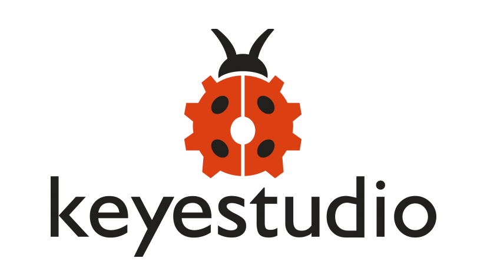

# 1. About keyestudio

Located in Shenzhen, the Silicon Valley of China, KEYES DIY ROBOT co.,LTD is a thriving technology company dedicated to open-source hardware research and development, production and marketing. 

Keyestudio is a best-selling brand owned by KEYES Corporation, our product lines range from Arduino boards, shields, sensor modules, Raspberry Pi, micro:bit extension boards and smart car to complete starter kits designed for customers of any level to learn Arduino knowledge. 

All of our products comply with international quality standards and are greatly appreciated in a variety of different markets throughout the world. 

Welcome check more contents from our official website: <http://www.keyestudio.com>

For more details of our products, you can check it from the links below.

**WIKI Website:** <https://wiki.keyestudio.com>

**US Amazon storefront:** <http://www.amazon.com/shops/A26TCVWBQE4D9T>

**CA Amazon storefront:**<http://www.amazon.ca/shops/A26TCVWBQE4D9T>

**UK Amazon storefront:** <http://www.amazon.co.uk/shops/A39F7KX4U3W9JH>

**DE Amazon storefront:** <http://www.amazon.de/shops/A39F7KX4U3W9JH>

**FR Amazon storefront:** <http://www.amazon.de/shops/A39F7KX4U3W9JH>

**ES Amazon storefront:** <http://www.amazon.de/shops/A39F7KX4U3W9JH>

**IT Amazon storefront:** <http://www.amazon.de/shops/A39F7KX4U3W9JH>

**US Amazon storefront:** <http://www.amazon.com/shops/APU90DTITU5DG>

**CA Amazon storefront:** <http://www.amazon.ca/shops/APU90DTITU5DG>

**JP Amazon storefront:** <http://www.amazon.jp/shops/AE9VWCCXQIC6J>

## 1.1Customer Service

As a continuous and fast growing technology company, we keep striving our best to offer you excellent products and quality service as to meet your expectation. 

We look forward to hearing from you and any of your critical comment or suggestion would be much valuable to us.

You can reach out to us by simply drop a line at <Fennie@keyestudio.com>

Thank you in advance.

## 1.2How to Contact Us?

**Shenzhen KEYES DIY ROBOT co., Ltd.** 

**E-mail:** <Fennie@keyestudio.com>

**TEL:** 0755-23085306

**Address:** Floor 9, Jinxing Building, Changyong Rd, Longhua Dist, Shenzhen, China

