# 1. Product introduction

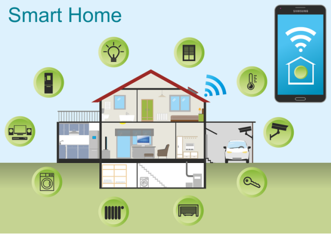

## 1.1 Overview:

This Smart Home Learning Kit based on the Arduino platform is newly rolled out by Keyestudio DIY Robot Co. Ltd.

It simulates the real smart home and demonstrates the cozy and comfortable life for people.

In fact, the logic programming, an invisible hand, controls everything in smart home: it turns on the air conditioner, boots up the water heater, secures your home with an electronic lock, and sets your LED lights and smart curtains to turn on automatically when you get home. Meanwhile, the intelligent lighting system allows you to create a comfortable, tranquil atmosphere. Everything is finished by a remote control or your own cellphone.

As Bill Gates puts it, "In the near future, a house without a smart home system will be as unfashionable as a home without Internet access today."

So, go ahead and get started; let's build this amazing analog smart home.

## 1.2 Kit list

After getting this smart home kit, we need to make sure that there are not missing components.

| #    | Name                                                    | QTY  | Picture                                                      |
| ---- | ------------------------------------------------------- | ---- | ------------------------------------------------------------ |
| 1    | Keyestudio PLUS Control Board                           | 1    | 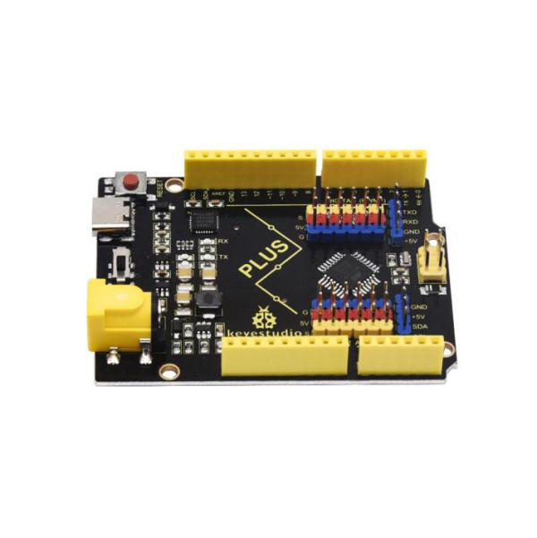             |
| 2    | Keyestudio Sensor Shield V 5.2                          | 1    | 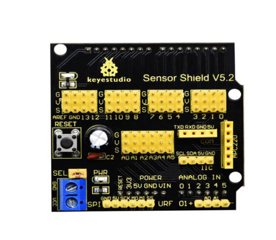             |
| 3    | Wooden Board*10 T=3MM                                   | 1    | 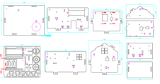 |
| 4    | White LED Module                                        | 1    | 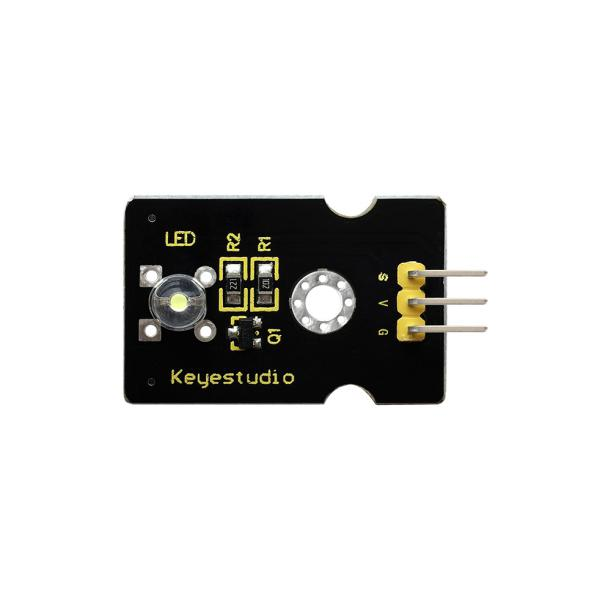             |
| 5    | Yellow LED Module                                       | 1    |              |
| 6    | Button Sensor                                           | 2    | 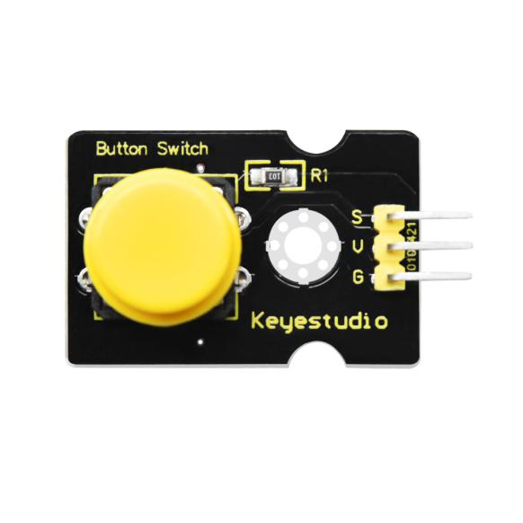             |
| 7    | Photocell Sensor                                        | 1    | 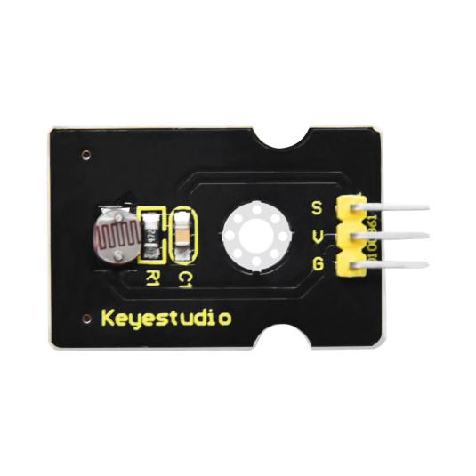             |
| 8    | PIR Motion Sensor                                       | 1    | 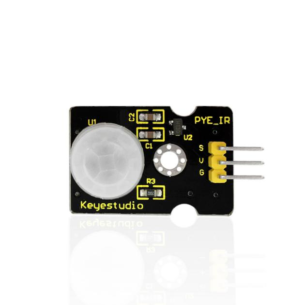             |
| 9    | MQ-2 Gas Sensor                                         | 1    | 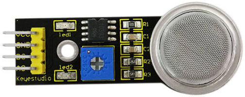              |
| 10   | Relay Module                                            | 1    | 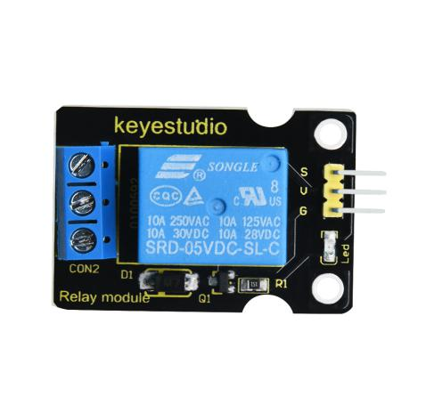             |
| 11   | Bluetooth HM-10 Module                                  | 1    | 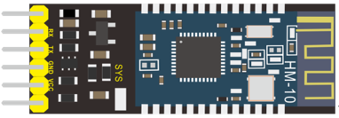              |
| 12   | Passive Buzzer Sensor                                   | 1    | 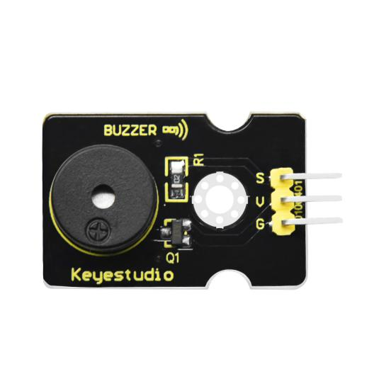             |
| 13   | Fan module                                              | 1    | 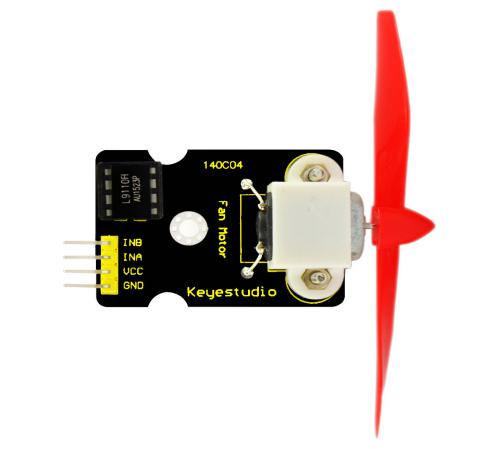             |
| 14   | Steam Sensor                                            | 1    | 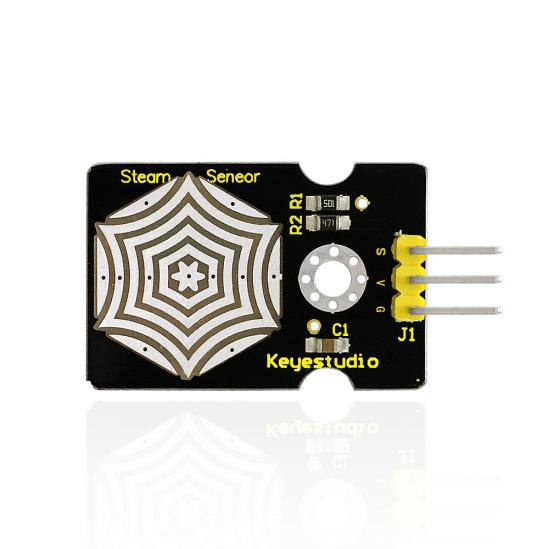             |
| 15   | Servo Motor                                             | 2    | 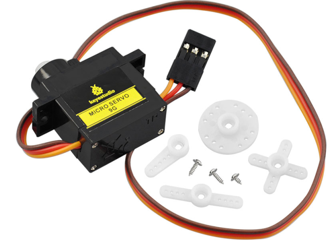              |
| 16   | LCD1602 Display Module                                  | 1    |              |
| 17   | Soil Humidity Sensor                                    | 1    | 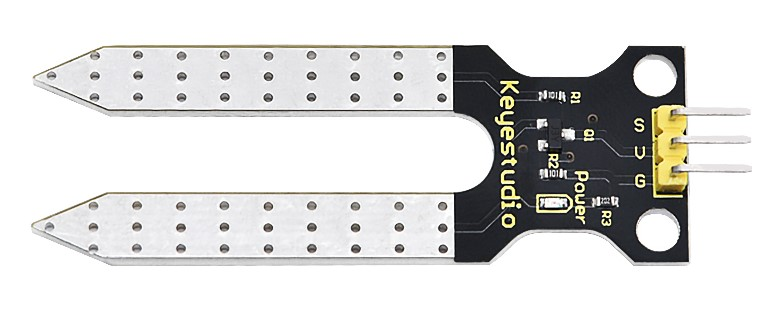             |
| 18   | USB Cable                                               | 1    | 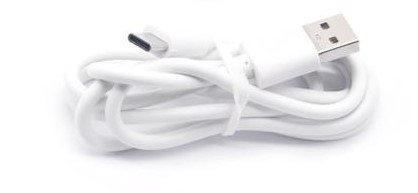             |
| 19   | Female to Female Dupont Cables                          | 40   | 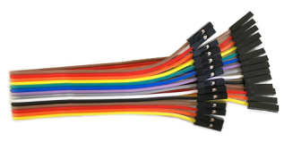              |
| 20   | Male to female Dupont Cables                            | 6    | 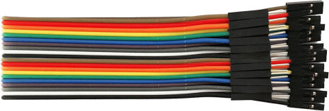              |
| 21   | M3 Nickel Plated Nuts                                   | 25   | 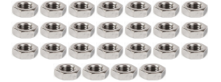 |
| 22   | M2*12MM Round Head Screws                               | 6    |  |
| 23   | M2 Nickel Plated Nuts                                   | 6    | 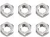 |
| 24   | M3*10MM Dual-pass  Copper Bush                          | 4    | 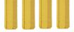 |
| 25   | M3*6MM Round Head Screws                                | 8    | 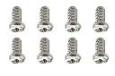 |
| 26   | M3 304 Stainless Steel Self-locking Nuts                | 4    | 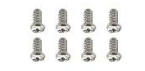 |
| 27   | M3*10MM Round Head Screws                               | 20   | 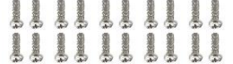 |
| 28   | M2.5*10MM Round Head Screws                             | 6    | 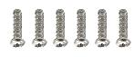 |
| 29   | M2.5 Nickel Plated Nuts                                 | 6    | 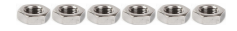 |
| 30   | M3*12MM Round Head Screws                               | 6    | 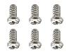 |
| 31   | M3*10MM Flat Head Screws                                | 2    | 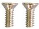 |
| 32   | M1.2*5MM Round Head Self-tapping Screws                 | 10   | 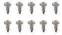 |
| 33   | 6-Slot AA Battery Holder with DC Head and 15cm Dew Line | 1    | 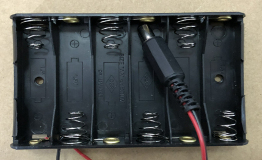              |
| 34   | Black-yellow  Handle 3*40MM Cross Screwdriver           | 1    | 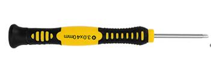             |
| 35   | 20cm 2.54 3Pin F-F Jumper Wire                          | 13   |               |
| 36   | 20cm 2.54 4Pin F-F Jumper Wire                          | 2    | 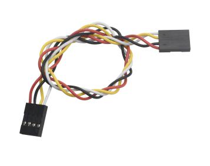             |

