# 2. Product installation

Servo Calibration Code Download：[Servo Calibration code](./Code.7z)

Check board A~I and other parts
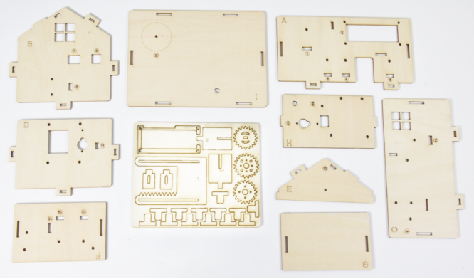

Step 1

Needed Components:
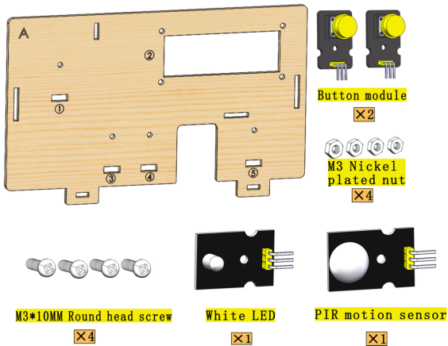
Installation Diagram:

Prototype:
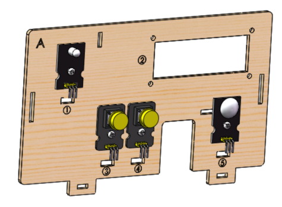

Step 2

Needed Components:
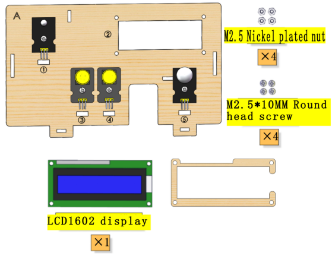
Installation Diagram:

Prototype:
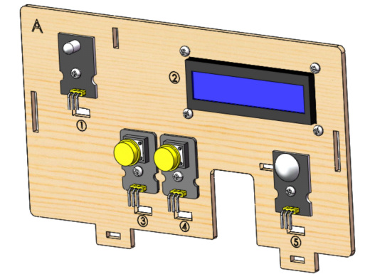

Step 3

Needed Components:
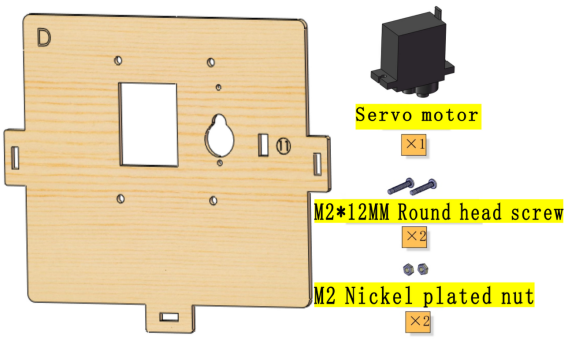
Installation Diagram:

Prototype:
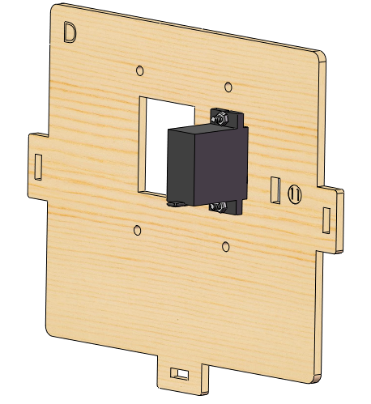

Step 4

Needed Components:
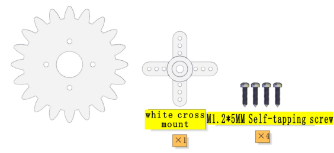
Installation Diagram:

Prototype:

Step 5

Needed Components:

Installation Diagram:

Prototype:

Set the angle of the Servo which controls the window to 90°:

| Servo for window | PLUS Mainboard|
| :--: | :--: |
| Brown line | G |
| Red line | V |
| Orange line | S（10） |

Wire up as shown in the picture and upload the code to the expansion board. Install the Servo after it automatically turn to 90°。

Servo calibration requires uploading code, please refer to the corresponding course (Arduino or Scartch) to install the programming software and upload the servo code of the course you are using.

(Note: This step is necessary.)

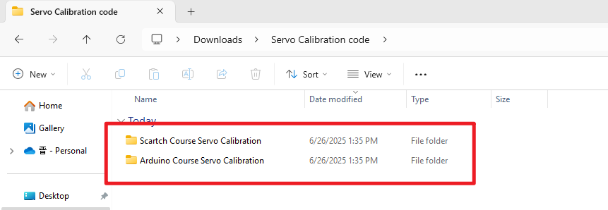

Step 6

Needed Components:
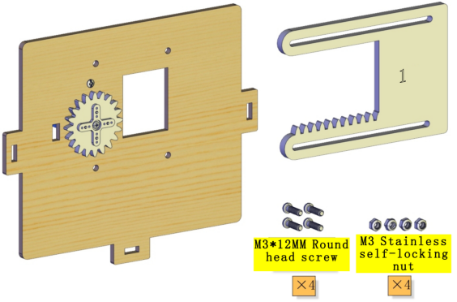
Installation Diagram:
(Please do not tighten the self-locking nut when installing it. The window is closed during installation as shown below:)
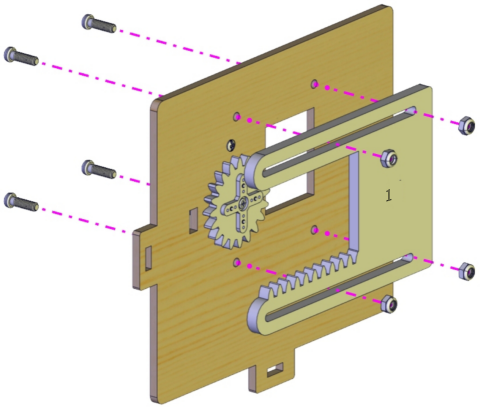
Prototype:
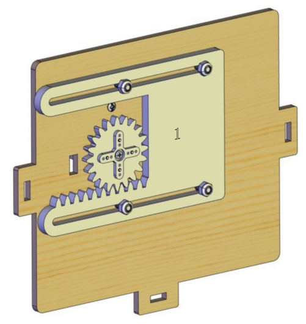

Step 7

Needed Components:
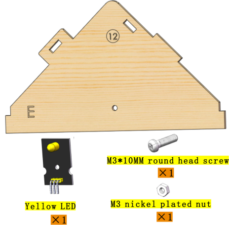
Installation Diagram:
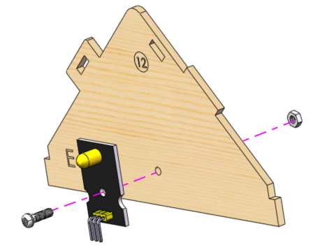
Prototype:
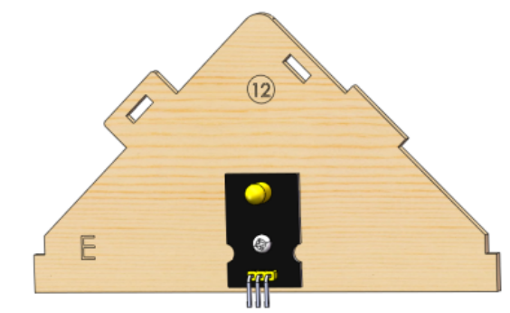

Step 8

Needed Components:
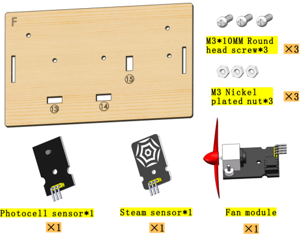
Installation Diagram:
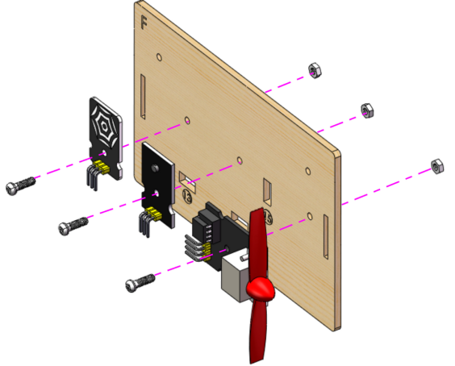
Prototype:
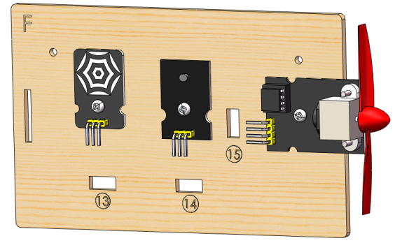

Step 9

Needed Components:

Installation Diagram:

Prototype:

Step 10

Needed Components:
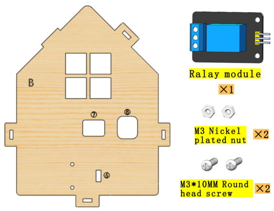
Installation Diagram:

Prototype:

Step 11

Needed Components:

Installation Diagram:

Prototype:
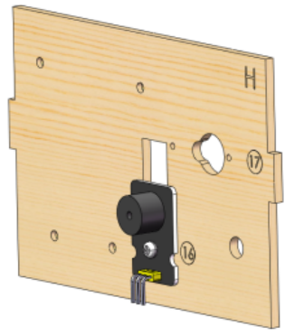

Step 12

Needed Components:
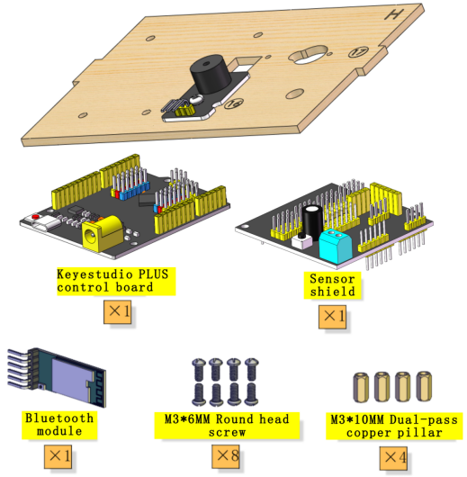
Installation Diagram:

| Bluetooth module | Expansion board |
| :--: | :--: |
| VCC | 5V |
| GND | GND |
| TXD | RXD |
| RXD | TXD |
|Prototype:||

Prototype:

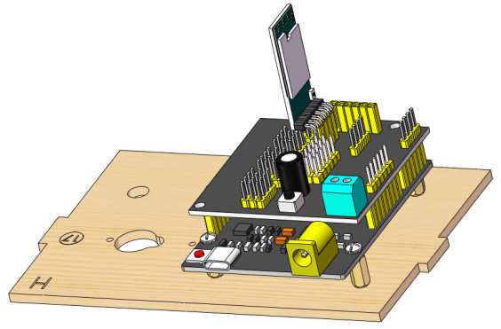

Step 13

Needed Components:
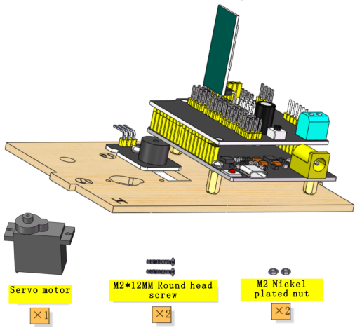
Installation Diagram:
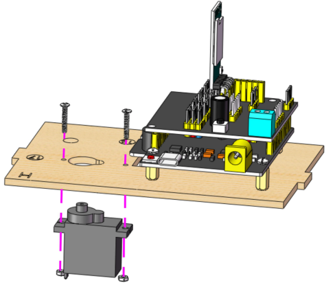
Prototype:

Step 14

Needed Components:

Installation Diagram:

Prototype:
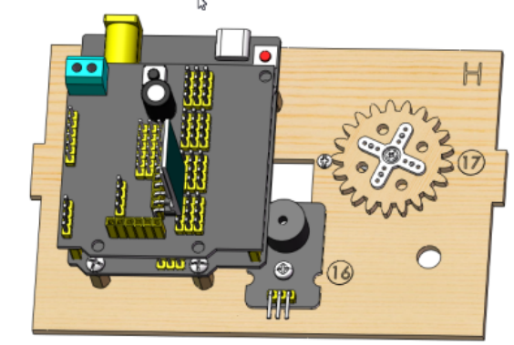

Step 15

Needed Components:

Installation Diagram:

Prototype:

Step 16

Needed Components:

Installation Diagram:
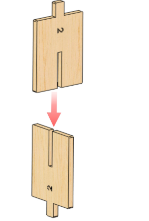
Prototype:

Step 17

Needed Components:
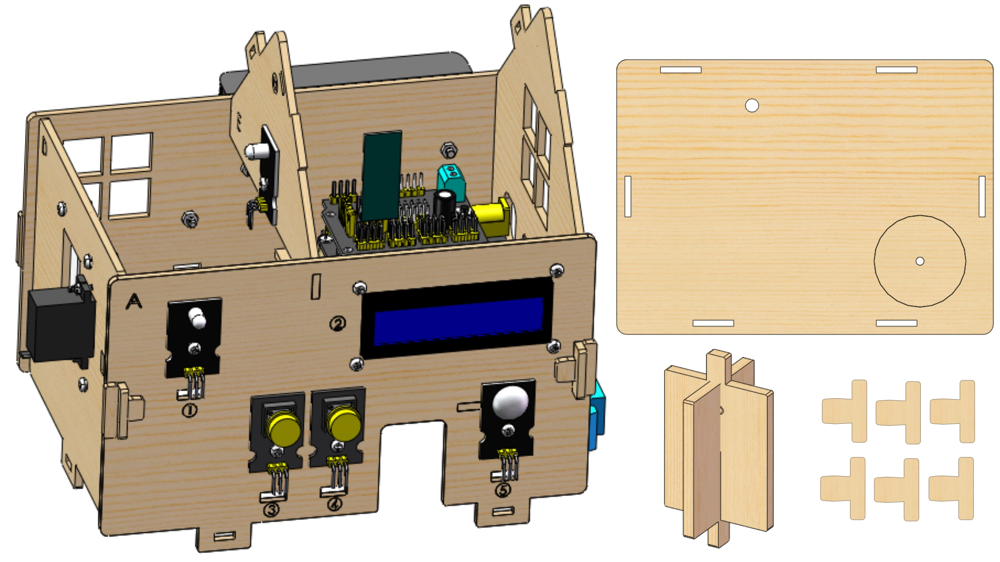
Installation Diagram:
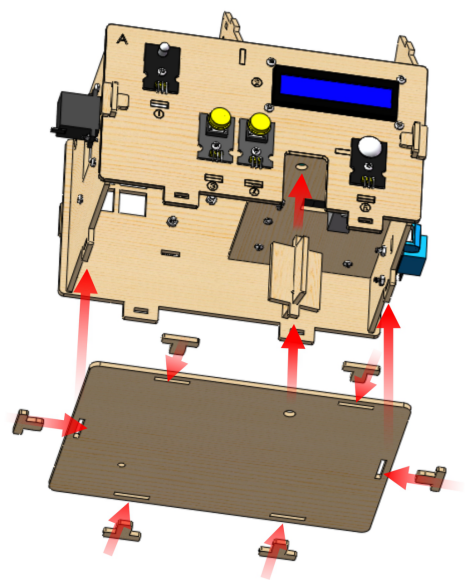
Prototype:

Step 18

Needed Components:

Installation Diagram:

Prototype:
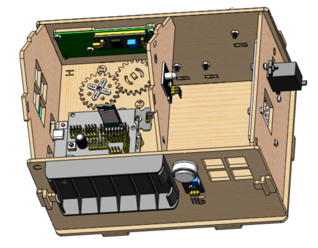

Step 19

Needed Components:            

Installation Diagram:

Prototype:

Wiring

**PIR Motion Sensor**

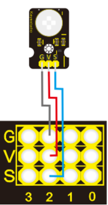

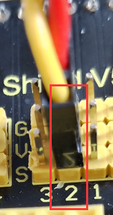

| PIR motion sensor | Expansion board | Position on wood board |
| :--: | :--: | :--: |
| G/V/S | G/V/2 | ⑤ |

**Passive Buzzer**

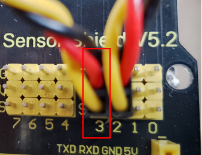

| Passive buzzer | Expansion board | Position on wood board |
| :--: | :--: | :--: |
| G/V/S | G/V/3 | ⑯ |

**Button 1**

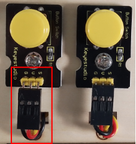
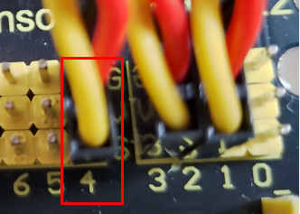

| Button 1 | Expansion board | Position on wood board |
| :--: | :--: | :--: |
| G/V/S | G/V/4 | ③ |

**Yellow LED**

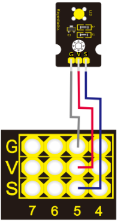

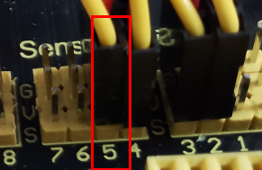

| Yellow LED | Expansion board | Position on wood board |
| :--: | :--: | :--: |
| G/V/S | G/V/5 | ⑫ |

**Fan**

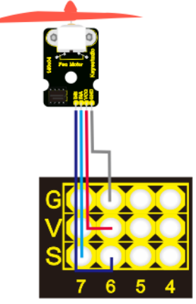
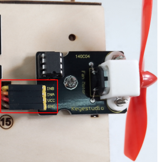
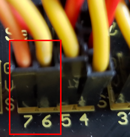

| Fan | Expansion board | Position on wood board |
| :--: | :--: | :--: |
| GND/VCC/INA/INB | G/V/7/6 | ⑮ |

**Button 2**

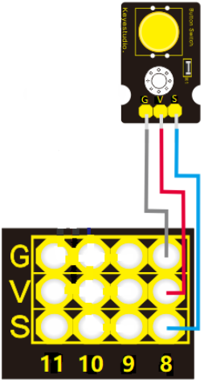
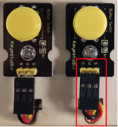

| Button 2 | Expansion board | Position on wood board |
| :--: | :--: | :--: |
| G/V/S | G/V/8 | ④ |

**Servo 1 for Door Controlling**

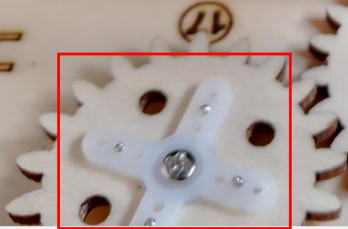

| Servo 1 | Expansion board | Position on wood board |
| :--: | :--: | :--: |
| Brown line/Red line/Orange line | G/V/9 | ⑰ |

**Servo 2 for Window Controlling**

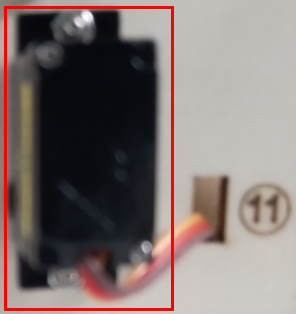

| Servo 2 | Expansion board | Position on wood board |
| :--: | :--: | :--: |
| Brown line/Red line/Orange line | G/V/10 | ⑪ |

**MQ-2 Gas Sensor**

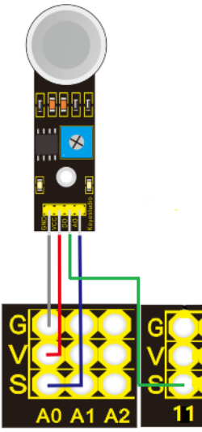
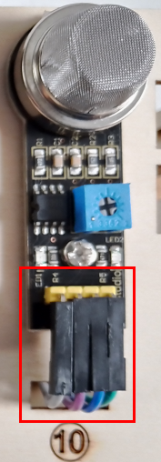

| MQ-2 gas sensor | Expansion board | Position on wood board |
| :--: | :--: | :--: |
| GND/VCC/D0/A0 | G/V/11/A0 | ⑩ |

**Relay Module**

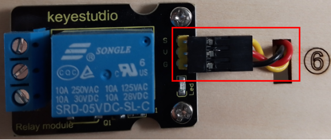
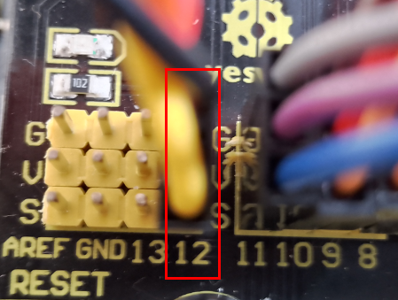

| Relay module | Expansion board | Position on wood board |
| :--: | :--: | :--: |
| G/V/S | G/V/12 | ⑥ |

**White LED**

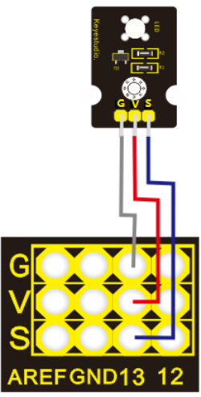

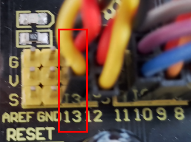

| White LED | Expansion board | Position on wood board |
| :--: | :--: | :--: |
| G/V/S | G/V/13 | ① |

**LCD1602 Display**

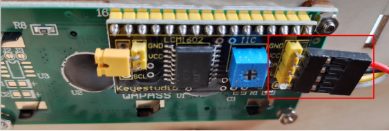

| LCD1602 display | Expansion board | Position on wood board |
| :--: | :--: | :--: |
| GND/VCC/SDA/SCL | GND/5V/SDA/SCL | ② |

**Photocell Sensor**

| photocell sensor | Expansion board | Position on wood board |
| :--: | :--: | :--: |
| G/V/S | G/V/A1 | ⑭ |

**Soil Humidity Sensor**

| soil humidity sensor | Expansion board | Position on wood board |
| :--: | :--: | :--: |
| G/V/S | G/V/A2 |   |

**Steam Sensor**

| steam sensor | Expansion board | Position on wood board |
| :--: | :--: | :--: |
| G/V/S | G/V/A3 | ⑬ |

**Power Supply**

Last Step: Roof Installation

Needed Components

Installation Diagram

Prototype

