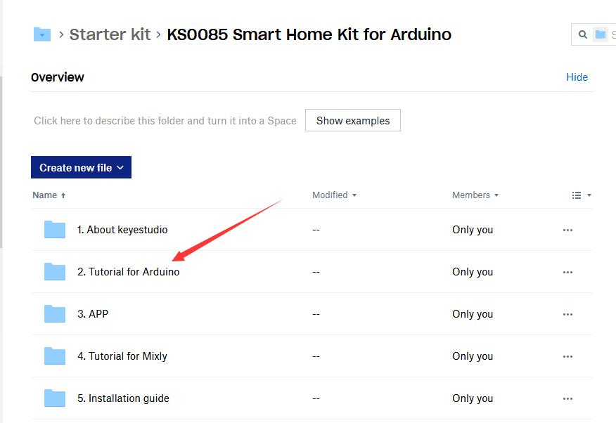

# 2. How to Add a Library?

What are Libraries ?

Libraries are a collection of code that makes it easy for you to connect to a sensor,display, module, etc. 

For example, the built-in LiquidCrystal library helps talk to LCD displays. There are hundreds of additional libraries available on the Internet for download. 

The built-in libraries and some of these additional libraries are listed in the reference.

Here we will introduce the most simple way for you to add libraries . 

Step 1 : After downloading well the Arduino IDE, you can right-click the icon of Arduino IDE. 

Find the option "Open file location" shown as below:

Step2: Enter it to find out libraries folder which is the library file of Arduino.

Step3：Next to find out the “libraries” of smart home(seen in the link:<https://fs.keyestudio.com/KS0085>),as shown below:

You just need to replicate and pastein to the libraries folder of Arduino IDE.

The library of smart home is successfully installed,as shown below:

