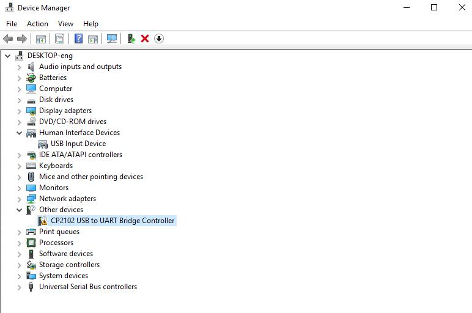
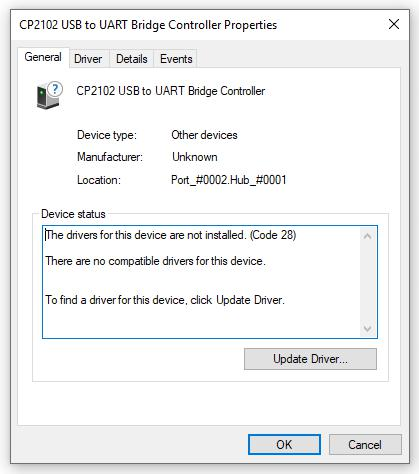
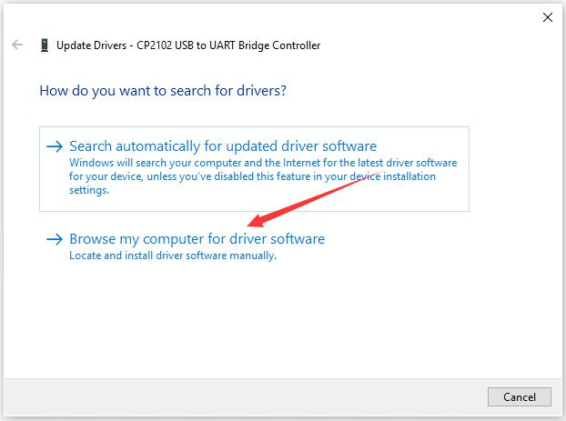

# 3. How to Install Software And Driver

When we get control board, we need to download Arduino IDE and driver firstly. 

You could download Arduino IDE from the official website:<https://www.arduino.cc/>, click the **SOFTWARE** on the browse bar, click “DOWNLOADS” to enter download page, as shown below:

There are various versions for Arduino,just download a suitable version for your system,we will take WINDOWS system as an example to show you how to download and install.

There are two versions for WINDOWS system,one is installed version,another one is download version,you just need to download file to computer directly and unzip it.These two versions can be used normally.Choose one and download on your computer.

You just need to click JUSTDOWNLOAD,then click the downloaded file to install it.

And when the ZIP file is downloaded,you can directly unzip and start it.

## Installing driver

Let’s install the driver of keyestudio PLUS control board.

The USB-TTL chip on PLUS board adopts CP2102 serial chip.

The driver program of this chip is included in Arduino 1.8 version and above,which is convenient.

Plug on USB port of board,the computer can recognizethe hardware and automatically install the driver of CP2102.

If install unsuccessfully,or you intend to install manually,open the device manager of computer.Right click Computer-----Properties-----DeviceManager.

There is a yellow exclamation mark on the page,which implies installing the driver of CP2102 unsuccessfully.Then we double click the hardware and update the driver.

Click “OK” to enter the following page,click “browse my computer for updated driver software”,find out the installed or downloaded ARDUINO software.

As shown below:

There is a DRIVERS folder in Arduino software installed package(),open driver folder and you can see the driver of CP210X series chips.

We click “Browse” ,then find out the driver folder,or you could enter “driver” to search in rectangular box,then click “next”,the driver will be installed successfully.

(I place Arduino software folder on the desktop,you could follow my way)

Open device manager,we will find the yellow exclamation mark disappear.The driver of CP2102 is installed successfully.

