## 5. How to Install the Driver of CP2102 on MAC System

Connect board we provide to your computer, and open Arduino IDE

Click Tools to select Board Arduino Uno and /dev/cu.usbserial-001

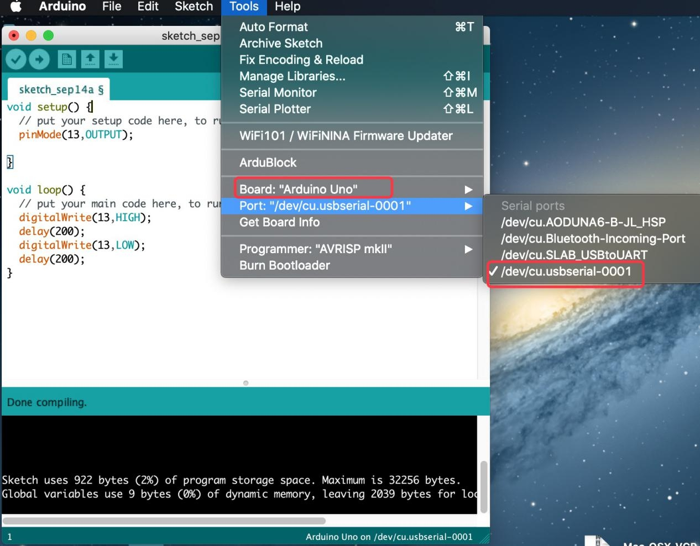

Tap **Upload ** to upload code.If code is uploaded successfully,you will view **Done uploading**.

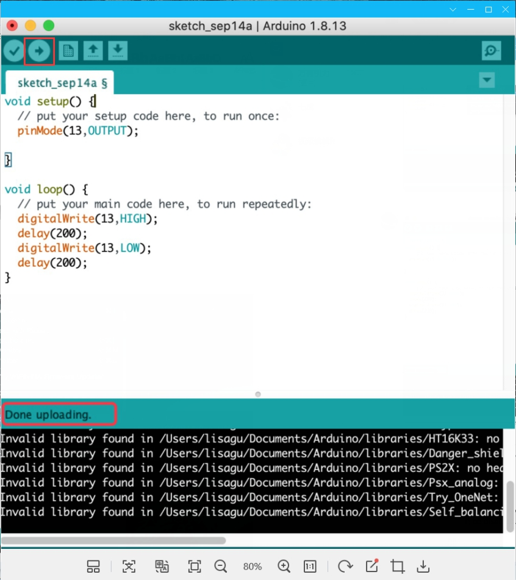

Note: If code is uploaded unsuccessfully,you need to install driver of CP2102,please continue to follow the instructions as below:

DownloadthedriverofCP2102:

<https://www.silabs.com/products/development-tools/software/usb-to-uart-bridge-vcp-drivers>

1.Select Mac OSX edition

2.Unzip the downloaded package

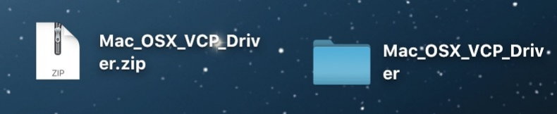

3.Open folder and double-click SiLabsUSBDriverDisk.dmg file.

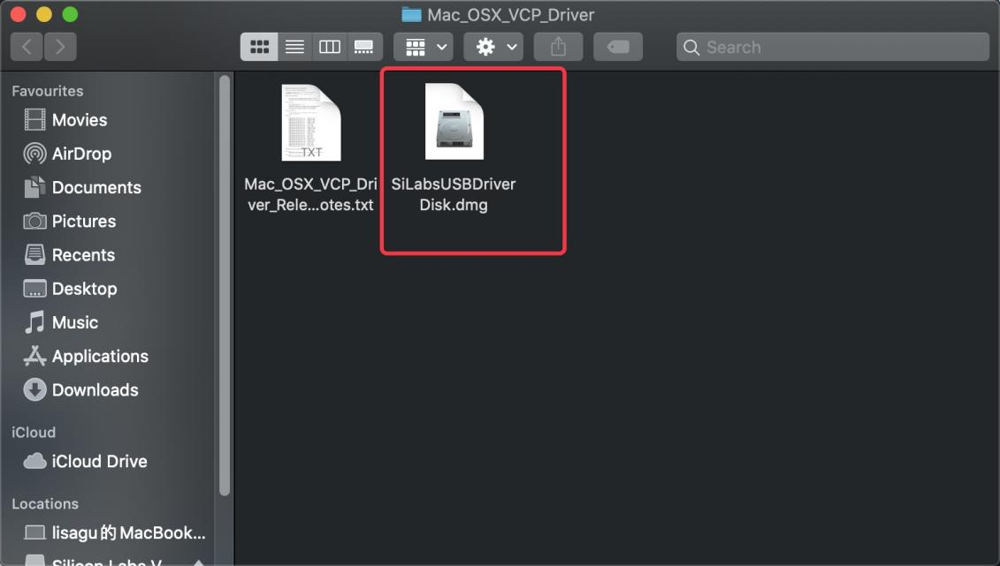

4.You will view the following files as follows:

5.Double-click Install  CP210x VCP Driver,tick **Don’twarn** **me....image** and tap Open.

6.Tap Continue

7.Tap Agree,**and**Continue

8.Click Continue and input your password.

9.Click Open Security Preferences

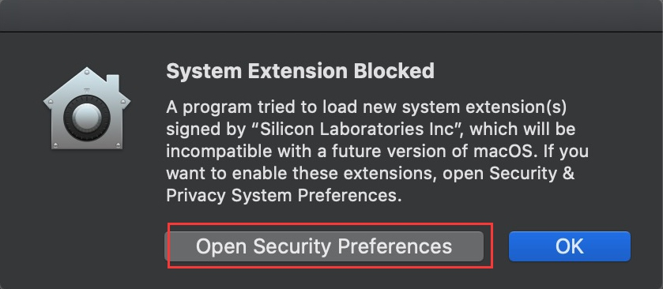

10.Click the lock to unlock security & privacy preference.

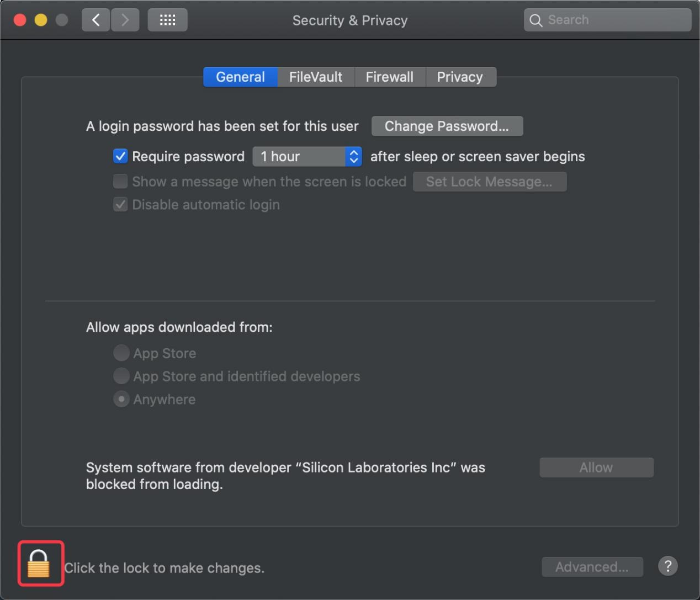

11.Tap Unlock and enter your Username and password

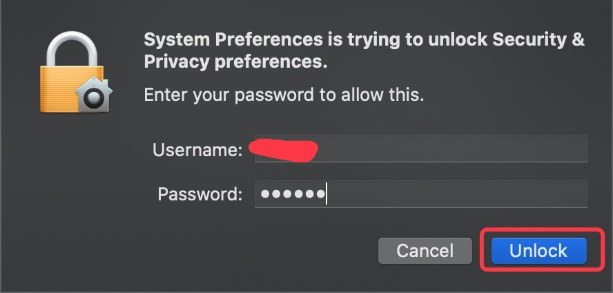

12.Then click Allow

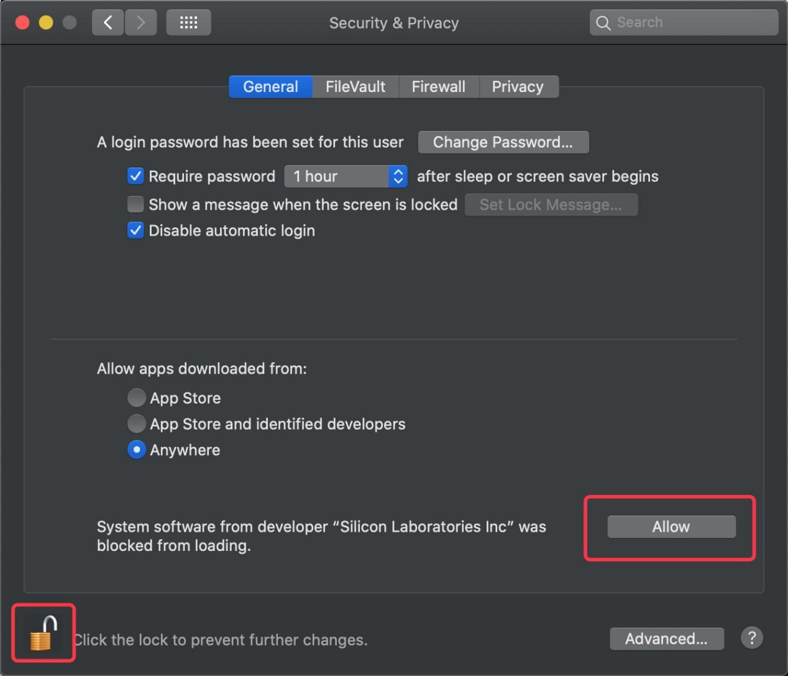

13.Back to installation page,and wait to install.

14.Successfully installed

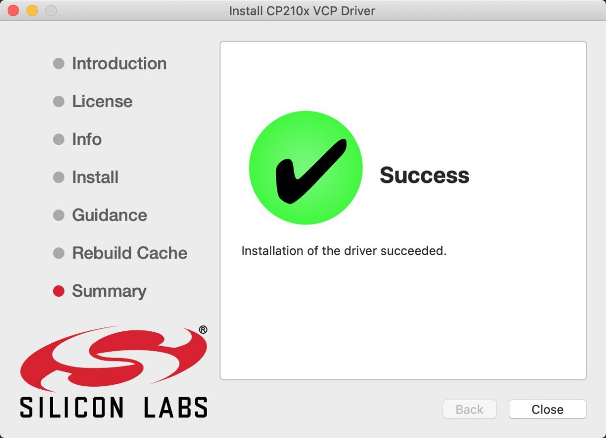

15.Then enter ArduinoIDE,click Tools and select Board Arduino Uno and /dev/ cu.SLAB_USBtoUAPT

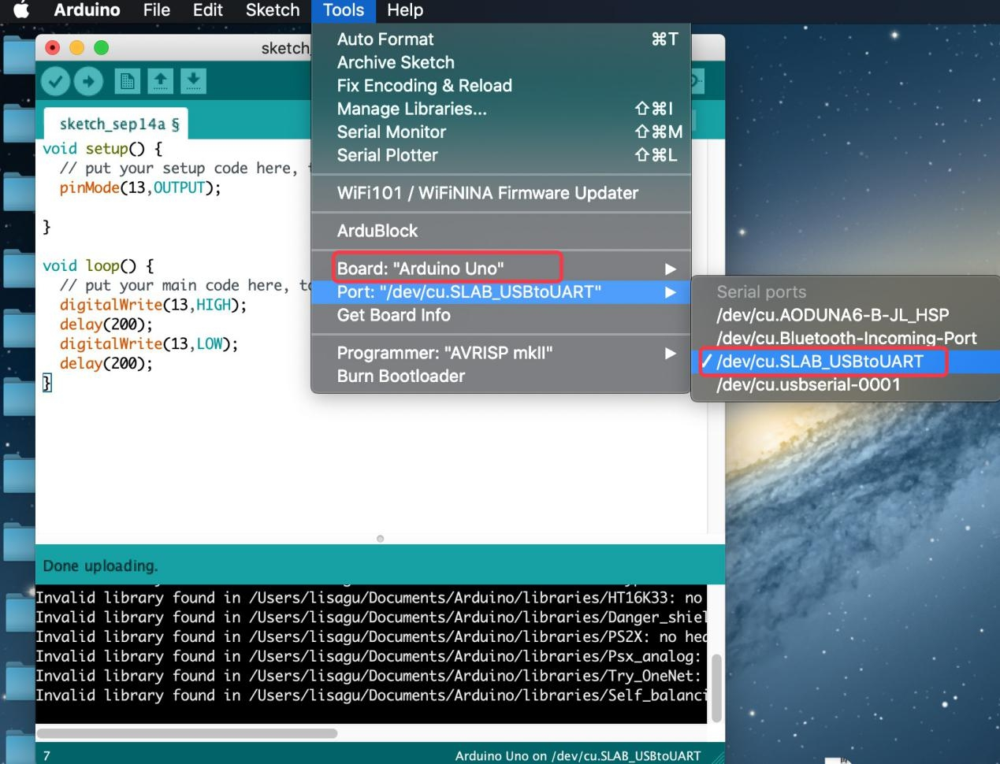

16.Clickto upload code and show “Done uploading”.

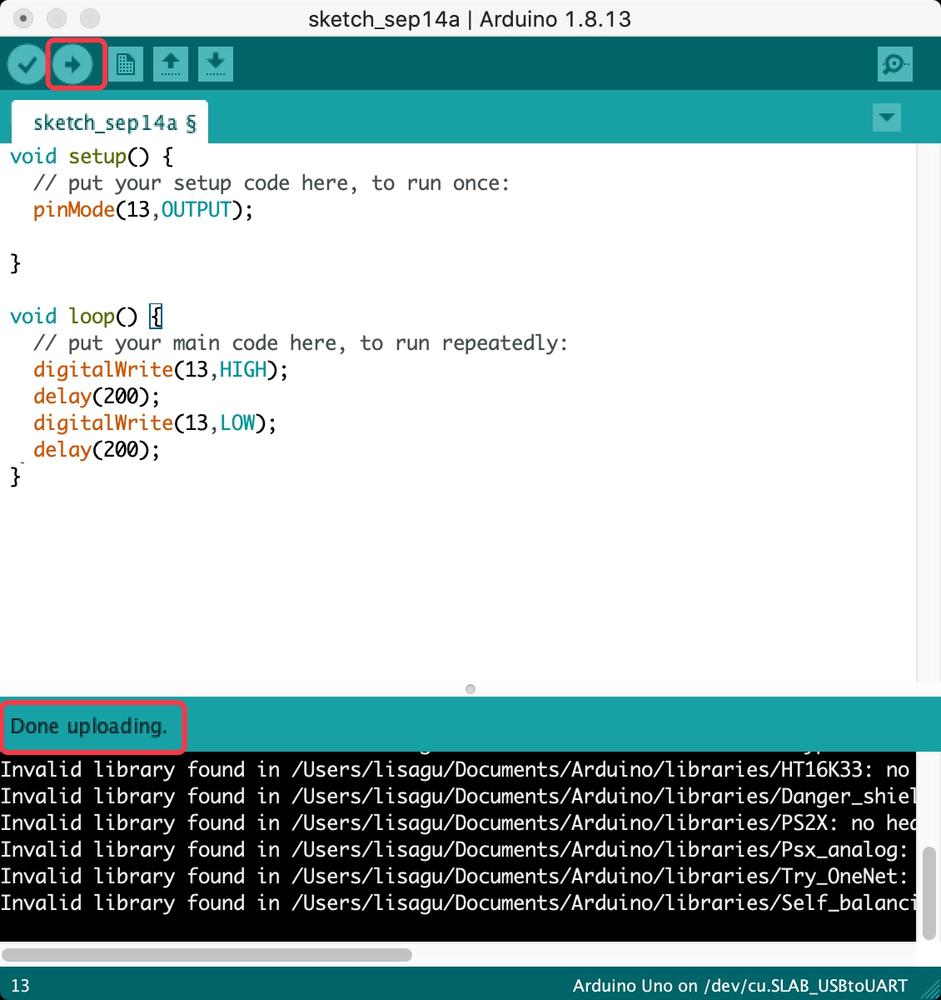