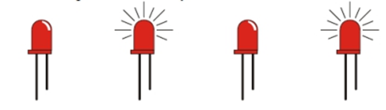
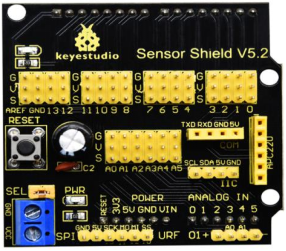
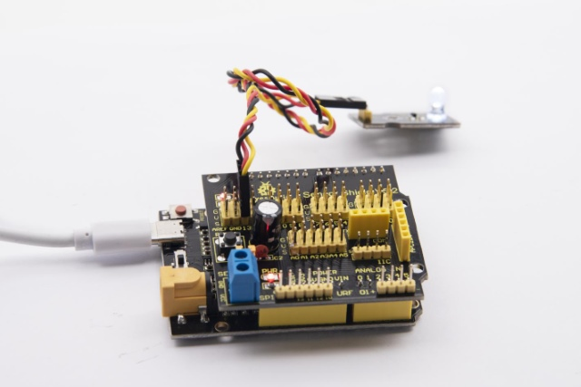

### Project 1: LED Blink



**1.1 Description**

We’ve installed the driver of Keyestudio V4.0 development board.

In this lesson, we will conduct an experiment to make LED blink.

Let’s connect GND and VCC to power. The LED will be on when signal end S is high level, on the contrary, LED will turn off when signal end S is low level.

In addition, the different blinking frequency can be presented by adjusting the delayed time.

**1.2 Specifications**

- Control interface: digital port

- Working voltage: DC 3.3-5V

- Pin pitch: 2.54mm

- LED display color: white

- Display color: white

**1.3 What You Need**

| PLUS control board\*1                           | Sensor shield\*1                                 | White LED module \*1                     | USB cable\*1                                                 | 3pin F-F Dupont line\*1                                      |
| ----------------------------------------------- | ------------------------------------------------ | ---------------------------------------- | ------------------------------------------------------------ | ------------------------------------------------------------ |
|  |  |  |  |  |

**1.4 Sensor Shield**



We usually combine Arduino control board with a large number of sensors and modules. However, the pins and ports are limited on control board.

To cope with this disadvantage, we just need to stack V5 sensor board on Keyestudio PLUS control board.

This V5 shield can be directly attached to sensors with 3 pin connectors, and be extended the commonly used communication ports as well, such as serial communication, IIC communication and SPI communication ports. What’s more, the shield comes with a reset button and 2 signal lights.

**1.5 Pins Description**


**1.6 Wiring Diagram**

Connect LED module with D13 of shield.


Note: pin G, V and S of white LED module are connected with G, V and 13 of V5 board.

**1.7 Test Code**

```c
/*
Keyestudio smart home Kit for Arduino
Project 1
Blink
http://www.keyestudio.com
*/
void setup() 
{
  // initialize digital pin 13 as an output.
  pinMode(13, OUTPUT);
}
// the loop function runs over and over again forever

void loop() 
{
  digitalWrite(13, HIGH);   // turn the LED on (HIGH is the voltage level)
  delay(1000);              // wait for a second
  digitalWrite(13, LOW);    // turn the LED off by making the voltage LOW
  delay(1000);              // wait for a second
}
```

**1.8 Test Result：**

After the code is uploaded, the white LED flashes for 1000ms, alternately.

**1.9 Code Explanation**

The code looks long and clutter, but most of which are comments. The grammar of Arduino is based on C.

Comments generally have two forms of expression:

/\* .......\*/ : suitable for long paragraph comments

// : suitable for mono line comments

The code contains many vital information, such as the author, the issued agreement, etc.

Starter must develop a good habit of looking through code.

The comments, major part of the whole code, are inclusive of significant information and do help you understand test code quickly.

```c
// the setup function runs once when you press reset or power the board
void setup() 
{
  // initialize digital pin 13 as an output.
  pinMode(13, OUTPUT);
}
```

According to comments, we will find that author define the D13 pin mode as digital output in setup() function.

Setup() is the basic function of Arduino and executes once when running program.

```c
// the loop function runs over and over again forever
void loop() 
{
  digitalWrite(13, HIGH);   // turn the LED on (HIGH is the voltage level)
  delay(1000);              // wait for a second
  digitalWrite(13, LOW);    // turn the LED off by making the voltage LOW
  delay(1000);              // wait for a second
}
```

Loop() is the necessary function of Arduino, it can run and loop all the time after “setup()” executes once

In the loop()function, author uses: 

```c
digitalWrite(13, HIGH); // turn the LED on (HIGH is the voltage level)
```

digitalWrite(): set the output voltage of pin to high or low level. We make D13 output high level, then the LED lights on.

```c
delay(1000); // wait for a second
```

Delay function is used for delaying time, 1000ms is 1s, unit is ms

```c
digitalWrite(13, LOW); // turn the LED off by making the voltage LOW
```

Similarly, we make D13 output low level, LED will turn off.

```c
delay(1000); // wait for a second
```

Delay for 1s, light on LED--keep on 1s--light off LED--stay on 1s, iterate the process. LED flashes with 1-second interval.

What if you want to make LED flash rapidly? You only need to modify the value of delay block. Reducing the delay value implies that the time you wait is shorter, that is, flashing rapidly. Conversely, you could make LED flash slowly.

****

