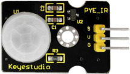
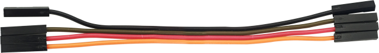
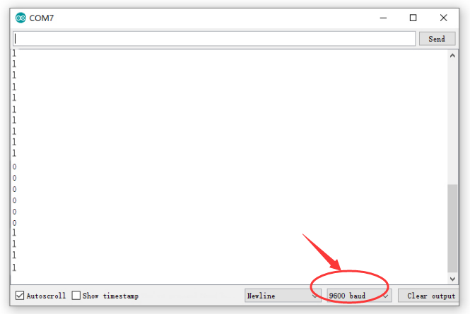
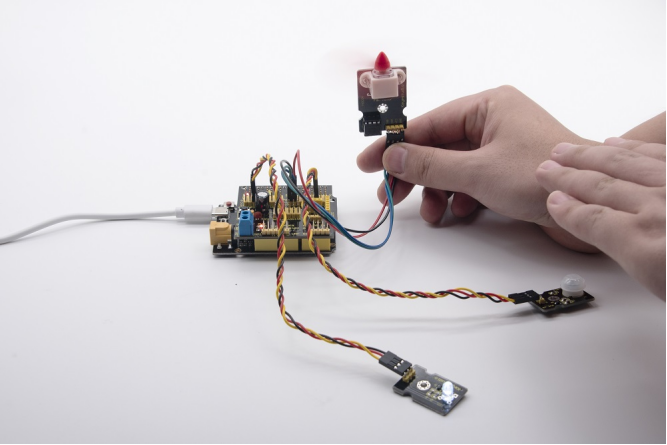

### Project 10: PIR Motion Sensor

**10.1 Description：**



The Pyroelectric infrared motion sensor can detect infrared signals from moving objects, and output switching signals. Applied to a variety of occasions, it can detect movement of human body.

Conventional pyroelectric infrared sensors are much more bigger, with complex circuit and lower reliability. Yet, this new pyroelectric infrared motion sensor, is more practical. It integrates a digital pyroelectric infrared sensor and connecting pins. It features higher sensibility and reliability, lower power consumption, light weight, small size, lower voltage working mode and simpler peripheral circuit.

**10.2 Specifications:**

- Input voltage: DC 3.3V ~ 18V

- Working current: 15uA

- Working temperature: -20 ~ 85 degrees Celsius

- Output voltage: high 3 V, low 0 V

- Output delay time (high level): about 2.3 to 3 seconds

- Detection angle: about 100 °

- Detection distance: 3-4 meters

- Output indicator LED (high-level )

- Pin limit current: 100mA

**Note：**

1\. The maximum distance is 3-4 meters during testing.

2\. In the test, open the white lens to check rectangular sensing part. When the long line of the sensing part is parallel to the ground, the distance is the best.

3\. In the test, covering the sensor with white lens can sense the distance precisely.

4\. The distance is best at 25℃, and the detection distance value will reduce when temperature exceeds 30℃.

5\. After powering up and uploading the code, you can start testing after 5-10 seconds, otherwise the sensor is not sensitive.

**10.3 What You Need**

| PLUS control board\*1                            | Sensor  shield\*1                                | PIR motion sensor\*1                            | F-F Dupont lines\*4                             |
| ------------------------------------------------ | ------------------------------------------------ | ----------------------------------------------- | ----------------------------------------------- |
|   |  |         |  |
| Fan module\*1                                    | White LED module\*1                              | USB cable\*1                                    | 3pinF-F Dupont  line\*2                         |
|  |  |  |  |

**10.4 Wiring Diagram：**


Note: On the shield, the G, V and S of PIR motion sensor are connected to G, V and 2; the GND, VCC, INA and INB of fan module are separately connected with G,V,7,6. The pin G, V and S of LED module are connected with G, V and 13.

**10.5 Test Code：**

```c
/*
Keyestudio smart home Kit for Arduino
Project 10
PIR
http://www.keyestudio.com
*/

void setup () {
   Serial.begin (9600); // open serial port, and set baud rate at 9600bps
   pinMode (2, INPUT); // Define PIR as input in D2
   Serial.begin (9600);
   pinMode (13, OUTPUT); // Define LED as output in D13
   pinMode (7, OUTPUT); // Define D7 as output
   pinMode (6, OUTPUT); // Define D6 as output
}

void loop () {
   Serial.println (digitalRead (2));
   delay (500); // Delay 500ms
   if (digitalRead (2) == 1) // If someone is detected walking
  {
     digitalWrite (13, HIGH); // LED light is on
     digitalWrite (7, HIGH);
     analogWrite (6,150); // Fan rotates

   } else // If no person is detected walking
{
     digitalWrite (13, LOW); // LED light is not on
     digitalWrite (7, LOW);
     analogWrite (6,0); // The fan does not rotate
   }
   }
```

**10.6 Test Result：**

Upload the above test code, open serial monitor, and set baud rate to 9600. If PIR motion sensor detects someone nearby, the serial monitor will display “1” , and LED and D13 will be turned on as well, and fan will rotate. If nobody is around, the serial monitor will show “0”, indicators will be off and fan will stop rotating.



****


