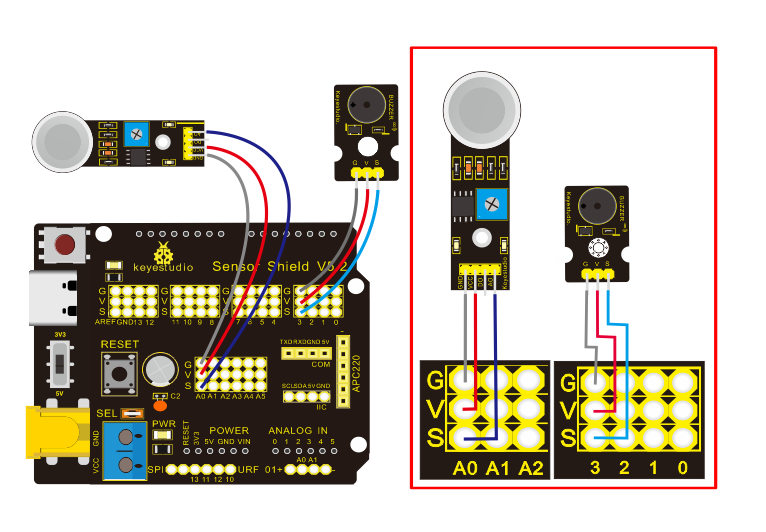
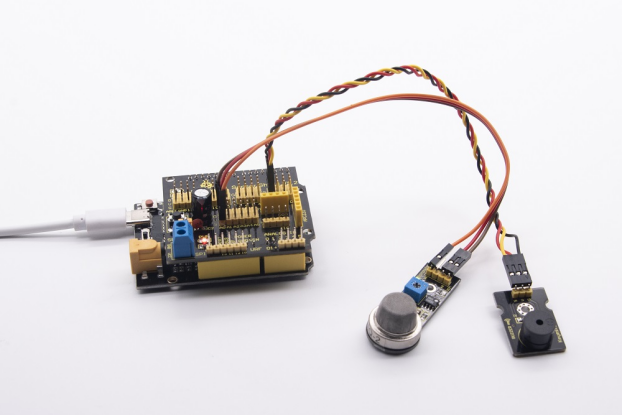

### Project 11: Analog Gas Sensor


**11.1 Description：**

This gas sensor is used for household gas leak alarms, industrial combustible gas alarms and portable gas detection instruments. Also, it is suitable for the detection of liquefied gas, benzene, alkane, alcohol, hydrogen, etc.,

The MQ-2 smoke sensor can be accurately a multi-gas detector, with the advantages of high sensitivity, fast response, good stability, long life, and simple drive circuit.

It can detect the concentration of flammable gas and smoke in the range of 300\~10000ppm. Meanwhile, it has high sensitivity to natural gas, liquefied petroleum gas and other smoke, especially to alkanes smoke.

It must be heated for a period of time before using the smoke sensor, otherwise the output resistance and voltage are not accurate. However, the heating voltage should not be too high, otherwise it will cause internal signal line to blow.

It belongs to the tin dioxide semiconductor gas-sensitive material. At a certain temperature, tin dioxide adsorbs oxygen in the air and forms negative ion adsorption of oxygen, reducing the electron density in the semiconductor, thereby increasing its resistance value.

When in contact with flammable gas in the air and smog, and the potential barrier at the grain boundary is adjusted by the smog, it will cause the surface conductivity to change. With this, information about the presence of smoke or flammable gas can be obtained. The greater the concentration of smoke or flammable gas in the air, the greater the conductivity, and the lower the output resistance, the larger the analog signal output. In addition, the sensitivity can be adjusted by rotating the potentiometer.

**11.2 Specifications:**

- Working voltage: 3.3-5V (DC)

- Interface: 4 pins (VCC, GND, D0, A0)

- Output signal: digital signal and analog signal

- Weight: 7.5g

**11.3 What you need**

| PLUS control  board\*1                          | Sensor shield\*1                                 | MQ-2 gas sensor\*1                       | 3pinF-FDupont Cable*1                    |
| ----------------------------------------------- | ------------------------------------------------ | ---------------------------------------- | ---------------------------------------- |
|  |  |  |  |
| **Passive buzzer\*1**                           | **USB cable\*1**                                 | **F-F Dupint line\*8**                   |                                          |
|         |   |  |                                          |

**11.4 Wiring Diagram：**



Note: On the shield, the pin GND, VCC, D0 and A0 of gas sensor are connected with pin G, V and A0. The pin G,V and S of passive buzzer are connected to G,V and 3.

**11.5 Test Code：**

```c
/*
Keyestudio smart home Kit for Arduino
Project 11
Gas
http://www.keyestudio.com
*/
int MQ2 = A0; // Define MQ2 gas sensor pin at A0
int val = 0; // declare variable
int buzzer = 3; // Define the buzzer pin at D3
void setup ()
{
    pinMode (MQ2, INPUT); // MQ2 gas sensor as input
    Serial.begin (9600); // Set the serial port baud rate to 9600
    pinMode (buzzer, OUTPUT); // Set the digital IO pin mode for output
}

void loop ()
{
    val = analogRead (MQ2); // Read the voltage value of A0 port and assign it to val
    Serial.println (val); // Serial port sends val value
    if (val> 450)
    {
        tone (buzzer, 589);
        delay(300);
    }
    else
    {
        noTone (buzzer);
    }
}
```

**11.6 Test Result：**

Upload test code, wire up components according to connection diagram and power on. When the detected value of flammable gas is greater than 70, the passive buzzer will emit sound, however, when there is no flammable gas, the passive buzzer won’t emit a sound.




