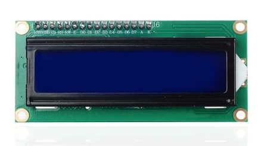

### Project 12: 1602 LCD Display



**12.1 Description：**

This is a display module, with I2C communication module, can show 2 lines with 16 characters per line.

It shows blue background and white word and is attached to I2C interface of MCU. On the back of LCD display is a blue potentiometer for adjusting the backlight. The communication default address is 0x27.

The original 1602 LCD can run with 7 IO ports, but ours is built with ARDUINOIIC/I2C interface, saving 5 IO ports. Alternatively, the module comes with 4 positioning holes with a diameter of 3mm, which is convenient for you to fix on other devices.

Notice that when the screen gets brighter or darker, the characters will become more visible or less visible.

**122 Specifications:**

- I2C address: 0x27

- Backlight (blue, white)

- Power supply voltage: 5V

- Adjustable contrast

- GND: A pin that connects to ground

- VCC: A pin that connects to a +5V power supply

- SDA: A pin that connects to analog port A4 for IIC communication

- SCL: A pin that connects to analog port A5 for IIC communication

**12.3 What You Need**

| PLUS control board\*1                           | Sensor shield\*1                                 | 1602 LCD Display\*1                              | USB cable\*1                                    | 4pinF-F Dupont  line\*1                  |
| ----------------------------------------------- | ------------------------------------------------ | ------------------------------------------------ | ----------------------------------------------- | ---------------------------------------- |
|  |  |  |  |  |

**12.4 Wiring Diagram：**


Note: there are pin GND, VCC, SDA and SCL on 1602LCD module. GND is connected with GND（-）of IIC communication, VCC is connected to 5V（+）, SDA to SDA, SCL to SCL.

**12.5 Test Code:**

```c
/*
Keyestudio smart home Kit for Arduino
Project 12
1602 LCD
http://www.keyestudio.com
*/
#include <Wire.h>
#include <LiquidCrystal_I2C.h>
LiquidCrystal_I2C lcd (0x27,16,2); // set the LCD address to 0x27 for a16 chars and 2 line display

void setup ()
{
    lcd.init (); // initialize the lcd
    lcd.init (); // Print a message to the LCD.
    lcd.backlight ();
    lcd.setCursor (3,0);
    lcd.print ("Hello, world!"); // LED print hello, world!
    lcd.setCursor (2,1);
    lcd.print ("keyestudio!"); // LED print keyestudio!
}

void loop ()
{
}
```

**12.6 Test Result**

After hooking up components and uploading sample code, the 1602 LCD will print "Hello, world!, keyestudio!", and you can adjust LCD backlight with a potentiometer.


Note: When the display doesn’t show characters, you can adjust the potentiometer behind the 1602LCD and backlight to make the 1602LCD display the corresponding character string.


