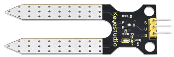
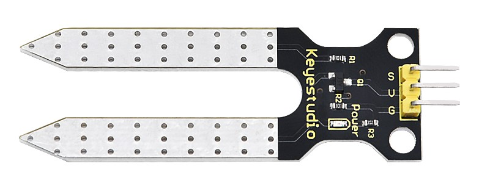
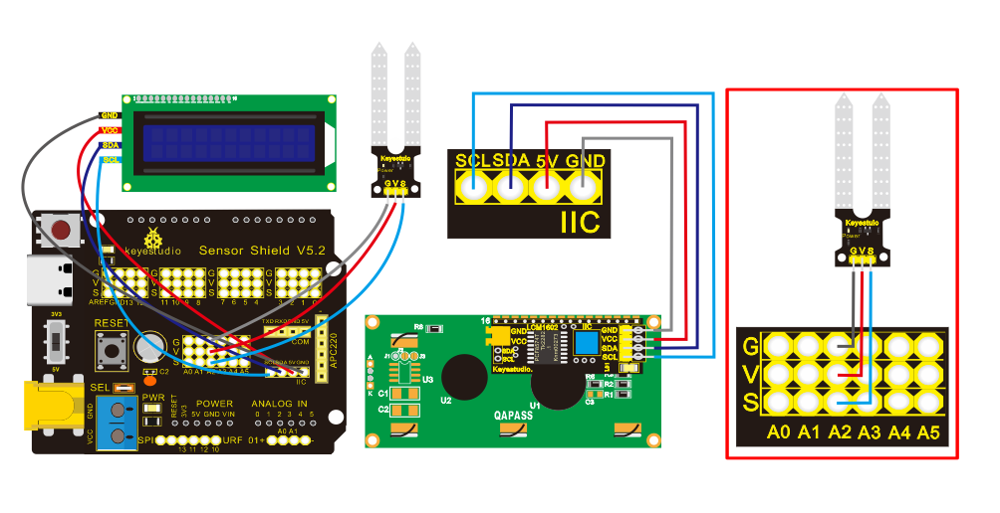
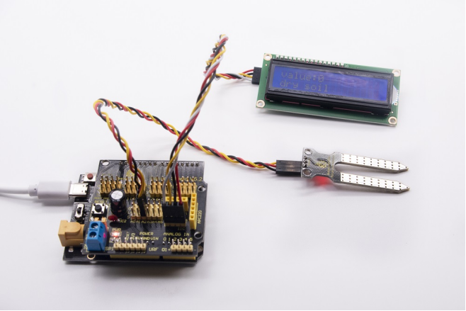

### Project 13：Soil Humidity Sensor

**13.1 Description**



This is a sensor to detect the soil humidity.

If the soil is lack of water, the analog value output by the sensor will decrease; otherwise, the value will increase. It can be applied to prevent your household plants from being destitute of water.

The soil humidity sensor module is not as complicated as you think. It has two probes. When inserted into the soil,it will get resistance value by reading the current changes between the two probes and converting resistance value into moisture content. The higher the moisture (less resistance), the higher the conductivity.

Meanwhile, it comes with 2 positioning holes for installing on other devices.

**13.2 Specification**

- Power Supply Voltage: 3.3V or 5V

- Working Current: ≤ 20mA

- Output Voltage: 0-2.3V (When the sensor is totally immersed in water, the voltage will be 2.3V) the higher humidity, the higher the output voltage

- Sensor type: Analog output

- Interface definition: S- signal, G- GND, V - VCC

**13.3 What You Need**

| PLUS control board\*1                           | Sensor shield\*1                                 | Soil humidity sensor\*1                  | 1602 LCD display\*1                              |
| ----------------------------------------------- | ------------------------------------------------ | ---------------------------------------- | ------------------------------------------------ |
|  |  |  |  |
| USB cable\*1                                    | 4pinF-F Dupont line\*1                           | 3pinF-F Dupont line\*1                   |                                                  |
|  |          |  |                                                  |

**13.4 Wiring Diagram：**



Note: On the shield, the pin G, V and S of soil humidity sensor are connected to G, V and A2; GND of 1602 LCD is connected with GND of ICC communication, VCC is connected to 5V（+）, SDA to SDA, SCL to SCL.

**13.5 Test Code：**

```c
/*
Keyestudio smart home Kit for Arduino
Project 13
Soil Humidity
http://www.keyestudio.com
*/
#include <Wire.h>
#include <LiquidCrystal_I2C.h>
volatile int value;
LiquidCrystal_I2C mylcd (0x27,16,2); // set the LCD address to 0x27 for a16 chars and 2 line display

void setup () 
{
  Serial.begin (9600); // Set the serial port baud rate to 9600
  value = 0;
  mylcd.init ();
  mylcd.backlight (); // Light up the backlight
  mylcd.clear (); // Clear the screen
  Serial.begin (9600); // Set the serial port baud rate to 9600
  pinMode (A2, INPUT); // Soil sensor is at A2, the mode is input
}

void loop () 
{
  Serial.print ("Soil moisture value:"); // Print the value of soil moisture
  Serial.print ("");
  Serial.println (value);
  delay (500); // Delay 0.5S
  value = analogRead (A2); // Read the value of the soil sensor
  if (value <300) // If the value is less than 300
  {
    mylcd.clear (); // clear screen
    mylcd.setCursor (0, 0);
    mylcd.print ("value:"); //
    mylcd.setCursor (6, 0);
    mylcd.print (value);
    mylcd.setCursor (0, 1);
    mylcd.print ("dry soil"); // LCD screen print dry soil
    delay (300); // Delay 0.3S
  } 
  else if ((value>=300) && (value <= 700)) // If the value is greater than 300 and less than 700
  {
    mylcd.clear (); //clear screen
    mylcd.setCursor (0, 0);
    mylcd.print ("value:");
    mylcd.setCursor (6, 0);
    mylcd.print (value);
    mylcd.setCursor (0, 1);
    mylcd.print ("humid soil"); // LCD screen printing humid soil
    delay (300); // Delay 0.3S
  } 
  else if (value> 700) // If the value is greater than 700
  {
    mylcd.clear ();//clear screen
    mylcd.setCursor (0, 0);
    mylcd.print ("value:");
    mylcd.setCursor (6, 0);
    mylcd.print (value);
    mylcd.setCursor (0, 1);
    mylcd.print ("in water"); /// LCD screen printing in water
    delay (300); // Delay 0.3S
  }
}
```

**13.6 Test Result：**

Upload code, open the serial monitor and insert the soil humidity sensor into the soil.

The greater the humidity is, the larger the value(0-1023). Also, the 1602 LCD will display the corresponding value.



