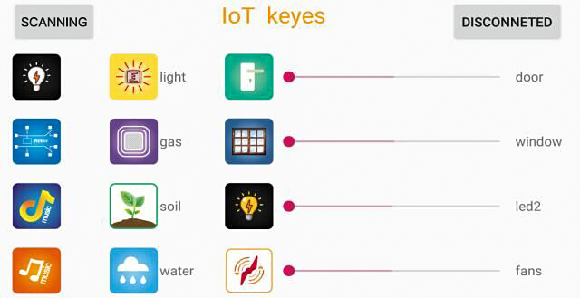
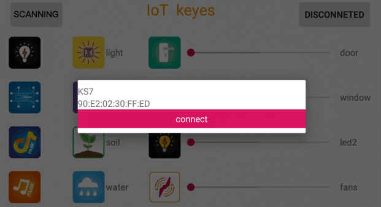
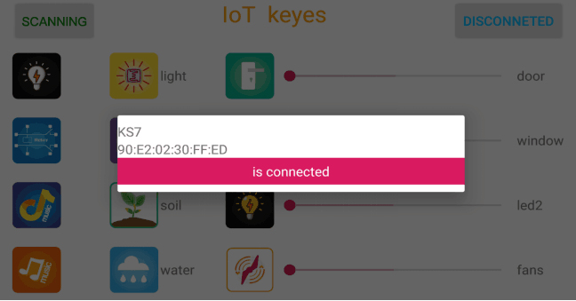

### Project 14: Bluetooth Test

14.1 Description


Bluetooth technology is a wireless standard technology that enables short-distance data exchange between fixed devices, mobile devices, and building personal area networks (using UHF radio waves in the ISM band of 2.4 to 2.485 GHz).

This kit is equipped with the HM-10 Bluetooth module, which is a master-slave machine. When used as the Host, it can send commands to the slave actively; when used as the Slave, it can only receive commands from the host.

The HM-10 Bluetooth module supports the Bluetooth 4.0 protocol, which not only supports Android mobile, but also supports iOS system.

In the experiment, we take the HM-10 Bluetooth module as a Slave and the cellphone as a Host. We install the Bluetooth APP on the mobile phone, connect the Bluetooth module; and use the Bluetooth APP to control the smart home kit.

We also provide you with APP for Android and iOS system.

| Pins  | Description                                                  |
| ----- | ------------------------------------------------------------ |
| BRK   | As the input pin, short press control, or input single pulse of 100ms low level to achieve the following functions: When module is in sleep state: Module is activated to normal state, if open AT+NOTI, serial port will send OK+WAKE. When in connected state: Module will actively request to disconnect When in standby mode: Module will be in initial state |
| RXD   | Serial data inputs                                           |
| TXD   | Serial data outputs                                          |
| GND   | ground lead                                                  |
| VCC   | Positive pole of power, input 5V                             |
| STATE | As output pin, show the working state of module Flash slowly in standby state——repeat 500ms pulse； Always light up in connected state——high level You could set to no flashing in standby state, always light up in connected state |

**14.2 Parameters:**

- Bluetooth protocol: Bluetooth Specification V4.0 BLE

- No byte limit in serial port Transceiving

- In open environment, realize 100m ultra-distance communication with iphone4s

- USB protocol: USB V2.0

- Working frequency: 2.4GHz ISM band

- Modulation method: GFSK(Gaussian Frequency Shift Keying)

- Transmission power: -23dbm, -6dbm, 0dbm, 6dbm, can be modified by AT command.

- Sensitivity: ≤-84dBm at 0.1% BER

- Transmission rate: Asynchronous: 6K bytes ; Synchronous: 6k Bytes

- Security feature: Authentication and encryption

- Supporting service: Central & Peripheral UUID FFE0, FFE1

- Power consumption: Auto sleep mode, stand by current 400uA\~800uA, 8.5mA during transmission.

- Power supply: 5V DC

- Working temperature: –5 to +65 Centigrade

**14.3 Using Bluetooth APP**

In the previous lesson, we’ve introduced the basic parameter principle of HM-10 Bluetooth module. In this project, let's show you how to use the HM-10 Bluetooth module. In order to efficiently control this kit by HM-10 Bluetooth module, we specially designed an APP, as shown below.



There are twelve control buttons and four sliders on App. When we press control button on APP, the Bluetooth of cellphone will send a control character, and Bluetooth module will receive a corresponding control character. When programming, we set the corresponding function of each sensor or module according to the corresponding key control character. Next, let’s test 16 buttons on app.

**APP for Android Mobile：**

**Note: You need to enable the location information before connecting to HM-10 Bluetooth module via cellphone, otherwise, Bluetooth may not be connected.**

Enter **Google** play，search “keyes IoT”. If you can’t search it on app store, please download the app：

<https://play.google.com/store/apps/details?id=com.keyestudio.iot_keyes>

Open the app，and the interface will pop up as below:


Upload code and power on. LED of Bluetooth module blinks.

Start Bluetooth of your cellphone and open App to click “SCANNING” to pair.



Click “Connect”, then Bluetooth is connected successfully(indicator is always on). As shown below;



**iOS System：**

(1) Open App store.

(2) Search “IoT keyes”on APP store, then click “download”.


(3)  After the app is installed successfully, tapto enter the interface as follows:


(4) After uploading the test code successfully, insert the Bluetooth module and power on.

First start the Bluetooth on cellphone, then click “connect” on app to search Bluetooth and pair. After paring successfully, the LED of Bluetooth module will be always on.

Note: Remove the Bluetooth module please when uploading the test code. Otherwise, the code will fail to be uploaded.

Remember to pair Bluetooth and Bluetooth module after uploading the test code.

**14.4 Wiring Diagram：**


Note: On the sensor expansion board, the RXD, TXD, GND, and VCC of the Bluetooth module are respectively connected to TXD, RXD, GND, and 5V, and the STATE and BRK pins of the Bluetooth module do not need connecting.

**14.5 Test Code：**

```c
/*
Keyestudio smart home Kit for Arduino
Project 14
Bluetooth
http://www.keyestudio.com
*/
char val;
void setup()
{
	Serial.begin(9600);// Set the serial port baud rate to 9600
}

void loop()
{
	while (Serial.available()>0)
	{
        val=Serial.read();// Read the value sent by Bluetooth
        Serial.print(val);// The serial port prints the read value
    }
}
```


The function of corresponding character and button is shown below:


