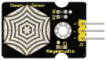

### Project 15：Multi-purpose Smart Home


**15.1 Description**

In the previous projects, we’ve introduced how to use sensors, modules and HM-10 Bluetooth module. For this lesson, we will present all functions of this smart home.

We will achieve the effect as follows:


**1.Photocell sensor, PIR motion sensor and LED.**  When at night, someone passes by, LED is on; nobody is around, the LED is off.

**2.1602LCD display, 2 buttons, 1 servo on the board.**

When button1 is pressed, you can input password(set password in the test code), and the 1602LCD will show “*”, then press button2 to “confirm”. If the password is correct, the 1602LCD will show “open” and the door will be open. However, if the password is wrong, the “error” pops up; after 2s, “error” will turn into “again” , which means that you can enter password again.

Note: The correct password is ”. - - . - .” which means that short press button1, long press button1, long press button1, short press button1, long press button1, and short press button1.

”- ”means long press button1, ”.”means short press button1

The door will be closed when PIR motion sensor doesn’t detect people around. What’s more, if you press and hold button2, the buzzer will emits a sound, and LCD display will show “wait”.

（If the password is right, the servo will rotate to 180°, otherwise，it doesn’t rotate）

**3.Insert soil humidity sensor into a plant pot.** When the soil is too dry, the buzzer will alarm and you will get the notification from app.


**(4) When the gas sensor detects the gas with high concentration,** the buzzer will emit a "tick,tick" alarm sound.


**(5) When steam sensor detects rains,** the servo 2 will be activated and the window will be closed automatically, otherwise, the window will be open.



**15.2 What You Need**


Keyestudio PLUS Control Board * 1, sensor shield * 1, Bluetooth module * 1, PIR motion sensor* 1, photocell sensor * 1, button sensor * 2, white LED module * 1,Yellow LED module * 1, relay Module * 1, passive buzzer module * 1, fan module\* 1, steam sensor * 1, servo module * 2, LCD1602 display module * 1, soil humidity sensor * 1 MQ-2 gas sensor* 1, 3pinF-F dupont cable * 10, 4pin F-F dupont cable * 1, several FF dupont cable, USB cable * 1

**15.3 Wiring diagram：**


| Name                            | sensors and sensor shield | board           |      |
| ------------------------------- | ------------------------- | --------------- | ---- |
| PIR Motion Sensor               | G/V/S                     | G/V/2           | ⑤    |
| Passive Buzzer                  | G/V/S                     | G/V/3           | ⑯    |
| Button sensor 1                 | G/V/S                     | G/V/4           | ③    |
| Yellow LED Module               | G/V/S                     | G/V/5           | ⑫    |
| Fan Module                      | GND/VCC/ INA/INB          | G/V/7/6         | ⑮    |
| Button Module 2                 | G/V/S                     | G/V/8           | ④    |
| Servo 1 controlling the door    | Brown/Red/ Orange Wire    | G/V/9           | ⑰    |
| Servo 2 controlling  the window | Brown/Red/ Orange Wire    | G/V/10          | ⑪    |
| MQ-2 Gas Sensor                 | GND/VCC/ D0/A0            | G/V/11/A0       | ⑩    |
| Relay Module                    | G/V/S                     | G/V/12          | ⑥    |
| White LED                       | G/V/S                     | G/V/13          | ①    |
| LCD1602  Display                | GND/VCC /SDA/SCL          | GND/5V /SDA/SCL | ②    |
| Photocell Sensor                | G/V/S                     | G/V/A1          | ⑭    |
| Soil Humidity Sensor            | G/V/S                     | G/V/A2          |      |
| Steam Sensor                    | G/V/S                     | G/V/A3          | ⑬    |

**15.4 Test Code：**

Finish wiring, let’s design the code:

```c
//call the relevant library file
#include <Servo.h>
#include <Wire.h>
#include <LiquidCrystal_I2C.h>
//Set the communication address of I2C to 0x27, display 16 characters every line, two lines in total
LiquidCrystal_I2C mylcd(0x27, 16, 2);

//set ports of two servos to digital 9 and 10
Servo servo_10;
Servo servo_9;

volatile int btn1_num;//set variable btn1_num
volatile int btn2_num;//set variable btn2_num
volatile int button1;//set variable button1
volatile int button2;//set variable button2
String fans_char;//string type variable fans_char
volatile int fans_val;//set variable fans_char
volatile int flag;//set variable flag
volatile int flag2;//set variable flag2
volatile int flag3;//set variable flag3
volatile int gas;//set variable gas
volatile int infrar;//set variable infrar
String led2;//string type variable led2
volatile int light;//set variable light
String pass;//string type variable pass
String passwd;//string type variable passwd

String servo1;//string type variable servo1
volatile int servo1_angle;//set variable light
String servo2;//string type variable servo2
volatile int servo2_angle;//set variable servo2_angle

volatile int soil;//set variable soil
volatile int val;//set variable val
volatile int value_led2;//set variable value_led2
volatile int water;//set variable water

int length;
int tonepin = 3; //set the signal end of passive buzzer to digital 3
//define name of every sound frequency
#define D0 -1
#define D1 262
#define D2 293
#define D3 329
#define D4 349
#define D5 392
#define D6 440
#define D7 494
#define M1 523
#define M2 586
#define M3 658
#define M4 697
#define M5 783
#define M6 879
#define M7 987
#define H1 1045
#define H2 1171
#define H3 1316
#define H4 1393
#define H5 1563
#define H6 1755
#define H7 1971

#define WHOLE 1
#define HALF 0.5
#define QUARTER 0.25
#define EIGHTH 0.25
#define SIXTEENTH 0.625

//set sound play frequency
int tune[] =
{
  M3, M3, M4, M5,
  M5, M4, M3, M2,
  M1, M1, M2, M3,
  M3, M2, M2,
  M3, M3, M4, M5,
  M5, M4, M3, M2,
  M1, M1, M2, M3,
  M2, M1, M1,
  M2, M2, M3, M1,
  M2, M3, M4, M3, M1,
  M2, M3, M4, M3, M2,
  M1, M2, D5, D0,
  M3, M3, M4, M5,
  M5, M4, M3, M4, M2,
  M1, M1, M2, M3,
  M2, M1, M1
};

//set music beat
float durt[] =
{
  1, 1, 1, 1,
  1, 1, 1, 1,
  1, 1, 1, 1,
  1 + 0.5, 0.5, 1 + 1,
  1, 1, 1, 1,
  1, 1, 1, 1,
  1, 1, 1, 1,
  1 + 0.5, 0.5, 1 + 1,
  1, 1, 1, 1,
  1, 0.5, 0.5, 1, 1,
  1, 0.5, 0.5, 1, 1,
  1, 1, 1, 1,
  1, 1, 1, 1,
  1, 1, 1, 0.5, 0.5,
  1, 1, 1, 1,
  1 + 0.5, 0.5, 1 + 1,
};


void setup() 
{
  Serial.begin(9600);//set baud rate to 9600
  
  mylcd.init();
  mylcd.backlight();//initialize LCD
  //LCD shows "password:" at first row and column
  mylcd.setCursor(1 - 1, 1 - 1);
  mylcd.print("password:");
  
  servo_9.attach(9);//make servo connect to digital 9
  servo_10.attach(10);//make servo connect to digital 10
  servo_9.write(0);//set servo connected digital 9 to 0°
  servo_10.write(0);//set servo connected digital 10 to 0°
  delay(300);
  
  pinMode(7, OUTPUT);//set digital 7 to output
  pinMode(6, OUTPUT);//set digital 6 to output
  digitalWrite(7, HIGH); //set digital 7 to high level
  digitalWrite(6, HIGH); //set digital 6 to high level
  
  pinMode(4, INPUT);//set digital 4 to input
  pinMode(8, INPUT);//set digital 8 to input
  pinMode(2, INPUT);//set digital 2 to input
  pinMode(3, OUTPUT);//set digital 3 to output
  pinMode(A0, INPUT);//set A0 to input
  pinMode(A1, INPUT);//set A1 to input
  pinMode(13, OUTPUT);//set digital 13 to input
  pinMode(A3, INPUT);//set A3 to input
  pinMode(A2, INPUT);//set A2 to input

  pinMode(12, OUTPUT);//set digital 12 to output
  pinMode(5, OUTPUT);//set digital 5 to output
  pinMode(3, OUTPUT);//set digital 3 to output
  length = sizeof(tune) / sizeof(tune[0]); //set the value of length
}

void loop() 
{
  auto_sensor();
  if (Serial.available() > 0) //serial reads the characters
  {
    val = Serial.read();//set val to character read by serial    Serial.println(val);//output val character in new lines
    pwm_control();
  }
  switch (val) 
  {
    case 'a'://if val is character 'a'，program will circulate
      digitalWrite(13, HIGH); //set digital 13 to high level，LED   lights up
      break;//exit loop
    case 'b'://if val is character 'b'，program will circulate
      digitalWrite(13, LOW); //Set digital 13 to low level, LED is off
      break;//exit loop
    case 'c'://if val is character 'c'，program will circulate
      digitalWrite(12, HIGH); //set digital 12 to high level，NO of relay is connected to COM
      break;//exit loop
    case 'd'://if val is character 'd'，program will circulate
      digitalWrite(12, LOW); //set digital 12 to low level，NO of relay is disconnected to COM

      break;//exit loop
    case 'e'://if val is character 'e'，program will circulate
      music1();//play birthday song
      break;//exit loop
    case 'f'://if val is character 'f'，program will circulate
      music2();//play ode to joy song
      break;//exit loop
    case 'g'://if val is character 'g'，program will circulate
      noTone(3);//set digital 3 to stop playing music
      break;//exit loop
    case 'h'://if val is character 'h'，program will circulate
      Serial.println(light);//output the value of variable light in new lines
      delay(100);
      break;//exit loop
    case 'i'://if val is character 'i'，program will circulate
      Serial.println(gas);//output the value of variable gas in new lines
      delay(100);
      break;//exit loop
    case 'j'://if val is character 'j'，program will circulate
      Serial.println(soil);//output the value of variable soil in new lines
      delay(100);
      break;//exit loop
    case 'k'://if val is character 'k'，program will circulate
      Serial.println(water);//output the value of variable water in new lines
      delay(100);
      break;//exit loop
    case 'l'://if val is character 'l'，program will circulate
      servo_9.write(180);//set servo connected to digital 9 to 180°
      delay(500);
      break;//exit loop
    case 'm'://if val is character 'm'，program will circulate
      servo_9.write(0);;//set servo connected to digital 9 to 0°
      delay(500);
      break;//exit loop
    case 'n'://if val is character 'n'，program will circulate
      servo_10.write(180);//set servo connected to digital 10 to 180°
      delay(500);
      break;//exit loop
    case 'o'://if val is character 'o'，program will circulate
      servo_10.write(0);//set servo connected to digital 10 to 0°
      delay(500);
      break;//exit loop
    case 'p'://if val is character 'p'，program will circulate
      digitalWrite(5, HIGH); //set digital 5 to high level, LED is on
      break;//exit loop
    case 'q'://if val is character 'q'，program will circulate
      digitalWrite(5, LOW); // set digital 5 to low level, LED is off
      break;//exit loop
    case 'r'://if val is character 'r'，program will circulate
      digitalWrite(7, LOW);
      digitalWrite(6, HIGH); //fan rotates anticlockwise at the fastest speed
      break;//exit loop
    case 's'://if val is character 's'，program will circulate
      digitalWrite(7, LOW);
      digitalWrite(6, LOW); //fan stops rotating
      break;//exit loop
  }
}

////////////////////////set birthday song//////////////////////////////////
void birthday()
{
  tone(3, 294); //digital 3 outputs 294HZ sound 
  delay(250);//delay in 250ms
  tone(3, 440);
  delay(250);
  tone(3, 392);
  delay(250);
  tone(3, 532);
  delay(250);
  tone(3, 494);
  delay(500);
  tone(3, 392);
  delay(250);
  tone(3, 440);
  delay(250);
  tone(3, 392);
  delay(250);
  tone(3, 587);
  delay(250);
  tone(3, 532);
  delay(500);
  tone(3, 392);
  delay(250);
  tone(3, 784);
  delay(250);
  tone(3, 659);
  delay(250);
  tone(3, 532);
  delay(250);
  tone(3, 494);
  delay(250);
  tone(3, 440);
  delay(250);
  tone(3, 698);
  delay(375);
  tone(3, 659);
  delay(250);
  tone(3, 532);
  delay(250);
  tone(3, 587);
  delay(250);
  tone(3, 532);
  delay(500);
}


//detect gas
void auto_sensor() 
{
  gas = analogRead(A0);//assign the analog value of A0 to gas
  if (gas > 700) 
  {
//if variable gas>700
    flag = 1;//set variable flag to 1
    while (flag == 1)
      //if flag is 1, program will circulate
    {
      Serial.println("danger");//output "danger" in new lines
      tone(3, 440);
      delay(125);
      delay(100);
      noTone(3);
      delay(100);
      tone(3, 440);
      delay(125);
      delay(100);
      noTone(3);
      delay(300);
      gas = analogRead(A0);//gas analog the value of A0 to gas
      if (gas < 100)  //if variable gas is less than 100
      {
        flag = 0;//set variable flag to 0
        break;//exit loop exist to loop
      }
    }

  } 
  else
  {
    noTone(3);// digital 3 stops playing music
  }
  light = analogRead(A1);////Assign the analog value of A1 to light
  if (light < 300)//if variable light is less than 300
  {
    infrar = digitalRead(2);//assign the value of digital 2 to infrar 
    Serial.println(infrar);//output the value of variable infrar in new lines
    if (infrar == 1)
      // if variable infra is 1
    {
      digitalWrite(13, HIGH); //set digital 13 to high level, LED is on
    } else//Otherwise
    {
      digitalWrite(13, LOW); //set digital 13 to low level, LED is off 
    }

  }
  water = analogRead(A3);//assign the analog value of A3 to variable water
  if (water > 800)
    // if variable water is larger than 800
  {
    flag2 = 1;//if variable flag 2 to 1
    while (flag2 == 1)
      // if flag2 is 1, program will circulate
    {
      Serial.println("rain");//output "rain" in new lines
      servo_10.write(180);// set the servo connected to digital 10 to 180°
      delay(300);//delay in 300ms
      delay(100);
      water = analogRead(A3);;//assign the analog value of A3 to variable water
      if (water < 30)// if variable water is less than 30
      {
        flag2 = 0;// set flag2 to 0
        break;//exit loop
      }
    }

  } else//Otherwise
  {
    if (val != 'u' && val != 'n')
      //if val is not equivalent 'u' either 'n'
    {
      servo_10.write(0);//set servo connected to digital 10 to 0°
      delay(10);

    }

  }
  soil = analogRead(A2);//assign the analog value of A2 to variable soil
  if (soil > 50)
    // if variable soil is greater than 50
  {
    flag3 = 1;//set flag3 to 1
    while (flag3 == 1)
      //If set flag3 to 1, program will circulate 
    {
      Serial.println("hydropenia ");//output "hydropenia " in new lines
      tone(3, 440);
      delay(125);
      delay(100);
      noTone(3);
      delay(100);
      tone(3, 440);
      delay(125);
      delay(100);
      noTone(3);//digital 3 stops playing sound
      delay(300);
      soil = analogRead(A2);//Assign the analog value of A2 to variable soil
      if (soil < 10)//If variable soil<10
      {
        flag3 = 0;//set flag3 to 0
        break;//exit loop
      }
    }

  } else//Otherwise
  {
    noTone(3);//set digital 3 to stop playing music
  }
  door();//run subroutine
}

void door() {
  button1 = digitalRead(4);// assign the value of digital 4 to button1
  button2 = digitalRead(8);//assign the value of digital 8 to button2
  if (button1 == 0)//if variablebutton1 is 0
  {
    delay(10);//delay in 10ms
    while (button1 == 0) //if variablebutton1 is 0，program will circulate
    {
      button1 = digitalRead(4);// assign the value of digital 4 to button1
      btn1_num = btn1_num + 1;//variable btn1_num plus 1
      delay(100);// delay in 100ms
    }

  }
  if (btn1_num >= 1 && btn1_num < 5) //1≤if variablebtn1_num<5
  {
    Serial.print(".");
    Serial.print("");
    passwd = String(passwd) + String(".");//set passwd 
pass = String(pass) + String("*");//set pass
    //LCD shows pass at the first row and column
    mylcd.setCursor(1 - 1, 2 - 1);
    mylcd.print(pass);
  }
  if (btn1_num >= 5)
    //if variablebtn1_num ≥5
  {
    Serial.print("-");
    passwd = String(passwd) + String("-");//Set passwd 
    pass = String(pass) + String("*");//set pass
    //LCD shows pass at the first row and column
    mylcd.setCursor(1 - 1, 2 - 1);
    mylcd.print(pass);

  }
  if (button2 == 0) //if variablebutton2 is 0
  {
    delay(10);
    if (button2 == 0)//if variable button2 is 0
    {
      if (passwd == ".--.-.")//if passwd is ".--.-."
      {
        mylcd.clear();//clear LCD screen
        //LCD shows "open!" at first character on second row
        mylcd.setCursor(1 - 1, 2 - 1);
        mylcd.print("open!");
        servo_9.write(100);//set servo connected to digital 9 to 100°
        delay(300);
        delay(5000);
        passwd = "";
        pass = "";
        mylcd.clear();//clear LCD screen
        //LCD shows "password:"at first character on first row
        mylcd.setCursor(1 - 1, 1 - 1);
        mylcd.print("password:");

      } else //Otherwise
      {
        mylcd.clear();//clear LCD screen
        //LCD shows "error!"at first character on first row
        mylcd.setCursor(1 - 1, 1 - 1);
        mylcd.print("error!");
        passwd = "";
        pass = "";
        delay(2000);
        //LCD shows "again" at first character on first row
        mylcd.setCursor(1 - 1, 1 - 1);
        mylcd.print("again");
      }
    }
  }
  infrar = digitalRead(2);//assign the value of digital 2 to infrar
  if (infrar == 0 && (val != 'l' && val != 't'))
    //if variable infrar is 0 and val is not 'l' either 't'
  {
    servo_9.write(0);//set servo connected to digital 9 to 0°
    delay(50);
  }
  if (button2 == 0)//if variablebutton2 is 0
  {
    delay(10);
    while (button2 == 0) //if variablebutton2 is 0，program will circulate
    {
      button2 = digitalRead(8);//assign the value of digital 8 to button2
      btn2_num = btn2_num + 1;//variable btn2_num plus 1
      delay(100);
      if (btn2_num >= 15)//if variablebtn2_num ≥15
      {
        tone(3, 532);
        delay(125);
        mylcd.clear();//clear LCD screen
        //LCD shows "password:" at the first character on first row
        mylcd.setCursor(1 - 1, 1 - 1);
        mylcd.print("password:");
        //LCD shows "wait" at the first character on first row
        mylcd.setCursor(1 - 1, 1 - 1);
        mylcd.print("wait");
      } else//Otherwise
      {
        noTone(3);//digital 3 stops playing music
      }
    }

  }
  btn1_num = 0;//set btn1_num to 0
  btn2_num = 0;//set btn2_num to 0
}

// Birthday song
void music1() {
  birthday();
}
//Ode to joy
void music2() {
  Ode_to_Joy();
}
void Ode_to_Joy()//play Ode to joy song
{
  for (int x = 0; x < length; x++)
  {
    tone(tonepin, tune[x]);
    delay(300 * durt[x]);
  }
}

//PWM control
void pwm_control() {
  switch (val)
  {
    case 't'://if val is 't'，program will circulate
      servo1 = Serial.readStringUntil('#');
      servo1_angle = String(servo1).toInt();
      servo_9.write(servo1_angle);//set the angle of servo connected to digital 9 to servo1_angle
      delay(300);
      break;//exit loop
    case 'u'://if val is 'u'，program will circulate
      servo2 = Serial.readStringUntil('#');
      servo2_angle = String(servo2).toInt();
      servo_10.write(servo2_angle);//set the angle of servo connected to digital 10 to servo2_angle
      delay(300);
      break;//exit loop
    case 'v'://if val is 'v'，program will circulate
      led2 = Serial.readStringUntil('#');
      value_led2 = String(led2).toInt();
      analogWrite(5, value_led2); //PWM value of digital 5 is value_led2
      break;//exit loop
    case 'w'://if val is 'w'，program will circulate
      fans_char = Serial.readStringUntil('#');
      fans_val = String(fans_char).toInt();
      digitalWrite(7, LOW);
      analogWrite(6, fans_val); //set PWM value of digital 6 to fans_val，the larger the value, the faster the fan
      break;//exit loop
  }
}

```

Upload the whole code and see the result！

Note: Remove the Bluetooth module please when uploading the test code. Otherwise, the code will fail to be uploaded.

Remember to pair Bluetooth and Bluetooth module after uploading the test code.

**15.5 Test Result：**

Upload the test code, stack expansion board on PLUS Control Board, and power on. After pairing and connecting Bluetooth successfully, we can control the smart home through app.


