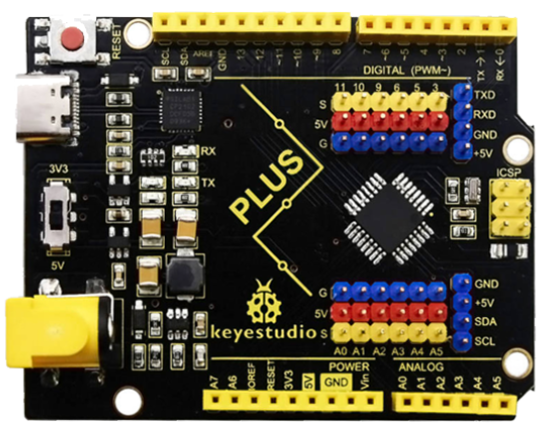
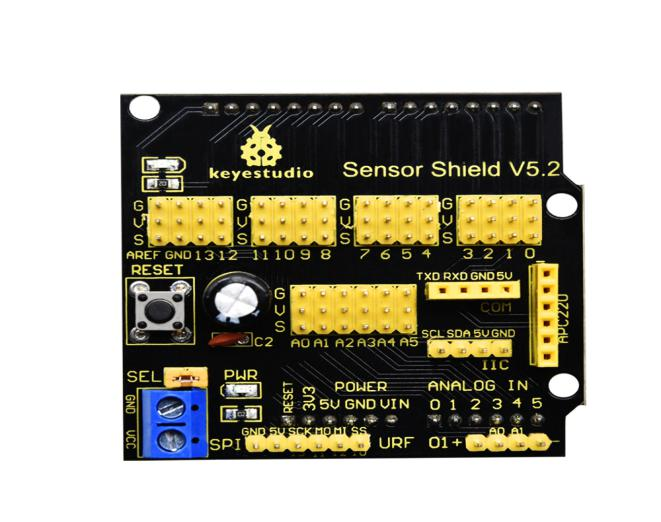
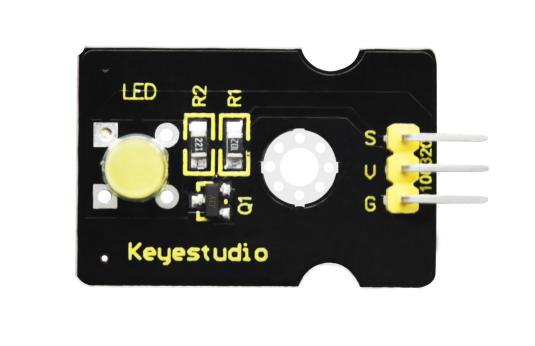
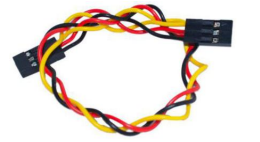
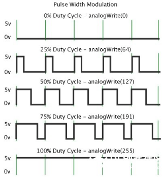

### Project 2：Breathing Light


**2.1 Description**

In the previous lesson, we control LED on and off and make it blink.

In this project, we will control LED brightness through PWM to simulate breathing effect. Similarly, you can change the step length and delay time in the code so as to demonstrate different breathing effect.

PWM is a means of controlling the analog output via digital means. Digital control is used to generate square waves with different duty cycles (a signal that constantly switches between high and low levels) to control the analog output.In general, the input voltage of port are 0V and 5V. What if the 3V is required? Or what if switch among 1V, 3V and 3.5V? We can’t change resistor constantly. For this situation, we need to control by PWM.


For the Arduino digital port voltage output, there are only LOW and HIGH, which correspond to the voltage output of 0V and 5V. You can define LOW as 0 and HIGH as 1, and let the Arduino output five hundred 0 or 1 signals within 1 second.

If output five hundred 1, that is 5V; if all of which is 1, that is 0V. If output 010101010101 in this way then the output port is 2.5V, which is like showing movie. The movie we watch are not completely continuous. It actually outputs 25 pictures per second. In this case, the human can’t tell it, neither does PWM. If want different voltage, need to control the ratio of 0 and 1. The more 0,1 signals output per unit time, the more accurately control.

**2.2 What You Need**

| PLUS control board\*1                           | Sensor shield\*1                                 | Yellow LED module\*1                             | USB cable\*1                                    | 3pin F-F Dupont line\*1                         |
| ----------------------------------------------- | ------------------------------------------------ | ------------------------------------------------ | ----------------------------------------------- | ----------------------------------------------- |
|  |  |  |  |  |

**2.3 Wiring Diagram**


Note: on sensor shield, the G, V and S pins of yellow LED module are connected with G, V and 5.

**2.4 Test Code**

```c
/*
Keyestudio smart home Kit for Arduino
Project 2
PWM
http://www.keyestudio.com
*/
int ledPin = 5; // Define the LED pin at D5
void setup () 
{
      pinMode (ledPin, OUTPUT); // initialize ledpin as an output.
}

void loop () 
{
    for (int value = 0; value<255; value = value + 1) 
    {
         analogWrite (ledPin, value); // LED lights gradually light up
         delay (5); // delay 5MS
     }
    for (int value = 255; value>0; value = value-1)
    {
         analogWrite (ledPin, value); // LED gradually goes out
         delay (5); // delay 5MS
    }
}
```

LED smoothly changes its brightness from dark to bright and back to dark, continuing to do so, which is similar to a lung breathing in and out.


**2.5 Code Analysis**

When we need to repeat some statements, we have to use “for” statement

For statement format as follows:

 

“for” cyclic sequence:

Round 1：1 → 2 → 3 → 4

Round 2：2 → 3 → 4

…

Until number 2 is not established, “for”loop is over,

After knowing this order, go back to code:

```c
for (int value = 0; value < 255; value=value+1)
{
        ...
}
for (int value = 255; value >0; value=value-1)
{
       ...
}
```

The two “for”statement make value increase from 0 to 255, then reduce from 255 to 0, then increase to 255,....infinite loop

There is a new function in “for” statement ----- analogWrite()

We know that digital port only has two state of 0 and 1. So how to send an analog value to a digital value? Here, we need this function, observe the Arduino board and you will find 6 pins with “\~”. They are different from other pins and can output PWM signals.

Function format as follows:

```c
analogWrite(pin,value)
```

analogWrite() is used to write an analog value from 0\~255 for PWM port, so the value is in the range of 0\~255, attention that you only write the digital pins with PWM function, such as pin 3, 5, 6, 9, 10, 11.

PWM is a technology to obtain analog quantity through digital method. Digital control forms a square wave, and the square wave signal only has two states of switching (that is, high or low levels of our digital pins). By controlling the ratio of the duration of on and off, a voltage varying from 0 to 5V can be simulated. The time taken(academically referred to as high level) is called pulse width, so PWM is also called pulse width modulation.

Through the following five square waves, let’s know more about PWM.



In the above figure, the green line represents a period, and value of analogWrite() corresponds to a percentage which is called Duty Cycle as well. Duty cycle implies that high-level duration is divided by low-level duration in a cycle. From top to bottom, the duty cycle of first square wave is 0% and its corresponding value is 0. The LED brightness is lowest, that is, turn off. The more time high level lasts, the brighter the LED. Therefore, the last duty cycle is 100%, which correspond to 255, LED is brightest. 25% means darker.

PWM mostly is used for adjusting the LED brightness or rotation speed of motor.
