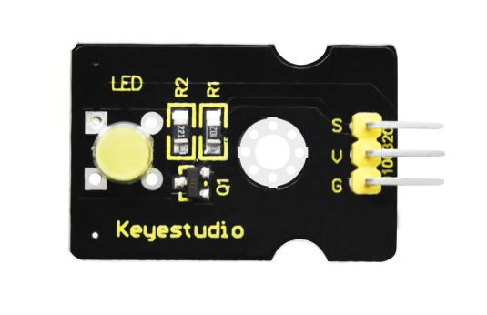

### Project 3：Passive Buzzer

**3.1 Description**


There are prolific interactive works completed by Arduino. The most common one is sound and light display. We always use LED to make experiments. For this lesson, we design circuit to emit sound. The universal sound components are buzzer and horns. Buzzer is easier to use. And buzzer includes about active buzzer and passive buzzer. In this experiment, we adopt passive buzzer.

While using passive buzzer, we can control different sound by inputting square waves with distinct frequency. During the experiment, we control code to make buzzer sound, begin with “tick, tick” sound, then make passive buzzer emit “do re mi fa so la si do”, and play specific songs.

**3.2 What You Need**

| PLUS control board\*1                           | Sensor shield\*1                                 | Passive buzzer\*1                        | USB cable\*1                             | 3pin F-F Dupont line\*1                  |
| ----------------------------------------------- | ------------------------------------------------ | ---------------------------------------- | ---------------------------------------- | ---------------------------------------- |
|  |  |  |  |  |

**3.2 Wiring Diagram**


The G, V and S pins of passive buzzer are connected to G, V and 3.

**3.4 Test Code**

```c
/*
Keyestudio smart home Kit for Arduino
Project 3.1
Buzzer
http://www.keyestudio.com
*/
int tonepin = 3; // Set the Pin of the buzzer to the digital D3

void setup ()
{
    pinMode (tonepin, OUTPUT); // Set the digital IO pin mode to output
}

void loop ()
{
     unsigned char i, j;
     while (1)
     {
        for (i = 0; i <80; i ++) // output a frequency sound
        {
           digitalWrite (tonepin, HIGH); // Sound
           delay (1); // Delay 1ms
           digitalWrite (tonepin, LOW); // No sound
           delay (1); // Delay 1ms
        }
        for (i = 0; i <100; i ++) // output sound of another frequency
        {
           digitalWrite (tonepin, HIGH); // Sound
           delay (2); // delay 2ms
           digitalWrite (tonepin, LOW); // No sound
           delay (2); // delay 2ms
        }
      }
}
```

From the above code, number 80 and 100 decide frequency in “for” statement. Delay time controls duration, like the beat in music.


We will play fabulous music if control ling frequency and beats well, so let’s figure out the frequency of tones. As shown below:

Bass：

| Tone Note | 1#   | 2#   | 3#   | 4#   | 5#   | 6#   | 7#   |
| --------- | ---- | ---- | ---- | ---- | ---- | ---- | ---- |
| A         | 221  | 248  | 278  | 294  | 330  | 371  | 416  |
| B         | 248  | 278  | 294  | 330  | 371  | 416  | 467  |
| C         | 131  | 147  | 165  | 175  | 196  | 221  | 248  |
| D         | 147  | 165  | 175  | 196  | 221  | 248  | 278  |
| E         | 165  | 175  | 196  | 221  | 248  | 278  | 312  |
| F         | 175  | 196  | 221  | 234  | 262  | 294  | 330  |
| G         | 196  | 221  | 234  | 262  | 294  | 330  | 371  |

Alto：

| Tone Note | 1    | 2    | 3    | 4    | 5    | 6    | 7    |
| --------- | ---- | ---- | ---- | ---- | ---- | ---- | ---- |
| A         | 441  | 495  | 556  | 589  | 661  | 742  | 833  |
| B         | 495  | 556  | 624  | 661  | 742  | 833  | 935  |
| C         | 262  | 294  | 330  | 350  | 393  | 441  | 495  |
| D         | 294  | 330  | 350  | 393  | 441  | 495  | 556  |
| E         | 330  | 350  | 393  | 441  | 495  | 556  | 624  |
| F         | 350  | 393  | 441  | 495  | 556  | 624  | 661  |
| G         | 393  | 441  | 495  | 556  | 624  | 661  | 742  |

Treble：

| Tone Note | 1#   | 2#   | 3#   | 4#   | 5#   | 6#   | 7#   |
| --------- | ---- | ---- | ---- | ---- | ---- | ---- | ---- |
| A         | 882  | 990  | 1112 | 1178 | 1322 | 1484 | 1665 |
| B         | 990  | 1112 | 1178 | 1322 | 1484 | 1665 | 1869 |
| C         | 525  | 589  | 661  | 700  | 786  | 882  | 990  |
| D         | 589  | 661  | 700  | 786  | 882  | 990  | 1112 |
| E         | 661  | 700  | 786  | 882  | 990  | 1112 | 1248 |
| F         | 700  | 786  | 882  | 935  | 1049 | 1178 | 1322 |
| G         | 786  | 882  | 990  | 1049 | 1178 | 1322 | 1484 |

Next, we need to control the time the note plays. The music will be produced when every note plays a certain amount of time. The note rhythm is divided into one beat, half beat, 1/4 beat, 1/8 beat,.

The time for a note is stipulated as half beat( 0.5), 1/4 beat(0.250, 1/8 beat( 0.125)....., therefore, the music is played.

We will take an example of “Ode to joy”


From notation, the music is 4/4 beat.

There are special notes we need to explain:

1.  Normal note, like the first note 3, correspond to 350(frequency), occupy 1 beat
2.  The note with underline means 0.5 beat
3.  The note with dot()means that 0.5 beat is added, that is 1+0.5 beat
4.  The note with”—” represents that 1 beat is added, that is 1+1 beat.
5.  The two successive notes with arc imply legato, you could slightly modify the frequency of the note behind legato(need to debug it yourself), such like reducing or increasing some values, the sound will be more smoother.

```c
/*
Keyestudio smart home Kit for Arduino
Project 3.2
Buzzer music
http://www.keyestudio.com
*/
#define NTD0 -1
#define NTD1 294
#define NTD2 330
#define NTD3 350
#define NTD4 393
#define NTD5 441
#define NTD6 495
#define NTD7 556
 
#define NTDL1 147
#define NTDL2 165
#define NTDL3 175
#define NTDL4 196
#define NTDL5 221
#define NTDL6 248
#define NTDL7 278
 
#define NTDH1 589
#define NTDH2 661
#define NTDH3 700
#define NTDH4 786
#define NTDH5 882
#define NTDH6 990
#define NTDH7 112
// List all D-tuned frequencies
#define WHOLE 1
#define HALF 0.5
#define QUARTER 0.25
#define EIGHTH 0.25
#define SIXTEENTH 0.625
// List all beats
int tune [] = // List each frequency according to the notation
{
  NTD3, NTD3, NTD4, NTD5,
  NTD5, NTD4, NTD3, NTD2,
  NTD1, NTD1, NTD2, NTD3,
  NTD3, NTD2, NTD2,
  NTD3, NTD3, NTD4, NTD5,
  NTD5, NTD4, NTD3, NTD2,
  NTD1, NTD1, NTD2, NTD3,
  NTD2, NTD1, NTD1,
  NTD2, NTD2, NTD3, NTD1,
  NTD2, NTD3, NTD4, NTD3, NTD1,
  NTD2, NTD3, NTD4, NTD3, NTD2,
  NTD1, NTD2, NTDL5, NTD0,
  NTD3, NTD3, NTD4, NTD5,
  NTD5, NTD4, NTD3, NTD4, NTD2,
  NTD1, NTD1, NTD2, NTD3,
  NTD2, NTD1, NTD1
};
float durt [] = // List the beats according to the notation
{
  1,1,1,1,
  1,1,1,1,
  1,1,1,1,
  1 + 0.5,0.5,1 + 1,
  1,1,1,1,
  1,1,1,1,
  1,1,1,1,
  1 + 0.5,0.5,1 + 1,
  1,1,1,1,
  1,0.5,0.5,1,1,
  1,0.5,0.5,1,1,
  1,1,1,1,
  1,1,1,1,
  1,1,1,0.5,0.5,
  1,1,1,1,
  1 + 0.5,0.5,1 + 1,
};
int length;
int tonepin = 3; // Use interface 3

void setup ()
{
  pinMode (tonepin, OUTPUT);
  length = sizeof (tune) / sizeof (tune [0]); // Calculate length
}

void loop ()
{
  for (int x = 0; x <length; x ++)
  {
    tone (tonepin, tune [x]);
    delay (350* durt [x]); // This is used to adjust the delay according to the beat, 350 can be adjusted by yourself.
    noTone (tonepin);
  }
  delay (2000); // delay 2S
}
```

Upload test code on the development board.

Do you hear “Ode to joy”?


