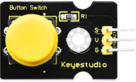
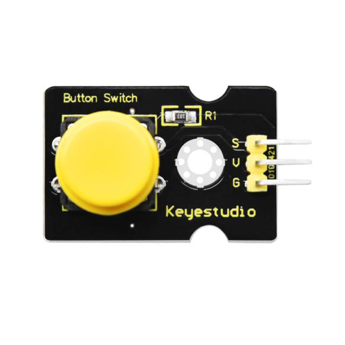
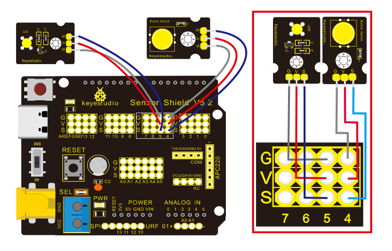

### Project 4：Button module



**4.1 Description**

In this lesson, we will use the input function of I/O port, that is, reading the output value of external device. Also, we will do an experiment with a button and an LED to know more about I/O.

The button switch is ordinary in our life. It belongs to switch quantity( digital quantity)components. Composed of normally open contact and normally closed contact, it is similar to ordinary switch.

When the normally open contact bears pressure, the circuit will be on state ; however, when this pressure disappears, the normally open contact will go back to be the initial state, that is, off state.

**4.2 What You Need**

| PLUS control board\*1                           | Sensor shield\*1                                 | Yellow LED module\*1                             | Button sensor\*1                         | USB cable\*1                             | 3pin F-F Dupont line\*2                  |
| ----------------------------------------------- | ------------------------------------------------ | ------------------------------------------------ | ---------------------------------------- | ---------------------------------------- | ---------------------------------------- |
|  |  |  |  |  |  |

**4.3 Wiring Diagram**



Note: The G, V, and S pins of button sensor module are separately connected to G, V, and 4 on the shield, and the G, V, and S pins of the yellow LED module are connected with G, V, and 5 on the shield.

**4.4 Test Code**

Then, we will design the program to make LED on by button. Comparing with previous experiments, we add a conditional judgement statement --- “if” statement. The written sentences of Arduino is based on C language, therefore, the condition judgement statement of C is suitable for Arduino, like while, swich, etc.

For this lesson, we take simple “if” statement as example to demonstrate:

If button is pressed, digital 4 is low level, then we make digital 5 output high level , then LED will be on; conversely, if the button is released, digital 4 is high level, we make digital 5 output low level, then LED will go off.

As for your reference：

```c
/*
Keyestudio smart home Kit for Arduino
Project 4
Button
http://www.keyestudio.com
*/
int ledpin = 5; // Define the led light in D5
int inpin = 4; // Define the button in D4
int val; // Define variable val
void setup ()
{
  pinMode (ledpin, OUTPUT); // The LED light interface is defined as      output
  pinMode (inpin, INPUT); // Define the button interface as input
}
void loop ()
{
  val = digitalRead (inpin); // Read the digital 4 level value and assign it to val
  if (val == LOW) // Whether the key is pressed, the light will be on when pressed
{  digitalWrite (ledpin, HIGH);}
else
{  digitalWrite (ledpin, LOW);}
}
```

This experiment is pretty simple, and widely applied to various of circuits and electrical appliances.

The back-light will be on when the button is pressed.


