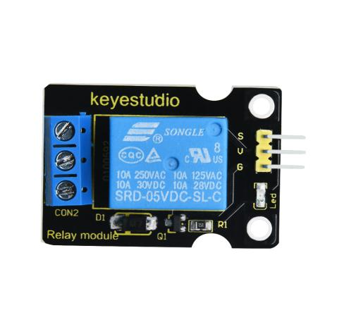
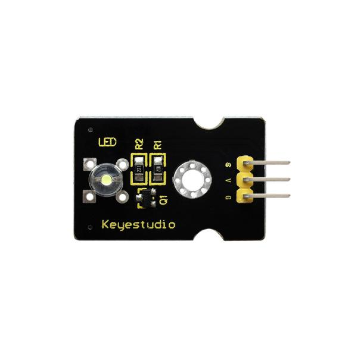
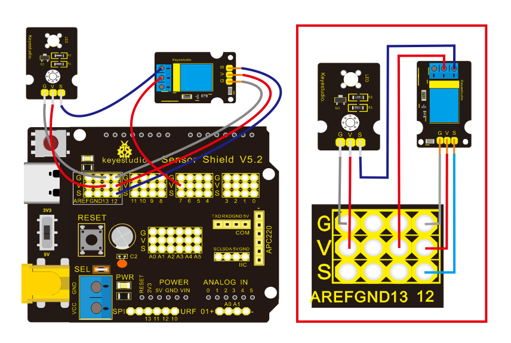
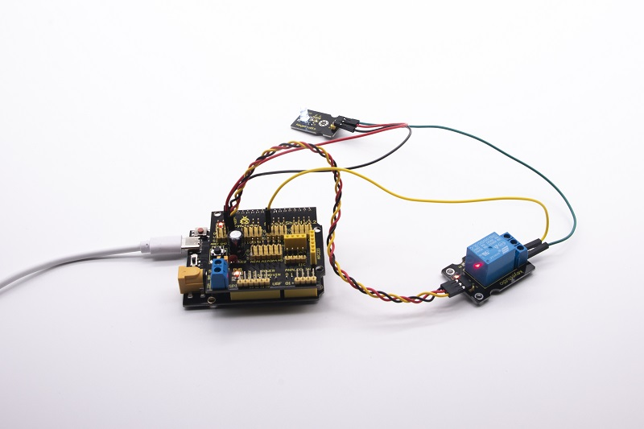

### Project 5：1-channel Relay Module


**5.1 Description：**

This module is an Arduino dedicated module, compatible with Arduino sensor expansion board. It has a control system (also called an input loop) and a controlled system (also called an output loop).

Commonly used in automatic control circuits, the relay module is an "automatic switch" that controls a larger current and a lower voltage with a smaller current and a lower voltage.

Therefore, it plays the role of automatic adjustment, safety protection and conversion in the circuit. It allows Arduino to drive loads below 3A, such as LED light strips, DC motors, miniature water pumps, solenoid valve interface.

The main internal components of the relay module are electromagnet A, armature B, spring C, moving contact D, static contact (normally open contact) E, and static contact (normally closed contact) F, (as shown in the figure ).


As long as a certain voltage is applied to both ends of the coil, a certain current will flow through the coil to generate electromagnetic effects, and the armature will attract the iron core against the pulling force of the return spring under the action of electromagnetic force attraction, thereby driving the moving contact and the static contact (normally open contact) to attract. When the coil is disconnected, the electromagnetic suction will also disappear, and the armature will return to the original position under the reaction force of the spring, releasing the moving contact and the original static contact (normally closed contact). 

This pulls in and releases, thus achieving the purpose of turning on and off in the circuit. The "normally open and closed" contacts of the relay can be distinguished in this way: the static contacts on disconnected state when the relay coil is powered off are called "normally open contacts"; the static contacts on connected state are called "normally closed contact". The module comes with 2 positioning holes for you to fix the module to other equipment.

**5.2 Specifications：**

- Working voltage: 5V (DC)

- Input signal: digital signal (high level 1, low level 0)

- Contacts: static contacts (normally open contacts, normally closed contacts) and moving contacts

- Rated current: 10A (NO) 5A (NC)

- Maximum switching voltage: 150 V (AC) 24 V (DC)

- Electric shock current: less than 3A

- Contact action time: 10ms

  

**5.3 What You Need**

| PLUS control board\*1                                        | Sensor shield\*1                                             | USB cable\*1                             |
| ------------------------------------------------------------ | ------------------------------------------------------------ | ---------------------------------------- |
|               |              |  |
| Relay module\*1                                              | White LED\*1                                                 | 3pin F-F Dupont Line\*1                  |
|  |  |  |
| Female to Female Dupont Lines\*2                             | Male to Female Dupont Line\*2                                |                                          |
|                      |  |                                          |

**5.4 Wiring Diagram：**



Note: On the shield, the G, V, and S pins of 1-channel relay module are connected to G, V, and 12 respectively. The NO is connected with V; the G, V, and S pins of white LED are respectively connected to G, V, and the static contact of NO on relay module.

**5.5 Test Code：**

```c
/*
Keyestudio smart home Kit for Arduino
Project 5
Relay
http://www.keyestudio.com
*/
int Relay = 12; // Define the relay pin at D12
void setup ()
{
   pinMode (13, OUTPUT); // Set Pin13 as output
   digitalWrite (13, HIGH); // Set Pin13 High
   pinMode (Relay, OUTPUT); // Set Pin12 as output
}

void loop ()
{
   digitalWrite (Relay, HIGH); // Turn off relay
   delay (2000);
   digitalWrite (Relay, LOW); // Turn on relay
   delay (2000);
}
```

**5.6 Test Result：**

When the relay is connected(“NO” is on , NC is off) for 0.5s, the white LED will be on; conversely, when it is disconnected, the white LED will go off.



