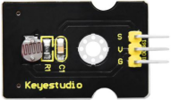
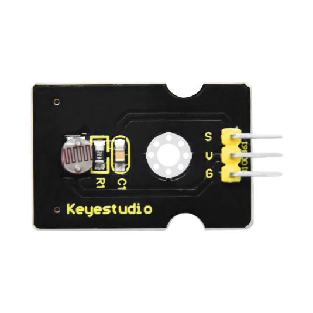
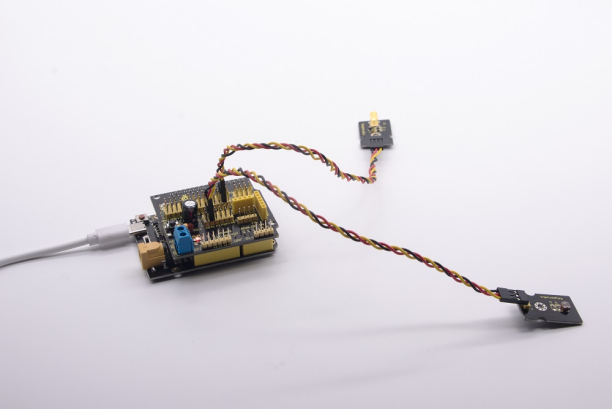

### Project 6：Photocell Sensor

**6.1 Description：**



The photocell sensor (photoresistor) is a resistor made by the photoelectric effect of a semiconductor. As highly sensitive to ambient light, its resistance value vary with different light intensity.

Its signal end is connected to the analog port of the microcontroller. When the light intensity increases, the resistance will decrease, but the analog value of the microcontroller won’t. On the contrary, when the light intensity decreases, the analog value of the microcontroller will go down.

Therefore, we can use the photoresistor sensor module to read the corresponding analog value and sense the light intensity in the environment.

It is commonly applied to light measurement, control and conversion, light control circuit as well.

**6.2 What You Need**

| PLUS control board\*1                           | Sensor shield\*1                                 | Photocell sensor\*1                      | Yellow LED module\*1                             | USB cable\*1                             | 3pin F-F Dupont line\*2                  |
| ----------------------------------------------- | ------------------------------------------------ | ---------------------------------------- | ------------------------------------------------ | ---------------------------------------- | ---------------------------------------- |
|  |  |  |  |  |  |

**6.3 Wiring Diagram：**


Note: On the expansion board, the G, V, and S pins of the photocell sensor module are connected to G, V, and A1; the G, V, and S pins of the yellow LED module are connected with G, V, and 5 separately.

**6.4 Test Code**：

```c
/*
Keyestudio smart home Kit for Arduino
Project 6
photocell
http://www.keyestudio.com
*/
int LED = 5; // Set LED pin at D5
int val = A1; // Read the voltage value of the photodiode
void setup () 
{     
    pinMode (LED, OUTPUT); // LED is output
    Serial.begin (9600); // The serial port baud rate is set to 9600
}
void loop ()
{
     val = analogRead (A1); // Read the voltage value of A1 Pin
     Serial.println (val); // Serial port to view the change of voltage value
     if (val <900)
     {// Less than 900, the LED lights up
       digitalWrite (LED, HIGH);
     } 
     else 
     {// Otherwise,LED light is off
       digitalWrite (LED, LOW);
     }
     delay (10); // Delay 10ms
} 
```


LED will be on after uploading test code. If you use a flashlight to point at the photocell, LED will be automatically off. However, if you turn off flashlight, LED will be on again.

**6.5 Result**

For this code string, it is simple. We read value through analog port and attention that analog quantity doesn’t need input and output mode. You can read the analog value of photocell sensor by analog port.

The analog value will gradually decrease if there is light. When the value is up to 900, this value can be set up according to the brightness you choose




