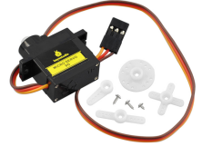
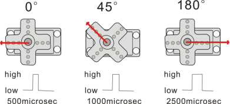
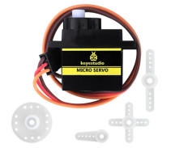
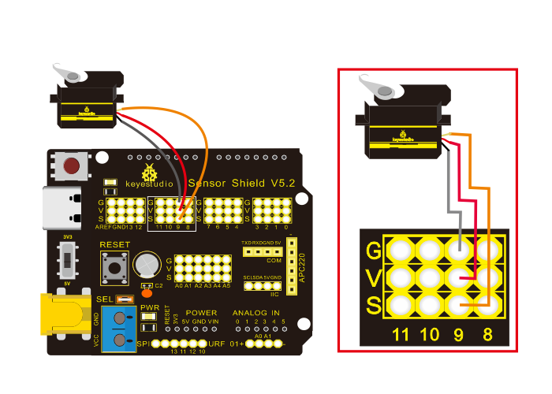

### Project 7：Adjusting Servo Angle



**7.1 Description：**

Servo can control doors and windows. In this course, we’ll introduce its principle and demonstrate how to use it.

Servo motor is a position control rotary actuator. It mainly consists of housing, circuit board, core-less motor, gear and position sensor. Its working principle is that the servo receives the signal sent by MCU or receiver, and produces a reference signal with a period of 20ms and width of 1.5ms, then compares the acquired DC bias voltage to the voltage of the potentiometer and obtains the voltage difference output.

When the motor speed is constant, the potentiometer is driven to rotate through the cascade reduction gear, which leads 0 voltage difference, and the motor stops rotating. Generally, the angle range of servo rotation is 0° --180 °

The rotation angle of servo motor is controlled by regulating the duty cycle of PWM (Pulse-Width Modulation) signal. The standard cycle of PWM signal is 20ms (50Hz). Theoretically, the width is distributed between 1ms-2ms, but in fact, it's between 0.5ms-2.5ms. The width corresponds to the rotation angle from 0° to 180°. But note that for different brand motor, the same signal may have different rotation angle.



One way is using a common digital sensor port of Arduino to produce square wave with different duty cycle and to simulate PWM signal and use that signal to control the positioning of the motor.

Another one is using the Servo function of the Arduino to control the motor. In this way, the program will be easier to design, but it can only control two-channel motor because the servo function only uses digital pin 9 and 10.

The Arduino drive capacity is limited. So if you need to control more than one motor, you will need external power.

Note that don’t supply power through USB cable, there is possibility to damage the USB cable if the current demand is greater than 500MA. We recommend the external power.

**7.2 Specifications:**

-   Working voltage: DC 4.8V \~ 6V
-   Operating angle range: about 180 ° (at 500 → 2500 μsec)
-   Pulse width range: 500 → 2500 μsec
-   No-load speed: 0.12 ± 0.01 sec / 60 (DC 4.8V) 0.1 ± 0.01 sec / 60 (DC 6V)
-   No-load current: 200 ± 20mA (DC 4.8V) 220 ± 20mA (DC 6V)
-   Stopping torque: 1.3 ± 0.01kg · cm (DC 4.8V) 1.5 ± 0.1kg · cm (DC 6V)
-   Stop current: ≦ 850mA (DC 4.8V) ≦ 1000mA (DC 6V)
-   Standby current: 3 ± 1mA (DC 4.8V) 4 ± 1mA (DC 6V)
-   Lead length: 250 ± 5 mm
-   Appearance size: 22.9 \* 12.2 \* 30mm
-   Weight: 9 ± 1 g (without servo horn)

**7.3 What You Need**

| PLUS control board\*1                           | Sensor shield\*1                                 | Servo\*1                                 | USB cable\*1                             |
| ----------------------------------------------- | ------------------------------------------------ | ---------------------------------------- | ---------------------------------------- |
|  |  |  |  |

**7.4 Wiring Diagram：**



Note: The servo is connected to G (GND), V (VCC), 9. The brown wire of the servo is connected to Gnd (G), the red wire is connected with 5v (V), and the orange wire is connected to digital pin 9.

**7.5 Test Code：**

```c
/*
Keyestudio smart home Kit for Arduino
Project 7
Sevro
http://www.keyestudio.com
*/
#include <Servo.h> // Servo function library
Servo myservo;
int pos = 0; // Start angle of servo

void setup ()
{
   myservo.attach (9); // Define the position of the servo on D9
}

void loop ()
{
   for(pos = 0; pos < 180; pos += 1)// angle from 0 to 180 degrees
   {
       myservo.write (pos); // The servo angle is pos
       delay (15); // Delay 15ms
   }
   for(pos = 180; pos>=1; pos-=1) // Angle from 180 to 0 degrees
   {
       myservo.write (pos); // The angle of the servo is pos
       delay (15); // Delay 15ms
   }
}
```

**7.6 Test Result：**

Upload code, wire up components according to connection diagram, and power on. The servo rotates from 0° to 180° then from 180°\~0°


