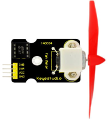
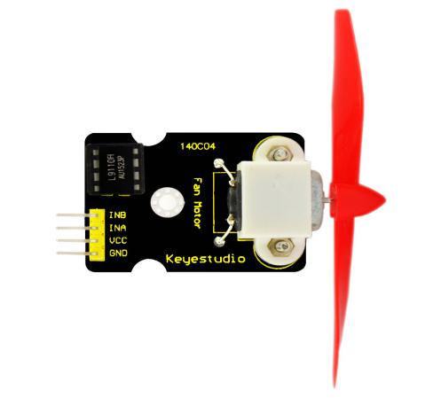
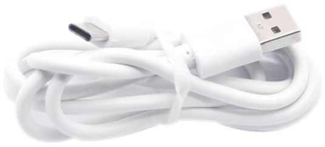
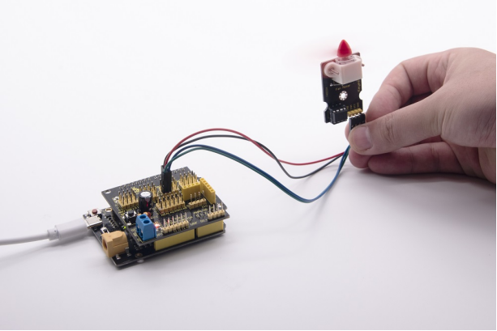

### Project 8：Fan Module



**8.1 Description**

The L9110 fan module adopts L9110 motor control chip, and controls the rotation direction and speed of the motor. Moreover, this module is efficient, with high quality fan, which can put out the flame within 20cm distance. Similarly, it is an important part of fire robot as well.

**8.2 Specifications:**

-   Working voltage: 5V
-   Working current: 0.8A
-   TTL / CMOS output level compatible,
-   Control and drive integrate in IC
-   Have pin high pressure protection function
-   Working temperature: 0-80 °

**8.3 What You Need**

| PLUS control board\*1                           | Sensor shield\*1                                 | Fan module\*1                            | USB cable\*1                             | Female to Female Dupont lines\*4         |
| ----------------------------------------------- | ------------------------------------------------ | ---------------------------------------- | ---------------------------------------- | ---------------------------------------- |
|  |  |  |  |  |

**8.4 Wiring Diagram：**


Note: On the shield, the GND, VCC, INA, and INB pins of the fan module are respectively connected to G, V, 7, 6.

**8.5 Test Code：**

```c
/*
Keyestudio smart home Kit for Arduino
Project 8
Fan
http://www.keyestudio.com
*/
void setup () 
{
   pinMode (7, OUTPUT); //define D7 pin as output
   pinMode (6, OUTPUT); //define  D6 pin as output
}

void loop () 
{
   digitalWrite (7, LOW);
   digitalWrite (6, HIGH); // Reverse rotation of the motor
   delay (3000); // delay 3S
   digitalWrite (7, LOW);
   digitalWrite (6, LOW); // The motor stops rotating
   delay (1000); //delay 1S
   digitalWrite (7, HIGH);
   digitalWrite (6, LOW); // The motor rotates in the forward direction
   delay (3000); // delay 3S
}
```

**8.6 Test Result：**

Upload test code, hook up the components according to connection diagram, and dial the DIP switch to right side and power on. The fan rotates counterclockwise for 3000ms, stops for 1000ms, then rotates clockwise for 3000ms.



