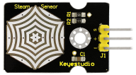
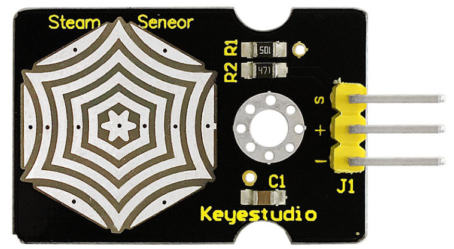
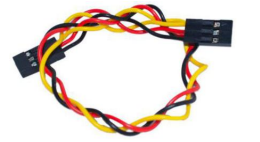
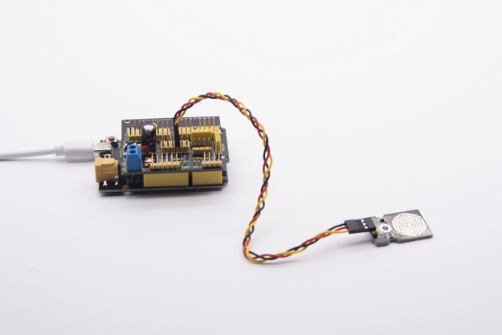
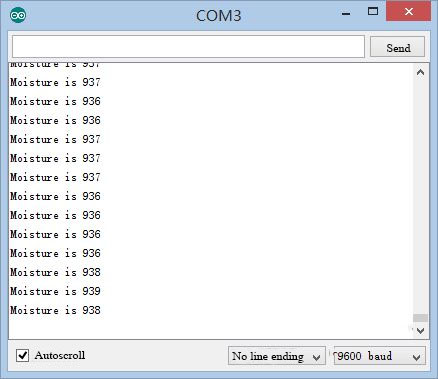

### Project 9: Steam Sensor



**9.1 Description：**

This is a commonly used steam sensor. Its principle is to detect the amount of water by bare printed parallel lines on the circuit board. The more the water content is, the more wires will be connected. As the conductive contact coverage increases, the output voltage will gradually rise. It can detect water vapor in the air as well. The steam sensor can be used as a rain water detector and level switch. When the humidity on the sensor surface surges, the output voltage will increase.

The sensor is compatible with various microcontroller control boards, such as Arduino series microcontrollers. When using it, we provide the guide to operate steam sensor and Arduino control board.

First, connect the sensor to the analog port of the microcontroller, and display the corresponding analog value on the serial monitor.

Note: the connection part is not waterproof, therefore, don’t immerse it in the water please.

**9.2 Specifications:**

-   Working voltage: DC 3.3-5V
-   Working current: \<20mA
-   Operating temperature range: -10 ℃ ～ ＋ 70 ℃;
-   Control signal: analog signal output
-   Interface: 3pin interface with 2.54mm in pitch

**9.3 What You Need**

| PLUS control board\*1                           | Sensor shield\*1                                 | Steam sensor\*1                          | USB  cable\*1                            | 3pinF-F Dupont  line\*1                  |
| ----------------------------------------------- | ------------------------------------------------ | ---------------------------------------- | ---------------------------------------- | ---------------------------------------- |
|  |  |  |  |  |

**9.4 Wiring Diagram：**


Note: On the sensor shield, the pins G，V and S of steam sensor are connected to G, V and A3

**9.5 Test Code：**

```c
/*
Keyestudio smart home Kit for Arduino
Project 9
Steam
http://www.keyestudio.com
*/
void setup()
{
   Serial.begin(9600); //open serial port, and set baud rate at 9600bps
}

void loop()
{
   int val;
   val=analogRead(3); //plug vapor sensor into analog port 3
   Serial.print("Moisture is ");
   Serial.println(val,DEC); //read analog value through serial port printed
   delay(100); //delay 100ms
}
```

**9.6 Test Result：**

When detecting different humidity, the sensor will get the feedback of different current value. As shown below;

When the sensor detects the steam of boiled water, the moisture value is displayed on serial monitor of ARDUINO software.





