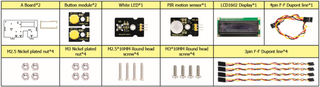
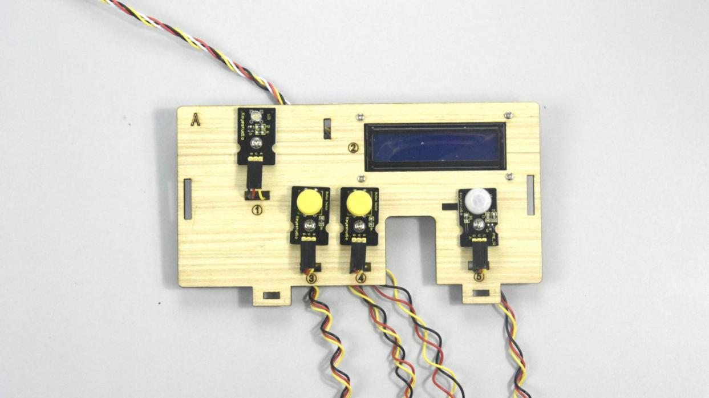
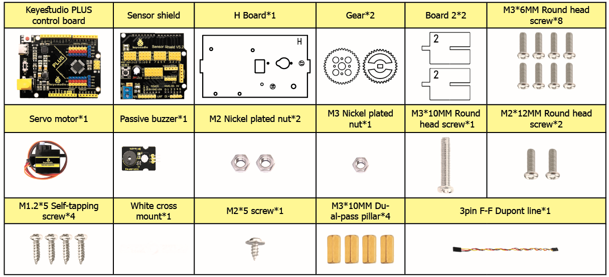
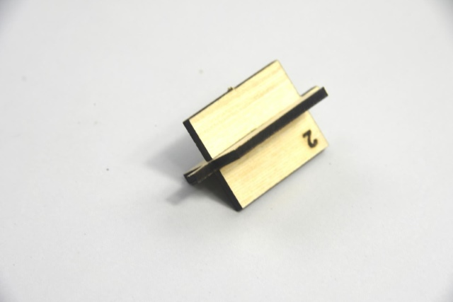
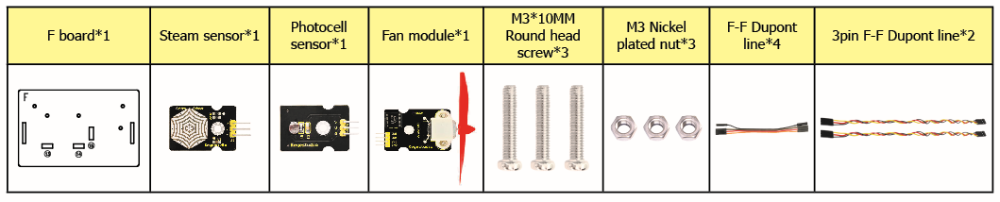
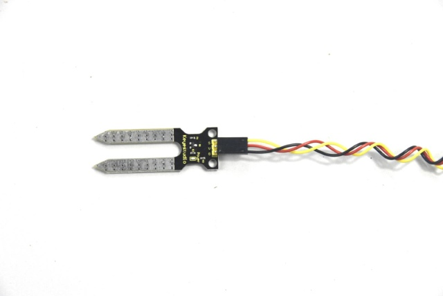
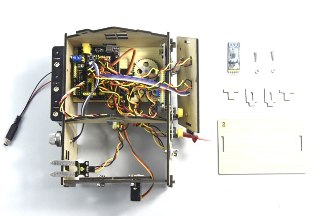
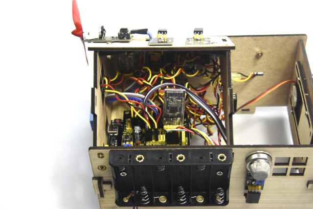

# 6. Assembly Guide

Check the board A\~I and parts in the first place.


**Step 1: Install sensors on A board**

Prepare components as follows;

-   A board\*1
-   M3\*10MM round screw\*4
-   M3 nickel plated nut\*4；
-   M2.5\*10MM round screw\*4
-   button sensor\*2
-   white LED\*1
-   PIR motion sensor\*1
-   LCD1602 display\*1
-   4pin F-F dupont Cable\*1
-   3pin F-F dupont cable\*4




1.  Fix the white LED, 2 button sensors and the PIR motion sensor on the corresponding areas of the A board with 4pcs M3\*10MM round head screws and 4pcs M3 nuts.
2.  Then install the LCD1602 display on A board with 4pcs M2.5\*10MM round head screws and 4pcs M2.5 nuts.
3.  Connect them with 3pin and 4pin dupont cables.





**Step 2: Install sensors on B board**

-   B board，
-   3pin F-F dupont line\*1，
-   M3\*10MM round head screw\*2，
-   M3 nickel plated nut\*2
-   A relay module


Assemble the relay module on B board with 2 pcs M3\*10MM screws and 2pcs M3 nickel plated nuts, and attach a 3pin F-F dupont cable to the relay module.


**Step 3: Fix A board and B board together with a “T” bolt**


**Step 4: Assemble sensors and a battery holder on C board**

C board\*1

MQ-2 gas sensor\*1

A battery holder

M3\*10MM flat head screw\*2

M3\*10MM round head screw\*1

M3 nickel plated nut\*3

4pin F-F dupont line\*1


1.  Fix the battery holder on C board with 2pcs M3\*10MM flat head screws and 2 pcs M3 nickel plated nuts.
2.  Then install the MQ-2 gas sensor on the corresponding area of C board with a M3\*10MM round head screw and a M3 nickel plated nut.
3.  Connect a 4pin dupont line to the MQ-2 gas sensor


**Step 5: Install the sensors and parts on D board**

-   A servo
-   M1.2\*5 self-tapping screw\*4
-   A white cross mount（included in servo）
-   M2\*5 round head screw（included in servo）\*1
-   M2\*12MM round head screw\*2
-   M2 nickel plated nut\*2
-   M3\*12MM round head screw\*4
-   M3 stainless self-locking nut\*4
-   D board
-   A gear
-   Board1


We need to set the servo to 90° before installing. Just follow the steps below

Connect servo to Keyestudio PLUS Control Board and upload test code to make servo rotate to 90°

| Servo Motor |         |
| ----------- | ------- |
| Brown wire  | GND     |
| Red wire    | 5V      |
| Orange wire | S（10） |


**Test Code：**

```c
#include <Servo.h>
Servo servo_10;

void setup(){
  servo_10.attach(10);
}
void loop(){
  servo_10.write(90);
  delay(500);}
```

After the test code is uploaded successfully, the servo will rotate to 90°

1.  Fix the servo on the corresponding area of D board with 2pcs M2\*12MM round head screws and 2pcs M2 nickel plated nuts.
2.  Then install the square board 1 on the D board with 4pcs M3\*12MM round head screws and 4 M3 self-locking nuts.


Install the white cross mount on the gear with 4pcs M1.2\*5MM self-tapping screws, and mount the gear on the servo motor with 1 M2\*5MM round head screw.


**Step 6: Assemble C board with D board with a “T” bolt.**


**Step 7: Install the yellow LED on E board**

-   A yellow LED module
-   A E board
-   M3\*10MM round head screw\*1
-   M3 nickel plated nut \*1
-   3pin F-F dupont line\*1


Mount the yellow LED on the corresponding area of E board with 1 M3\*10MM round head screw and 1 M3 nickel plated nut，then connect a 3pin dupont line to it.


**Step 8: Install control board, sensors and parts on H board**

- A servo

- A passive buzzer

- M1.2\*5 self-tapping screw\*4,

- A white cross mount(included in servo)\*1

- A M2\*5 screw( included in servo)

- M2\*12MM round head screw\*2

- M2 nickel plated nut\*2

- M3\*10MM round screw\*1

- M3 nickel plated nut\*1

- M3\*6MM round head screw\*8

- M3\*10MM dual-pass copper pillar\*4

- A Keyestudio PLUS Control Board

- A sensor shield

- 3pinF-F dupont line\*1

- H board

- 2 gears
- Board 2\*2





1.  Mount 4pcs dual-pass copper pillars on the H board with 4pcs M3\*6MM screws
2.  Then fix the passive buzzer on H board with 1 M3\*10MM round head screw and 1 M3 nut.
3.  Connect a 3pinF-F dupont line to the passive buzzer.


Set the servo to 90° before installing, and the method is same as the step 6.

Fix the 4pcs M3\*10MM copper pillars on the Keyestudio PLUS control board with 4 M3\*6MM round head screws, then mount the servo on the corresponding area of H board with 2 M2\*12MM round head screws and 2 M2 nuts.


Mount 2pcs board 2 together, then fix white cross mount on the gear with 4pcs M1.2\*5 self-tapping screws





Fix the gear with white cross mount on the black servo with 1 M2\*5MM screw(included in servo), then install the combination of 2pcs board 2 and another servo on the corresponding area of H board, finally stack the sensor shield on the Keyestudio PLUS control board.


Step 9: Assemble all boards together with 2 “T” type bolts.

(Note: the port of PLUS Control Board is aligned with the hole ⑧ on board B, and the interface of USB cable is aligned with the hole ⑦ on board B)


**Step 10: Install sensors on F board**

- A steam sensor,

- A photocell sensor

- A fan module(with fan)

- Board F

- 3pinF-F dupont line\*2,

- 4pin F-F dupont line\*1
- M3\*10MM round head screw\*3

- M3 nickel plated nut\*3.





Separately fix the steam sensor, the photocell sensor and the fan module on the F board with 3pcs M3\*10MM round head screws and 3pcs M3 nuts, then attach 3pin and 4pin dupont lines to sensors


**Step 11: Connect sensor/module**

Connect one end of a 3pin dupont line to soil humidity sensor, then connect all sensors with the sensor shield. (make dupont wires of the servo go through the holes of board)



| Name                            | The corresponding interfaces of sensors and sensor shield | The corresponding installed area on the board |      |
| ------------------------------- | --------------------------------------------------------- | --------------------------------------------- | ---- |
| PIR Motion Sensor               | G/V/S                                                     | G/V/2                                         | ⑤    |
| Passive buzzer                  | G/V/S                                                     | G/V/3                                         | ⑯    |
| Button module 1                 | G/V/S                                                     | G/V/4                                         | ③    |
| Yellow LED                      | G/V/S                                                     | G/V/5                                         | ⑫    |
| Fan module                      | GND/VCC/INA/INB                                           | G/V/7/6                                       | ⑮    |
| Button module 2                 | G/V/S                                                     | G/V/8                                         | ④    |
| Servo 1 controlling the door    | Brown/Red/Orange wire                                     | G/V/9                                         | ⑰    |
| Servo 2 controlling the windows | Brown/Red/Orange wire                                     | G/V/10                                        | ⑪    |
| MQ-2 Gas Sensor                 | GND/VCC/D0/A0                                             | G/V/11/A0                                     | ⑩    |
| Relay Module                    | G/V/S                                                     | G/V/12                                        | ⑥    |
| White LED                       | G/V/S                                                     | G/V/13                                        | ①    |
| LCD1602 Display                 | GND/VCC/SDA/SCL                                           | GND/5V/SDA/SCL                                | ②    |
| Photocell Sensor                | G/V/S                                                     | G/V/A1                                        | ⑭    |
| Soil humidity sensor            | G/V/S                                                     | G/V/A2                                        |      |
| Steam sensor                    | G/V/S                                                     | G/V/A3                                        | ⑬    |



Insert the Bluetooth module into sensor shield, then fix the F board with 2 M3\*10MM round head screws, 2 M3 nuts and 2 pcs parts and mount G board with 2 “T” bolts.

| Bluetooth Module | Sensor shield |
| ---------------- | ------------- |
| VCC              | 5V            |
| GND              | GND           |
| TXD              | RXD           |
| RXD              | TXD           |




**Step 12: Assemble the kit**

Fix the board I with 6 “T” bolts


The smart home kit is established.