# 7. Introduction

## 7.1 About keyestudio

Keyestudio is a best-selling brand owned by KEYES Corporation. Our product contains Arduinodevelopment boards, expansion boards, sensors and modules, Raspberry Pi, micro: bit expansionboards as well as smart cars, which can help customers at any level to learn about Arduino.

Notably, all of our products are in line with international quality standards and are greatlyappreciated in a broad menu of different markets across the world.Welcome to check out more contents from our official website:<http://www.keyestudio.com>

## 7.2 Obtain Information and After-sales Service

1. Download address: <https://fs.keyestudio.com/KS0085>

2. If something is found missing or broken, or you have some difficulty learning the kit, please feel

free to contact us. Welcome to send email to us: <service@keyestudio.com>

3. 3.We will endeavor to update projects and products continuously from your sincere advice!

Thanks!

## 7.3 Warning

1. This product contains tiny parts(risistors, LED)so please keep out of reach of children under 7.

2. This product contains conductive parts (control board and electronic module). Please operate

according to the requirements of tutorials. Improper operation may damage parts due to

overheating. Do not touch and immediately disconnect the circuit power.

## 7.4 Copyright

The keyestudio trademark and logo are the copyright of KEYES DIY ROBOT co.,LTD. All products

under Keyestudio brand can’t be copied, sold or resold without authorization by anyone or company.

If you are interested in our products, please contact to our sales representatives.

## 7.5 Keyestudio Arduino Smart Home Kit

### 1. Introduction

This Smart Home Learning Kit based on the Arduino platform is newly rolled out by Keyestudio DIY Robot Co. Ltd.

It simulates the real smart home and demonstrates the cozy and comfortable life for people.

This system adopts PLUS main control board and multiple modules,including 1602 LCD, photocell sensor, analog gas(MQ-2) sensor, PIR motion sensor, yellow LED, servo, steam sensor and Bluetooth.

In fact, Bluetooth controls everything in smart home: light intensity, humidity, flammable gas concentration, doors openning and closing. 

Everything is controlled via APPs on smart phones/IPad and will be displayed on 1602 LCD in real time.

We totally provide 3 programming languages: C language, Mixly and Scratch.

In this tutorial, Scratch graphical programming will be introduced for you. 

Scratch hits the top list in programming, which is easy and convenient to use and understand.

### 2. Kit List

|  NO  |              Specification              | QNT  |                             PIC                              |
| :--: | :-------------------------------------: | :--: | :----------------------------------------------------------: |
|  1   |      Keyestudio UNO PLUS Mainboard      |  1   | 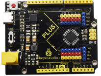 |
|  2   |      Keyestudio V5 Expansion Board      |  1   | 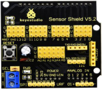 |
|  3   |          basswood 10PCS T=3MM           |  1   |  |
|  4   |                White LED                |  1   | 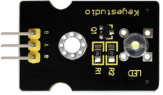 |
|  5   |               Yellow LED                |  1   | 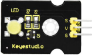 |
|  6   |                 Button                  |  2   | 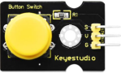 |
|  7   |            Photocell Sensor             |  1   | 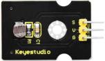 |
|  8   |            PIR Motion Sensor            |  1   | 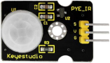 |
|  9   |             MQ-2 Gas Sensor             |  1   |  |
|  10  |              Relay Module               |  1   | 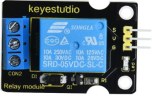 |
|  11  |                BT HM-10                 |  1   | 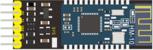 |
|  12  |             Passive Buzzer              |  1   | 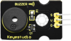 |
|  13  |                   Fan                   |  1   | 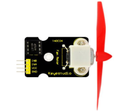 |
|  14  |              Steam Sensor               |  1   |  |
|  15  |                  Servo                  |  2   |  |
|  16  |                LCD 1602                 |  1   |  |
|  17  |          Soil Humidity Sensor           |  1   |  |
|  18  |                USB Cable                |  1   |  |
|  19  |            F-F Dupont Wires             |  40  | 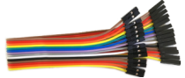 |
|  20  |            M-F Dupont Wires             |  6   |  |
|  21  |                 M3 Nuts                 |  25  |  |
|  22  |        M2*12MM Round Head Screws        |  6   |  |
|  23  |                 M2 Nuts                 |  6   |  |
|  24  |     M3*10MM Dual-pass Copper Pillar     |  4   |  |
|  25  |        M3*6MM Round Head Screws         |  8   |  |
|  26  |        M3 304 Self-locking Nuts         |  4   |  |
|  27  |        M3*10MM Round Head Screws        |  20  |  |
|  28  |       M2.5*10MM Round Head Screws       |  6   |  |
|  29  |                M2.5 Nuts                |  6   |  |
|  30  |        M3*12MM Round Head Screws        |  6   | 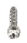 |
|  31  |        M3*10MM Flat Head Screws         |  2   |  |
|  32  | M1.2*5MM Round Head Self-tapping Screws |  10  |  |
|  33  |        6-Slot AA Battery Holder         |  1   | 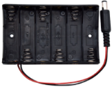 |
|  34  |        3*40MM Cross Screwdriver         |  1   |  |
|  35  |           3P F-F Jumper Wire            |  13  | 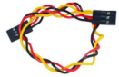 |
|  36  |           4P F-F Jumper Wire            |  2   |  |

### 3.Course catalog

Project 1 LED Blink

Project 2 Breathing Light

Project 3 Passive Buzzer

Project 4 Button Controls LED

Project 5 Relay

Project 6 Optical Control Light

Project 7 Servo

Project 8 Fan

Project 9 Steam Sensor

Project 10 Human Sensing Intelligent Fan 

Project 11 Dangerous Gas Alarm

Project 12 1602 LCD Display

Project 13 Soil Moisture Detector

Project 14 Bluetooth Test

Project 15 Multi-functional Smart Home

