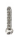

.. _7.-Introduction:

7. Introduction
===============

.. _7.1-About-keyestudio:

7.1 About keyestudio
--------------------

Keyestudio is a best-selling brand owned by KEYES Corporation. Our
product contains Arduinodevelopment boards, expansion boards, sensors
and modules, Raspberry Pi, micro: bit expansionboards as well as smart
cars, which can help customers at any level to learn about Arduino.

Notably, all of our products are in line with international quality
standards and are greatlyappreciated in a broad menu of different
markets across the world.Welcome to check out more contents from our
official website:http://www.keyestudio.com

.. _7.2-Obtain-Information-and-After-sales-Service:

7.2 Obtain Information and After-sales Service
----------------------------------------------

#. Download address: https://fs.keyestudio.com/KS0085

#. If something is found missing or broken, or you have some difficulty
   learning the kit, please feel

free to contact us. Welcome to send email to us: service@keyestudio.com

3. 3.We will endeavor to update projects and products continuously from
   your sincere advice!

Thanks!

.. _7.3-Warning:

7.3 Warning
-----------

#. This product contains tiny parts(risistors, LED)so please keep out of
   reach of children under 7.

#. This product contains conductive parts (control board and electronic
   module). Please operate

according to the requirements of tutorials. Improper operation may
damage parts due to

overheating. Do not touch and immediately disconnect the circuit power.

.. _7.4-Copyright:

7.4 Copyright
-------------

The keyestudio trademark and logo are the copyright of KEYES DIY ROBOT
co.,LTD. All products

under Keyestudio brand can’t be copied, sold or resold without
authorization by anyone or company.

If you are interested in our products, please contact to our sales
representatives.

.. _7.5-Keyestudio-Arduino-Smart-Home-Kit:

7.5 Keyestudio Arduino Smart Home Kit
-------------------------------------

.. _1.-Introduction:

1. Introduction
~~~~~~~~~~~~~~~

This Smart Home Learning Kit based on the Arduino platform is newly
rolled out by Keyestudio DIY Robot Co. Ltd.

It simulates the real smart home and demonstrates the cozy and
comfortable life for people.

This system adopts PLUS main control board and multiple
modules,including 1602 LCD, photocell sensor, analog gas(MQ-2) sensor,
PIR motion sensor, yellow LED, servo, steam sensor and Bluetooth.

In fact, Bluetooth controls everything in smart home: light intensity,
humidity, flammable gas concentration, doors openning and closing.

Everything is controlled via APPs on smart phones/IPad and will be
displayed on 1602 LCD in real time.

We totally provide 3 programming languages: C language, Mixly and
Scratch.

In this tutorial, Scratch graphical programming will be introduced for
you.

Scratch hits the top list in programming, which is easy and convenient
to use and understand.

.. _2.-Kit-List:

2. Kit List
~~~~~~~~~~~

.. container:: table-wrapper

   == ======================================= === =========================
   NO Specification                           QNT PIC
   == ======================================= === =========================
   1  Keyestudio UNO PLUS Mainboard           1   |image-20250417092736616|
   2  Keyestudio V5 Expansion Board           1   |image-20250417092914962|
   3  basswood 10PCS T=3MM                    1   |image-20250416145409152|
   4  White LED                               1   |image-20250417093209402|
   5  Yellow LED                              1   |image-20250417093230138|
   6  Button                                  2   |image-20250417093258161|
   7  Photocell Sensor                        1   |image-20250417093317057|
   8  PIR Motion Sensor                       1   |image-20250417093342432|
   9  MQ-2 Gas Sensor                         1   |image-20250417093400697|
   10 Relay Module                            1   |image-20250417093418050|
   11 BT HM-10                                1   |image-20250417093442985|
   12 Passive Buzzer                          1   |image-20250417093517570|
   13 Fan                                     1   |image-20250417093536440|
   14 Steam Sensor                            1   |image-20250417093559297|
   15 Servo                                   2   |image-20250417093615633|
   16 LCD 1602                                1   |image-20250417093639017|
   17 Soil Humidity Sensor                    1   |image-20250417093703994|
   18 USB Cable                               1   |image-20250417093726193|
   19 F-F Dupont Wires                        40  |image-20250417093747370|
   20 M-F Dupont Wires                        6   |image-20250417093812955|
   21 M3 Nuts                                 25  |image-20250417093836339|
   22 M2*12MM Round Head Screws               6   |image-20250417093900510|
   23 M2 Nuts                                 6   |image-20250417093934937|
   24 M3*10MM Dual-pass Copper Pillar         4   |image-20250417093957866|
   25 M3*6MM Round Head Screws                8   |image-20250417094032234|
   26 M3 304 Self-locking Nuts                4   |image-20250417094117953|
   27 M3*10MM Round Head Screws               20  |image-20250417094153690|
   28 M2.5*10MM Round Head Screws             6   |image-20250417094235435|
   29 M2.5 Nuts                               6   |image-20250417094259042|
   30 M3*12MM Round Head Screws               6   |image-20250417094323689|
   31 M3*10MM Flat Head Screws                2   |image-20250417094420775|
   32 M1.2*5MM Round Head Self-tapping Screws 10  |image-20250417094446826|
   33 6-Slot AA Battery Holder                1   |image-20250417094535682|
   34 3*40MM Cross Screwdriver                1   |image-20250417094621905|
   35 3P F-F Jumper Wire                      13  |image-20250417094643338|
   36 4P F-F Jumper Wire                      2   |image-20250417094703394|
   == ======================================= === =========================

.. _3.Course-catalog:

3.Course catalog
~~~~~~~~~~~~~~~~

Project 1 LED Blink

Project 2 Breathing Light

Project 3 Passive Buzzer

Project 4 Button Controls LED

Project 5 Relay

Project 6 Optical Control Light

Project 7 Servo

Project 8 Fan

Project 9 Steam Sensor

Project 10 Human Sensing Intelligent Fan

Project 11 Dangerous Gas Alarm

Project 12 1602 LCD Display

Project 13 Soil Moisture Detector

Project 14 Bluetooth Test

Project 15 Multi-functional Smart Home

.. |image-20250417092736616| image:: media/image-20250417092736616.png
.. |image-20250417092914962| image:: media/image-20250417092914962.png
.. |image-20250416145409152| image:: ../../5.%20Tutorial%20for%20Scratch/1.%20Introduction/media/image-20250416145409152.png
.. |image-20250417093209402| image:: media/image-20250417093209402.png
.. |image-20250417093230138| image:: media/image-20250417093230138.png
.. |image-20250417093258161| image:: media/image-20250417093258161.png
.. |image-20250417093317057| image:: media/image-20250417093317057.png
.. |image-20250417093342432| image:: media/image-20250417093342432.png

.. |image-20250417093418050| image:: media/image-20250417093418050.png
.. |image-20250417093442985| image:: media/image-20250417093442985.png
.. |image-20250417093517570| image:: media/image-20250417093517570.png
.. |image-20250417093536440| image:: media/image-20250417093536440.png

.. |image-20250417093726193| image:: media/image-20250417093726193.png
.. |image-20250417093747370| image:: media/image-20250417093747370.png
.. |image-20250417093812955| image:: media/image-20250417093812955.png

.. |image-20250417093934937| image:: media/image-20250417093934937.png

.. |image-20250417094117953| image:: media/image-20250417094117953.png

.. |image-20250417094259042| image:: media/image-20250417094259042.png
.. |image-20250417094323689| image:: media/image-20250417094323689.png
.. |image-20250417094420775| image:: media/image-20250417094420775.png

.. |image-20250417094535682| image:: media/image-20250417094535682.png
.. |image-20250417094621905| image:: media/image-20250417094621905.png
.. |image-20250417094643338| image:: media/image-20250417094643338.png

