# 8. Installation
Check board A~I and other parts

## Step 1

Needed Components:

Installation Diagram:
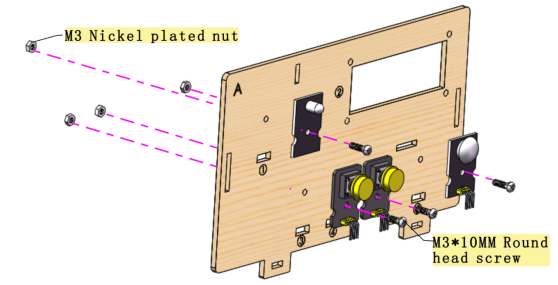
Prototype:

## Step 2

Needed Components:
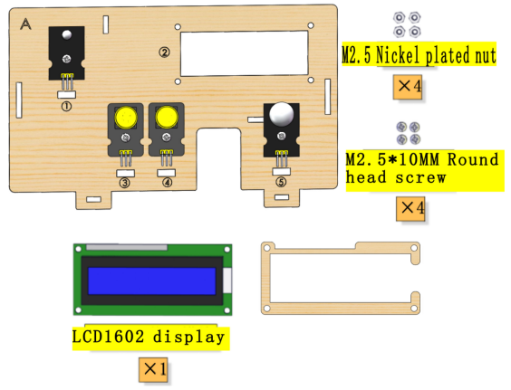
Installation Diagram:

Prototype:

## Step 3

Needed Components:

Installation Diagram:

Prototype:

## Step 4

Needed Components:

Installation Diagram:
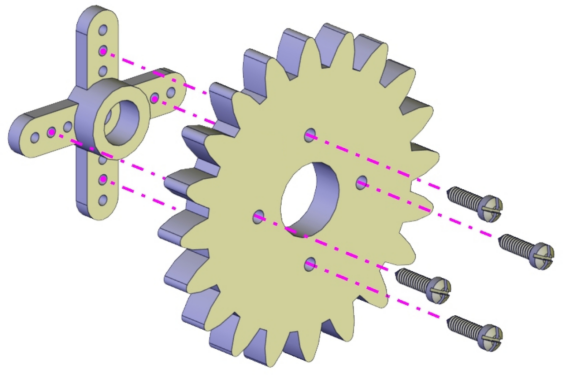
Prototype:

## Step 5

Needed Components:

Installation Diagram:

Prototype:
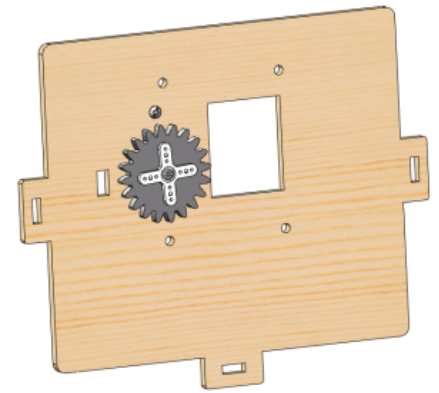
Set the angle of the Servo which controls the window to 90°:

| Servo for window | PLUS Mainboard|
| :--: | :--: |
| Brown line | G |
| Red line | V |
| Orange line | S（10） |

Wire up as shown in the picture and upload the code to the expansion board. Install the Servo after it automatically turn to 90°。

(Note: This step is necessary.)

## Step 6

Needed Components:

Installation Diagram:
(Please do not tighten the self-locking nut when installing it. The window is closed during installation as shown below:)

Prototype:

## Step 7

Needed Components:

Installation Diagram:
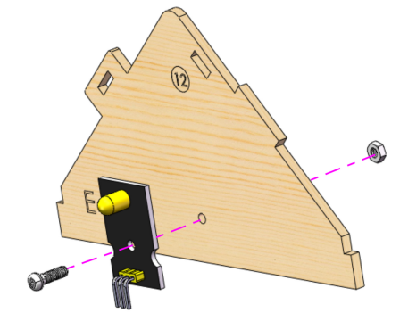
Prototype:

## Step 8

Needed Components:

Installation Diagram:
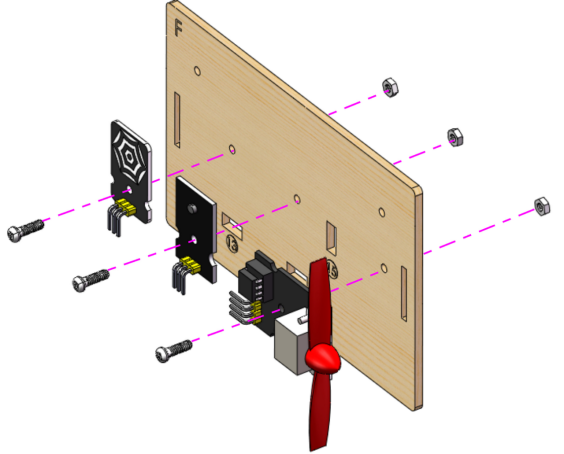
Prototype:

## Step 9

Needed Components:

Installation Diagram:

Prototype:

## Step 10

Needed Components:

Installation Diagram:

Prototype:

## Step 11

Needed Components:

Installation Diagram:

Prototype:

## Step 12

Needed Components:

Installation Diagram:

| Bluetooth module | Expansion board |
| :--: | :--: |
| VCC | 5V |
| GND | GND |
| TXD | RXD |
| RXD | TXD |
|Prototype:||

Prototype:

## Step 13

Needed Components:

Installation Diagram:

Prototype:

## Step 14

Needed Components:

Installation Diagram:

Prototype:

## Step 15

Needed Components:

Installation Diagram:

Prototype:

## Step 16

Needed Components:

Installation Diagram:

Prototype:

## Step 17

Needed Components:

Installation Diagram:

Prototype:

## Step 18

Needed Components:

Installation Diagram:

Prototype:

## Step 19

Needed Components:            

Installation Diagram:

Prototype:

## Wiring

**PIR Motion Sensor**

| PIR motion sensor | Expansion board | Position on wood board |
| :--: | :--: | :--: |
| G/V/S | G/V/2 | ⑤ |

**Passive Buzzer**

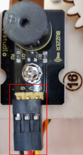

| Passive buzzer | Expansion board | Position on wood board |
| :--: | :--: | :--: |
| G/V/S | G/V/3 | ⑯ |

**Button 1**

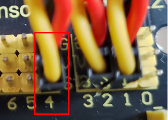

| Button 1 | Expansion board | Position on wood board |
| :--: | :--: | :--: |
| G/V/S | G/V/4 | ③ |

**Yellow LED**

| Yellow LED | Expansion board | Position on wood board |
| :--: | :--: | :--: |
| G/V/S | G/V/5 | ⑫ |

**Fan**

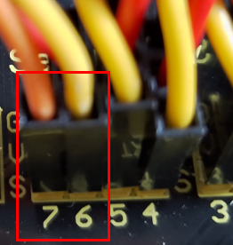

| Fan | Expansion board | Position on wood board |
| :--: | :--: | :--: |
| GND/VCC/INA/INB | G/V/7/6 | ⑮ |

**Button 2**

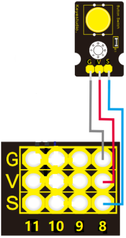

| Button 2 | Expansion board | Position on wood board |
| :--: | :--: | :--: |
| G/V/S | G/V/8 | ④ |

**Servo 1 for Door Controlling**

| Servo 1 | Expansion board | Position on wood board |
| :--: | :--: | :--: |
| Brown line/Red line/Orange line | G/V/9 | ⑰ |

**Servo 2 for Window Controlling**

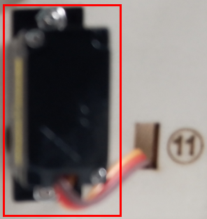

| Servo 2 | Expansion board | Position on wood board |
| :--: | :--: | :--: |
| Brown line/Red line/Orange line | G/V/10 | ⑪ |

**MQ-2 Gas Sensor**

| MQ-2 gas sensor | Expansion board | Position on wood board |
| :--: | :--: | :--: |
| GND/VCC/D0/A0 | G/V/11/A0 | ⑩ |

**Relay Module**

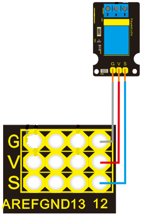

| Relay module | Expansion board | Position on wood board |
| :--: | :--: | :--: |
| G/V/S | G/V/12 | ⑥ |

**White LED**

| White LED | Expansion board | Position on wood board |
| :--: | :--: | :--: |
| G/V/S | G/V/13 | ① |

**LCD1602 Display**

| LCD1602 display | Expansion board | Position on wood board |
| :--: | :--: | :--: |
| GND/VCC/SDA/SCL | GND/5V/SDA/SCL | ② |

**Photocell Sensor**

| photocell sensor | Expansion board | Position on wood board |
| :--: | :--: | :--: |
| G/V/S | G/V/A1 | ⑭ |

**Soil Humidity Sensor**

| soil humidity sensor | Expansion board | Position on wood board |
| :--: | :--: | :--: |
| G/V/S | G/V/A2 |   |

**Steam Sensor**

| steam sensor | Expansion board | Position on wood board |
| :--: | :--: | :--: |
| G/V/S | G/V/A3 | ⑬ |

**Power Supply**

## Last Step: Roof Installation

Needed Components

Installation Diagram

Prototype

