.. _8.-Installation:

8. Installation
===============

| Check board A~I and other parts
| |Img|

.. _Step-1:

Step 1
------

| Needed Components:
| |image1|
| Installation Diagram:
| |image2|
| Prototype:
| |image3|

.. _Step-2:

Step 2
------

| Needed Components:
| |image4|
| Installation Diagram:
| |image5|
| Prototype:
| |image6|

.. _Step-3:

Step 3
------

| Needed Components:
| |image7|
| Installation Diagram:
| |image8|
| Prototype:
| |image9|

.. _Step-4:

Step 4
------

| Needed Components:
| |image10|
| Installation Diagram:
| |image11|
| Prototype:
| |image12|

.. _Step-5:

Step 5
------

| Needed Components:
| |image13|
| Installation Diagram:
| |image14|
| Prototype:
| |image15|
| Set the angle of the Servo which controls the window to 90°:

.. container:: table-wrapper

   ================ ==============
   Servo for window PLUS Mainboard
   ================ ==============
   Brown line       G
   Red line         V
   Orange line      S（10）
   ================ ==============

.. image:: media/image-20250417105156944.png
   :alt: image-20250417105156944

Wire up as shown in the picture and upload the code to the expansion
board. Install the Servo after it automatically turn to 90°。

(Note: This step is necessary.)

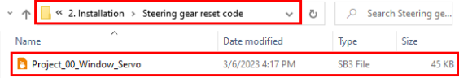

.. _Step-6:

Step 6
------

| Needed Components:
| |image16|
| Installation Diagram:
| (Please do not tighten the self-locking nut when installing it. The
  window is closed during installation as shown below:)
| |image17|
| Prototype:
| |image18|

.. _Step-7:

Step 7
------

| Needed Components:
| |image19|
| Installation Diagram:
| |image20|
| Prototype:
| |image21|

.. _Step-8:

Step 8
------

| Needed Components:
| |image22|
| Installation Diagram:
| |image23|
| Prototype:
| |image24|

.. _Step-9:

Step 9
------

| Needed Components:
| |image25|
| Installation Diagram:
| |image26|
| Prototype:
| |image27|

.. _Step-10:

Step 10
-------

| Needed Components:
| |image28|
| Installation Diagram:
| |image29|
| Prototype:
| |image30|

.. _Step-11:

Step 11
-------

| Needed Components:
| |image31|
| Installation Diagram:
| |image32|
| Prototype:
| |image33|

.. _Step-12:

Step 12
-------

| Needed Components:
| |image34|
| Installation Diagram:

.. container:: table-wrapper

   ================ ===============
   Bluetooth module Expansion board
   ================ ===============
   VCC              5V
   GND              GND
   TXD              RXD
   RXD              TXD
   Prototype:       
   ================ ===============

.. image:: media/image-20250417105441840.png
   :alt: image-20250417105441840

.. image:: media/image-20250417105451246-17448584932021.png
   :alt: image-20250417105451246

Prototype:

.. image:: media/image-20250417105526047.png
   :alt: image-20250417105526047

.. _Step-13:

Step 13
-------

| Needed Components:
| |image35|
| Installation Diagram:
| |image36|
| Prototype:
| |image37|

.. _Step-14:

Step 14
-------

| Needed Components:
| |image38|
| Installation Diagram:
| |image39|
| Prototype:
| |image40|

.. _Step-15:

Step 15
-------

| Needed Components:
| |image41|
| Installation Diagram:
| |image42|
| Prototype:
| |image43|

.. _Step-16:

Step 16
-------

| Needed Components:
| |image44|
| Installation Diagram:
| |image45|
| Prototype:
| |image46|

.. _Step-17:

Step 17
-------

| Needed Components:
| |image47|
| Installation Diagram:
| |image48|
| Prototype:
| |image49|

.. _Step-18:

Step 18
-------

| Needed Components:
| |image50|
| Installation Diagram:
| |image51|
| Prototype:
| |image52|

.. _Step-19:

Step 19
-------

| Needed Components:
| |image53|
| Installation Diagram:
| |image54|
| Prototype:
| |image55|

.. _Wiring:

Wiring
------

**PIR Motion Sensor**

| |image56|
| |image57|
| |image58|

.. container:: table-wrapper

   ================= =============== ======================
   PIR motion sensor Expansion board Position on wood board
   ================= =============== ======================
   G/V/S             G/V/2           ⑤
   ================= =============== ======================

**Passive Buzzer**

| |image59|
| |image60|
| |image61|

.. container:: table-wrapper

   ============== =============== ======================
   Passive buzzer Expansion board Position on wood board
   ============== =============== ======================
   G/V/S          G/V/3           ⑯
   ============== =============== ======================

**Button 1**

| |image62|
| |image63|
| |image64|

.. container:: table-wrapper

   ======== =============== ======================
   Button 1 Expansion board Position on wood board
   ======== =============== ======================
   G/V/S    G/V/4           ③
   ======== =============== ======================

**Yellow LED**

| |image65|
| |image66|
| |image67|

.. container:: table-wrapper

   ========== =============== ======================
   Yellow LED Expansion board Position on wood board
   ========== =============== ======================
   G/V/S      G/V/5           ⑫
   ========== =============== ======================

**Fan**

| |image68|
| |image69|
| |image70|

.. container:: table-wrapper

   =============== =============== ======================
   Fan             Expansion board Position on wood board
   =============== =============== ======================
   GND/VCC/INA/INB G/V/7/6         ⑮
   =============== =============== ======================

**Button 2**

| |image71|
| |image72|
| |image73|

.. container:: table-wrapper

   ======== =============== ======================
   Button 2 Expansion board Position on wood board
   ======== =============== ======================
   G/V/S    G/V/8           ④
   ======== =============== ======================

**Servo 1 for Door Controlling**

| |image74|
| |image75|
| |image76|

.. container:: table-wrapper

   =============================== =============== ======================
   Servo 1                         Expansion board Position on wood board
   =============================== =============== ======================
   Brown line/Red line/Orange line G/V/9           ⑰
   =============================== =============== ======================

**Servo 2 for Window Controlling**

| |image77|
| |image78|
| |image79|

.. container:: table-wrapper

   =============================== =============== ======================
   Servo 2                         Expansion board Position on wood board
   =============================== =============== ======================
   Brown line/Red line/Orange line G/V/10          ⑪
   =============================== =============== ======================

**MQ-2 Gas Sensor**

| |image80|
| |image81|
| |image82|

.. container:: table-wrapper

   =============== =============== ======================
   MQ-2 gas sensor Expansion board Position on wood board
   =============== =============== ======================
   GND/VCC/D0/A0   G/V/11/A0       ⑩
   =============== =============== ======================

**Relay Module**

| |image83|
| |image84|
| |image85|

.. container:: table-wrapper

   ============ =============== ======================
   Relay module Expansion board Position on wood board
   ============ =============== ======================
   G/V/S        G/V/12          ⑥
   ============ =============== ======================

**White LED**

| |image86|
| |image87|
| |image88|

.. container:: table-wrapper

   ========= =============== ======================
   White LED Expansion board Position on wood board
   ========= =============== ======================
   G/V/S     G/V/13          ①
   ========= =============== ======================

**LCD1602 Display**

| |image89|
| |image90|
| |image91|

.. container:: table-wrapper

   =============== =============== ======================
   LCD1602 display Expansion board Position on wood board
   =============== =============== ======================
   GND/VCC/SDA/SCL GND/5V/SDA/SCL  ②
   =============== =============== ======================

**Photocell Sensor**

| |image92|
| |image93|
| |image94|

.. container:: table-wrapper

   ================ =============== ======================
   photocell sensor Expansion board Position on wood board
   ================ =============== ======================
   G/V/S            G/V/A1          ⑭
   ================ =============== ======================

**Soil Humidity Sensor**

| |image95|
| |image96|
| |image97|

.. container:: table-wrapper

   ==================== =============== ======================
   soil humidity sensor Expansion board Position on wood board
   ==================== =============== ======================
   G/V/S                G/V/A2          
   ==================== =============== ======================

**Steam Sensor**

| |image98|
| |image99|
| |image100|

.. container:: table-wrapper

   ============ =============== ======================
   steam sensor Expansion board Position on wood board
   ============ =============== ======================
   G/V/S        G/V/A3          ⑬
   ============ =============== ======================

**Power Supply**

| |image101|
| |image102|

.. _Last-Step:-Roof-Installation:

Last Step: Roof Installation
----------------------------

| Needed Components
| |image103|
| Installation Diagram
| |image104|
| Prototype
| |image105|

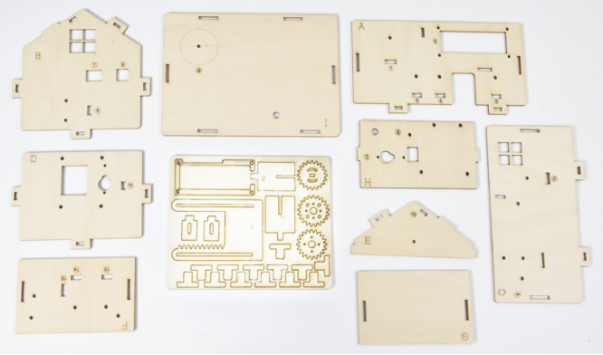
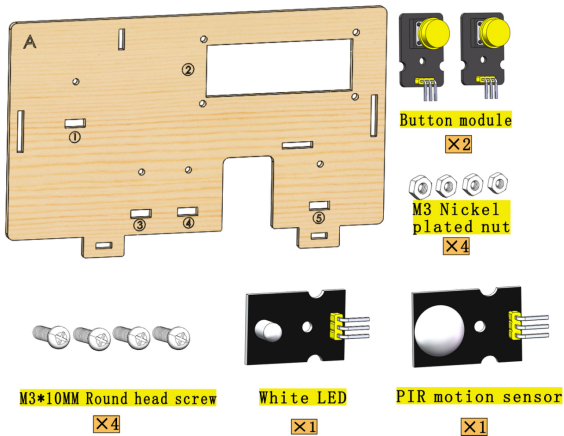
.. |image2| image:: media/img-20230313134049.png
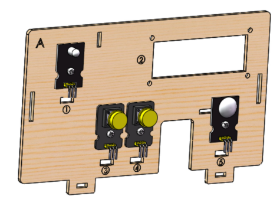
.. |image4| image:: media/img-20230313134129.png
.. |image5| image:: media/img-20230313134141.png
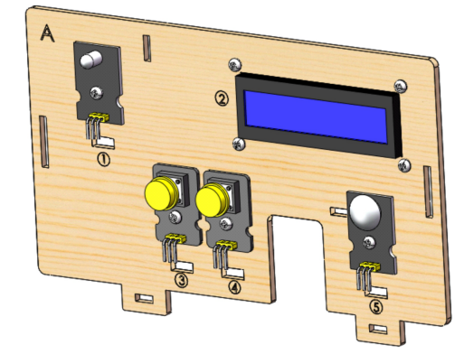
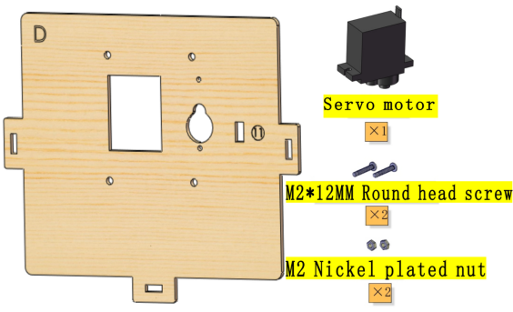
.. |image8| image:: media/img-20230313134350.png
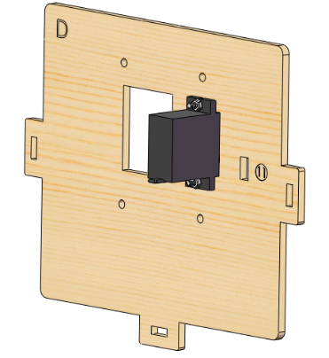
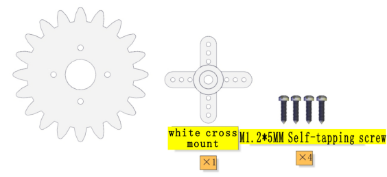
.. |image11| image:: media/img-20230313134433.png
.. |image12| image:: media/img-20230313134443.png
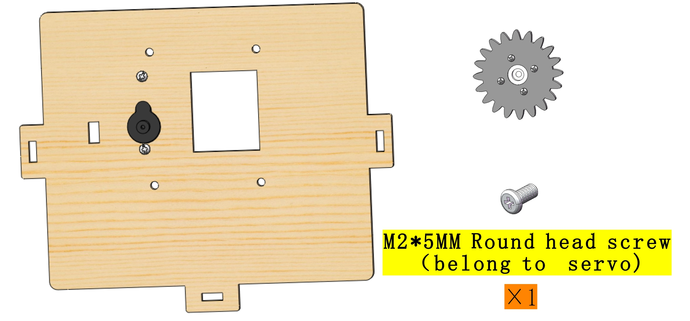
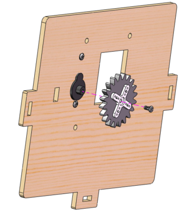
.. |image15| image:: media/img-20230313134552.png
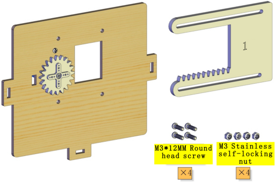
.. |image17| image:: media/img-20230313135716.png
.. |image18| image:: media/img-20230313135729.png
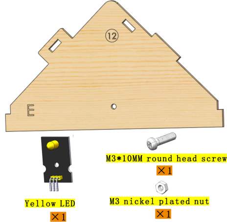
.. |image20| image:: media/img-20230313141959.png
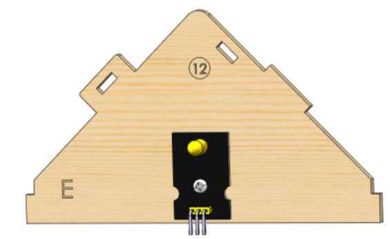
.. |image22| image:: media/img-20230313142042.png
.. |image23| image:: media/img-20230313142055.png
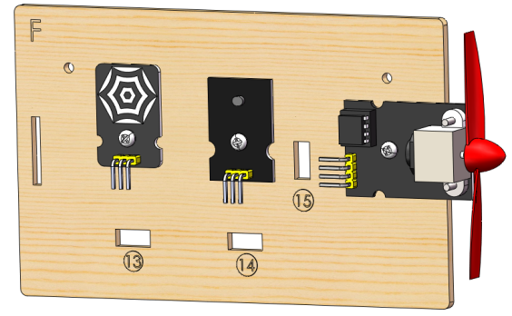
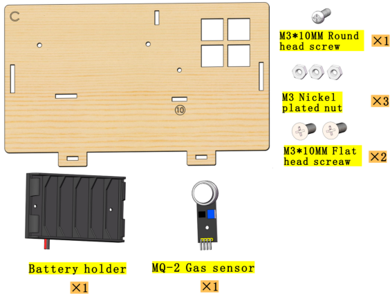
.. |image26| image:: media/img-20230313142246.png
.. |image27| image:: media/img-20230313142259.png
.. |image28| image:: media/img-20230313142331.png
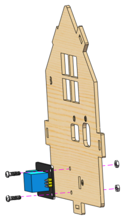
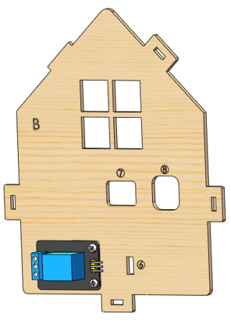
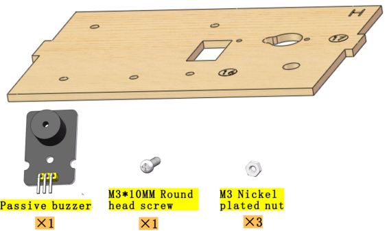
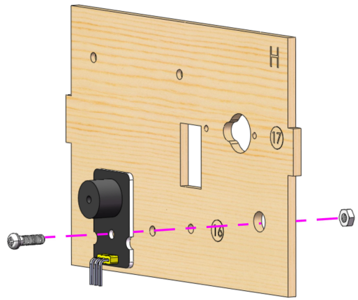
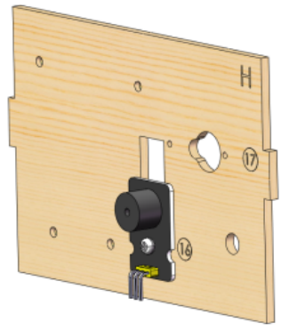
.. |image34| image:: media/img-20230313142514.png
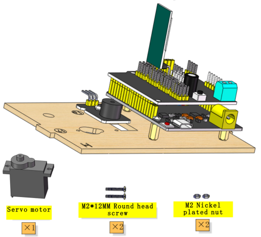
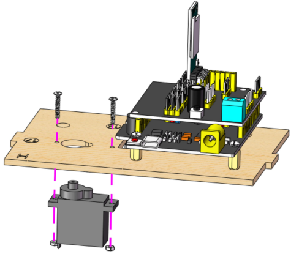
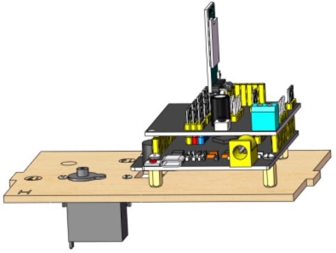
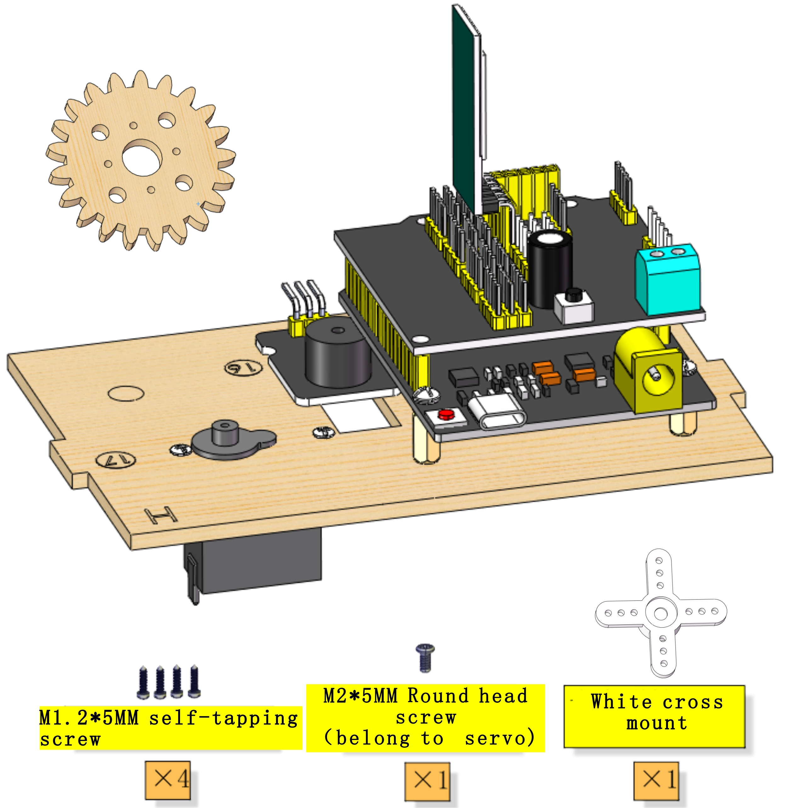
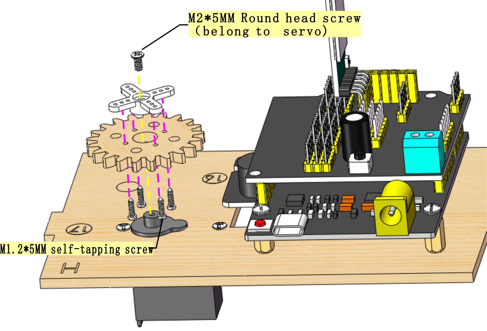
.. |image40| image:: media/img-20230313142855.png
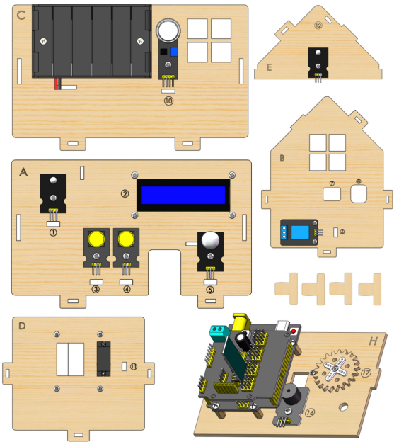
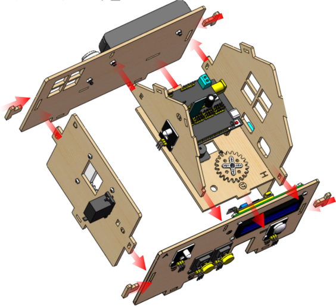
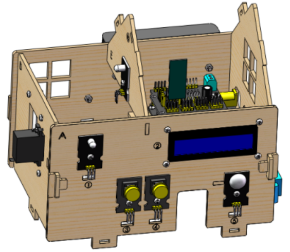
.. |image44| image:: media/img-20230313143115.png
.. |image45| image:: media/img-20230313143126.png
.. |image46| image:: media/img-20230313143135.png
.. |image47| image:: media/img-20230315153204.jpg
.. |image48| image:: media/img-20230313143210.png
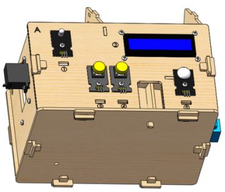
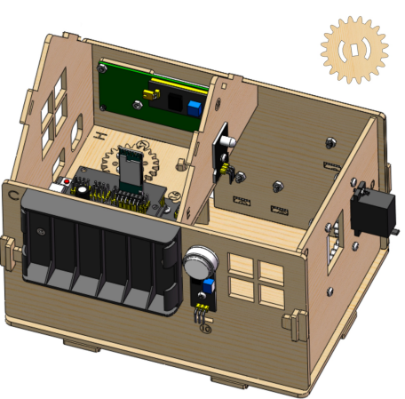
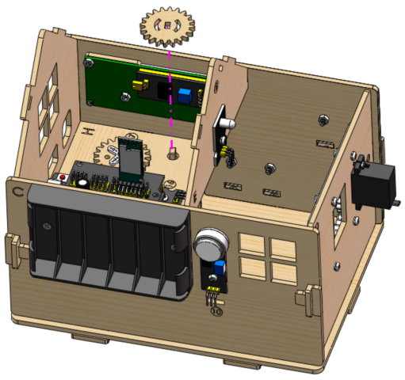
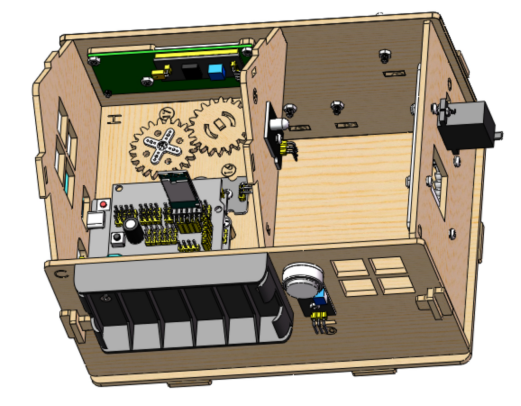
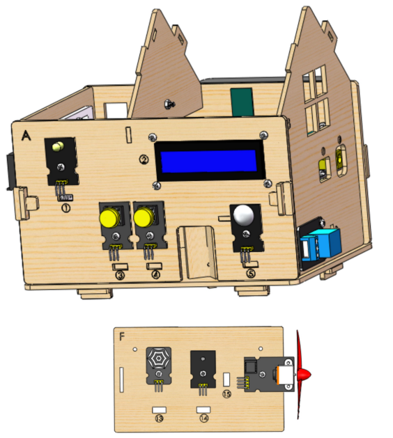
.. |image54| image:: media/img-20230313143340.png
.. |image55| image:: media/img-20230313143350.png
.. |image56| image:: media/img-20230317084823.png
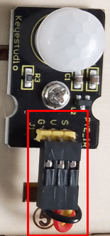
.. |image58| image:: media/img-20230313143558.png
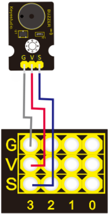
.. |image60| image:: media/img-20230313143731.png
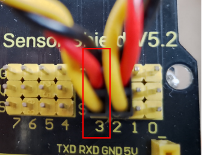
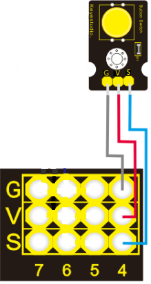
.. |image63| image:: media/img-20230313144155.png
.. |image64| image:: media/img-20230313144159.png
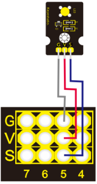
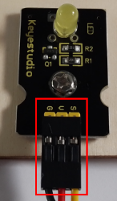
.. |image67| image:: media/img-20230313144254.png
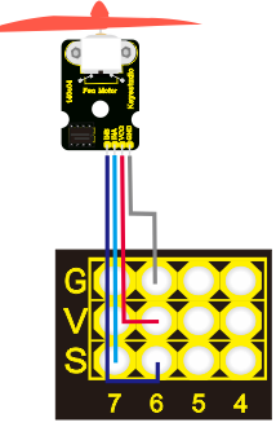
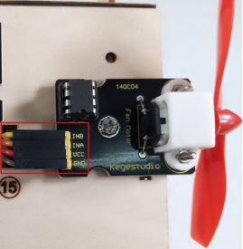
.. |image70| image:: media/img-20230313144329.png
.. |image71| image:: media/img-20230317084958.png
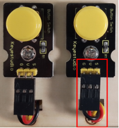
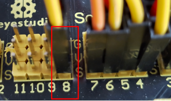
.. |image74| image:: media/img-20230317085050.png
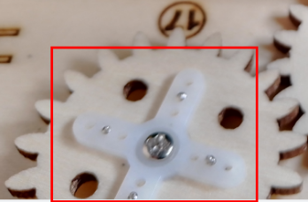
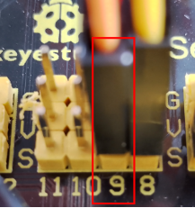
.. |image77| image:: media/img-20230317085128.png
.. |image78| image:: media/img-20230313144715.png
.. |image79| image:: media/img-20230313144719.png
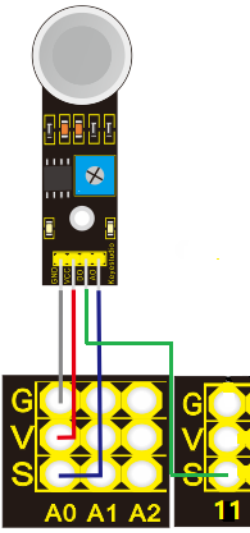
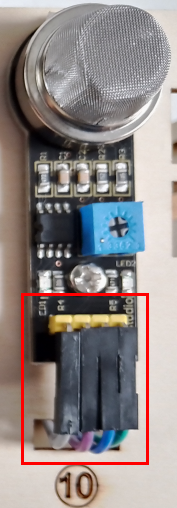
.. |image82| image:: media/img-20230313144757.png
.. |image83| image:: media/img-20230317085152.png
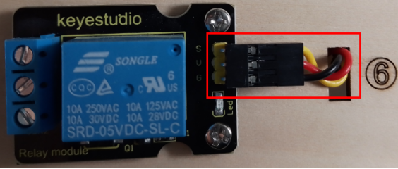
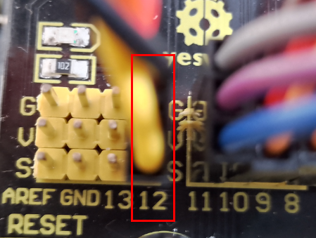
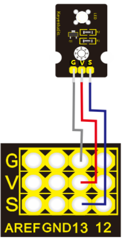

.. |image88| image:: media/img-20230313145007.png
.. |image89| image:: media/img-20230317085224.png

.. |image91| image:: media/img-20230313145057.png
.. |image92| image:: media/img-20230317085244.png
.. |image93| image:: media/img-20230313145145.png
.. |image94| image:: media/img-20230313145148.png
.. |image95| image:: media/img-20230317085306.png

.. |image97| image:: media/img-20230313145234.png

.. |image101| image:: media/img-20230313145419.png

