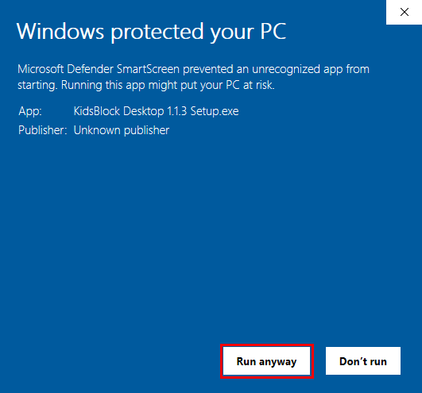
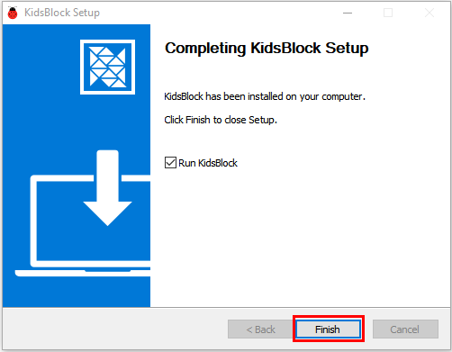

# 9. KidsBlock Installation -- Windows
Note: Take Windows system as an example here

1. Download kidsblock: www.kidsbits.net/Down/KidsBlock Desktop 1.1.3 Setup.exe 
2. Click “KidsBlock 1.1.3 Setup.exe”. Click “**More info**” and “**Run anyway**”。

2. Tick “**Anyone who uses this computer(all users)**”, and click “**Next**”。

3.Click “**Browse...**” to choose an installation path（Here we choose Disk C, you may choose at will. ）.
  Click“**Install**” and wait a few seconds.

4.Click “**Finish**” and open Kidsblock.

5.If it need to update, click “**Upgrade and restart**” for the latest version. 

6.Now open Kidsblock. If a warning window pops up, click “**Allow access**”.

