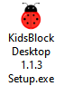
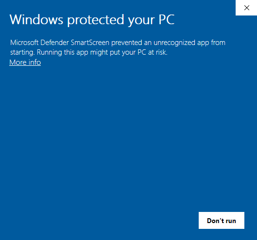

.. _9.-KidsBlock-Installation----Windows:

9. KidsBlock Installation -- Windows
====================================

Note: Take Windows system as an example here

#. Download kidsblock:
   `www.kidsbits.net/Down/KidsBlock <http://www.kidsbits.net/Down/KidsBlock>`__
   Desktop 1.1.3 Setup.exe

#. | Click “KidsBlock 1.1.3 Setup.exe”. Click “\ **More info**\ ” and
     “\ **Run anyway**\ ”。
   | |Img|
   | |image1|
   | |image2|
   | |image3|

#. | Tick “\ **Anyone who uses this computer(all users)**\ ”, and click
     “\ **Next**\ ”。
   | |image4|

| 3.Click “\ **Browse...**\ ” to choose an installation path（Here we
  choose Disk C, you may choose at will.）.
| Click“\ **Install**\ ” and wait a few seconds.
| |image5|
| |image6|

| 4.Click “\ **Finish**\ ” and open Kidsblock.
| |image7|

| 5.If it need to update, click “\ **Upgrade and restart**\ ” for the
  latest version.
| |image8|
| |image9|

| 6.Now open Kidsblock. If a warning window pops up, click “\ **Allow
  access**\ ”.
| |image10|

.. |image2| image:: media/img-20230302101411.png
.. |image3| image:: media/img-20230302101416.png
.. |image4| image:: media/img-20230302101526.png
.. |image5| image:: media/img-20230302101537.png
.. |image6| image:: media/img-20230302101638.png
.. |image7| image:: media/img-20230302101703.png
.. |image8| image:: media/img-20230302101708.png
.. |image9| image:: media/img-20230302101717.png
.. |image10| image:: media/img-20230302101733.png
