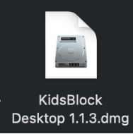
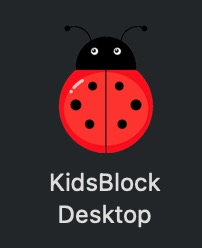

.. _10.-KidsBlock-Installation----MacOS:

10. KidsBlock Installation -- MacOS
===================================

Note: Take iOS system as an example here

| 1.Download kidsblock:
  `www.kidsbits.net/Down/KidsBlock <http://www.kidsbits.net/Down/KidsBlock>`__
  Desktop 1.1.3.dmg.
| |Img|

| 2.Click KidsBlock, and drag KidsBlock Desktop into Applications.
| |image1|

| 3.Wait for installing. KidsBlock icon will show up in Launchpad if it
  is installed successfully.
| |image2|

.. |image1| image:: media/img-20230302102213.png

