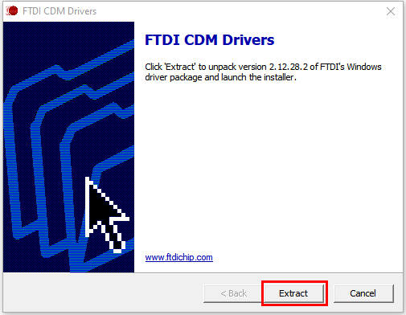
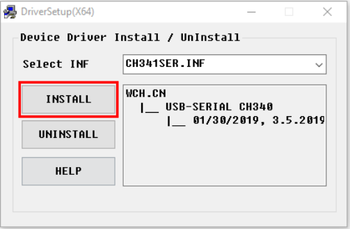
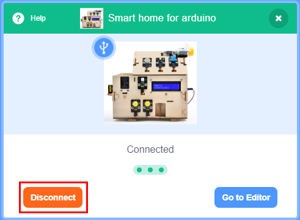
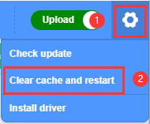

# 11. KidsBlock Using and Drive Installing
(Take Windows system as an example, MacOS may take as reference)

1.Function description: 

2.: Alter language into “**English**” or “**简体中文**”。

                
3.: “**Install driver**”
Note: If your computer has already installed a driver, please skip the following steps. 

A.Click “**Next**” on “**Welcome to the Device Driver Installation Wizard**”.

B.Wait for a few seconds and click “**Finish**”.

C.Click “**Next**”.

D.Click “**Finish**”.

E.If a warning window pops up, click “**Allow**” to select “**Install**”.

F.Click “**Install**” when an installation prompt shows up.
G.Wait for a while and click “**Finish**”.

H.Click “**Extract**”。

I.Click “**Next**”。

J.Click “**I accept this agreement**” and “**Next**”。

K.Click “**Finish**”。

O.Wait for a moment and click “**INSTALL**”。

P.When the driver is installed, click “**OK**”.

4.Click  to enter main control board interface and select “**Smart home for arduino**”. Click “Connect” to link with “**Smart home for arduino**”. Click “Go to Editor”. 
And you will find  shifts to  while  turn to . This indicates that “**Smart home for arduino**” and Port(COM) are both successfully connected.     

5.After “**Smart home for arduino**” being connected without a shift of  to , you need to click  to select “**Connect**” and wait for a “**Connected**” interface. 

Disconnection: Just click  to select “**Disconnect**”.

**KidsBlock library file updating: Click  to select “Clear cache and restart”。**

                
6.: add sensors/modules/components.
Click  to enter extension warehouse, and select sensors/modules to add it/them in library. 
For example: Click “Passive buzzer ”, and “**Not loaded**” shifting to “**Loaded**” means “**Passive buzzer**” is successfully added.

     
Click  to return to editor, and you will see “**Passive buzzer**” block in the instruction area. 

Delete “**Passive buzzer**”: Click to enter extension warehouse, and select “Passive buzzer” to shift “**Loaded**” to “**Not loaded**”.  

7.Open pre-existing files in SB3 format: 
Method 1: click SB3 file. For example, double click  to open it. 

Method 2: Open Kidsblock. Click “**file**” to select “**Load from your computer**”, and load an SB3 file on your computer.

                                    
