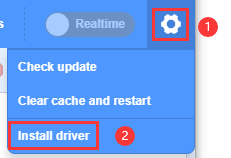

.. _11.-KidsBlock-Using-and-Drive-Installing:

11. KidsBlock Using and Drive Installing
========================================

(Take Windows system as an example, MacOS may take as reference)

| 1.Function description:
| |Img|

| 2.\ |image1|: Alter language into “\ **English**\ ” or
  “\ **简体中文**\ ”。
| |image2|

| 3.\ |image3|: “\ **Install driver**\ ”
| Note: If your computer has already installed a driver, please skip the
  following steps.
| |image4|

| A.Click “\ **Next**\ ” on “\ **Welcome to the Device Driver
  Installation Wizard**\ ”.
| |image5|

| B.Wait for a few seconds and click “\ **Finish**\ ”.
| |image6|

| C.Click “\ **Next**\ ”.
| |image7|

| D.Click “\ **Finish**\ ”.
| |image8|

| E.If a warning window pops up, click “\ **Allow**\ ” to select
  “\ **Install**\ ”.
| |image9|

| F.Click “\ **Install**\ ” when an installation prompt shows up.
| G.Wait for a while and click “\ **Finish**\ ”.
| |image10|

| H.Click “\ **Extract**\ ”。
| |image11|

| I.Click “\ **Next**\ ”。
| |image12|

| J.Click “\ **I accept this agreement**\ ” and “\ **Next**\ ”。
| |image13|

| K.Click “\ **Finish**\ ”。
| |image14|

| O.Wait for a moment and click “\ **INSTALL**\ ”。
| |image15|

| P.When the driver is installed, click “\ **OK**\ ”.
| |image16|

| 4.Click |image17| to enter main control board interface and select
  “\ **Smart home for arduino**\ ”. Click “Connect” to link with
  “\ **Smart home for arduino**\ ”. Click “Go to Editor”.
| And you will find |image18| shifts to |image19| while |image20| turn
  to |image21|. This indicates that “\ **Smart home for arduino**\ ” and
  Port(COM) are both successfully connected.
| |image22|
| |image23|
| |image24|
| |image25|

| 5.After “\ **Smart home for arduino**\ ” being connected without a
  shift of |image26| to |image27|, you need to click |image28| to select
  “\ **Connect**\ ” and wait for a “\ **Connected**\ ” interface.
| |image29|
| |image30|
| |image31|
| |image32|

| Disconnection: Just click |image33| to select “\ **Disconnect**\ ”.
| |image34|
| |image35|

| **KidsBlock library file updating: Click Img to select “Clear cache
  and restart”。**
| |image36|

| 6.\ |image37|: add sensors/modules/components.
| Click |image38| to enter extension warehouse, and select
  sensors/modules to add it/them in library.
| For example: Click “Passive buzzer ”\ |image39|, and “\ **Not
  loaded**\ ” shifting to “\ **Loaded**\ ” means “\ **Passive
  buzzer**\ ” is successfully added.
| |image40|
| |image41|

| Click |image42| to return to editor, and you will see “\ **Passive
  buzzer**\ ” block in the instruction area.
| |image43|

| Delete “\ **Passive buzzer**\ ”: Click |image44|\ to enter extension
  warehouse, and select “Passive buzzer”\ |image45| to shift
  “\ **Loaded**\ ” to “\ **Not loaded**\ ”.
| |image46|
| |image47|

| 7.Open pre-existing files in SB3 format:
| Method 1: click SB3 file. For example, double click |image48| to open
  it.
| |image49|

| Method 2: Open Kidsblock. Click “\ **file**\ ” to select “\ **Load
  from your computer**\ ”, and load an SB3 file on your computer.
| |image50|
| |image51|
| |image52|

.. |image1| image:: media/img-20230302102405.png

.. |image3| image:: media/img-20230302102423.png

.. |image5| image:: media/img-20230302102537.png
.. |image6| image:: media/img-20230302102548.png
.. |image7| image:: media/img-20230302102601.png
.. |image8| image:: media/img-20230302102610.png
.. |image9| image:: media/img-20230302102627.png
.. |image10| image:: media/img-20230302102715.png
.. |image11| image:: media/img-20230302102732.png
.. |image12| image:: media/img-20230302102740.png
.. |image13| image:: media/img-20230302102753.png
.. |image14| image:: media/img-20230302102805.png
.. |image15| image:: media/img-20230302102813.png

.. |image17| image:: media/img-20230302102913.png
.. |image18| image:: media/img-20230302114107.png

.. |image20| image:: media/img-20230302114143.png
.. |image21| image:: media/img-20230302114744.png

.. |image26| image:: media/img-20230302115148.png
.. |image27| image:: media/img-20230302114744.png
.. |image28| image:: media/img-20230302115255.png

.. |image33| image:: media/img-20230302114744.png
.. |image34| image:: media/img-20230302115627.png

.. |image36| image:: media/img-20230302120057.png
.. |image37| image:: media/img-20230302120102.png
.. |image38| image:: media/img-20230302120113.png
.. |image39| image:: media/img-20230302120145.png
.. |image40| image:: media/img-20230302120217.png
.. |image41| image:: media/img-20230302120222.png

.. |image44| image:: media/img-20230302120307.png
.. |image45| image:: media/img-20230302120318.png

.. |image50| image:: media/img-20230302120644.png

