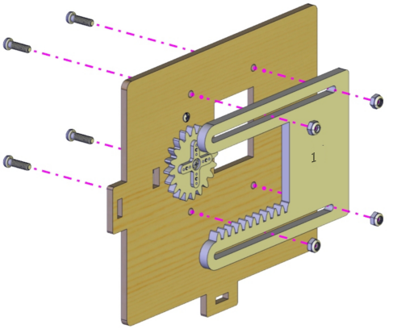

# 12. Trouble Shooting

#### 1. The smart home does not response.                                               
A: 
（1）Please keep batteries fresh.
（2）Please ensure the correctness of wiring. 
Note: The control board have not burned related programs of smart home before leaving the factory, so you need to burn them manually if you want to implement those functions.

#### 2. USB port cannot be recognised by computer                                     
A: 
（1）Please install the development board driver according to "Development Environment Configuration".
（2）Please make sure the USB is in good contact. 

#### 3. The programs cannot be uploaded.                                                 
A: 
Please disconnect Bluetooth when burning programs, otherwise the code fails to be uploaded. Remember installing the Bluetooth after finishing uploading. 

#### 4. The servo is burning hot.                                                     
A: 
（1）Before installing the window servo, please reset it to 90° to avoid blocking and burning when executing programs.
（2）When installing window, please tighten the self-locking nuts too much to guarantee the slip of the window. Otherwise, servo may be burning hot for blocking. 

