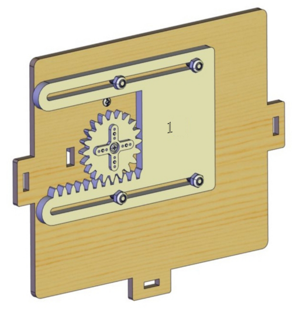

.. _12.-Trouble-Shooting:

12. Trouble Shooting
====================

.. _1.-The-smart-home-does-not-response.:

1. The smart home does not response.
------------------------------------

| A:
| （1）Please keep batteries fresh.
| （2）Please ensure the correctness of wiring.
| Note: The control board have not burned related programs of smart home
  before leaving the factory, so you need to burn them manually if you
  want to implement those functions.

.. _2.-USB-port-cannot-be-recognised-by-computer:

2. USB port cannot be recognised by computer
--------------------------------------------

| A:
| （1）Please install the development board driver according to
  "Development Environment Configuration".
| （2）Please make sure the USB is in good contact.

.. _3.-The-programs-cannot-be-uploaded.:

3. The programs cannot be uploaded.
-----------------------------------

| A:
| Please disconnect Bluetooth when burning programs, otherwise the code
  fails to be uploaded. Remember installing the Bluetooth after
  finishing uploading.

.. _4.-The-servo-is-burning-hot.:

4. The servo is burning hot.
----------------------------

| A:
| （1）Before installing the window servo, please reset it to 90° to
  avoid blocking and burning when executing programs.
| （2）When installing window, please tighten the self-locking nuts too
  much to guarantee the slip of the window. Otherwise, servo may be
  burning hot for blocking.
| |Img|
| |image1|

.. |Img| image:: media/img-20230322135411.png

