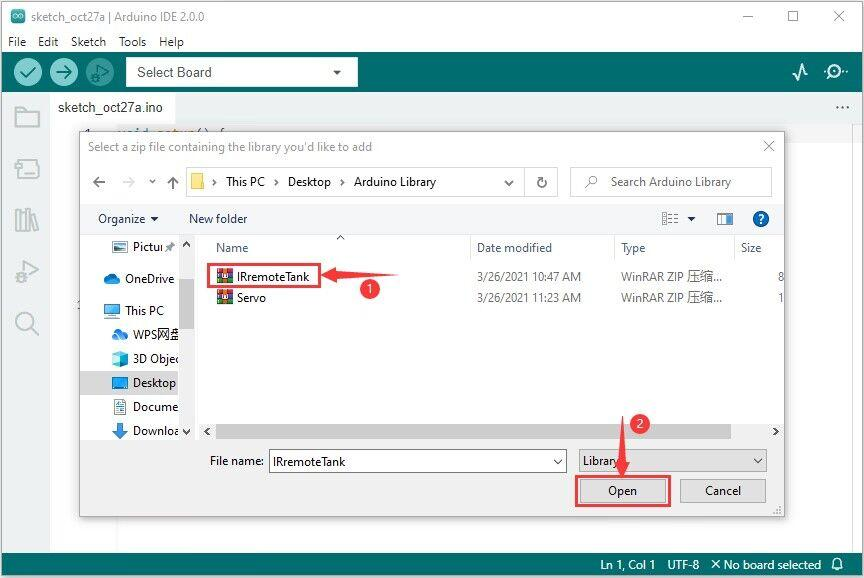
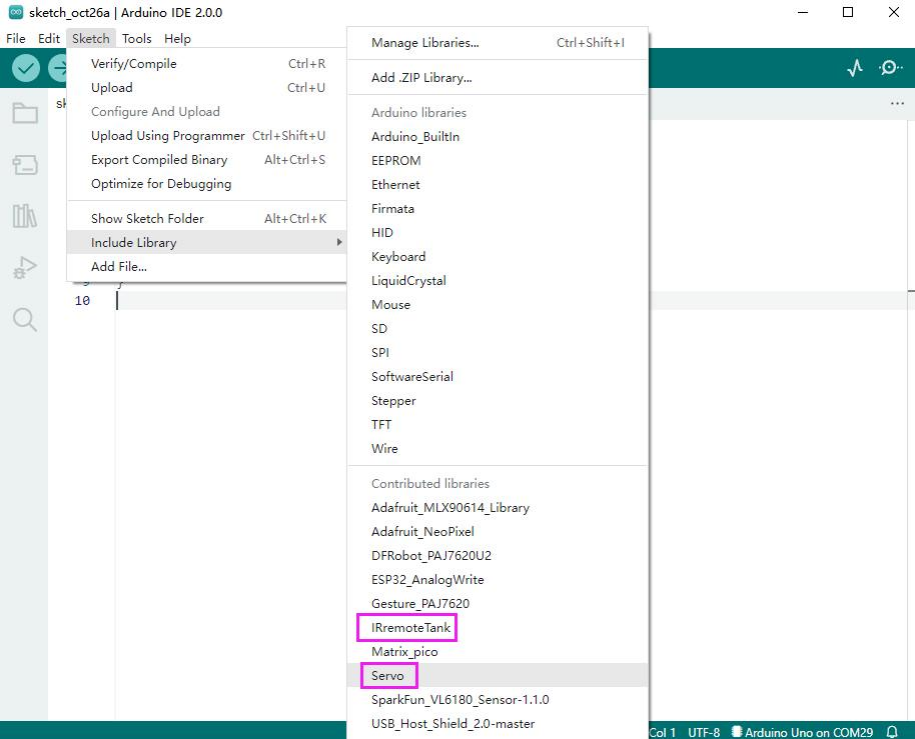

## 14. How to add the library of Arduino IDE2.0

Go to Sketch---->Include Library—>Add.ZIPLibrary，then the library will be

seen.

Click Open to add it.Let’s take the IRremoteTank.zip as an example.

库文件导入成功后，可在IncledeLibrary里看所导入的库

Import the library.Check it in the include library

