# 13. How to install the driver

## 13.1 Window

The USB-TTL chip of the Keyestudio V4.0 development board is a CP2102 serial chip.You can download the driver ofthe CP2101 in the following link. Generally,the hardware will be identified once the USB is plugged into a computer.Then the driver ofthe CP2102 will be installed automatically.

<https://www.silabs.com/products/development-tools/software/usb-to-uart-bridge-vcp-drivers>

If you fail to install it or by manual operation,just go to the device management of the desktop.

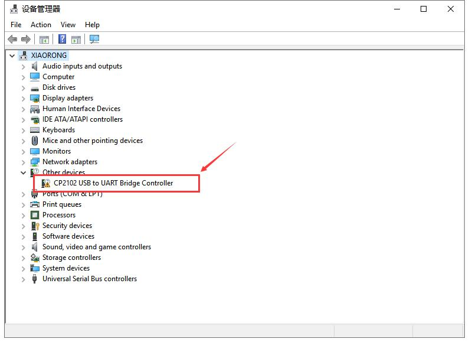

The yellow exclamation mark on the page implies that the driver of CP2101 isn’t installed.Next,you should double-click the hardware to update the driver.

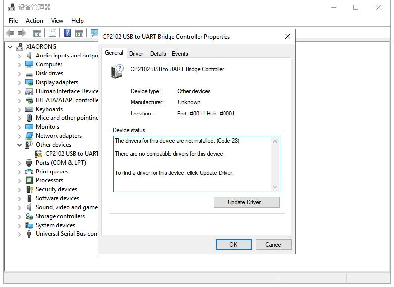

Click “OK” to enter the  following page,click “browse my computer for 

updated driver software”,find the installed or downloaded ARDUINO

software.As shown below:

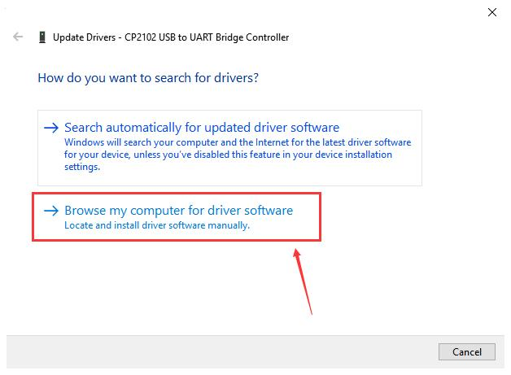

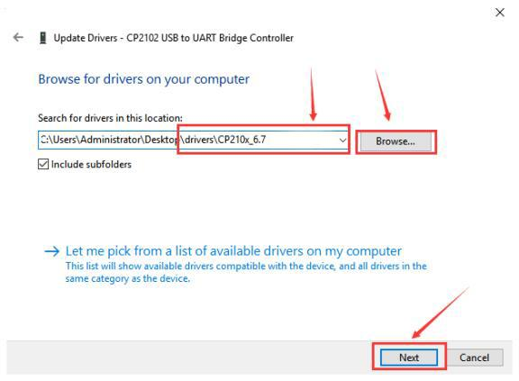

Then we select this folder and click Next.

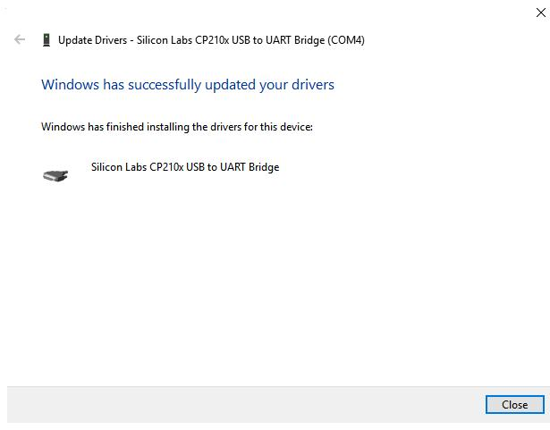

Open device manager,you will find the yellow exclamation mark disappear.The driver of CP2102 is installed successfully.

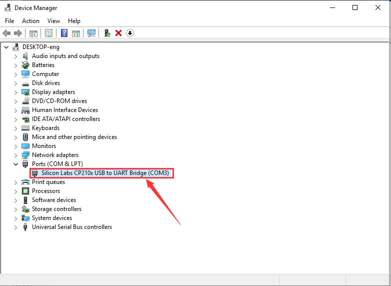

## 13.2 MAC system

Open the driver folder and double-click SiLabsUSBDriverDisk.dmg file.

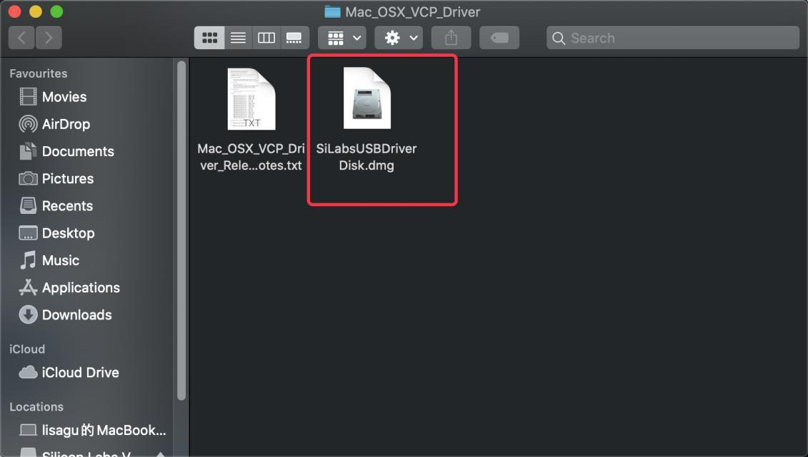

You will view following files as follows:

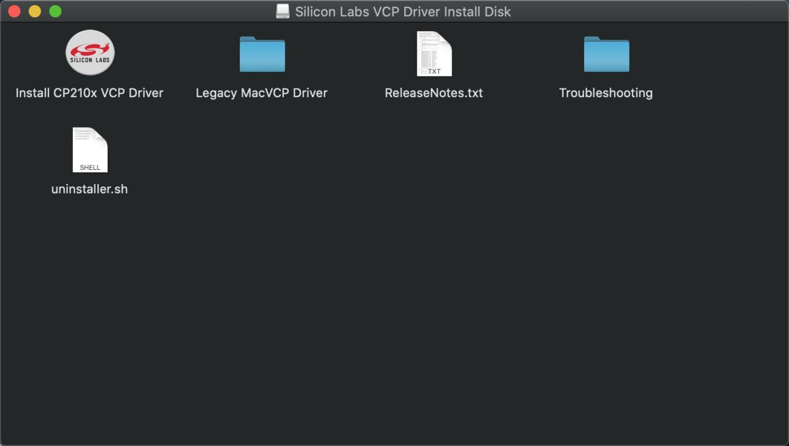

Double-click InstallCP210x VCP Driver,tick Don’t warn me and click Open

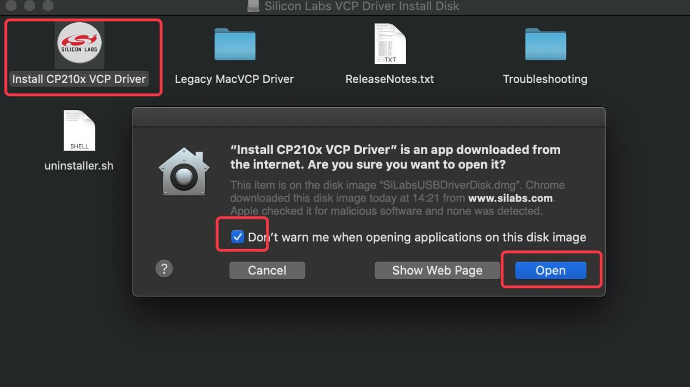

Click Continue

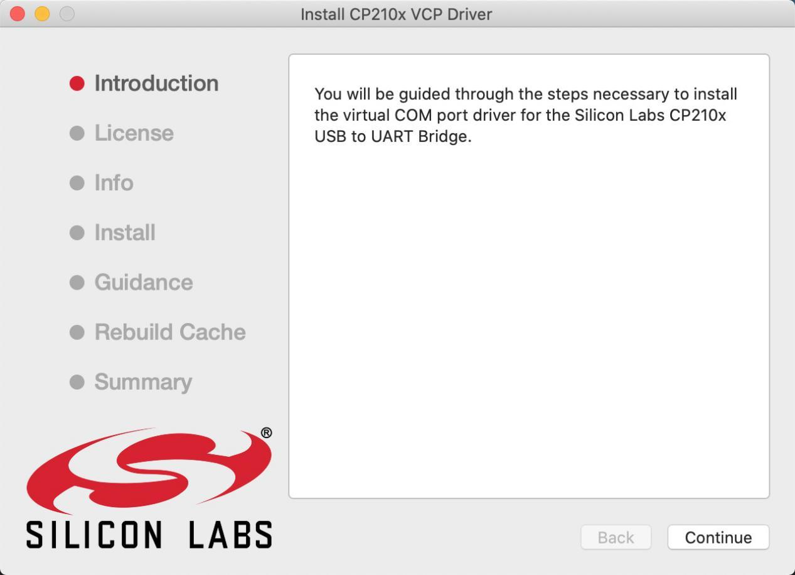

Click Continue and Agree

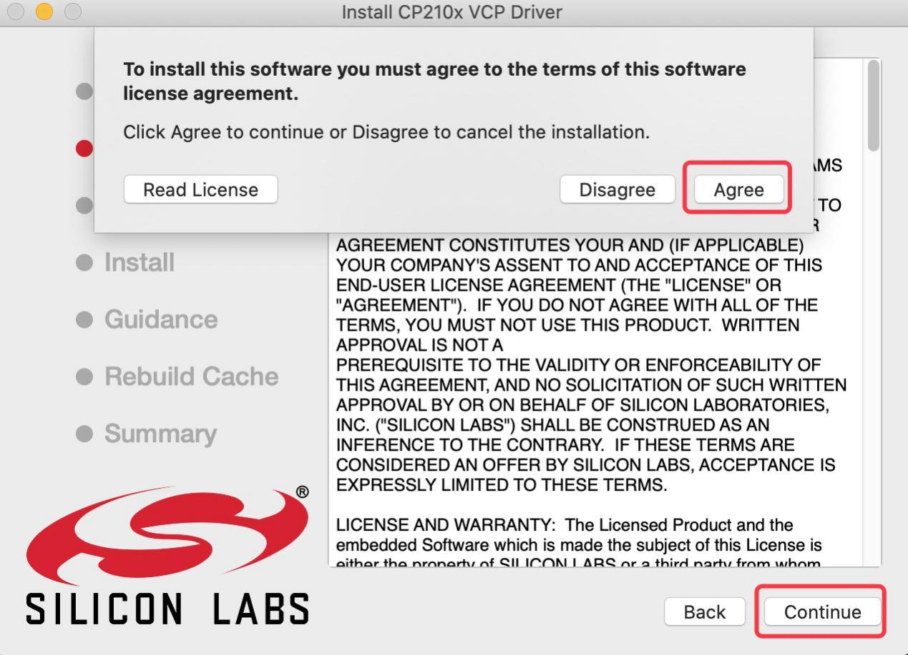

Click Continue and enter your user password.

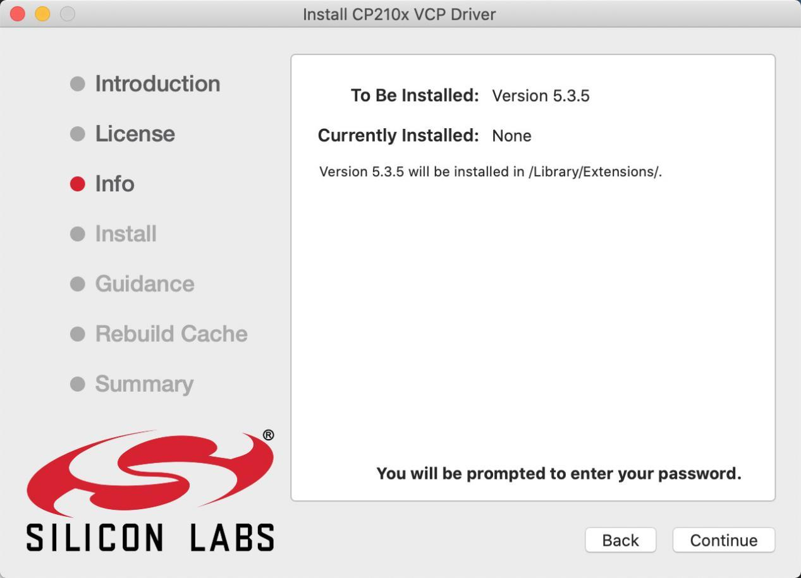

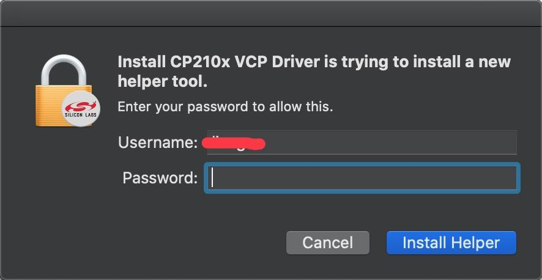

Select Open Security Preferences

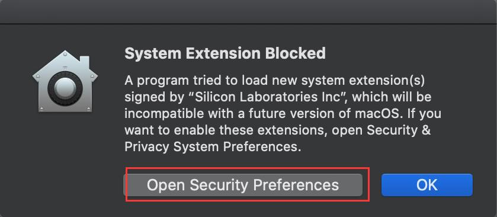

Click the lock then enter your user’s password to authorize.

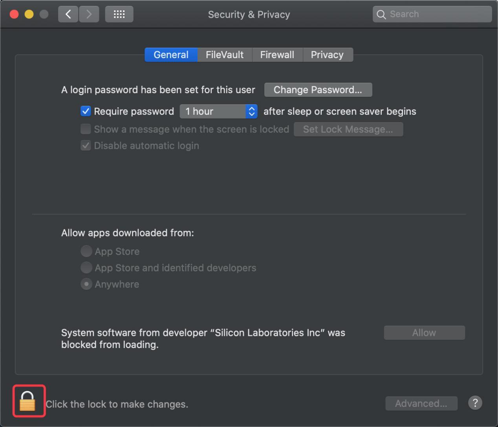

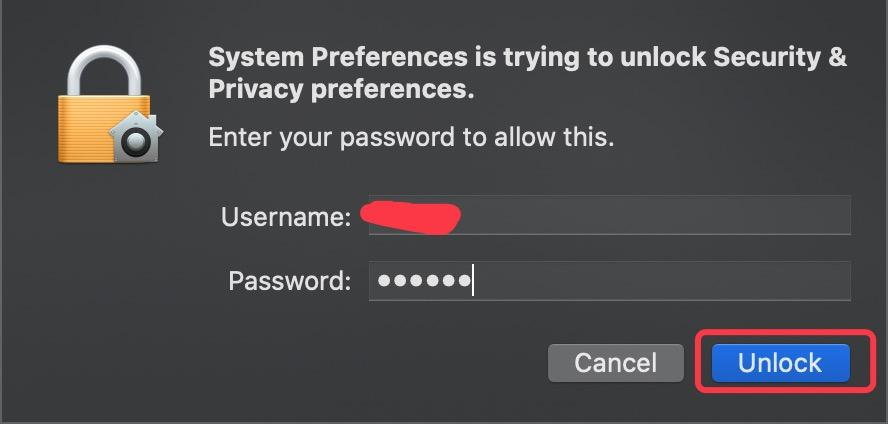

Then click Allow

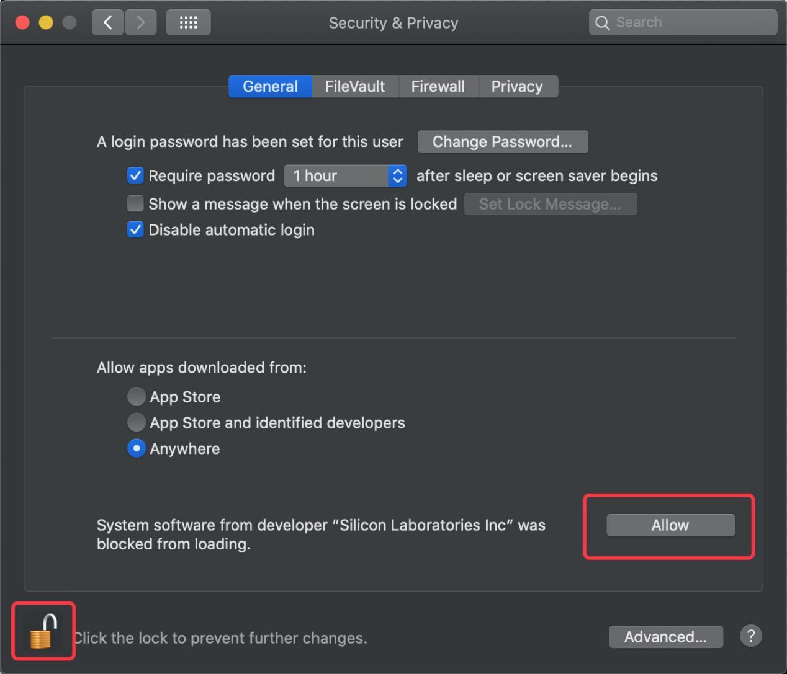

Back to installation page,and wait to install.

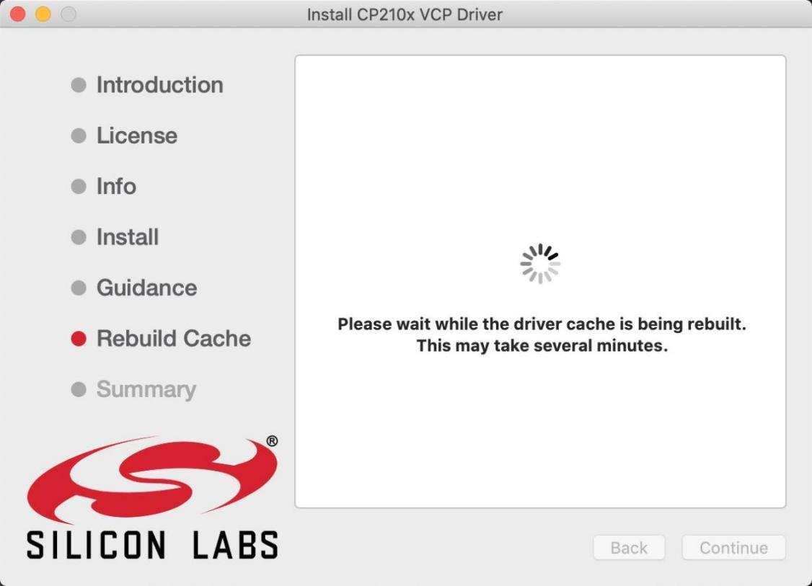

Successfully installed

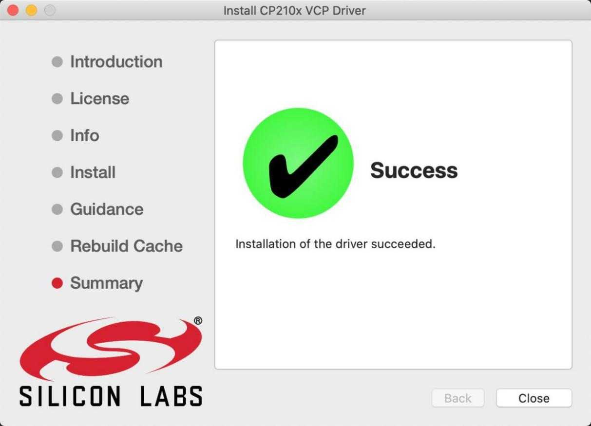