.. _13.-How-to-install-the-driver:

13. How to install the driver
=============================

.. _13.1-Window:

13.1 Window
-----------

.. image:: media/image-20250417111005615.png
   :alt: image-20250417111005615

The USB-TTL chip of the Keyestudio V4.0 development board is a CP2102
serial chip.You can download the driver ofthe CP2101 in the following
link. Generally,the hardware will be identified once the USB is plugged
into a computer.Then the driver ofthe CP2102 will be installed
automatically.

https://www.silabs.com/products/development-tools/software/usb-to-uart-bridge-vcp-drivers

If you fail to install it or by manual operation,just go to the device
management of the desktop.

.. image:: media/image-20250417111430411.png
   :alt: image-20250417111430411

The yellow exclamation mark on the page implies that the driver of
CP2101 isn’t installed.Next,you should double-click the hardware to
update the driver.

.. image:: media/image-20250417111729586-17448598518421.png
   :alt: image-20250417111729586

Click “OK” to enter the following page,click “browse my computer for

updated driver software”,find the installed or downloaded ARDUINO

`software.As <http://software.As>`__ shown below:

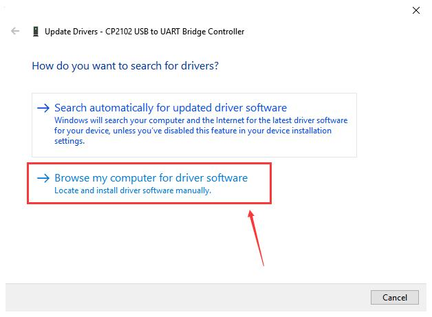

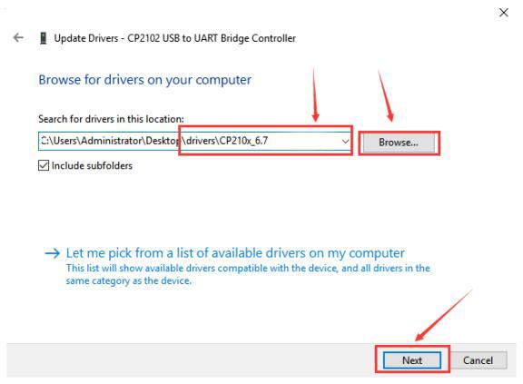

Then we select this folder and click Next.

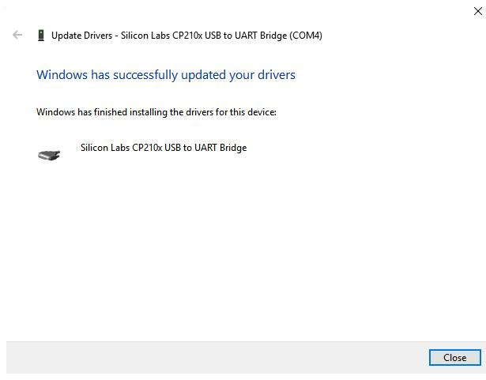

Open device manager,you will find the yellow exclamation mark
disappear.The driver of CP2102 is installed successfully.

.. image:: media/image-20250417112036033.png
   :alt: image-20250417112036033

.. _13.2-MAC-system:

13.2 MAC system
---------------

.. image:: media/image-20250417112110997.png
   :alt: image-20250417112110997

Open the driver folder and double-click SiLabsUSBDriverDisk.dmg file.

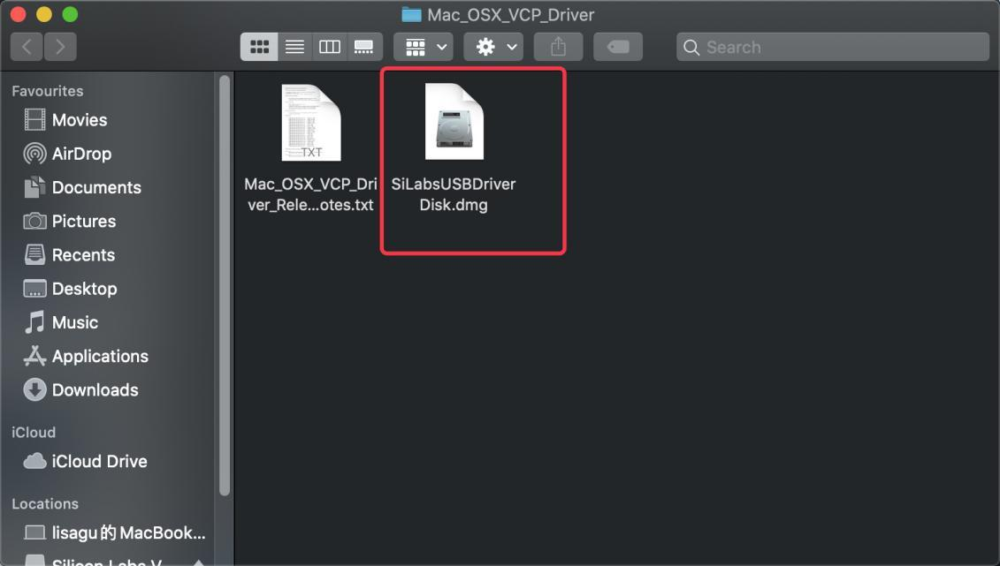

You will view following files as follows:

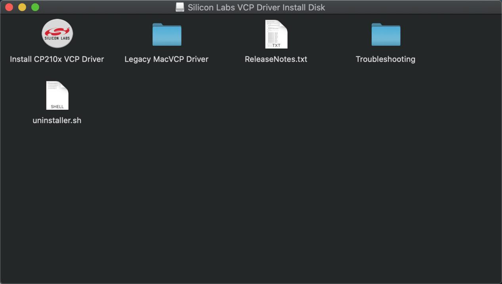

Double-click InstallCP210x VCP Driver,tick Don’t warn me and click Open

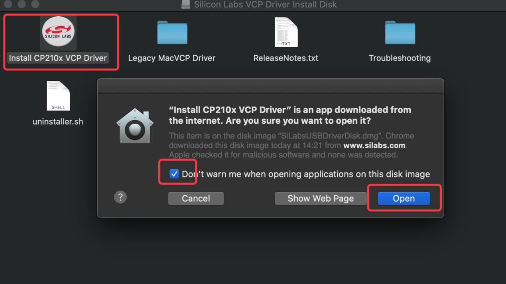

Click Continue

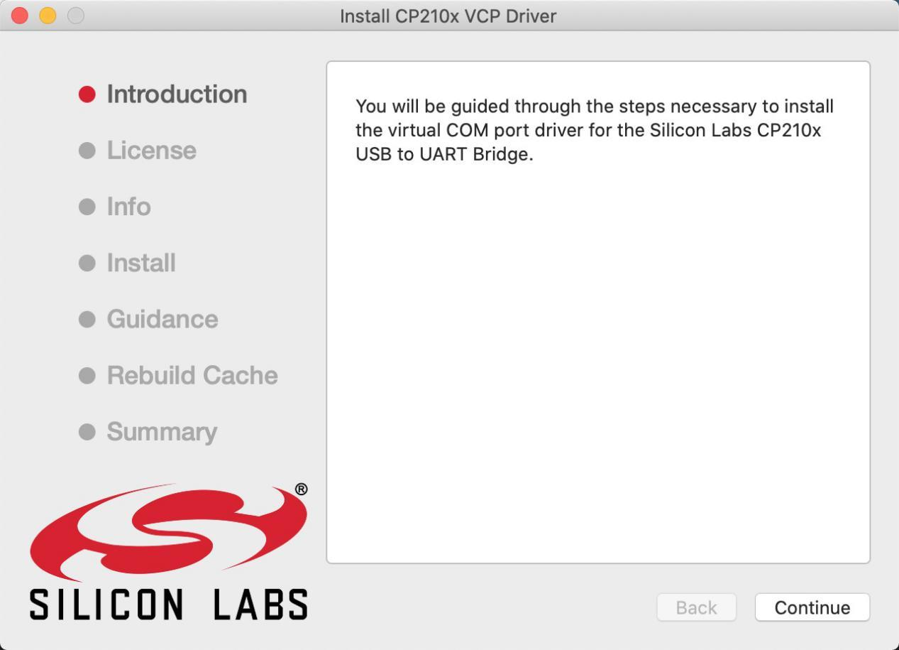

Click Continue and Agree

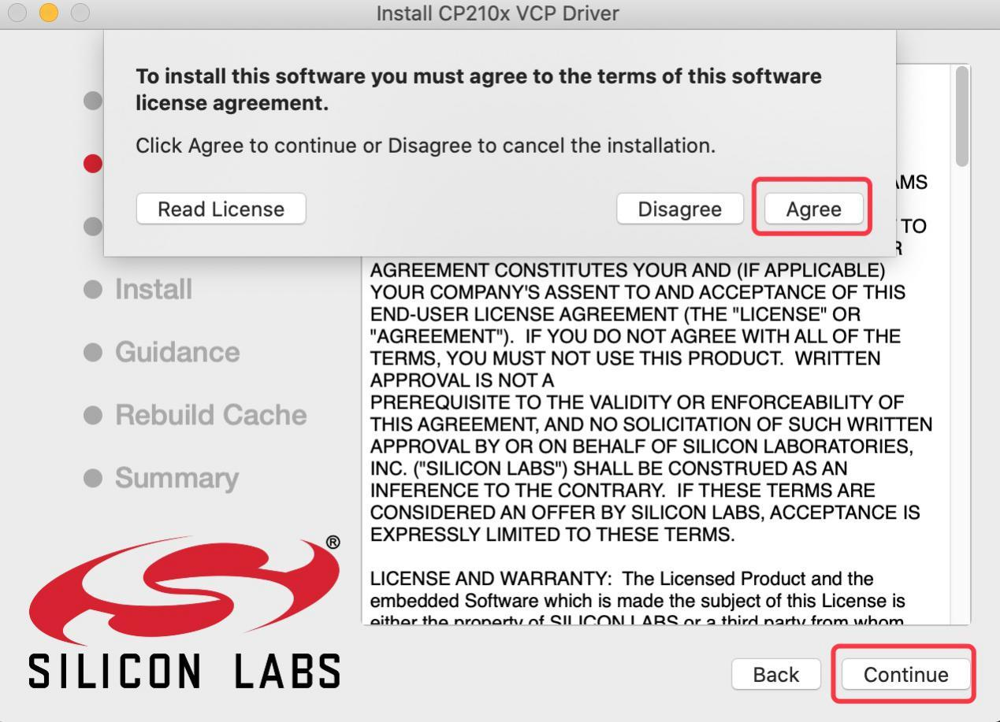

Click Continue and enter your user password.

.. image:: media/image-20250417112516104.png
   :alt: image-20250417112516104

.. image:: media/image-20250417112523290.png
   :alt: image-20250417112523290

Select Open Security Preferences

.. image:: media/image-20250417112541193.png
   :alt: image-20250417112541193

Click the lock then enter your user’s password to authorize.

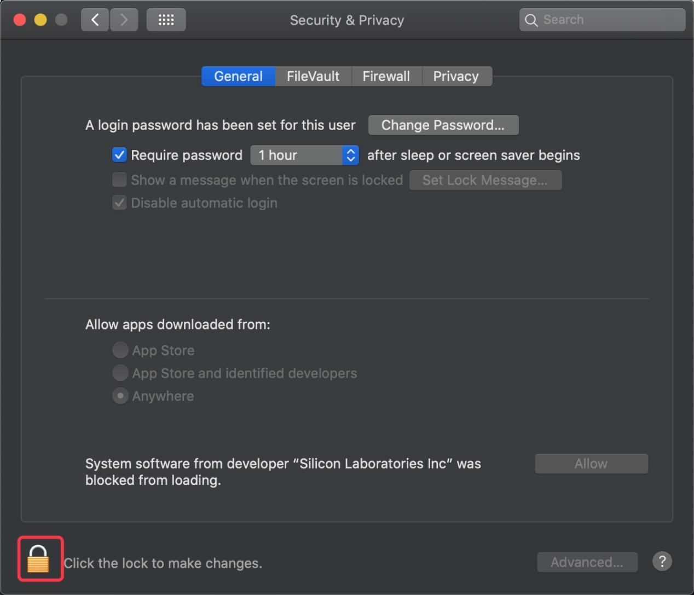

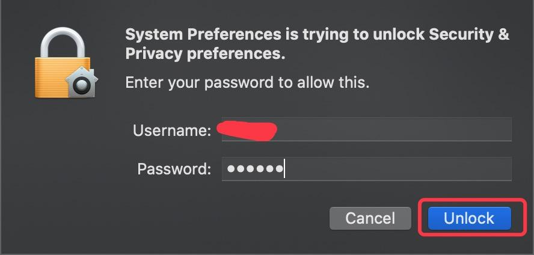

Then click Allow

.. image:: media/image-20250417112640475.png
   :alt: image-20250417112640475

Back to installation page,and wait to install.

.. image:: media/image-20250417112715167.png
   :alt: image-20250417112715167

Successfully installed

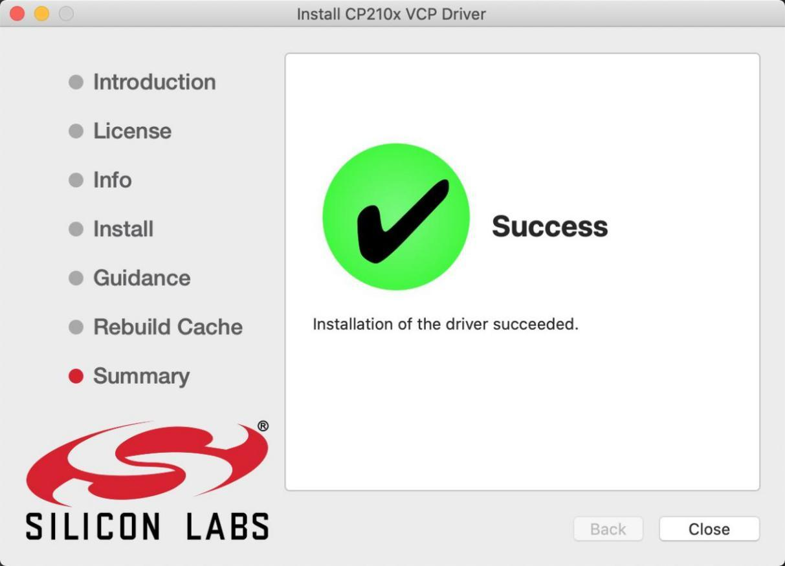
