# 15. Mixly Tutorial

Note: when you get this kit, you need to confirm to use 9V voltage to drive smart home to work.

## 15.1 Download Mixly Software

**Instruction**

Mixly is a free open-source graphical Arduino programming software, based on Google’s Blockly graphical programming framework.

It is a free open-source graphical programming tool for creative electronic development; a complete support ecosystem for creative e-education; a stage for maker educators to realize their dreams.

More info please check the link to download the Mixly blocks software.

**Download and install Mixly 1.0 software**

**Download link：**

Windows system: [https://fs.keyestudio.com/Mixly1-Windows](https://wiki.keyestudio.com/Down/Mixly_1.0-windows.rar)

MACOS system：[https://fs.keyestudio.com/Mixly1-MACOS](https://wiki.keyestudio.com/Down/Mixly_1.0-MacOS.zip)

**Mixly Interface:**

After downloading Mixly, Clickicon, as shown below:

When downloading the sketch to the board, you must select the correct name of Arduino board that matches the board connected to your computer. As shown below;

Then select correct COM port（the corresponding COM port will be shown after successful installation)

## 15.2 Install PLUS Development Board Driver

Now, let’s get to know Keyestudio PLUS development board. It is the core of the whole kit.

Keyestudio PLUS Control Board is fully compatible with Arduino UNO R3 board. Its functions is as same as Arduino UNO R3 board. Moreover, some improvements made highly strengthen its function. Alternatively, it is the best choice to learn building the circuit and designing codes.

Serial communication interface: D0 is RX, D1 is TX

PWM interface (pulse width modulation): D3 D5 D6 D9 D10 D11

External interrupt interface: D2 (interrupt 0) and D3 (interrupt 1)

SPI communication interface: D10 is SS, D11 is MOSI, D12 is MISO, D13 is SCK

IIC communication port: A4 is SDA, A5 is SCL

Let’s install the driver of Keyestudio PLUS Control Board. The USB-TTL chip on PLUS board adopts CP2102 serial chip. The driver program of this chip is included in Arduino 1.8 version and above, which is convenient.

When you attach USB port to computer, the driver of CP2102 can be installed.

If the driver is installed unsuccessfully, you need to install it manually.

Open the device manager of computer. Right click Computer----- Properties----- Device Manager.

There is a yellow exclamation mark on the page, which implies the failure installation of the driver of CP2102.

Operate as follows；

Click “OK” to enter the following page and click “browse my computer for updated driver software”.

Click “Browse”, then search the driver of CP2102 and click “Next”,

There is a DRIVERS folder in Arduino software installed package（）, open driver folder and check the driver of CP210X series chips.

When opening the device manager, we will find the yellow exclamation mark disappear. The driver of CP2102 is installed successfully.

**Start your first program**

Click“Open”→Mixly 1.0 for keyestudio→ sample→ arduino→Arduino→01 IN-OUT→led-blink

Set board and COM port. The corresponding board and COM port are shown in the lower right corner. 

Click“Compile”to check errors of program.

If without errors, click“Upload”to upload program.

LED blinks, and your first program is finished.

## 15.3 Projects

Alright, let’s get straight to our projects. In this kit, there are 14 sensors and modules. We will make you know the smart home deeply from the simple sensor.

However, if you are professional with Arduino. You can skip theses steps and assemble the smart home kit directly.

<https://ks0085-smart-home-kit-for-mixly.readthedocs.io/en/latest/KS0085-Mixly.html#assembly-guide>

Note: In this course, the interface of each sensor / module marked with (G,-, GND) indicates the negative pole, G is connected to G or - or GND of sensor shield or control board; “V” implies positive pole which is linked with V or VCC or 5V.

### Project 1：LED Blink

**Description：**

We’ve installed the driver of Keyestudio V4.0 development board.

In this lesson, we will conduct an experiment to make LED blink.

Let’s connect GND and VCC to power. The LED will be on when signal end S is high level, on the contrary, LED will turn off when signal end S is low level.

In addition, the different blinking frequency can be presented by adjusting the delayed time.

**Specifications：**

Control interface: digital port

Working voltage: DC 3.3-5V

Pin pitch: 2.54mm

Display color: white

**Experiment equipment：**

| PLUS control board\*1                           | Sensor shield\*1                                 | White LED module \*1                             | USB cable\*1                                    | 3pin F-F Dupont line\*1                         |
|-------------------------------------------------|--------------------------------------------------|--------------------------------------------------|-------------------------------------------------|-------------------------------------------------|
|  |  |  |  |  |

**Sensor shield**

We usually combine Arduino control board with a large number of sensors and modules. However, the pins and ports are limited on control board.

To cope with this disadvantage, we just need to stack V5 sensor board on Keyestudio PLUS control board.

This V5 shield can be directly attached to sensors with 3 pin connectors, and be extended the commonly used communication ports as well, such as serial communication, IIC communication and SPI communication ports. What’s more, the shield comes with a reset button and 2 signal lights.

**Wiring Diagram：**

Note: G, V and S of white LED module are linked with G, V and 13 of expansion board.

**Test Code：**

Wire up components according to connection diagram.

Let’s design code to make LED blink.

Enter “sensor” → “Control Output” → 

\*\*\*\*\*\*\*\*\*\*\*\*\*\*\*\*\*\*\*\*\*\*\*\*\*\*\*\*\*\*\*\*\*\*\*\*\*\*\*\*\*\*\*\*\*\*\*\*\*\*\*\*\*\*\*\*\*\*\*\*\*\*\*\*\*\*\*\*\*\*\*\*\*\*\*\*\*\*\*\*\*\*\*

White LED is linked with digital 13 of shield, then we click drop-down triangle to select 13 and HIGH, then we get block:

\*\*\*\*\*\*\*\*\*\*\*\*\*\*\*\*\*\*\*\*\*\*\*\*\*\*\*\*\*\*\*\*\*\*\*\*\*\*\*\*\*\*\*\*\*\*\*\*\*\*\*\*\*\*\*\*\*\*\*\*\*\*\*\*\*\*\*\*\*\*\*\*\*\*\*\*\*\*\*\*\*\*\*

Next click “Control”→

Then we get block:

+= .

\*\*\*\*\*\*\*\*\*\*\*\*\*\*\*\*\*\*\*\*\*\*\*\*\*\*\*\*\*\*\*\*\*\*\*\*\*\*\*\*\*\*\*\*\*\*\*\*\*\*\*\*\*\*\*\*\*\*\*\*\*\*\*\*\*\*\*\*\*\*\*\*\*\*\*\*\*\*\*\*\*\*\*

Duplicate once，but set to LOW, then we get block:

.

\*\*\*\*\*\*\*\*\*\*\*\*\*\*\*\*\*\*\*\*\*\*\*\*\*\*\*\*\*\*\*\*\*\*\*\*\*\*\*\*\*\*\*\*\*\*\*\*\*\*\*\*\*\*\*\*\*\*\*\*\*\*\*\*\*\*\*\*\*\*\*\*\*\*\*\*\*\*\*\*\*\*\*

The complete code is shown below:

Click “Code” on Mixly software to convert graphic code into C language code.

**Test Result：**

After the code is uploaded, the white LED flashes for 1000ms, alternately.

**Code explanation：**

(1)

(2)

When signal end S is high level, LED is on; however, when signal end S is low level, LED is off.

: delay for 1000ms, namely 1s, we could set any numbers to alter delay time so as to control flashing frequency of LED.

### Project 2：Breathing light

**Description**

In the previous lesson, we control LED on and off and make it blink.

In this project, we will control LED brightness through PWM to simulate breathing effect. Similarly, you can change the step length and delay time in the code so as to demonstrate different breathing effect.

PWM is a means of controlling the analog output via digital means. Digital control is used to generate square waves with different duty cycles (a signal that constantly switches between high and low levels) to control the analog output.In general, the input voltage of port are 0V and 5V. What if the 3V is required? Or what if switch among 1V, 3V and 3.5V? We can’t change resistor constantly. For this situation, we need to control by PWM.

For the Arduino digital port voltage output, there are only LOW and HIGH, which correspond to the voltage output of 0V and 5V. You can define LOW as 0 and HIGH as 1, and let the Arduino output five hundred 0 or 1 signals within 1 second.

If output five hundred 1, that is 5V; if all of which is 1, that is 0V. If output 010101010101 in this way then the output port is 2.5V, which is like showing movie. The movie we watch are not completely continuous. It actually outputs 25 pictures per second. In this case, the human can’t tell it, neither does PWM. If want different voltage, need to control the ratio of 0 and 1. The more 0,1 signals output per unit time, the more accurately control.

**Experiment equipment：**

| PLUS control board\*1                           | Sensor shield\*1                                 | Yellow LED module\*1                             | USB cable\*1                                    | 3pin F-F Dupont line\*1                         |
|-------------------------------------------------|--------------------------------------------------|--------------------------------------------------|-------------------------------------------------|-------------------------------------------------|
|  |  |  |  |  |

**Wiring Diagram：**

Not like general digital port, PWM port can output high and low level, and alter levels constantly in certain time. PWM controls the brightness. Additionally, 0-255 “range” voltage output is decided by PWM. D3, D5, D6, D9, D10, D11 are PWM pins. In the following experiment, D5 is needed.

Note: on sensor shield, the G, V and S pins of yellow LED module are linked with G, V and S.

**Test Code：**
Enter “Control” →.

\*\*\*\*\*\*\*\*\*\*\*\*\*\*\*\*\*\*\*\*\*\*\*\*\*\*\*\*\*\*\*\*\*\*\*\*\*\*\*\*\*\*\*\*\*\*\*\*\*\*\*\*\*\*\*\*\*\*\*\*\*\*\*\*\*\*\*\*\*\*\*\*\*\*\*\*\*\*\*\*\*\*\*

Click “IN/OUT” →，LED is linked with digital 5, so we set to pin 5, then get block .

+=

During initialization, set PWM value of D5 to 0.

\*\*\*\*\*\*\*\*\*\*\*\*\*\*\*\*\*\*\*\*\*\*\*\*\*\*\*\*\*\*\*\*\*\*\*\*\*\*\*\*\*\*\*\*\*\*\*\*\*\*\*\*\*\*\*\*\*\*\*\*\*\*\*\*\*\*\*\*\*\*\*\*\*\*\*\*\*\*\*\*\*\*\*

Click “Control” →，numbers and variable i are set freely. Level varies from 0 to 255, then LED is getting brighter, so we set block.

\*\*\*\*\*\*\*\*\*\*\*\*\*\*\*\*\*\*\*\*\*\*\*\*\*\*\*\*\*\*\*\*\*\*\*\*\*\*\*\*\*\*\*\*\*\*\*\*\*\*\*\*\*\*\*\*\*\*\*\*\*\*\*\*\*\*\*\*\*\*\*\*\*\*\*\*\*\*\*\*\*\*\*

Copyonce, then +=

\*\*\*\*\*\*\*\*\*\*\*\*\*\*\*\*\*\*\*\*\*\*\*\*\*\*\*\*\*\*\*\*\*\*\*\*\*\*\*\*\*\*\*\*\*\*\*\*\*\*\*\*\*\*\*\*\*\*\*\*\*\*\*\*\*\*\*\*\*\*\*\*\*\*\*\*\*\*\*\*\*\*\*

Click“Variables”to select , +=;

\*\*\*\*\*\*\*\*\*\*\*\*\*\*\*\*\*\*\*\*\*\*\*\*\*\*\*\*\*\*\*\*\*\*\*\*\*\*\*\*\*\*\*\*\*\*\*\*\*\*\*\*\*\*\*\*\*\*\*\*\*\*\*\*\*\*\*\*\*\*\*\*\*\*\*\*\*\*\*\*\*\*\*

Add delay block，set to 500ms.

Then get code string

\*\*\*\*\*\*\*\*\*\*\*\*\*\*\*\*\*\*\*\*\*\*\*\*\*\*\*\*\*\*\*\*\*\*\*\*\*\*\*\*\*\*\*\*\*\*\*\*\*\*\*\*\*\*\*\*\*\*\*\*\*\*\*\*\*\*\*\*\*\*\*\*\*\*\*\*\*\*\*\*\*\*\*

Duplicate once, then we set to “counter with i from 255 to 0 step -51”, check out the entire code:

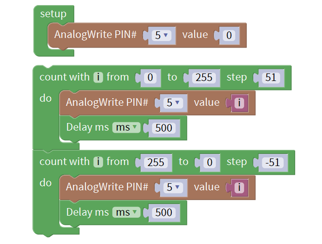

**Test Result：**

LED smoothly changes its brightness from dark to bright and back to dark, continuing to do so, which is similar to a lung breathing in and out.

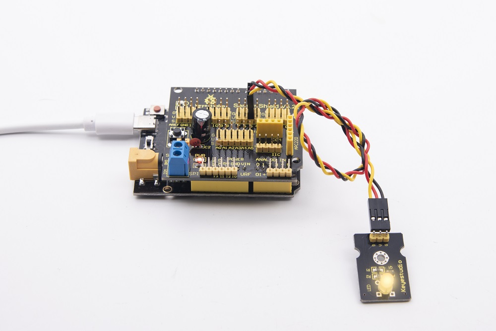

**Code explanation**

: the code of “setup” only run once

There are PWM ports(D3 D5 D6 D9 D10 D11) on PLUS control board, which control brightness of LED. In the experiment, connect signal end S to digital 5(PWM port). The smaller the PWM value, the darker the LED, conversely, the brighter the LED, in the range of 0-255.

\*\*\*\*\*\*\*\*\*\*\*\*\*\*\*\*\*\*\*\*\*\*\*\*\*\*\*\*\*\*\*\*\*\*\*\*\*\*\*\*\*\*\*\*\*\*\*\*\*\*\*\*\*\*\*\*\*\*\*\*\*\*\*\*\*\*\*\*\*\*\*\*\*\*\*\*\*\*\*\*\*\*\*

， in this lesson, it implies that variable i increases from 51 to 255 every 500ms, or decrease 51 every 500ms.

**Extension Practice：**

Change test code, link LED with D10. When LED is getting brighter, PWM value goes up from 0 to 255, plus 15 every time, delay in 100ms; when getting darker, PWM value decreases from 255 to 0, reduces 15 every time, delay in 100ms.

Do you find any difference in brightness when we alter some numbers? Is it cool?

### Project 3：Passive Buzzer

**Description：**

****

There are prolific interactive works completed by Arduino. The most common one is sound and light display. We always use LED to make experiments. For this lesson, we design circuit to emit sound. The universal sound components are buzzer and horns. Buzzer is easier to use. And buzzer includes about active buzzer and passive buzzer. In this experiment, we adopt passive buzzer.

While using passive buzzer, we can control different sound by inputting square waves with distinct frequency. During the experiment, we control code to make buzzer sound, begin with “tick, tick” sound, then make passive buzzer emit “do re mi fa so la si do”, and play specific songs.

**Experiment equipment：：**

| PLUS control board\*1                           | Sensor shield\*1                                 | Passive buzzer\*1                                | USB cable\*1                                    | 3pin F-F Dupont line\*1                         |
|-------------------------------------------------|--------------------------------------------------|--------------------------------------------------|-------------------------------------------------|-------------------------------------------------|
|  |  |  |  |  |

**Wiring Diagram：**

The G, V and S pins of passive buzzer are connected to G, V and S.

**Test Code：**

Code 1：Code to make passive buzzer emit “tick, tick”

Click→ “sensor” → “Control Output” →: there are triangle buttons at “NOTE_C3” and “1/8”, click to get more options which are used to select tones and beats.

\*\*\*\*\*\*\*\*\*\*\*\*\*\*\*\*\*\*\*\*\*\*\*\*\*\*\*\*\*\*\*\*\*\*\*\*\*\*\*\*\*\*\*\*\*\*\*\*\*\*\*\*\*\*\*\*\*\*\*\*\*\*\*\*\*\*\*\*\*\*\*\*\*\*\*\*\*\*\*\*\*\*\*

The signal end S of passive buzzer is attached to digital 3, therefore, set to pin 3, tone NOTE_C4，1/4 beat，get block, tones and beats are set freely.

\*\*\*\*\*\*\*\*\*\*\*\*\*\*\*\*\*\*\*\*\*\*\*\*\*\*\*\*\*\*\*\*\*\*\*\*\*\*\*\*\*\*\*\*\*\*\*\*\*\*\*\*\*\*\*\*\*\*\*\*\*\*\*\*\*\*\*\*\*\*\*\*\*\*\*\*\*\*\*\*\*\*\*

Enter “Control Output” →and , set to pin 3, delay in 200ms. ++=

\*\*\*\*\*\*\*\*\*\*\*\*\*\*\*\*\*\*\*\*\*\*\*\*\*\*\*\*\*\*\*\*\*\*\*\*\*\*\*\*\*\*\*\*\*\*\*\*\*\*\*\*\*\*\*\*\*\*\*\*\*\*\*\*\*\*\*\*\*\*\*\*\*\*\*\*\*\*\*\*\*\*\*

Duplicatecode string once. Modify the last 200ms into 1000ms so as to delay time. The complete code is shown as below:

Upload cod on control board, buzzer will emit“tick,tick”sound.

Code 2：Passive buzzer emits“do re mi fa so la si do”

Duplicate this block for 7 times, separately remain frequency for NOTE_D4, NOTE_E4, NOTE_F4, NOTE_G4, NOTE_A4, NOTE_B4, NOTE_C5;

\*\*\*\*\*\*\*\*\*\*\*\*\*\*\*\*\*\*\*\*\*\*\*\*\*\*\*\*\*\*\*\*\*\*\*\*\*\*\*\*\*\*\*\*\*\*\*\*\*\*\*\*\*\*\*\*\*\*\*\*\*\*\*\*\*\*\*\*\*\*\*\*\*\*\*\*\*\*\*\*\*\*\*

Add，move out blockfrom “Control”, delay in 1000ms. Check out the complete code.

Upload code on control board, buzzer will emit “do re mi fa so la si do”

\*\*\*\*\*\*\*\*\*\*\*\*\*\*\*\*\*\*\*\*\*\*\*\*\*\*\*\*\*\*\*\*\*\*\*\*\*\*\*\*\*\*\*\*\*\*\*\*\*\*\*\*\*\*\*\*\*\*\*\*\*\*\*\*\*\*\*\*\*\*\*\*\*\*\*\*\*\*\*\*\*\*\*

Code 3：Play《Ode to joy》

Click “sensor” →“control output”→，respectively set to pin 3 and click drop down triangle button to select “Ode to joy”

\*\*\*\*\*\*\*\*\*\*\*\*\*\*\*\*\*\*\*\*\*\*\*\*\*\*\*\*\*\*\*\*\*\*\*\*\*\*\*\*\*\*\*\*\*\*\*\*\*\*\*\*\*\*\*\*\*\*\*\*\*\*\*\*\*\*\*\*\*\*\*\*\*\*\*\*\*\*\*\*\*\*\*

Then move out block，set to pin 3，drag block，delay in 3000ms.

Upload test code on the development board.

Do you hear “Ode to joy”?

\*\*\*\*\*\*\*\*\*\*\*\*\*\*\*\*\*\*\*\*\*\*\*\*\*\*\*\*\*\*\*\*\*\*\*\*\*\*\*\*\*\*\*\*\*\*\*\*\*\*\*\*\*\*\*\*\*\*\*\*\*\*\*\*\*\*\*\*\*\*\*\*\*\*\*\*\*\*\*\*\*\*\*

**Code Explanation：**

: passive buzzer is attached to D3, so set to pin 3, NOTE_C4 and 1/4 beat;

1（Do）、2(Re)、3(Mi)、4(Fa)、5(Sol)、6(La)、7(Si) are the roll-call in music. They correspond to NOTE C、NOTE D、NOTE E、NOTE F、NOTE G、NOTE A、NOTE B in frequency drop-down list.

\*\*\*\*\*\*\*\*\*\*\*\*\*\*\*\*\*\*\*\*\*\*\*\*\*\*\*\*\*\*\*\*\*\*\*\*\*\*\*\*\*\*\*\*\*\*\*\*\*\*\*\*\*\*\*\*\*\*\*\*\*\*\*\*\*\*\*\*\*\*\*\*\*\*\*\*\*\*\*\*\*\*\*

From 1（Do）to 7（Si）, that is from C to B. As the below table shown.

The pitch/tone is getting higher and higher.

| 1（Do） | 2（Re） | 3(Mi)  | 4(Fa)  | 5(Sol) | 6(La)  | 7(Si)  |
|---------|---------|--------|--------|--------|--------|--------|
| NOTE_C  | NOTE_D  | NOTE_E | NOTE_F | NOTE_G | NOTE_A | NOTE_B |

Music in addition to "singing accurately", but also "rhythm-paired". The duration of each note, is the beat. The bigger the number, the longer the duration.

\*\*\*\*\*\*\*\*\*\*\*\*\*\*\*\*\*\*\*\*\*\*\*\*\*\*\*\*\*\*\*\*\*\*\*\*\*\*\*\*\*\*\*\*\*\*\*\*\*\*\*\*\*\*\*\*\*\*\*\*\*\*\*\*\*\*\*\*\*\*\*\*\*\*\*\*\*\*\*\*\*\*\*

*For example:*

-   1 beat, 1 second is 1000 milliseconds;
-   1/2 beat, 0.5 second is 500 milliseconds;
-   1/4 beat, 0.25 second is 250 milliseconds;

 passive buzzer plays specific music, multiple choices are provided

### Project 4：Button-controlled LED

**Description：**

****
In this lesson, we will use the input function of I/O port, that is, reading the output value of external device. Also, we will do an experiment with a button and an LED to know more about I/O.

The button switch is ordinary in our life. It belongs to switch quantity( digital quantity)components. Composed of normally open contact and normally closed contact, it is similar to ordinary switch.

When the normally open contact bears pressure, the circuit will be on state ; however, when this pressure disappears, the normally open contact will go back to be the initial state, that is, off state.

**Experiment equipment：**

| PLUS control board\*1                                    | Sensor shield\*1                                 | Yellow LED module\*1                             | Button sensor\*1                                 | USB cable\*1                                    | 3pin F-F Dupont line\*2                         |
|----------------------------------------------------------|--------------------------------------------------|--------------------------------------------------|--------------------------------------------------|-------------------------------------------------|-------------------------------------------------|
|           |  |  |  |  |  |

**Wiring Diagram：**

Note: the G, V, and S pins of button sensor module are separately connected to G, V, and 4 on the shield, and the G, V, and S pins of the yellow LED module are linked with G, V, and 5 on the shield.

**Test Code：**

 Click “Control” →;

\*\*\*\*\*\*\*\*\*\*\*\*\*\*\*\*\*\*\*\*\*\*\*\*\*\*\*\*\*\*\*\*\*\*\*\*\*\*\*\*\*\*\*\*\*\*\*\*\*\*\*\*\*\*\*\*\*\*\*\*\*\*\*\*\*\*\*\*\*\*\*\*\*\*\*\*\*\*\*\*\*\*\*

 Enter “Serialport” → ,

Then we get the block:

+=

In order to read the signal detected by button sensor, select  from “Serialport”；

\*\*\*\*\*\*\*\*\*\*\*\*\*\*\*\*\*\*\*\*\*\*\*\*\*\*\*\*\*\*\*\*\*\*\*\*\*\*\*\*\*\*\*\*\*\*\*\*\*\*\*\*\*\*\*\*\*\*\*\*\*\*\*\*\*\*\*\*\*\*\*\*\*\*\*\*\*\*\*\*\*\*\*

 Next to click “sensor” → “Digital Read” →, the button sensor is connected to digital 4，set to pin 4.

Then we get the block:

+=.

\*\*\*\*\*\*\*\*\*\*\*\*\*\*\*\*\*\*\*\*\*\*\*\*\*\*\*\*\*\*\*\*\*\*\*\*\*\*\*\*\*\*\*\*\*\*\*\*\*\*\*\*\*\*\*\*\*\*\*\*\*\*\*\*\*\*\*\*\*\*\*\*\*\*\*\*\*\*\*\*\*\*\*

Then drag，delay in 500ms, get the following code string: .

\*\*\*\*\*\*\*\*\*\*\*\*\*\*\*\*\*\*\*\*\*\*\*\*\*\*\*\*\*\*\*\*\*\*\*\*\*\*\*\*\*\*\*\*\*\*\*\*\*\*\*\*\*\*\*\*\*\*\*\*\*\*\*\*\*\*\*\*\*\*\*\*\*\*\*\*\*\*\*\*\*\*\*

Enter “control” →，click blue gear icon, appear box, moveblock into then get→block.

\*\*\*\*\*\*\*\*\*\*\*\*\*\*\*\*\*\*\*\*\*\*\*\*\*\*\*\*\*\*\*\*\*\*\*\*\*\*\*\*\*\*\*\*\*\*\*\*\*\*\*\*\*\*\*\*\*\*\*\*\*\*\*\*\*\*\*\*\*\*\*\*\*\*\*\*\*\*\*\*\*\*\*

Click “Logic” → , copy block, drag  from “math”:

+++=.

\*\*\*\*\*\*\*\*\*\*\*\*\*\*\*\*\*\*\*\*\*\*\*\*\*\*\*\*\*\*\*\*\*\*\*\*\*\*\*\*\*\*\*\*\*\*\*\*\*\*\*\*\*\*\*\*\*\*\*\*\*\*\*\*\*\*\*\*\*\*\*\*\*\*\*\*\*\*\*\*\*\*\*

Enter “Control Output” →，yellow LED is linked with digital 5, so set pin 5. When the button is released, yellow LED is off, copy block once and drag it into else block, and set to LOW.

Alright, we get the complete code.

\*\*\*\*\*\*\*\*\*\*\*\*\*\*\*\*\*\*\*\*\*\*\*\*\*\*\*\*\*\*\*\*\*\*\*\*\*\*\*\*\*\*\*\*\*\*\*\*\*\*\*\*\*\*\*\*\*\*\*\*\*\*\*\*\*\*\*\*\*\*\*\*\*\*\*\*\*\*\*\*\*\*\*

**Test Result：**

After the code is uploaded successfully. The serial monitor will send digital 0（low level) and yellow LED will be on, when the button is pressed; however, when the button is released, signal 1 will be displayed and LED will be off.

**Code Explanation：**

: button sensor is linked with D4, when the button is pressed, low level(0) is sent; when released, high level(1) is maintained at signal end.

\*\*\*\*\*\*\*\*\*\*\*\*\*\*\*\*\*\*\*\*\*\*\*\*\*\*\*\*\*\*\*\*\*\*\*\*\*\*\*\*\*\*\*\*\*\*\*\*\*\*\*\*\*\*\*\*\*\*\*\*\*\*\*\*\*\*\*\*\*\*\*\*\*\*\*\*\*\*\*\*\*\*\*

：set baud rate to 9600

: output word/data on serial monitor，word wrap

\*\*\*\*\*\*\*\*\*\*\*\*\*\*\*\*\*\*\*\*\*\*\*\*\*\*\*\*\*\*\*\*\*\*\*\*\*\*\*\*\*\*\*\*\*\*\*\*\*\*\*\*\*\*\*\*\*\*\*\*\*\*\*\*\*\*\*\*\*\*\*\*\*\*\*\*\*\*\*\*\*\*\*

: if condition 1 is met, then the result will be A....., otherwise, the result will be B....

**Extension Practice：**

Finish the following program:

When press button, yellow LED is getting brighter then darker moderately; when release button, yellow LED will be off, alternately.

### Project 5：1-channel Relay Module

**Description：**

This module is an Arduino dedicated module, and compatible with arduino sensor expansion board. It has a control system (also called an input loop) and a controlled system (also called an output loop).

Commonly used in automatic control circuits, the relay module is an "automatic switch" that controls a larger current and a lower voltage with a smaller current and a lower voltage.

Therefore, it plays the role of automatic adjustment, safety protection and conversion circuit in the circuit. It allows Arduino to drive loads below 3A, such as LED light strips, DC motors, miniature water pumps, solenoid valve pluggable interface.

The main internal components of the relay module are electromagnet A, armature B, spring C, moving contact D, static contact (normally open contact) E, and static contact (normally closed contact) F, (as shown in the figure ).

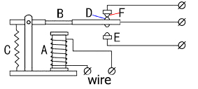

As long as a certain voltage is applied to both ends of the coil, a certain current will flow through the coil to generate electromagnetic effects, and the armature will attract the iron core against the pulling force of the return spring under the action of electromagnetic force attraction, thereby driving the moving contact and the static contact (normally open contact) to attract. When the coil is disconnected, the electromagnetic suction will also disappear, and the armature will return to the original position under the reaction force of the spring, releasing the moving contact and the original static contact (normally closed contact). This pulls in and releases, thus achieving the purpose of turning on and off in the circuit. The "normally open and closed" contacts of the relay can be distinguished in this way: the static contacts on disconnected state when the relay coil is powered off are called "normally open contacts"; the static contacts on connected state are called "normally closed contact". The module comes with 2 positioning holes for you to fix the module to other equipment.

**Specifications：**

Working voltage: 5V (DC)

Input signal: digital signal (high level 1, low level 0)

Contacts: static contacts (normally open contacts, normally closed contacts) and moving contacts

Rated current: 10A (NO) 5A (NC)

Maximum switching voltage: 150 V (AC) 24 V (DC)

Electric shock current: less than 3A

Contact action time: 10ms

**Experiment equipment：**

| PLUS control board\*1                                                                                                                             | Sensor shield\*1                                                                                  | USB cable\*1                                    |
|---------------------------------------------------------------------------------------------------------------------------------------------------|---------------------------------------------------------------------------------------------------|-------------------------------------------------|
|                                                                                                    |                                                   |  |
| Relay module\*1                                                                                                                                   | White LED\*1                                                                                      | 3pin F-F Dupont Line\*1                         |
|                                                                                                   |                                                   |  |
| Female to Female Dupont Lines\*2                                                                                                                  | Male to Female Dupont Line\*2                                                                     |                                                 |
|   |   |                                                 |

**Wiring Diagram：**

Note: On the shield, the G, V, and S pins of 1-channel relay module are connected to G, V, and 12 respectively. The NO is linked with V; the G, V, and S pins of white LED are respectively connected to G, V, and the static contact of NO on relay module.

**Test Code：**
Click “Sensor”→ “Control Output” → ，relay sensor is linked with digital 12, so set to pin 12 and maintain HIGH , then get block;

\*\*\*\*\*\*\*\*\*\*\*\*\*\*\*\*\*\*\*\*\*\*\*\*\*\*\*\*\*\*\*\*\*\*\*\*\*\*\*\*\*\*\*\*\*\*\*\*\*\*\*\*\*\*\*\*\*\*\*\*\*\*\*\*\*\*\*\*\*\*\*\*\*\*\*\*\*\*\*\*\*\*\*

Enter “Control” →，set to 500ms，then compile code according to following code.

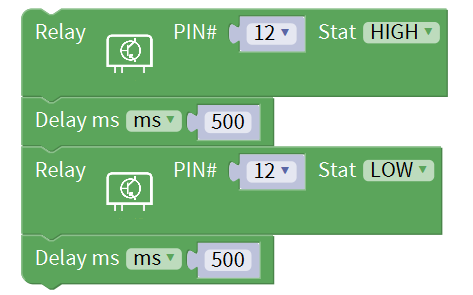

**Test Result：**

Wire up components, power up and upload test code. The relay is electrified(“NO”is on, NC is off) for 0.5s, white LED will be on; then disconnected for 0.5s (NC is on, NO is off), white LED will go off; alternately.

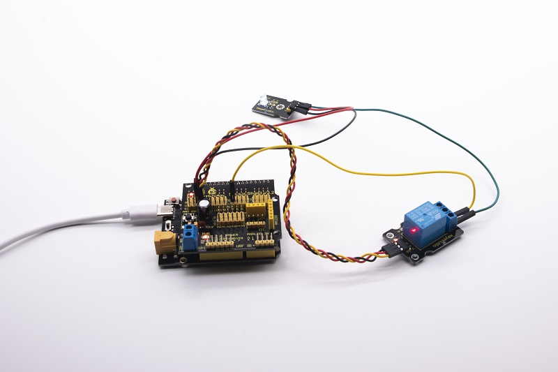

**Code Explanation：**

**Extension Practice：**

Finish the following program:

We link relay module with D11, relay is electrified for 1000ms(NO is on, NC is disconnected), LED lights on; then disconnected for 1000ms(NC is on, NO is off), LED goes off; alternately.

### Project 6：Photocell Sensor

**Description：**

The photocell sensor (photoresistor) is a resistor made by the photoelectric effect of a semiconductor. As highly sensitive to ambient light, its resistance value vary with different light intensity.

Its signal end is connected to the analog port of the microcontroller. When the light intensity increases, the resistance will decrease, but the analog value of the microcontroller won’t. On the contrary, when the light intensity decreases, the analog value of the microcontroller will go down.

Therefore, we can use the photoresistor sensor module to read the corresponding analog value and sense the light intensity in the environment.

It is commonly applied to light measurement, control and conversion, light control circuit as well.

**Experiment equipment：**

| PLUS control board\*1                           | Sensor shield\*1                                 | Photocell sensor\*1                              | Yellow LED module\*1                             | USB cable\*1                                    | 3pin F-F Dupont line\*2                         |
|-------------------------------------------------|--------------------------------------------------|--------------------------------------------------|--------------------------------------------------|-------------------------------------------------|-------------------------------------------------|
|  |  |  |  |  |  |

**Wiring Diagram：**

Note: On the expansion board, the G, V, and S pins of the photocell sensor module are connected to G, V, and A1; the G, V, and S pins of the yellow LED module are linked with G, V, and 5 separately.

**Test Code：(Note: you could set the range of analog value freely based on test result)**

Click “Control”→block，enter “Serialport” →;

Then +=.

\*\*\*\*\*\*\*\*\*\*\*\*\*\*\*\*\*\*\*\*\*\*\*\*\*\*\*\*\*\*\*\*\*\*\*\*\*\*\*\*\*\*\*\*\*\*\*\*\*\*\*\*\*\*\*\*\*\*\*\*\*\*\*\*\*\*\*\*\*\*\*\*\*\*\*\*\*\*\*\*\*\*\*

Click “serialport” → ，

\*\*\*\*\*\*\*\*\*\*\*\*\*\*\*\*\*\*\*\*\*\*\*\*\*\*\*\*\*\*\*\*\*\*\*\*\*\*\*\*\*\*\*\*\*\*\*\*\*\*\*\*\*\*\*\*\*\*\*\*\*\*\*\*\*\*\*\*\*\*\*\*\*\*\*\*\*\*\*\*\*\*\*

Click “Sensor” →“Analog Read” →, photocell sensor is connected to A1 of shield, so set to A1;

Then get block+ = ，

\*\*\*\*\*\*\*\*\*\*\*\*\*\*\*\*\*\*\*\*\*\*\*\*\*\*\*\*\*\*\*\*\*\*\*\*\*\*\*\*\*\*\*\*\*\*\*\*\*\*\*\*\*\*\*\*\*\*\*\*\*\*\*\*\*\*\*\*\*\*\*\*\*\*\*\*\*\*\*\*\*\*\*

dragblock and set to 500ms, then get the following block.

\*\*\*\*\*\*\*\*\*\*\*\*\*\*\*\*\*\*\*\*\*\*\*\*\*\*\*\*\*\*\*\*\*\*\*\*\*\*\*\*\*\*\*\*\*\*\*\*\*\*\*\*\*\*\*\*\*\*\*\*\*\*\*\*\*\*\*\*\*\*\*\*\*\*\*\*\*\*\*\*\*\*\*

Enter “control” →，click blue gear icon, appear edit box, moveblock into then get→block.

\*\*\*\*\*\*\*\*\*\*\*\*\*\*\*\*\*\*\*\*\*\*\*\*\*\*\*\*\*\*\*\*\*\*\*\*\*\*\*\*\*\*\*\*\*\*\*\*\*\*\*\*\*\*\*\*\*\*\*\*\*\*\*\*\*\*\*\*\*\*\*\*\*\*\*\*\*\*\*\*\*\*\*

Enter “Logic” →, Copy block and ，modify “=” into “≤”，0 into 600, once, next get block:

+++=.

\*\*\*\*\*\*\*\*\*\*\*\*\*\*\*\*\*\*\*\*\*\*\*\*\*\*\*\*\*\*\*\*\*\*\*\*\*\*\*\*\*\*\*\*\*\*\*\*\*\*\*\*\*\*\*\*\*\*\*\*\*\*\*\*\*\*\*\*\*\*\*\*\*\*\*\*\*\*\*\*\*\*\*

Enter“Control Output” →, LED is connected to digital 5, so set block ,

+=

\*\*\*\*\*\*\*\*\*\*\*\*\*\*\*\*\*\*\*\*\*\*\*\*\*\*\*\*\*\*\*\*\*\*\*\*\*\*\*\*\*\*\*\*\*\*\*\*\*\*\*\*\*\*\*\*\*\*\*\*\*\*\*\*\*\*\*\*\*\*\*\*\*\*\*\*\*\*\*\*\*\*\*

Add delay block，delay in 500ms, combine delay block with to get ;

\*\*\*\*\*\*\*\*\*\*\*\*\*\*\*\*\*\*\*\*\*\*\*\*\*\*\*\*\*\*\*\*\*\*\*\*\*\*\*\*\*\*\*\*\*\*\*\*\*\*\*\*\*\*\*\*\*\*\*\*\*\*\*\*\*\*\*\*\*\*\*\*\*\*\*\*\*\*\*\*\*\*\*

 Duplicate code stringonce and move it into “else” block，set to LOW. Refer to the following complete code.

**Test Result：**

Hook up components, upload code and power on, set baud rate to 9600.

When the value is equivalent to or less than 600, yellow LED will be on; conversely, LED will go off.

 

**Code Explanation：**

: output word/data on serial monitor，wrap word

: if condition 1 is met, then the result will be A....., otherwise, the result will be B....

: logic statement, the value is equivalent to or less than 600

**Extension Practice:**

The light intensity of photocell sensor is greater than 500, yellow LED will light on; conversely, LED will go off.

### Project 7：Adjusting Servo Angle

**Description：**

When we make this kit, we often control doors and windows with servos. In this course, we’ll introduce its principle and how to use servo motors.

Servo motor is a position control rotary actuator. It mainly consists of housing, circuit board, core-less motor, gear and position sensor. Its working principle is that the servo receives the signal sent by MCU or receiver and produces a reference signal with a period of 20ms and width of 1.5ms, then compares the acquired DC bias voltage to the voltage of the potentiometer and obtain the voltage difference output.

When the motor speed is constant, the potentiometer is driven to rotate through the cascade reduction gear, which leads that the voltage difference is 0, and the motor stops rotating. Generally, the angle range of servo rotation is 0° --180 °

The rotation angle of servo motor is controlled by regulating the duty cycle of PWM (Pulse-Width Modulation) signal. The standard cycle of PWM signal is 20ms (50Hz). Theoretically, the width is distributed between 1ms-2ms, but in fact, it's between 0.5ms-2.5ms. The width corresponds the rotation angle from 0° to 180°. But note that for different brand motor, the same signal may have different rotation angle.

One is to use a common digital sensor port of Arduino to produce square wave with different duty cycle to simulate PWM signal and use that signal to control the positioning of the motor.

Another way is to directly use the servo function of the Arduino to control the motor. In this way, the program will be easier to design, but it can only control two-channel motor because the servo function only uses digital pin 9 and 10.

However, you need to control more than one motor by external power as the drive capacity of micro:bit board is limited.

Note that don’t supply power through USB cable. There is possibility to damage the USB cable if the current demand is greater than 500MA. We recommend the external power.

**Specifications:**

Working voltage: DC 4.8V \~ 6V

Operating angle range: about 180 ° (at 500 → 2500 μsec)

Pulse width range: 500 → 2500 μsec

No-load speed: 0.12 ± 0.01 sec / 60 (DC 4.8V) 0.1 ± 0.01 sec / 60 (DC 6V)

No-load current: 200 ± 20mA (DC 4.8V) 220 ± 20mA (DC 6V)

Stopping torque: 1.3 ± 0.01kg · cm (DC 4.8V) 1.5 ± 0.1kg · cm (DC 6V)

Stop current: ≦ 850mA (DC 4.8V) ≦ 1000mA (DC 6V)

Standby current: 3 ± 1mA (DC 4.8V) 4 ± 1mA (DC 6V)

Lead length: 250 ± 5 mm

Appearance size: 22.9 \* 12.2 \* 30mm

Weight: 9 ± 1 g (without servo horn)

**Experiment equipment：**

| PLUS control board\*1                           | Sensor shield\*1                                 | Servo\*1                                        | USB cable\*1                                    |
|-------------------------------------------------|--------------------------------------------------|-------------------------------------------------|-------------------------------------------------|
|  |  |  |  |

**Wiring Diagram：**

Note: The servo is connected to G (GND), V (VCC), 9. The brown wire of the servo is connected to Gnd (G), the red wire is linked with 5v (V), and the orange wire is connected to digital pin 9.

**Test Code：**

Click "module" → “Drive_module”→，set to pin 9，delay in 500ms，

\*\*\*\*\*\*\*\*\*\*\*\*\*\*\*\*\*\*\*\*\*\*\*\*\*\*\*\*\*\*\*\*\*\*\*\*\*\*\*\*\*\*\*\*\*\*\*\*\*\*\*\*\*\*\*\*\*\*\*\*\*\*\*\*\*\*\*\*\*\*\*\*\*\*\*\*\*\*\*\*\*\*\*

Copy this code string twice，separately set to 90° and 180°, the whole coding string is shown below:

**Test Result：**

Upload code, dial DIP switch to right end and power on.

The servo swing forth and back in range of 0°\~90\~180°.

**Code Explanation：**

Set servo angle with library files, set signal end of servo to D9.

**Extension Practice:**

Set angle of servo, the servo swings in range of 0°\~45°\~90°\~135°\~180° alternately, delay in 500ms.

### Project 8：Fan Module

**Description**

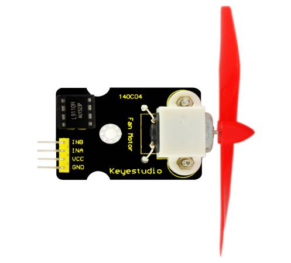

The L9110 fan module adopts L9110 motor control chip, it can control the rotation direction and speed of the motor. Moreover, this module is efficient and with high quality fan, which can put out the flame within 20cm distance. Similarly, it is an important part of fire robot as well.

**Specifications:**

1\. Working voltage: 5V

2\. Working current: 0.8A

3\. TTL / CMOS output level compatible,

4\. Control and drive integrate in IC

5\. Have pin high pressure protection function

6\. Working temperature: 0-80 °

**Experiment equipment：**

| PLUS control board\*1                           | Sensor shield\*1                                 | Fan module\*1                                    | USB cable\*1                                    | Female to Female Dupont lines\*4                |
|-------------------------------------------------|--------------------------------------------------|--------------------------------------------------|-------------------------------------------------|-------------------------------------------------|
|  |  |  |  |  |

**Wiring Diagram：**

Note: On the shield, the GND, VCC, INA, and INB pins of the fan module are respectively connected to G, V, 7, 6.

**Test Code：**

Turn clockwise and anticlockwise
Click "module" →“Drive_module” →，signal ends of fan module are linked with digital 7 and 6, so set to pin 7 and 6, stay HIGH unchanged. Upload program to test it.

\*\*\*\*\*\*\*\*\*\*\*\*\*\*\*\*\*\*\*\*\*\*\*\*\*\*\*\*\*\*\*\*\*\*\*\*\*\*\*\*\*\*\*\*\*\*\*\*\*\*\*\*\*\*\*\*\*\*\*\*\*\*\*\*\*\*\*\*\*\*\*\*\*\*\*\*\*\*\*\*\*\*\*

| INA（D7） | INB（D6） | Motor Fan |
|-----------|-----------|-----------|
| HIGH      | HIGH      | Not Turn  |

It turns out that fan doesn’t rotate.

\*\*\*\*\*\*\*\*\*\*\*\*\*\*\*\*\*\*\*\*\*\*\*\*\*\*\*\*\*\*\*\*\*\*\*\*\*\*\*\*\*\*\*\*\*\*\*\*\*\*\*\*\*\*\*\*\*\*\*\*\*\*\*\*\*\*\*\*\*\*\*\*\*\*\*\*\*\*\*\*\*\*\*

Then alter digital 7 into LOW, upload the code to see the change.

| INA（D7） | INB（D6） | Motor Fan           |
|-----------|-----------|---------------------|
| LOW       | HIGH      | Turn anticlockwise  |

Fan turns anticlockwise.

\*\*\*\*\*\*\*\*\*\*\*\*\*\*\*\*\*\*\*\*\*\*\*\*\*\*\*\*\*\*\*\*\*\*\*\*\*\*\*\*\*\*\*\*\*\*\*\*\*\*\*\*\*\*\*\*\*\*\*\*\*\*\*\*\*\*\*\*\*\*\*\*\*\*\*\*\*\*\*\*\*\*\*

Set D7 to HIGH, D6 to LOW, check out how fan rotates:

| INA（D7） | INB（D6） | Motor Fan       |
|-----------|-----------|-----------------|
| HIGH      | LOW       | Turn Clockwise  |

Fan turns clockwise.

\*\*\*\*\*\*\*\*\*\*\*\*\*\*\*\*\*\*\*\*\*\*\*\*\*\*\*\*\*\*\*\*\*\*\*\*\*\*\*\*\*\*\*\*\*\*\*\*\*\*\*\*\*\*\*\*\*\*\*\*\*\*\*\*\*\*\*\*\*\*\*\*\*\*\*\*\*\*\*\*\*\*\*

Set D7 and D6 to LOW

| INA（D7） | INB（D6） | Motor Fan |
|-----------|-----------|-----------|
| LOW       | LOW       | Not Turn  |

The fan doesn’t rotate.

B. Fan rotates anticlockwise for 3s, stops for 3s, in clockwise direction for 3s

Copy  block;

Addblock，delay in 3000ms；

Fan turns anticlockwise for 3s:

+=

\*\*\*\*\*\*\*\*\*\*\*\*\*\*\*\*\*\*\*\*\*\*\*\*\*\*\*\*\*\*\*\*\*\*\*\*\*\*\*\*\*\*\*\*\*\*\*\*\*\*\*\*\*\*\*\*\*\*\*\*\*\*\*\*\*\*\*\*\*\*\*\*\*\*\*\*\*\*\*\*\*\*\*

Duplicatetwice，

Next to make fan stop for 1s, so set block:

\*\*\*\*\*\*\*\*\*\*\*\*\*\*\*\*\*\*\*\*\*\*\*\*\*\*\*\*\*\*\*\*\*\*\*\*\*\*\*\*\*\*\*\*\*\*\*\*\*\*\*\*\*\*\*\*\*\*\*\*\*\*\*\*\*\*\*\*\*\*\*\*\*\*\*\*\*\*\*\*\*\*\*

And make fan turn clockwise:

The entire code:

\*\*\*\*\*\*\*\*\*\*\*\*\*\*\*\*\*\*\*\*\*\*\*\*\*\*\*\*\*\*\*\*\*\*\*\*\*\*\*\*\*\*\*\*\*\*\*\*\*\*\*\*\*\*\*\*\*\*\*\*\*\*\*\*\*\*\*\*\*\*\*\*\*\*\*\*\*\*\*\*\*\*\*

Regulate speed

Fan rotates so rapidly, is there a way to make it slow?

PWM ports can output and alter high and low level steadily in certain time, which can adjust speed of motor. The signal end of fan is linked with digital 7 and 6, digital 6 is PWM port.

\*\*\*\*\*\*\*\*\*\*\*\*\*\*\*\*\*\*\*\*\*\*\*\*\*\*\*\*\*\*\*\*\*\*\*\*\*\*\*\*\*\*\*\*\*\*\*\*\*\*\*\*\*\*\*\*\*\*\*\*\*\*\*\*\*\*\*\*\*\*\*\*\*\*\*\*\*\*\*\*\*\*\*

Click "module"→“Drive_module” →，set pin 7 and 6, when fan rotates anticlockwise, INA outputs LOW, assign the PWMB value as 150, add delay block, set to 3000ms, then fan will turn slowly.

+=.

\*\*\*\*\*\*\*\*\*\*\*\*\*\*\*\*\*\*\*\*\*\*\*\*\*\*\*\*\*\*\*\*\*\*\*\*\*\*\*\*\*\*\*\*\*\*\*\*\*\*\*\*\*\*\*\*\*\*\*\*\*\*\*\*\*\*\*\*\*\*\*\*\*\*\*\*\*\*\*\*\*\*\*

Duplicatetwice，when not turning, we set block :

\*\*\*\*\*\*\*\*\*\*\*\*\*\*\*\*\*\*\*\*\*\*\*\*\*\*\*\*\*\*\*\*\*\*\*\*\*\*\*\*\*\*\*\*\*\*\*\*\*\*\*\*\*\*\*\*\*\*\*\*\*\*\*\*\*\*\*\*\*\*\*\*\*\*\*\*\*\*\*\*\*\*\*

When turning clockwise, we set block: and fan will rotate slowly. Upload program code and see the result.

**Test Result：**

Upload test code, wire up components according to connection diagram. The DIP switch is dialed to right side and power on. The fan rotates counterclockwise for 3000ms, stops for 1000ms, then rotates clockwise for 3000ms.

**Code Explanation：**

:

fan rotates anticlockwise at the fastest speed, blow outward.

: fan rotates clockwise at the fastest speed, blow inward.

\*\*\*\*\*\*\*\*\*\*\*\*\*\*\*\*\*\*\*\*\*\*\*\*\*\*\*\*\*\*\*\*\*\*\*\*\*\*\*\*\*\*\*\*\*\*\*\*\*\*\*\*\*\*\*\*\*\*\*\*\*\*\*\*\*\*\*\*\*\*\*\*\*\*\*\*\*\*\*\*\*\*\*

: fan turns slowly, and rotates anticlockwise at the speed of PWMB 150, blow outward

\*\*\*\*\*\*\*\*\*\*\*\*\*\*\*\*\*\*\*\*\*\*\*\*\*\*\*\*\*\*\*\*\*\*\*\*\*\*\*\*\*\*\*\*\*\*\*\*\*\*\*\*\*\*\*\*\*\*\*\*\*\*\*\*\*\*\*\*\*\*\*\*\*\*\*\*\*\*\*\*\*\*\*

: fan turns slowly, and rotates clockwise at the speed of PWMB 150, blow inward.

**Extension Practice:**

Fan will rotate clockwise for 2500ms, stop for 1000ms and turn anticlockwise for 2500ms, stop for 1000ms, and rotate clockwise at the speed of PWM100.

### Project 9：Steam Sensor

**Description：**

This is a commonly used steam sensor. Its principle is to detect the amount of water by bare printed parallel lines on the circuit board. The more the water content is, the more wires will be connected. As the conductive contact coverage increases, the output voltage will gradually rise. It can detect water vapor in the air as well. The steam sensor can be used as a rain water detector and level switch. When the humidity on the sensor surface surges, the output voltage will increase.

The sensor is compatible with various microcontroller control boards, such as Arduino series microcontrollers. When using it, we provide the guide to operate steam sensor and Arduino control board.

First, connect the sensor to the analog port of the microcontroller, and display the corresponding analog value on the serial monitor.

Note: the connection part is not waterproof, therefore, don’t immerse it in the water please.

**Specifications:**

Working voltage: DC 3.3-5V

Working current: \<20mA

Operating temperature range: -10 ℃ ～ ＋ 70 ℃;

Control signal: analog signal output

Interface: 3pin interface with 2.54mm in pitch

**Experiment equipment：**

| PLUS control board\*1                           | Sensor shield\*1                                 | Steam sensor\*1                                 | USB  cable\*1                                   | 3pinF-F Dupont  line\*1                         |
|-------------------------------------------------|--------------------------------------------------|-------------------------------------------------|-------------------------------------------------|-------------------------------------------------|
|  |  |  |  |  |

**Wiring Diagram：**

Note: On the sensor shield, the pins G，V and S of steam sensor are connected to G, V and A3

**Test Code：(Note: you could set the range of analog value freely based on test result)**

Initialize firstly，click “Control” → ，

\*\*\*\*\*\*\*\*\*\*\*\*\*\*\*\*\*\*\*\*\*\*\*\*\*\*\*\*\*\*\*\*\*\*\*\*\*\*\*\*\*\*\*\*\*\*\*\*\*\*\*\*\*\*\*\*\*\*\*\*\*\*\*\*\*\*\*\*\*\*\*\*\*\*\*\*\*\*\*\*\*\*\*

Enter ”serialport” → ；

+=.

\*\*\*\*\*\*\*\*\*\*\*\*\*\*\*\*\*\*\*\*\*\*\*\*\*\*\*\*\*\*\*\*\*\*\*\*\*\*\*\*\*\*\*\*\*\*\*\*\*\*\*\*\*\*\*\*\*\*\*\*\*\*\*\*\*\*\*\*\*\*\*\*\*\*\*\*\*\*\*\*\*\*\*

To read the signal detected by steam sensor, enter “serialport” →;

Click “sensor” → “Analog Read” →, steam sensor is connected to A3 of shield, therefore, set to A3;

Then+=;

\*\*\*\*\*\*\*\*\*\*\*\*\*\*\*\*\*\*\*\*\*\*\*\*\*\*\*\*\*\*\*\*\*\*\*\*\*\*\*\*\*\*\*\*\*\*\*\*\*\*\*\*\*\*\*\*\*\*\*\*\*\*\*\*\*\*\*\*\*\*\*\*\*\*\*\*\*\*\*\*\*\*\*

To prevent numbers from updating rapidly，addblock，set to 500ms, check out the entire code:

The higher the humidity, the larger the value on serial monitor; on the contrary, the lower the humidity, the smaller the value.

\*\*\*\*\*\*\*\*\*\*\*\*\*\*\*\*\*\*\*\*\*\*\*\*\*\*\*\*\*\*\*\*\*\*\*\*\*\*\*\*\*\*\*\*\*\*\*\*\*\*\*\*\*\*\*\*\*\*\*\*\*\*\*\*\*\*\*\*\*\*\*\*\*\*\*\*\*\*\*\*\*\*\*

**Test Result：**

Upload code, wire up components, and drop water on steam sensor.

At the beginning, the analog value is getting larger. If you wipe out the water on steam sensor, the analog value will reduce

**Code Explanation**

： Set baud rate to 9600

: Output word/data on serial monitor, word wrap.

### Project 10：PIR Motion Sensor

**Description：**

The Pyroelectric infrared motion sensor can detect infrared signals from moving objects, and output switching signals. Applied to a variety of occasions, it can detect movement of human body.

Conventional pyroelectric infrared sensors are much more bigger, with complex circuit and lower reliability. Yet, this new pyroelectric infrared motion sensor, is more practical. It integrates a digital pyroelectric infrared sensor and connecting pins. It features higher sensibility and reliability, lower power consumption, light weight, small size, lower voltage working mode and simpler peripheral circuit.

**Specifications:：**

Input voltage: DC 3.3V \~ 18V

Working current: 15uA

Working temperature: -20 \~ 85 degrees Celsius

Output voltage: high 3 V, low 0 V

Output delay time (high level): about 2.3 to 3 seconds

Detection angle: about 100 °

Detection distance: 3-4 meters

Output indicator LED (high-level )

Pin limit current: 100mA

Note：

1\. The maximum distance is 3-4 meters during testing.

2\. In the test, open the white lens to check rectangular sensing part. When the long line of the sensing part is parallel to the ground, the distance is the best.

3\. In the test, covering the sensor with white lens can sense the distance precisely.

4\. The distance is best at 25℃, and the detection distance value will reduce when temperature exceeds 30℃.

5\. After powering up and uploading the code, you can start testing after 5-10 seconds, otherwise the sensor is not sensitive.

**Experiment equipment：**

| PLUS control board\*1                            | Sensor  shield\*1                                | PIR motion sensor\*1                             | F-F Dupont lines\*4                             |
|--------------------------------------------------|--------------------------------------------------|--------------------------------------------------|-------------------------------------------------|
|   |  |  |  |
| Fan module\*1                                    | White LED module\*1                              | USB cable\*1                                     | 3pinF-F Dupont  line\*2                         |
|  |  |   |  |

**Wiring Diagram：**

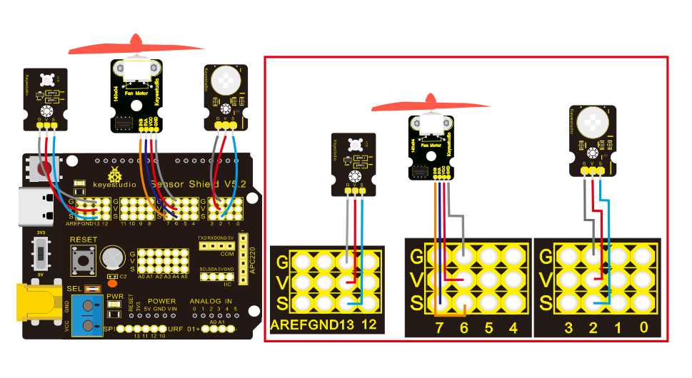

Note: On the shield, the G, V and S of PIR motion sensor are connected to G, V and 2; the GND, VCC, INA and INB of fan module are separately linked with G,V,7,6. The pin G, V and S of LED module are linked with G, V and 13.

**Test Code：**

Initialize firstly，Click “Control” →;

\*\*\*\*\*\*\*\*\*\*\*\*\*\*\*\*\*\*\*\*\*\*\*\*\*\*\*\*\*\*\*\*\*\*\*\*\*\*\*\*\*\*\*\*\*\*\*\*\*\*\*\*\*\*\*\*\*\*\*\*\*\*\*\*\*\*\*\*\*\*\*\*\*\*\*\*\*\*\*\*\*\*\*

Enter “Serialport” → ,

Then we get the block:

+=

To read the signal detected by PIR motion sensor, click “Serialport” →.

\*\*\*\*\*\*\*\*\*\*\*\*\*\*\*\*\*\*\*\*\*\*\*\*\*\*\*\*\*\*\*\*\*\*\*\*\*\*\*\*\*\*\*\*\*\*\*\*\*\*\*\*\*\*\*\*\*\*\*\*\*\*\*\*\*\*\*\*\*\*\*\*\*\*\*\*\*\*\*\*\*\*\*

Click “Sensor” → “Digital Read” → , PIR motion sensor is linked with digital 2, so set to pin 2.

\*\*\*\*\*\*\*\*\*\*\*\*\*\*\*\*\*\*\*\*\*\*\*\*\*\*\*\*\*\*\*\*\*\*\*\*\*\*\*\*\*\*\*\*\*\*\*\*\*\*\*\*\*\*\*\*\*\*\*\*\*\*\*\*\*\*\*\*\*\*\*\*\*\*\*\*\*\*\*\*\*\*\*

Next to get block:

+=

\*\*\*\*\*\*\*\*\*\*\*\*\*\*\*\*\*\*\*\*\*\*\*\*\*\*\*\*\*\*\*\*\*\*\*\*\*\*\*\*\*\*\*\*\*\*\*\*\*\*\*\*\*\*\*\*\*\*\*\*\*\*\*\*\*\*\*\*\*\*\*\*\*\*\*\*\*\*\*\*\*\*\*

Addblock, set to 500ms.

\*\*\*\*\*\*\*\*\*\*\*\*\*\*\*\*\*\*\*\*\*\*\*\*\*\*\*\*\*\*\*\*\*\*\*\*\*\*\*\*\*\*\*\*\*\*\*\*\*\*\*\*\*\*\*\*\*\*\*\*\*\*\*\*\*\*\*\*\*\*\*\*\*\*\*\*\*\*\*\*\*\*\*

Then judge if there is person close，enter “control” →，click blue gear icon, appear edit box, moveblock into then get→block.

\*\*\*\*\*\*\*\*\*\*\*\*\*\*\*\*\*\*\*\*\*\*\*\*\*\*\*\*\*\*\*\*\*\*\*\*\*\*\*\*\*\*\*\*\*\*\*\*\*\*\*\*\*\*\*\*\*\*\*\*\*\*\*\*\*\*\*\*\*\*\*\*\*\*\*\*\*\*\*\*\*\*\*

Click “Logic” → ，Duplicate once, select  from “math”, modify it into 1.

\*\*\*\*\*\*\*\*\*\*\*\*\*\*\*\*\*\*\*\*\*\*\*\*\*\*\*\*\*\*\*\*\*\*\*\*\*\*\*\*\*\*\*\*\*\*\*\*\*\*\*\*\*\*\*\*\*\*\*\*\*\*\*\*\*\*\*\*\*\*\*\*\*\*\*\*\*\*\*\*\*\*\*

+++=;

\*\*\*\*\*\*\*\*\*\*\*\*\*\*\*\*\*\*\*\*\*\*\*\*\*\*\*\*\*\*\*\*\*\*\*\*\*\*\*\*\*\*\*\*\*\*\*\*\*\*\*\*\*\*\*\*\*\*\*\*\*\*\*\*\*\*\*\*\*\*\*\*\*\*\*\*\*\*\*\*\*\*\*

Click “Control Output” →，set to pin 13.

\*\*\*\*\*\*\*\*\*\*\*\*\*\*\*\*\*\*\*\*\*\*\*\*\*\*\*\*\*\*\*\*\*\*\*\*\*\*\*\*\*\*\*\*\*\*\*\*\*\*\*\*\*\*\*\*\*\*\*\*\*\*\*\*\*\*\*\*\*\*\*\*\*\*\*\*\*\*\*\*\*\*\*

Enter "module" →”Drive_module” →.

\*\*\*\*\*\*\*\*\*\*\*\*\*\*\*\*\*\*\*\*\*\*\*\*\*\*\*\*\*\*\*\*\*\*\*\*\*\*\*\*\*\*\*\*\*\*\*\*\*\*\*\*\*\*\*\*\*\*\*\*\*\*\*\*\*\*\*\*\*\*\*\*\*\*\*\*\*\*\*\*\*\*\*

Set pin to 7 and 6, INA to HIGH and PWMB to 150:

++=

\*\*\*\*\*\*\*\*\*\*\*\*\*\*\*\*\*\*\*\*\*\*\*\*\*\*\*\*\*\*\*\*\*\*\*\*\*\*\*\*\*\*\*\*\*\*\*\*\*\*\*\*\*\*\*\*\*\*\*\*\*\*\*\*\*\*\*\*\*\*\*\*\*\*\*\*\*\*\*\*\*\*\*

Copyonce, move it to else block, set to LOW, assign the value of 0. Okay, check the whole code string. 

**Test Result：**

Upload the above test code, open serial monitor, and set baud rate to 9600. If PIR motion sensor detects someone nearby, the serial monitor will display “1” , and LED and D13 will be turned on as well, and fan will rotate. If nobody is around, the serial monitor will show “0”, indicators will be off and fan will stop rotating.

****

**Code Explanation:**

: Read the signals 1 and 0 of PIR motion sensor.

: Read the digital signal of D2 is 1.

set baud rate to 9600,digital signals are displayed on serial monitor, set to word wrap.

: if condition 1 is met, then the result will be A....., otherwise, the result will be B....

**Extension Practice：**

In certain distance, when there is person around, LED flashes and fan turns anticlockwise at the speed of PWMB200; however, if nobody, LED is off and fan rotates clockwise at the speed of PWMB150

### Project 11：Analog Gas Sensor

**Description：**

This gas sensor is used for household gas leak alarms, industrial combustible gas alarms and portable gas detection instruments. Also, it is suitable for the detection of liquefied gas, benzene, alkane, alcohol, hydrogen, etc.,

The MQ-2 smoke sensor can be accurately a multi-gas detector, with the advantages of high sensitivity, fast response, good stability, long life, and simple drive circuit.

It can detect the concentration of flammable gas and smoke in the range of 300\~10000ppm. Meanwhile, it has high sensitivity to natural gas, liquefied petroleum gas and other smoke, especially to alkanes smoke.

It must be heated for a period of time before using the smoke sensor, otherwise the output resistance and voltage are not accurate. However, the heating voltage should not be too high, otherwise it will cause internal signal line to blow.

It belongs to the tin dioxide semiconductor gas-sensitive material. At a certain temperature, tin dioxide adsorbs oxygen in the air and forms negative ion adsorption of oxygen, reducing the electron density in the semiconductor, thereby increasing its resistance value.

When in contact with flammable gas in the air and smog, and the potential barrier at the grain boundary is adjusted by the smog, it will cause the surface conductivity to change. With this, information about the presence of smoke or flammable gas can be obtained. The greater the concentration of smoke or flammable gas in the air, the greater the conductivity, and the lower the output resistance, the larger the analog signal output. In addition, the sensitivity can be adjusted by rotating the potentiometer.

**Specifications:**

Working voltage: 3.3-5V (DC)

Interface: 4 pins (VCC, GND, D0, A0)

Output signal: digital signal and analog signal

Weight: 7.5g

**Experiment equipment：**

| PLUS control  board\*1                           | Sensor shield\*1                                 | MQ-2 gas sensor\*1                              | Fan module\*1                                    | Yellow LED module\*1                             |
|--------------------------------------------------|--------------------------------------------------|-------------------------------------------------|--------------------------------------------------|--------------------------------------------------|
|   |  |  |  |  |
| Passive buzzer\*1                                | USB cable\*1                                     | F-F Dupint line\*8                              | 3pinF-F Dupint line\*2                           |                                                  |
|  |   |  |   |                                                  |

**Wiring Diagram：**

Note: On the shield, the pin GND, VCC, D0 and A0 of gas sensor are linked with pin G, V and A0. The pin G,V and S of passive buzzer are connected to G,V and 3.

**Test Code：(Note: you could set the range of analog value freely based on test result)**

Analog output 0\~5V voltage; the higher the concentration, the higher the voltage.

300-10000ppm (0-5V) corresponds to 0-1023. So there is a proportional relationship. The analog signal 0 corresponds 300ppm; and analog signal 1023 corresponds 10000ppm.

Using the formula , calculate the concentration of combustible gas or smoke in the air.

（refers to the analog signal value when the smoke sensor detects flammable gas or smoke; refers to the analog signal value in the initial state; W refers to the concentration）

If the analog signal is 40 at the beginning, there is a flammable gas in the air, and the analog signal is 515. Thus, the concentration of the air flammable gas is 4799.5 ppm ().

Design the code that MQ-2 gas sensor detects flammable gas and outputs the analog signal.

Click “Control” →, enter “Serialport” → ,

Then we get the block:

+=.

\*\*\*\*\*\*\*\*\*\*\*\*\*\*\*\*\*\*\*\*\*\*\*\*\*\*\*\*\*\*\*\*\*\*\*\*\*\*\*\*\*\*\*\*\*\*\*\*\*\*\*\*\*\*\*\*\*\*\*\*\*\*\*\*\*\*\*\*\*\*\*\*\*\*\*\*\*\*\*\*\*\*\*

Enter “Serialport” → , click “sensor”→“Analog Read” →;

+=.

This block is used to detect and display the concentration value of combustible gas

\*\*\*\*\*\*\*\*\*\*\*\*\*\*\*\*\*\*\*\*\*\*\*\*\*\*\*\*\*\*\*\*\*\*\*\*\*\*\*\*\*\*\*\*\*\*\*\*\*\*\*\*\*\*\*\*\*\*\*\*\*\*\*\*\*\*\*\*\*\*\*\*\*\*\*\*\*\*\*\*\*\*\*

Addblock，delay in 500ms. Upload the program and open serial monitor, point fire lighter at analog gas (MQ-2）sensor to test.

\*\*\*\*\*\*\*\*\*\*\*\*\*\*\*\*\*\*\*\*\*\*\*\*\*\*\*\*\*\*\*\*\*\*\*\*\*\*\*\*\*\*\*\*\*\*\*\*\*\*\*\*\*\*\*\*\*\*\*\*\*\*\*\*\*\*\*\*\*\*\*\*\*\*\*\*\*\*\*\*\*\*\*

Open serial monitor, the analog value is less than 45. Point fire lighter at gas sensor, the analog value is getting larger. Power on, adjust potentiometer of gas sensor to make LED1 at the critical point between off and on and sensitivity is highest.

Note: the range of analog value is 0\~1023, however, the detected range is 300-10000ppm. If the smoke per cubic meter of air is less than 300 cubic centimeters, the value can’t be detected.

Next to make code that MQ-2 gas sensor controls passive sensor:

If the analog data of A0 is greater than 45, the passive buzzer will emit sound. We could use block to express this statement.

Enter “control” →，click blue gear icon, appear edit box, moveblock into then get→block，

The content behind “ if” is to set assuming condition, such as “if the analog data of A0 is greater than 45 and signal of digital 11 is 0”.

\*\*\*\*\*\*\*\*\*\*\*\*\*\*\*\*\*\*\*\*\*\*\*\*\*\*\*\*\*\*\*\*\*\*\*\*\*\*\*\*\*\*\*\*\*\*\*\*\*\*\*\*\*\*\*\*\*\*\*\*\*\*\*\*\*\*\*\*\*\*\*\*\*\*\*\*\*\*\*\*\*\*\*

Let’s complete the code that analog data is greater 45. Enter ”Logic” →，modify “=” into “\>”;

Click “analog sensor” →, move out the  from “math”, alter 0 into 45.

\*\*\*\*\*\*\*\*\*\*\*\*\*\*\*\*\*\*\*\*\*\*\*\*\*\*\*\*\*\*\*\*\*\*\*\*\*\*\*\*\*\*\*\*\*\*\*\*\*\*\*\*\*\*\*\*\*\*\*\*\*\*\*\*\*\*\*\*\*\*\*\*\*\*\*\*\*\*\*\*\*\*\*

The we get block:

++=; the analog value can be set freely.

\*\*\*\*\*\*\*\*\*\*\*\*\*\*\*\*\*\*\*\*\*\*\*\*\*\*\*\*\*\*\*\*\*\*\*\*\*\*\*\*\*\*\*\*\*\*\*\*\*\*\*\*\*\*\*\*\*\*\*\*\*\*\*\*\*\*\*\*\*\*\*\*\*\*\*\*\*\*\*\*\*\*\*

Click“Control Output”→， set to pin3. Enter"module" →“Drive_module” →，set to pin 7 and 6; in order to stop fan from turning rapidly, set INA to LOW and PWMB to 200. Get block:.

\*\*\*\*\*\*\*\*\*\*\*\*\*\*\*\*\*\*\*\*\*\*\*\*\*\*\*\*\*\*\*\*\*\*\*\*\*\*\*\*\*\*\*\*\*\*\*\*\*\*\*\*\*\*\*\*\*\*\*\*\*\*\*\*\*\*\*\*\*\*\*\*\*\*\*\*\*\*\*\*\*\*\*

Enter“Control Output”→， set to pin 5, remain HIGH unchanged. Add block, set to 200ms，then we get code string:;

\*\*\*\*\*\*\*\*\*\*\*\*\*\*\*\*\*\*\*\*\*\*\*\*\*\*\*\*\*\*\*\*\*\*\*\*\*\*\*\*\*\*\*\*\*\*\*\*\*\*\*\*\*\*\*\*\*\*\*\*\*\*\*\*\*\*\*\*\*\*\*\*\*\*\*\*\*\*\*\*\*\*\*

Replicate blockonce, set to LOW.

\*\*\*\*\*\*\*\*\*\*\*\*\*\*\*\*\*\*\*\*\*\*\*\*\*\*\*\*\*\*\*\*\*\*\*\*\*\*\*\*\*\*\*\*\*\*\*\*\*\*\*\*\*\*\*\*\*\*\*\*\*\*\*\*\*\*\*\*\*\*\*\*\*\*\*\*\*\*\*\*\*\*\*

Else means that when analog value of gas sensor is less than 45, passive won’t emit sound. Click“Control Output”→， set to pin 3; copy ，set to LOW, duplicate set PWMB to 0. Upload code to see the result:

**Test Result：**

Wire up, burn test code and power up. When there is combustible gas, the passive buzzer will alarm, fan will rotate and LED will flash; however, if no flammable gas is around, they won’t work.

**Code Explanation:**

，read the analog data of digital A0 of MQ-2 gas sensor.
: set baud rate to 9600.
: Detect and display the analog data on serial monitor and set word wrap.

**Extension Practice：**

The analog value of flammable gas or smoke is greater than 40, passive buzzer will emit sound with tone of NOTE_A4 and 1/4 beat, yellow LED will blink. Otherwise, yellow LED and passive buzzer won’t work, fan will rotate clockwise at the speed of PWMB 150

### Project 12: 1602 LCD Display

**Description：**

This is a display module, with I2C communication module, can show 2 lines with 16 characters per line.

It shows blue background and white word and is attached to I2C interface of MCU. On the back of LCD display is a blue potentiometer for adjusting the backlight. The communication default address is 0x27.

The original 1602 LCD can run with 7 IO ports, but ours is built with ARDUINOIIC/I2C interface, saving 5 IO ports. Alternatively, the module comes with 4 positioning holes with a diameter of 3mm, which is convenient for you to fix on other devices.

Notice that when the screen gets brighter or darker, the characters will become more visible or less visible.

**Specifications:**

I2C address: 0x27

Backlight (blue, white)

Power supply voltage: 5V

Adjustable contrast

GND: A pin that connects to ground

VCC: A pin that connects to a +5V power supply

SDA: A pin that connects to analog port A4 for IIC communication

SCL: A pin that connects to analog port A5 for IIC communication

**Experiment equipment:**

| PLUS control board\*1                           | Sensor shield\*1                                 | 1602 LCD Display\*1                              | USB cable\*1                                    | 4pinF-F Dupont  line\*1                         |
|-------------------------------------------------|--------------------------------------------------|--------------------------------------------------|-------------------------------------------------|-------------------------------------------------|
|  |  |  |  |  |

**Wiring Diagram：**

Note: there are pin GND, VCC, SDA and SCL on 1602LCD module. GND is linked with GND（-）of IIC communication, VCC is connected to 5V（+）, SDA to SDA,

SCL to SCL.

**Test Code:**

Code 1：1602 LCD displays “Hello World！

Click “Control” →;

\*\*\*\*\*\*\*\*\*\*\*\*\*\*\*\*\*\*\*\*\*\*\*\*\*\*\*\*\*\*\*\*\*\*\*\*\*\*\*\*\*\*\*\*\*\*\*\*\*\*\*\*\*\*\*\*\*\*\*\*\*\*\*\*\*\*\*\*\*\*\*\*\*\*\*\*\*\*\*\*\*\*\*

Enter "module" →“Display_module” →;

Then we get block:

+=;

\*\*\*\*\*\*\*\*\*\*\*\*\*\*\*\*\*\*\*\*\*\*\*\*\*\*\*\*\*\*\*\*\*\*\*\*\*\*\*\*\*\*\*\*\*\*\*\*\*\*\*\*\*\*\*\*\*\*\*\*\*\*\*\*\*\*\*\*\*\*\*\*\*\*\*\*\*\*\*\*\*\*\*

Then enter “Display_module” →, click drop down triangle to select “clear”: , clear the previous content on 1602 LCD.

+=

\*\*\*\*\*\*\*\*\*\*\*\*\*\*\*\*\*\*\*\*\*\*\*\*\*\*\*\*\*\*\*\*\*\*\*\*\*\*\*\*\*\*\*\*\*\*\*\*\*\*\*\*\*\*\*\*\*\*\*\*\*\*\*\*\*\*\*\*\*\*\*\*\*\*\*\*\*\*\*\*\*\*\*

Enter“Display_module” →，

The content you fill in must be letters, numbers, symbols and spaces.

For instance, delete“Hello World”and fill in“line1”and“lin2”.

\*\*\*\*\*\*\*\*\*\*\*\*\*\*\*\*\*\*\*\*\*\*\*\*\*\*\*\*\*\*\*\*\*\*\*\*\*\*\*\*\*\*\*\*\*\*\*\*\*\*\*\*\*\*\*\*\*\*\*\*\*\*\*\*\*\*\*\*\*\*\*\*\*\*\*\*\*\*\*\*\*\*\*

Copyagain. Enter“Control”→，set to 300ms, upload code to see the result.

“Hello World”is displayed on line 1 of 1602 LCD and rolls leftward

\*\*\*\*\*\*\*\*\*\*\*\*\*\*\*\*\*\*\*\*\*\*\*\*\*\*\*\*\*\*\*\*\*\*\*\*\*\*\*\*\*\*\*\*\*\*\*\*\*\*\*\*\*\*\*\*\*\*\*\*\*\*\*\*\*\*\*\*\*\*\*\*\*\*\*\*\*\*\*\*\*\*\*

Code 2：”Hello” is displayed at row 1 and column 3, “AB” is shown at row2 and column 1; “12345” appears at row 2, column 4

We make 1602 LCD display “Hello World！”, then we copy the code string of code 1:

\*\*\*\*\*\*\*\*\*\*\*\*\*\*\*\*\*\*\*\*\*\*\*\*\*\*\*\*\*\*\*\*\*\*\*\*\*\*\*\*\*\*\*\*\*\*\*\*\*\*\*\*\*\*\*\*\*\*\*\*\*\*\*\*\*\*\*\*\*\*\*\*\*\*\*\*\*\*\*\*\*\*\*

Duplicate once, then enter “Display_module” →，set to row 1, column 3, print “Hello”, then get , addblock.

\*\*\*\*\*\*\*\*\*\*\*\*\*\*\*\*\*\*\*\*\*\*\*\*\*\*\*\*\*\*\*\*\*\*\*\*\*\*\*\*\*\*\*\*\*\*\*\*\*\*\*\*\*\*\*\*\*\*\*\*\*\*\*\*\*\*\*\*\*\*\*\*\*\*\*\*\*\*\*\*\*\*\*

Then get code string:

++=.

\*\*\*\*\*\*\*\*\*\*\*\*\*\*\*\*\*\*\*\*\*\*\*\*\*\*\*\*\*\*\*\*\*\*\*\*\*\*\*\*\*\*\*\*\*\*\*\*\*\*\*\*\*\*\*\*\*\*\*\*\*\*\*\*\*\*\*\*\*\*\*\*\*\*\*\*\*\*\*\*\*\*\*

Copy twice，then separately set to row 1, column 3, print “AB”; and set to row 2, column 4, print “12345”, refer to the following code string.

**Test Result：**

Upload Test Code1 and power on, “Hello World” is displayed at row 1 on 1602 LCD, and rolls leftward. Upload Test Code2，1602 LCD displays “Hello”, "AB" and “12345”.

Note: Wire according to connection diagram, upload the code and after power on, when no characters shown, you can adjust the potentiometer behind the 1602LCD and backlight to make the 1602LCD display the corresponding character string.

**Code Explanation：**

: initialize1602 LCD，SCL and SDA of 1602 LCD are linked with SCL and SDA of Arduino board or shield or A4 and A5 of analog port.

\*\*\*\*\*\*\*\*\*\*\*\*\*\*\*\*\*\*\*\*\*\*\*\*\*\*\*\*\*\*\*\*\*\*\*\*\*\*\*\*\*\*\*\*\*\*\*\*\*\*\*\*\*\*\*\*\*\*\*\*\*\*\*\*\*\*\*\*\*\*\*\*\*\*\*\*\*\*\*\*\*\*\*

clear the previous content on 1602LCD, click drop-down triangle to get a series of options.

: “Hello World!” is displayed at row 1and column 1, you could set row 1 and column 2. However, you can’t set in which columns the displayed content is. This displayed content is default at column 1.

\*\*\*\*\*\*\*\*\*\*\*\*\*\*\*\*\*\*\*\*\*\*\*\*\*\*\*\*\*\*\*\*\*\*\*\*\*\*\*\*\*\*\*\*\*\*\*\*\*\*\*\*\*\*\*\*\*\*\*\*\*\*\*\*\*\*\*\*\*\*\*\*\*\*\*\*\*\*\*\*\*\*\*

: use library files and make the shown data of 1602 LCD roll leftward. There is another corresponding block ，it can make displayed data roll rightward.

\*\*\*\*\*\*\*\*\*\*\*\*\*\*\*\*\*\*\*\*\*\*\*\*\*\*\*\*\*\*\*\*\*\*\*\*\*\*\*\*\*\*\*\*\*\*\*\*\*\*\*\*\*\*\*\*\*\*\*\*\*\*\*\*\*\*\*\*\*\*\*\*\*\*\*\*\*\*\*\*\*\*\*

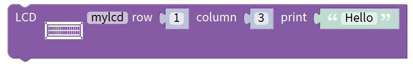: “Hello” starts showing at row 1 and column 3, you could display character at different rows and columns. when set row 0 and column 0, ”Hello” appears at row 2 and column 1 on the display; its function is to show the location of character.

Note: Wire up, upload code and power on. When no character displayed, we recommend you to adjust the potentiometer at the back and backlight to make character string appear.

\*\*\*\*\*\*\*\*\*\*\*\*\*\*\*\*\*\*\*\*\*\*\*\*\*\*\*\*\*\*\*\*\*\*\*\*\*\*\*\*\*\*\*\*\*\*\*\*\*\*\*\*\*\*\*\*\*\*\*\*\*\*\*\*\*\*\*\*\*\*\*\*\*\*\*\*\*\*\*\*\*\*\*

### Project 13：Soil Humidity Sensor

**Description：**

This is a sensor to detect the soil humidity.

If the soil is lack of water, the analog value output by the sensor will decrease; otherwise, the value will increase. It can be applied to prevent your household plants from being destitute of water.

The soil humidity sensor module is not as complicated as you think. It has two probes. When inserted into the soil,it will get resistance value by reading the current changes between the two probes and converting resistance value into moisture content. The higher the moisture (less resistance), the higher the conductivity.

Meanwhile, it comes with 2 positioning holes for installing on other devices.

**Specification:**

Power Supply Voltage: 3.3V or 5V

Working Current: ≤ 20mA

Output Voltage: 0-2.3V (When the sensor is totally immersed in water, the voltage will be 2.3V) the higher humidity, the higher the output voltage

Sensor type: Analog output

Interface definition: S- signal, G- GND, V - VCC

**Experiment equipment：**

| PLUS control board\*1                           | Sensor shield\*1                                 | Soil humidity sensor\*1                          | 1602 LCD display\*1                              |
|-------------------------------------------------|--------------------------------------------------|--------------------------------------------------|--------------------------------------------------|
|  |  |  |  |
| USB cable\*1                                    | 4pinF-F Dupont line\*1                           | 3pinF-F Dupont line\*1                           |                                                  |
|  |   |   |                                                  |

**Wiring diagram：**

Note: On the shield, the pin G, V and S of soil humidity sensor are connected to G, V and A2; GND of 1602LCD is linked with GND of ICC communication, VCC is connected to 5V（+）, SDA to SDA, SCL to SCL.

**Test Code：(Note: you could set the range of analog value freely based on test result)**

Wire soil humidity sensor with 1602 LCD display. Let’s design the code to test soil humidity.

Click “Control” →，

\*\*\*\*\*\*\*\*\*\*\*\*\*\*\*\*\*\*\*\*\*\*\*\*\*\*\*\*\*\*\*\*\*\*\*\*\*\*\*\*\*\*\*\*\*\*\*\*\*\*\*\*\*\*\*\*\*\*\*\*\*\*\*\*\*\*\*\*\*\*\*\*\*\*\*\*\*\*\*\*\*\*\*

Enter “Serialport” → ,

Then we get the block:

+=

\*\*\*\*\*\*\*\*\*\*\*\*\*\*\*\*\*\*\*\*\*\*\*\*\*\*\*\*\*\*\*\*\*\*\*\*\*\*\*\*\*\*\*\*\*\*\*\*\*\*\*\*\*\*\*\*\*\*\*\*\*\*\*\*\*\*\*\*\*\*\*\*\*\*\*\*\*\*\*\*\*\*\*

To read the signal detected by soil humidity sensor, drag out blockand from “serial port”

\*\*\*\*\*\*\*\*\*\*\*\*\*\*\*\*\*\*\*\*\*\*\*\*\*\*\*\*\*\*\*\*\*\*\*\*\*\*\*\*\*\*\*\*\*\*\*\*\*\*\*\*\*\*\*\*\*\*\*\*\*\*\*\*\*\*\*\*\*\*\*\*\*\*\*\*\*\*\*\*\*\*\*

Enter “Text”→，+=，copy this code once, change the first “hello” into “Soil moisture value”，then get block；

\*\*\*\*\*\*\*\*\*\*\*\*\*\*\*\*\*\*\*\*\*\*\*\*\*\*\*\*\*\*\*\*\*\*\*\*\*\*\*\*\*\*\*\*\*\*\*\*\*\*\*\*\*\*\*\*\*\*\*\*\*\*\*\*\*\*\*\*\*\*\*\*\*\*\*\*\*\*\*\*\*\*\*

Then delete the second “hello”, get block:.

Click “Sensor”→ “Analog Read” →，soil humidity sensor is attached to A2, get block,

+=.

\*\*\*\*\*\*\*\*\*\*\*\*\*\*\*\*\*\*\*\*\*\*\*\*\*\*\*\*\*\*\*\*\*\*\*\*\*\*\*\*\*\*\*\*\*\*\*\*\*\*\*\*\*\*\*\*\*\*\*\*\*\*\*\*\*\*\*\*\*\*\*\*\*\*\*\*\*\*\*\*\*\*\*

Drag out block，set to 500ms, upload program, insert soil humidity sensor into soil and check the analog value.

Open serial monitor, insert soil humidity sensor into dry soil, the analog value is around in the range of 0\~300; When in wet soil, the range is 300\~700; in the water, the range is 700\~950.

In this lesson, we need to observe the distinct humidity in different condition. So we need to use assuming condition, likeblock. .

for instance, we set “if the analog data of soil humidity is greater than0 and less than 300”, which is assuming condition.

Next, we will show you how to create a variable. You will adopt this method in the subsequent courses. In this lesson, need to create “value” which saves the soil humidity value detected.

\*\*\*\*\*\*\*\*\*\*\*\*\*\*\*\*\*\*\*\*\*\*\*\*\*\*\*\*\*\*\*\*\*\*\*\*\*\*\*\*\*\*\*\*\*\*\*\*\*\*\*\*\*\*\*\*\*\*\*\*\*\*\*\*\*\*\*\*\*\*\*\*\*\*\*\*\*\*\*\*\*\*\*

Enter “variables” →， click “math” →, then we get block:+=，

Change “item” into “value”，we get block.

\*\*\*\*\*\*\*\*\*\*\*\*\*\*\*\*\*\*\*\*\*\*\*\*\*\*\*\*\*\*\*\*\*\*\*\*\*\*\*\*\*\*\*\*\*\*\*\*\*\*\*\*\*\*\*\*\*\*\*\*\*\*\*\*\*\*\*\*\*\*\*\*\*\*\*\*\*\*\*\*\*\*\*

+=

\*\*\*\*\*\*\*\*\*\*\*\*\*\*\*\*\*\*\*\*\*\*\*\*\*\*\*\*\*\*\*\*\*\*\*\*\*\*\*\*\*\*\*\*\*\*\*\*\*\*\*\*\*\*\*\*\*\*\*\*\*\*\*\*\*\*\*\*\*\*\*\*\*\*\*\*\*\*\*\*\*\*\*

A variable is like a box. We can name it, like "num". You could put anything inside such as oranges, apples, pears, etc.. It is changeable. “Value” means soil humidity.

\*\*\*\*\*\*\*\*\*\*\*\*\*\*\*\*\*\*\*\*\*\*\*\*\*\*\*\*\*\*\*\*\*\*\*\*\*\*\*\*\*\*\*\*\*\*\*\*\*\*\*\*\*\*\*\*\*\*\*\*\*\*\*\*\*\*\*\*\*\*\*\*\*\*\*\*\*\*\*\*\*\*\*

Click “variables”→， +=， then move outfrom ;

Combine it with , therefore we get block:+=;

\*\*\*\*\*\*\*\*\*\*\*\*\*\*\*\*\*\*\*\*\*\*\*\*\*\*\*\*\*\*\*\*\*\*\*\*\*\*\*\*\*\*\*\*\*\*\*\*\*\*\*\*\*\*\*\*\*\*\*\*\*\*\*\*\*\*\*\*\*\*\*\*\*\*\*\*\*\*\*\*\*\*\*

Enter“variables” →，+=;

The complete code is shown below:

When the analog data is less than 300, 1602 LCD displays soil humidity and “dry soil”

Enter “Control” →，click blue gear icon，appear edit box，move blockintoblock for 2 times，so get block.

\*\*\*\*\*\*\*\*\*\*\*\*\*\*\*\*\*\*\*\*\*\*\*\*\*\*\*\*\*\*\*\*\*\*\*\*\*\*\*\*\*\*\*\*\*\*\*\*\*\*\*\*\*\*\*\*\*\*\*\*\*\*\*\*\*\*\*\*\*\*\*\*\*\*\*\*\*\*\*\*\*\*\*

Enter “Logic” →，+=.

modify “=” into “＜”，drag out, +=

\*\*\*\*\*\*\*\*\*\*\*\*\*\*\*\*\*\*\*\*\*\*\*\*\*\*\*\*\*\*\*\*\*\*\*\*\*\*\*\*\*\*\*\*\*\*\*\*\*\*\*\*\*\*\*\*\*\*\*\*\*\*\*\*\*\*\*\*\*\*\*\*\*\*\*\*\*\*\*\*\*\*\*

Move out, change 0 into 300, then get block，the numbers can be set freely.

\*\*\*\*\*\*\*\*\*\*\*\*\*\*\*\*\*\*\*\*\*\*\*\*\*\*\*\*\*\*\*\*\*\*\*\*\*\*\*\*\*\*\*\*\*\*\*\*\*\*\*\*\*\*\*\*\*\*\*\*\*\*\*\*\*\*\*\*\*\*\*\*\*\*\*\*\*\*\*\*\*\*\*

Click "module" → “Display_module” →，place it into setup block. +=

.

\*\*\*\*\*\*\*\*\*\*\*\*\*\*\*\*\*\*\*\*\*\*\*\*\*\*\*\*\*\*\*\*\*\*\*\*\*\*\*\*\*\*\*\*\*\*\*\*\*\*\*\*\*\*\*\*\*\*\*\*\*\*\*\*\*\*\*\*\*\*\*\*\*\*\*\*\*\*\*\*\*\*\*

Drag out , set to “Clear” , and place it into “set up” block :

\*\*\*\*\*\*\*\*\*\*\*\*\*\*\*\*\*\*\*\*\*\*\*\*\*\*\*\*\*\*\*\*\*\*\*\*\*\*\*\*\*\*\*\*\*\*\*\*\*\*\*\*\*\*\*\*\*\*\*\*\*\*\*\*\*\*\*\*\*\*\*\*\*\*\*\*\*\*\*\*\*\*\*

Move out block, set to row 1 and column 1 to display “value”, enter “value” in the text box, copy this block once. The soil humidity value is shown at row 1. Character string “value：” occupies 6 characters, therefore, the soil humidity will be displayed at row 7. We set row 1, column 7.

\*\*\*\*\*\*\*\*\*\*\*\*\*\*\*\*\*\*\*\*\*\*\*\*\*\*\*\*\*\*\*\*\*\*\*\*\*\*\*\*\*\*\*\*\*\*\*\*\*\*\*\*\*\*\*\*\*\*\*\*\*\*\*\*\*\*\*\*\*\*\*\*\*\*\*\*\*\*\*\*\*\*\*

Click“Variables”to move blockinto text box. Replicate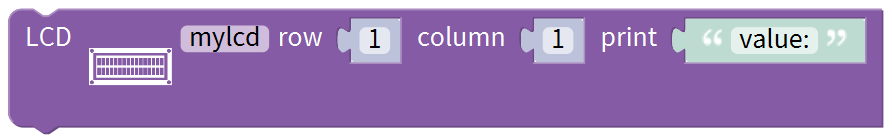block once, set to row 2 and column 1, change “value：” into “dry soil”, “dry soil” will show at row 2 and column 1.

\*\*\*\*\*\*\*\*\*\*\*\*\*\*\*\*\*\*\*\*\*\*\*\*\*\*\*\*\*\*\*\*\*\*\*\*\*\*\*\*\*\*\*\*\*\*\*\*\*\*\*\*\*\*\*\*\*\*\*\*\*\*\*\*\*\*\*\*\*\*\*\*\*\*\*\*\*\*\*\*\*\*\*

Move out block, click drop-down triangle to select “clear”, clear up the previous content on 1602LCD.+=;

\*\*\*\*\*\*\*\*\*\*\*\*\*\*\*\*\*\*\*\*\*\*\*\*\*\*\*\*\*\*\*\*\*\*\*\*\*\*\*\*\*\*\*\*\*\*\*\*\*\*\*\*\*\*\*\*\*\*\*\*\*\*\*\*\*\*\*\*\*\*\*\*\*\*\*\*\*\*\*\*\*\*\*

Add block, set to 300ms. 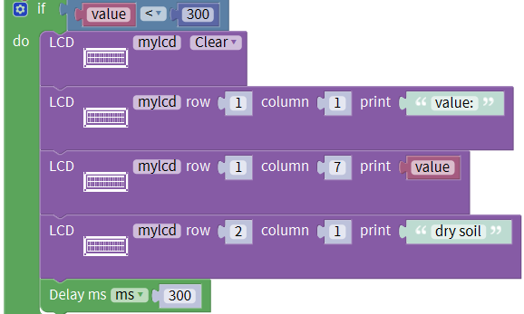

Next to design the code that the soil humidity is in the range of 300-700. 1602 LCD will shows soil humidity and “humid soil” if soil humidity is in the range of 300-700.

\*\*\*\*\*\*\*\*\*\*\*\*\*\*\*\*\*\*\*\*\*\*\*\*\*\*\*\*\*\*\*\*\*\*\*\*\*\*\*\*\*\*\*\*\*\*\*\*\*\*\*\*\*\*\*\*\*\*\*\*\*\*\*\*\*\*\*\*\*\*\*\*\*\*\*\*\*\*\*\*\*\*\*

Copytwice，then we separately set blocksand， we need to combine this two blocks to express “300≤value≤700”,  is needed.

\*\*\*\*\*\*\*\*\*\*\*\*\*\*\*\*\*\*\*\*\*\*\*\*\*\*\*\*\*\*\*\*\*\*\*\*\*\*\*\*\*\*\*\*\*\*\*\*\*\*\*\*\*\*\*\*\*\*\*\*\*\*\*\*\*\*\*\*\*\*\*\*\*\*\*\*\*\*\*\*\*\*\*

++=; then the assuming condition is created.

\*\*\*\*\*\*\*\*\*\*\*\*\*\*\*\*\*\*\*\*\*\*\*\*\*\*\*\*\*\*\*\*\*\*\*\*\*\*\*\*\*\*\*\*\*\*\*\*\*\*\*\*\*\*\*\*\*\*\*\*\*\*\*\*\*\*\*\*\*\*\*\*\*\*\*\*\*\*\*\*\*\*\*

Duplicateonce, alter“dry soil” into “humid soil”.

\*\*\*\*\*\*\*\*\*\*\*\*\*\*\*\*\*\*\*\*\*\*\*\*\*\*\*\*\*\*\*\*\*\*\*\*\*\*\*\*\*\*\*\*\*\*\*\*\*\*\*\*\*\*\*\*\*\*\*\*\*\*\*\*\*\*\*\*\*\*\*\*\*\*\*\*\*\*\*\*\*\*\*

Then design the code that soil humidity is greater than 700. 1602 LCD will display the soil humidity and “In Water” if soil humidity is larger than 700.

\*\*\*\*\*\*\*\*\*\*\*\*\*\*\*\*\*\*\*\*\*\*\*\*\*\*\*\*\*\*\*\*\*\*\*\*\*\*\*\*\*\*\*\*\*\*\*\*\*\*\*\*\*\*\*\*\*\*\*\*\*\*\*\*\*\*\*\*\*\*\*\*\*\*\*\*\*\*\*\*\*\*\*

Replicateand once, place into second “else if” block, change “＜” into “＞” , “dry soil” into “ in water”and 300 into 700.

The whole code is for your reference:

Upload test code, open serial monitor, insert soil humidity sensor into soil, change soil humidity to see the result.

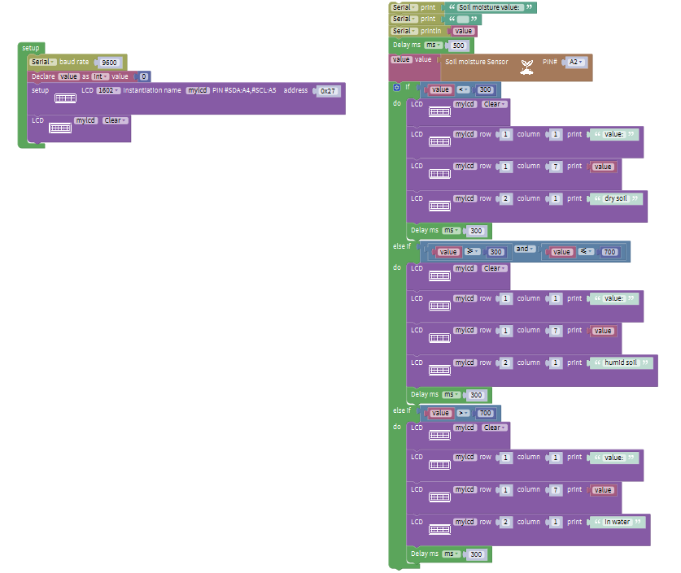

**Test Result：**

Upload code, open the serial monitor and insert the soil humidity sensor into the soil.

The greater the humidity is, the larger the value(0-1023). Also, the 1602LCD will display the corresponding value.

**Code Explanation：**

，read the analog value of A2

，if the condition in the “if” block is not met, the judgement result of “else if” block will be executed. On the contrary, if it met, judgement result only execute the situation in the “do” block.

\*\*\*\*\*\*\*\*\*\*\*\*\*\*\*\*\*\*\*\*\*\*\*\*\*\*\*\*\*\*\*\*\*\*\*\*\*\*\*\*\*\*\*\*\*\*\*\*\*\*\*\*\*\*\*\*\*\*\*\*\*\*\*\*\*\*\*\*\*\*\*\*\*\*\*\*\*\*\*\*\*\*\*

: 1602 LCD displays “value” at row 1 and column 1.

\*\*\*\*\*\*\*\*\*\*\*\*\*\*\*\*\*\*\*\*\*\*\*\*\*\*\*\*\*\*\*\*\*\*\*\*\*\*\*\*\*\*\*\*\*\*\*\*\*\*\*\*\*\*\*\*\*\*\*\*\*\*\*\*\*\*\*\*\*\*\*\*\*\*\*\*\*\*\*\*\*\*\*

: 1602 LCD starts showing the soil humidity value at row 1 and column7. There are only 2 line with 16 grids of per row on 1602LCD, thus, 32 pcs characters can be displayed. The letters, numbers and symbols are called characters, as well as space. Multiple characters come together and form into character string. For instance, character string “value：”occupies 6 characters，then set to start displaying soil humidity value at column 7.

\*\*\*\*\*\*\*\*\*\*\*\*\*\*\*\*\*\*\*\*\*\*\*\*\*\*\*\*\*\*\*\*\*\*\*\*\*\*\*\*\*\*\*\*\*\*\*\*\*\*\*\*\*\*\*\*\*\*\*\*\*\*\*\*\*\*\*\*\*\*\*\*\*\*\*\*\*\*\*\*\*\*\*

: 1602 LCD starts displaying “dry soil” at row 2 and column 1.

### Project 14: Bluetooth Test

**Description：**

Bluetooth technology is a wireless standard technology that enables short-distance data exchange between fixed devices, mobile devices, and building personal area networks (using UHF radio waves in the ISM band of 2.4 to 2.485 GHz).

This kit is equipped with the HM-10 Bluetooth module, which is a master-slave machine. When used as the Host, it can send commands to the slave actively; when used as the Slave, it can only receive commands from the host.

The HM-10 Bluetooth module supports the Bluetooth 4.0 protocol, which not only supports Android mobile, but also supports iOS system.

In the experiment, we take the HM-10 Bluetooth module as a Slave and the cellphone as a Host. We install the Bluetooth APP on the mobile phone, connect the Bluetooth module; and use the Bluetooth APP to control the smart home kit.

We also provide you with APP for Android and iOS system.

**Pins description**

| Pins  | Description                                                                                                                                                                                                                                                                                                                                                       |
|-------|-------------------------------------------------------------------------------------------------------------------------------------------------------------------------------------------------------------------------------------------------------------------------------------------------------------------------------------------------------------------|
| BRK   | As the input pin, short press control, or input single pulse of 100ms low level to achieve the following functions: When module is in sleep state: Module is activated to normal state, if open AT+NOTI, serial port will send OK+WAKE. When in connected state: Module will actively request to disconnect When in standby mode: Module will be in initial state |
| RXD   | Serial data inputs                                                                                                                                                                                                                                                                                                                                                |
| TXD   | Serial data outputs                                                                                                                                                                                                                                                                                                                                               |
| GND   | ground lead                                                                                                                                                                                                                                                                                                                                                       |
| VCC   | Positive pole of power, input 5V                                                                                                                                                                                                                                                                                                                                  |
| STATE | As output pin, show the working state of module Flash slowly in standby state——repeat 500ms pulse； Always light up in connected state——high level You could set to no flashing in standby state, always light up in connected state                                                                                                                              |

**Parameters:**

Bluetooth protocol: Bluetooth Specification V4.0 BLE

No byte limit in serial port Transceiving

In open environment, realize 100m ultra-distance communication with iphone4s

USB protocol: USB V2.0

Working frequency: 2.4GHz ISM band

Modulation method: GFSK(Gaussian Frequency Shift Keying)

Transmission power: -23dbm, -6dbm, 0dbm, 6dbm, can be modified by AT command.

Sensitivity: ≤-84dBm at 0.1% BER

Transmission rate: Asynchronous: 6K bytes ; Synchronous: 6k Bytes

Security feature: Authentication and encryption

Supporting service: Central & Peripheral UUID FFE0, FFE1

Power consumption: Auto sleep mode, stand by current 400uA\~800uA, 8.5mA during transmission.

Power supply: 5V DC

Working temperature: –5 to +65 Centigrade

**Using Bluetooth APP**

In the previous lesson, we’ve introduced the basic parameter principle of HM-10 Bluetooth module. In this project, let's show you how to use the HM-10 Bluetooth module. In order to efficiently control this kit by HM-10 Bluetooth module, we specially designed an APP, as shown below.

There are twelve control buttons and four sliders on App. When we press control button on APP, the Bluetooth of cellphone will send a control character, and Bluetooth module will receive a corresponding control character. When programming, we set the corresponding function of each sensor or module according to the corresponding key control character. Next, let’s test 16 buttons.

**Android System**

**Note: you need to enable the location information before connecting to HM-10 Bluetooth module via cellphone, otherwise, Bluetooth may not be connected.**

Enter **Google** play，search “keyes IoT”. If you can’t search it on app store, please download the app：

<https://play.google.com/store/apps/details?id=com.keyestudio.iot_keyes>

Open the app，and the interface will pop up as below:

Upload code and power on. LED of Bluetooth module blinks.

Start Bluetooth of your cellphone and open App to click “SCANNING” to pair.

Click “Connect”, then Bluetooth is connected successfully(indicator is always on). As shown below;

**IOS system：**

(1) Open App store

Search “IoT keyes”on APP store，then click “download”.

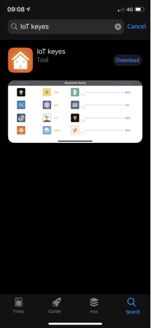

After the app is installed successfully, tapto enter the interface as follows:

After uploading the test code successfully, insert the Bluetooth module and power on.

First start the Bluetooth on cellphone, then click “connect” on app to search Bluetooth and pair. After paring successfully, the LED of Bluetooth module will be always on.

Note: Remove the Bluetooth module please when uploading the test code. Otherwise, the code will fail to be uploaded.

Remember to pair Bluetooth and Bluetooth module after uploading the test code.

**Wiring diagram：**

Note: On the sensor expansion board, the RXD, TXD, GND, and VCC of the Bluetooth module are respectively connected to TXD, RXD, GND, and 5V, and the STATE and BRK pins of the Bluetooth module do not need to be connected. Connect the power supply.

**Test Code：**

Download APP，wire up Bluetooth module and power.

Drag out，

\*\*\*\*\*\*\*\*\*\*\*\*\*\*\*\*\*\*\*\*\*\*\*\*\*\*\*\*\*\*\*\*\*\*\*\*\*\*\*\*\*\*\*\*\*\*\*\*\*\*\*\*\*\*\*\*\*\*\*\*\*\*\*\*\*\*\*\*\*\*\*\*\*\*\*\*\*\*\*\*\*\*\*

+=.

\*\*\*\*\*\*\*\*\*\*\*\*\*\*\*\*\*\*\*\*\*\*\*\*\*\*\*\*\*\*\*\*\*\*\*\*\*\*\*\*\*\*\*\*\*\*\*\*\*\*\*\*\*\*\*\*\*\*\*\*\*\*\*\*\*\*\*\*\*\*\*\*\*\*\*\*\*\*\*\*\*\*\*

Click "module" →“Communicate_module”→，TXD of Bluetooth module is linked with RXD of sensor shield(RXD is as same as D0), RXD is attached to TXD of sensor shield (TXD is as same as D1); set RX: 0, TX:1.

\*\*\*\*\*\*\*\*\*\*\*\*\*\*\*\*\*\*\*\*\*\*\*\*\*\*\*\*\*\*\*\*\*\*\*\*\*\*\*\*\*\*\*\*\*\*\*\*\*\*\*\*\*\*\*\*\*\*\*\*\*\*\*\*\*\*\*\*\*\*\*\*\*\*\*\*\*\*\*\*\*\*\*

Click "serialport” →, enter“variables” →,

++=.

\*\*\*\*\*\*\*\*\*\*\*\*\*\*\*\*\*\*\*\*\*\*\*\*\*\*\*\*\*\*\*\*\*\*\*\*\*\*\*\*\*\*\*\*\*\*\*\*\*\*\*\*\*\*\*\*\*\*\*\*\*\*\*\*\*\*\*\*\*\*\*\*\*\*\*\*\*\*\*\*\*\*\*

Remove Bluetooth module after uploading test code, then connect with Bluetooth module and open serial monitor, set baud rate to 9600. The corresponding characters are shown below:

The function of corresponding characters and buttons are shown below:

### Assembly Guide

Check the board A\~I and parts in the first place.

 **Step 1: Install sensors on A board**

Prepare components as follows;

-   A board\*1
-   M3\*10MM round screw\*4
-   M3 nickel plated nut\*4；
-   M2.5\*10MM round screw\*4
-   button sensor\*2
-   white LED\*1
-   PIR motion sensor\*1
-   LCD1602 display\*1
-   4pin F-F dupont Cable\*1
-   3pin F-F dupont cable\*4

1.  Fix the white LED, 2 button sensors and the PIR motion sensor on the corresponding areas of the A board with 4pcs M3\*10MM round head screws and 4pcs M3 nuts.
2.  Then install the LCD1602 display on A board with 4pcs M2.5\*10MM round head screws and 4pcs M2.5 nuts.
3.  Connect them with 3pin and 4pin dupont cables.

 **Step 2: Install sensors on B board**

-   B board，
-   3pin F-F dupont line\*1，
-   M3\*10MM round head screw\*2，
-   M3 nickel plated nut\*2
-   A relay module

Assemble the relay module on B board with 2 pcs M3\*10MM screws and 2pcs M3 nickel plated nuts, and attach a 3pin F-F dupont cable to the relay module

 **Step 3: Fix A board and B board together with a “T” bolt**

 **Step 4: Assemble sensors and a battery holder on C board**

C board\*1

MQ-2 gas sensor\*1

A battery holder

M3\*10MM flat head screw\*2

M3\*10MM round head screw\*1

M3 nickel plated nut\*3

4pin F-F dupont line\*1

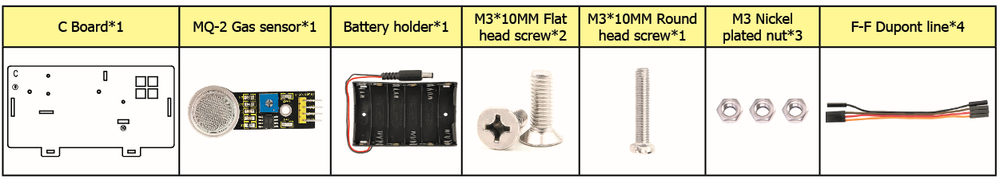

1.  Fix the battery holder on C board with 2pcs M3\*10MM flat head screws and 2 pcs M3 nickel plated nuts.
2.  Then install the MQ-2 gas sensor on the corresponding area of C board with a M3\*10MM round head screw and a M3 nickel plated nut.
3.  Connect a 4pin dupont line to the MQ-2 gas sensor

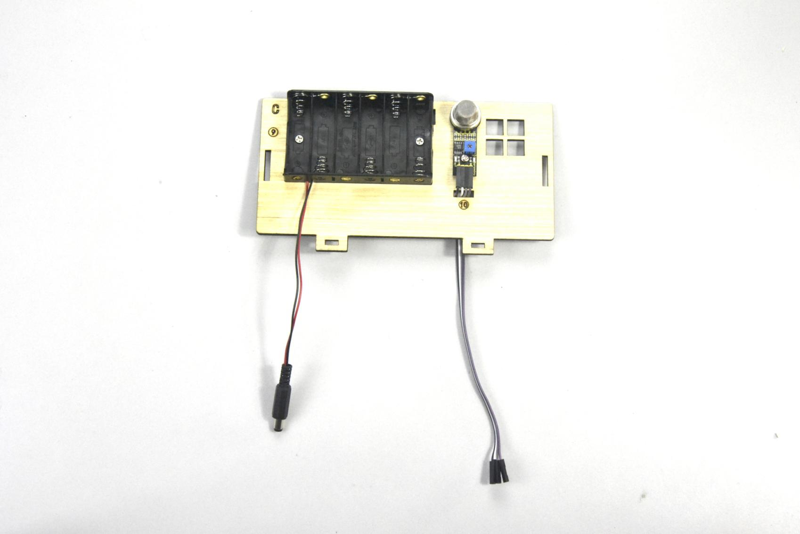 

 **Step 5: Install the sensors and parts on D board**

-   A servo
-   M1.2\*5 self-tapping screw\*4
-   A white cross mount（included in servo）
-   M2\*5 round head screw（included in servo）\*1
-   M2\*12MM round head screw\*2
-   M2 nickel plated nut\*2
-   M3\*12MM round head screw\*4
-   M3 stainless self-locking nut\*4
-   D board
-   A gear
-   Board1

We need to set the servo to 90° before installing. Just follow the steps below

Connect servo to Keyestudio PLUS Control Board and upload test code to make servo rotate to 90°

| Servo Motor |         |
|-------------|---------|
| Brown wire  | GND     |
| Red wire    | 5V      |
| Orange wire | S（10） |

**Test Code：**

    #include <Servo.h>
    
    Servo servo_10;
    
    void setup(){
    
    servo_10.attach(10);
    
    }
    
    void loop(){
    
    servo_10.write(90);
    
    delay(500);}

After the test code is uploaded successfully, the servo will rotate to 90°

1.  Fix the servo on the corresponding area of D board with 2pcs M2\*12MM round head screws and 2pcs M2 nickel plated nuts.
2.  Then install the square board 1 on the D board with 4pcs M3\*12MM round head screws and 4 M3 self-locking nuts.

 

Install the white cross mount on the gear with 4pcs M1.2\*5MM self-tapping screws, and mount the gear on the servo motor with 1 M2\*5MM round head screw.

 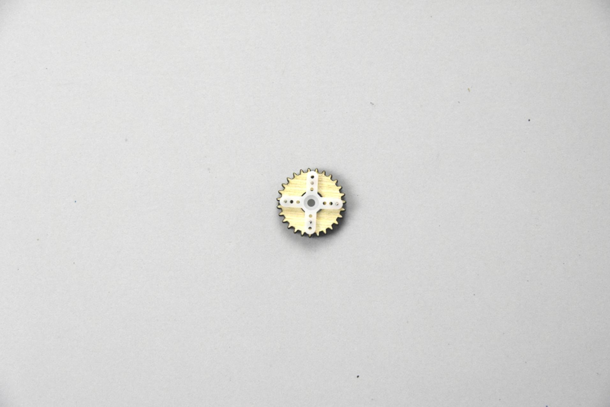

 **Step 6: Assemble C board with D board with a “T” bolt.**

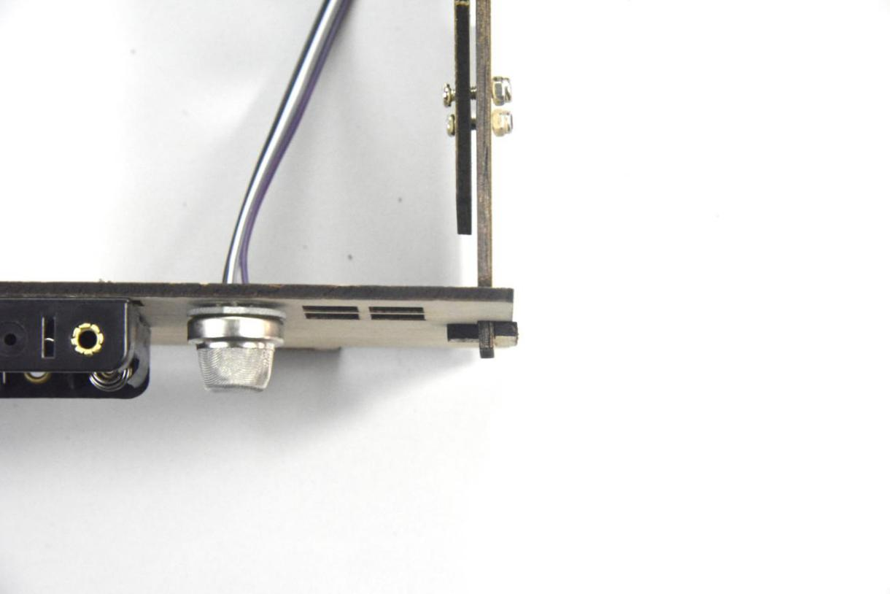

 **Step 7: Install the yellow LED on E board**

-   A yellow LED module
-   A E board
-   M3\*10MM round head screw\*1
-   M3 nickel plated nut \*1
-   3pin F-F dupont line\*1

Mount the yellow LED on the corresponding area of E board with 1 M3\*10MM round head screw and 1 M3 nickel plated nut，then connect a 3pin dupont line to it.

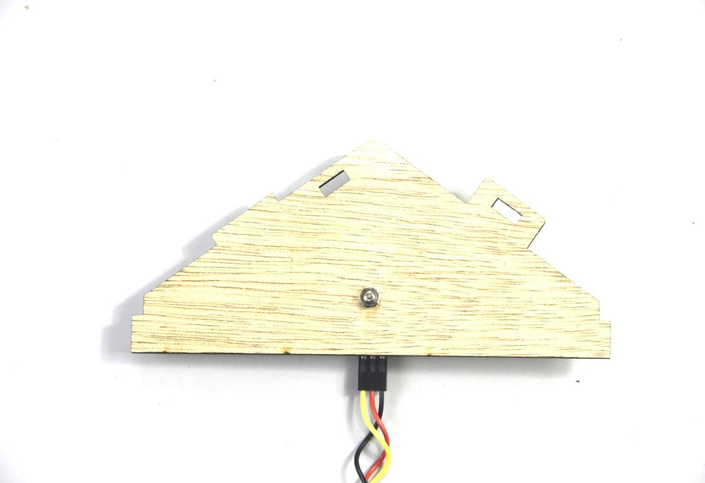

 **Step 8: Install control board, sensors and parts on H board**

A servo

A passive buzzer

M1.2\*5 self-tapping screw\*4,

A white cross mount(included in servo)\*1

A M2\*5 screw( included in servo)

M2\*12MM round head screw\*2

M2 nickel plated nut\*2

M3\*10MM round screw\*1

M3 nickel plated nut\*1

M3\*6MM round head screw\*8

M3\*10MM dual-pass copper pillar\*4

A Keyestudio PLUS Control Board

A sensor shield

3pinF-F dupont line\*1

H board E

2 gears

Board 2\*2

1.  Mount 4pcs dual-pass copper pillars on the H board with 4pcs M3\*6MM screws
2.  Then fix the passive buzzer on H board with 1 M3\*10MM round head screw and 1 M3 nut.
3.  Connect a 3pinF-F dupont line to the passive buzzer.

Set the servo to 90° before installing, and the method is same as the step 6.

Fix the 4pcs M3\*10MM copper pillars on the Keyestudio PLUS control board with 4 M3\*6MM round head screws, then mount the servo on the corresponding area of H board with 2 M2\*12MM round head screws and 2 M2 nuts.

Mount 2pcs board 2 together, then fix white cross mount on the gear with 4pcs M1.2\*5 self-tapping screws

 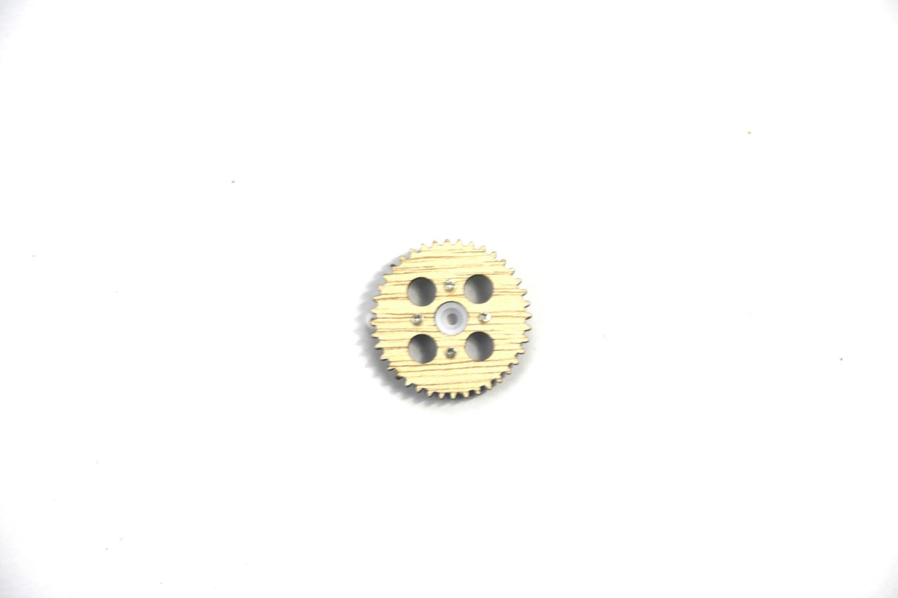

Fix the gear with white cross mount on the black servo with 1 M2\*5MM screw(included in servo), then install the combination of 2pcs board 2 and another servo on the corresponding area of H board, finally stack the sensor shield on the Keyestudio PLUS control board.

 **Step 9: Assemble all boards together with 2 “T” type bolts.**

(Note: the port of PLUS Control Board is aligned with the hole ⑧ on board B, and the interface of USB cable is aligned with the hole ⑦ on board B)

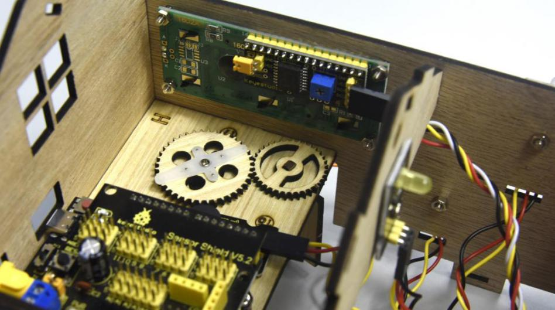

 **Step 10: Install sensors on F board**

A steam sensor,

A photocell sensor

A fan module(with fan)

Board F

3pinF-F dupont line\*2,

4pin F-F dupont line\*1

M3\*10MM round head screw\*3

M3 nickel plated nut\*3.

Separately fix the steam sensor, the photocell sensor and the fan module on the F board with 3pcs M3\*10MM round head screws and 3pcs M3 nuts, then attach 3pin and 4pin dupont lines to sensors

 **Step 11: Connect sensor/module**

Connect one end of a 3pin dupont line to soil humidity sensor, then link all sensors with the sensor shield. (make dupont wires of the servo go through the holes of board)

| Name                            | The corresponding interfaces of sensors  and sensor shield | The corresponding installed area on the board |   |
|---------------------------------|------------------------------------------------------------|-----------------------------------------------|---|
| PIR Motion Sensor               | G/V/S                                                      | G/V/2                                         | ⑤ |
| Passive buzzer                  | G/V/S                                                      | G/V/3                                         | ⑯ |
| Button module 1                 | G/V/S                                                      | G/V/4                                         | ③ |
| Yellow LED                      | G/V/S                                                      | G/V/5                                         | ⑫ |
| Fan module                      | GND/VCC/INA/INB                                            | G/V/7/6                                       | ⑮ |
| Button module 2                 | G/V/S                                                      | G/V/8                                         | ④ |
| Servo 1 controlling the door    | Brown/Red/Orange wire                                      | G/V/9                                         | ⑰ |
| Servo 2 controlling the windows | Brown/Red/Orange wire                                      | G/V/10                                        | ⑪ |
| MQ-2 Gas Sensor                 | GND/VCC/D0/A0                                              | G/V/11/A0                                     | ⑩ |
| Relay Module                    | G/V/S                                                      | G/V/12                                        | ⑥ |
| White LED                       | G/V/S                                                      | G/V/13                                        | ① |
| LCD1602 Display                 | GND/VCC/SDA/SCL                                            | GND/5V/SDA/SCL                                | ② |
| Photocell Sensor                | G/V/S                                                      | G/V/A1                                        | ⑭ |
| Soil humidity sensor            | G/V/S                                                      | G/V/A2                                        |   |
| Steam sensor                    | G/V/S                                                      | G/V/A3                                        | ⑬ |

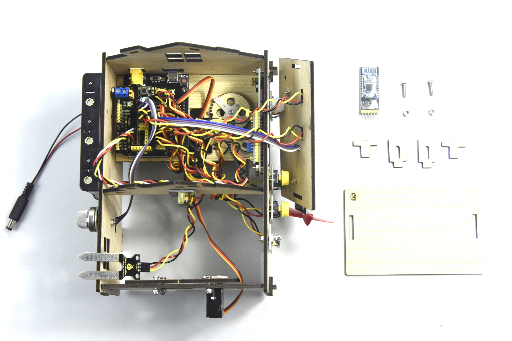

Insert the Bluetooth module into sensor shield, then fix the F board with 2 M3\*10MM round head screws, 2 M3 nuts and 2 pcs parts and mount G board with 2 “T” bolts.

| Bluetooth Module | Sensor shield |
|------------------|---------------|
| VCC              | 5V            |
| GND              | GND           |
| TXD              | RXD           |
| RXD              | TXD           |

 **Step 12: Assemble the kit**

Fix the board I with 6 “T” bolts

The smart home kit is established.

### Project 15：Multi-purpose Smart Home

**Description：**

In the previous projects, we’ve introduced how to use sensors, modules and HM-10 Bluetooth module. For this lesson, we will present all functions of this smart home.

We will achieve the effect as follows:

（1）Photocell sensor, PIR motion sensor and LED. When at night, someone passes by, LED is on; nobody is around, the LED is off.

A 1602LCD display, 2 buttons, 1 servo on the board.

When button1 is pressed, you can input password(set password in the test code), and the 1602LCD will show “\*”, then press button2 to “confirm”. If the password is correct, the 1602LCD will show “open” and the door will be open. However, if the password is wrong, the “error” pops up; after 2s, “error” will turn into “again” , which means that you can enter password again.

Note: The correct password is ”. - - . - .” which means that short press button1, long press button1, long press button1, short press button1, long press button1, and short press button1.

”- ”means long press button1, ”.”means short press button1

The door will be closed when PIR motion sensor doesn’t detect people around. What’s more, if you press and hold button2, the buzzer will emits a sound, and LCD display will show “wait”.

（If the password is right, the servo will rotate to 180°, otherwise，it doesn’t rotate）

Insert soil humidity sensor into a plant pot, when the soil is too dry, the buzzer will alarm and you will get the notification from app.

(5) When the gas sensor detects the gas with high concentration, the buzzer will emit a "tick,tick" alarm sound.

(6) When steam sensor detects rains, the servo 2 will be activated and the window will be closed automatically, otherwise, the window will be open.

**Experiment equipment：**

keyestudio PLUS control board \* 1,

Sensor shield \* 1,

Bluetooth module \* 1,

PIR motion sensor\* 1,

Photocell sensor \* 1,

button sensor \* 2,

White LED module \* 1,

Yellow LED module \* 1,

Relay Module \* 1,

passive buzzer module \* 1,

fan module \* 1,

steam sensor \* 1,

servo module \* 2,

LCD1602 display module \* 1,

Soil humidity sensor \* 1

MQ-2 gas sensor\* 1,

3pinF-F Dupont line \* 10,

4pinF-F Dupont line \* 1,

several FF Dupont line,

USB cable \* 1

**Wiring Diagram：**

|   Name                         |  The corresponding interfaces of sensors and sensor shield | The corresponding installed area on the board |    |
|--------------------------------|------------------------------------------------------------|-----------------------------------------------|----|
| PIR Motion Sensor              | G/V/S                                                      | G/V/2                                         | ⑤  |
| Passive Buzzer                 | G/V/S                                                      | G/V/3                                         | ⑯  |
| Button sensor 1                | G/V/S                                                      | G/V/4                                         | ③  |
| Yellow LED Module              | G/V/S                                                      | G/V/5                                         | ⑫  |
| Fan Module                     | GND/VCC/INA/INB                                            | G/V/7/6                                       | ⑮  |
| Button Module 2                | G/V/S                                                      | G/V/8                                         | ④  |
| Servo 1 controlling the door   | Brown/Red/Orange Wire                                      |  G/V/9                                        |  ⑰ |
| Servo 2 controlling the window | Brown/Red/ Orange Wire                                     |  G/V/10                                       |  ⑪ |
| MQ-2 Gas Sensor                | GND/VCC/D0/A0                                              | G/V/11/A0                                     | ⑩  |
| Relay Module                   | G/V/S                                                      | G/V/12                                        | ⑥  |
| White LED                      | G/V/S                                                      | G/V/13                                        | ①  |
| LCD1602 Display                | GND/VCC/SDA/SCL                                            | GND/5V/SDA/SCL                                | ②  |
| Photocell Sensor               | G/V/S                                                      | G/V/A1                                        | ⑭  |
| Soil Humidity Sensor           | G/V/S                                                      | G/V/A2                                        |    |
| Steam Sensor                   | G/V/S                                                      | G/V/A3                                        | ⑬  |

**Test Code：**

**Serial port displays data from Bluetooth**

Click “Control” →;

\*\*\*\*\*\*\*\*\*\*\*\*\*\*\*\*\*\*\*\*\*\*\*\*\*\*\*\*\*\*\*\*\*\*\*\*\*\*\*\*\*\*\*\*\*\*\*\*\*\*\*\*\*\*\*\*\*\*\*\*\*\*\*\*\*\*\*\*\*\*\*\*\*\*\*\*\*\*\*\*\*\*\*

Enter “Serialport” → ,

\*\*\*\*\*\*\*\*\*\*\*\*\*\*\*\*\*\*\*\*\*\*\*\*\*\*\*\*\*\*\*\*\*\*\*\*\*\*\*\*\*\*\*\*\*\*\*\*\*\*\*\*\*\*\*\*\*\*\*\*\*\*\*\*\*\*\*\*\*\*\*\*\*\*\*\*\*\*\*\*\*\*\*

Then we get the block:+=

\*\*\*\*\*\*\*\*\*\*\*\*\*\*\*\*\*\*\*\*\*\*\*\*\*\*\*\*\*\*\*\*\*\*\*\*\*\*\*\*\*\*\*\*\*\*\*\*\*\*\*\*\*\*\*\*\*\*\*\*\*\*\*\*\*\*\*\*\*\*\*\*\*\*\*\*\*\*\*\*\*\*\*

 : display the signal sent by Bluetooth. Bluetooth can read the character signals, the variables and judgement condition are needed. Therefore, we could use to read data.

\*\*\*\*\*\*\*\*\*\*\*\*\*\*\*\*\*\*\*\*\*\*\*\*\*\*\*\*\*\*\*\*\*\*\*\*\*\*\*\*\*\*\*\*\*\*\*\*\*\*\*\*\*\*\*\*\*\*\*\*\*\*\*\*\*\*\*\*\*\*\*\*\*\*\*\*\*\*\*\*\*\*\*

Selectand, combine these two blocks. Get block . Change “item” into “val”, block is produced, then  is created.

\*\*\*\*\*\*\*\*\*\*\*\*\*\*\*\*\*\*\*\*\*\*\*\*\*\*\*\*\*\*\*\*\*\*\*\*\*\*\*\*\*\*\*\*\*\*\*\*\*\*\*\*\*\*\*\*\*\*\*\*\*\*\*\*\*\*\*\*\*\*\*\*\*\*\*\*\*\*\*\*\*\*\*

Drag out，,

\*\*\*\*\*\*\*\*\*\*\*\*\*\*\*\*\*\*\*\*\*\*\*\*\*\*\*\*\*\*\*\*\*\*\*\*\*\*\*\*\*\*\*\*\*\*\*\*\*\*\*\*\*\*\*\*\*\*\*\*\*\*\*\*\*\*\*\*\*\*\*\*\*\*\*\*\*\*\*\*\*\*\*

Enter “variables” → ,

+++=;

Move out block and .

\*\*\*\*\*\*\*\*\*\*\*\*\*\*\*\*\*\*\*\*\*\*\*\*\*\*\*\*\*\*\*\*\*\*\*\*\*\*\*\*\*\*\*\*\*\*\*\*\*\*\*\*\*\*\*\*\*\*\*\*\*\*\*\*\*\*\*\*\*\*\*\*\*\*\*\*\*\*\*\*\*\*\*

++=；

\*\*\*\*\*\*\*\*\*\*\*\*\*\*\*\*\*\*\*\*\*\*\*\*\*\*\*\*\*\*\*\*\*\*\*\*\*\*\*\*\*\*\*\*\*\*\*\*\*\*\*\*\*\*\*\*\*\*\*\*\*\*\*\*\*\*\*\*\*\*\*\*\*\*\*\*\*\*\*\*\*\*\*

Refer to following code:

\*\*\*\*\*\*\*\*\*\*\*\*\*\*\*\*\*\*\*\*\*\*\*\*\*\*\*\*\*\*\*\*\*\*\*\*\*\*\*\*\*\*\*\*\*\*\*\*\*\*\*\*\*\*\*\*\*\*\*\*\*\*\*\*\*\*\*\*\*\*\*\*\*\*\*\*\*\*\*\*\*\*\*

Tap function buttons on APP interface，Bluetooth module will receive the corresponding signals, and transfer them to other sensors or modules.

Clickto turn on and off LED.

Click “Control” →，click blue gear icon, appear edit box，draginto，then we get block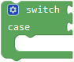，when the value behind block switch is equal to the value behind “case” block, the statement of case block will be executed, then continue to go on with the next statement of “case”

\*\*\*\*\*\*\*\*\*\*\*\*\*\*\*\*\*\*\*\*\*\*\*\*\*\*\*\*\*\*\*\*\*\*\*\*\*\*\*\*\*\*\*\*\*\*\*\*\*\*\*\*\*\*\*\*\*\*\*\*\*\*\*\*\*\*\*\*\*\*\*\*\*\*\*\*\*\*\*\*\*\*\*

block. Moveto for 18 times ( )→.

\*\*\*\*\*\*\*\*\*\*\*\*\*\*\*\*\*\*\*\*\*\*\*\*\*\*\*\*\*\*\*\*\*\*\*\*\*\*\*\*\*\*\*\*\*\*\*\*\*\*\*\*\*\*\*\*\*\*\*\*\*\*\*\*\*\*\*\*\*\*\*\*\*\*\*\*\*\*\*\*\*\*\*

Select，click “Text” to move out ;

\*\*\*\*\*\*\*\*\*\*\*\*\*\*\*\*\*\*\*\*\*\*\*\*\*\*\*\*\*\*\*\*\*\*\*\*\*\*\*\*\*\*\*\*\*\*\*\*\*\*\*\*\*\*\*\*\*\*\*\*\*\*\*\*\*\*\*\*\*\*\*\*\*\*\*\*\*\*\*\*\*\*\*

Then get block:+ + =

\*\*\*\*\*\*\*\*\*\*\*\*\*\*\*\*\*\*\*\*\*\*\*\*\*\*\*\*\*\*\*\*\*\*\*\*\*\*\*\*\*\*\*\*\*\*\*\*\*\*\*\*\*\*\*\*\*\*\*\*\*\*\*\*\*\*\*\*\*\*\*\*\*\*\*\*\*\*\*\*\*\*\*

Select block ,

white LED is linked with digital 13, so set block;

\*\*\*\*\*\*\*\*\*\*\*\*\*\*\*\*\*\*\*\*\*\*\*\*\*\*\*\*\*\*\*\*\*\*\*\*\*\*\*\*\*\*\*\*\*\*\*\*\*\*\*\*\*\*\*\*\*\*\*\*\*\*\*\*\*\*\*\*\*\*\*\*\*\*\*\*\*\*\*\*\*\*\*

Press, Bluetooth passes on signal “a” to turn on LED, so we combine code string:

+=.

\*\*\*\*\*\*\*\*\*\*\*\*\*\*\*\*\*\*\*\*\*\*\*\*\*\*\*\*\*\*\*\*\*\*\*\*\*\*\*\*\*\*\*\*\*\*\*\*\*\*\*\*\*\*\*\*\*\*\*\*\*\*\*\*\*\*\*\*\*\*\*\*\*\*\*\*\*\*\*\*\*\*\*

Click again, signal“b”is transmitted to Bluetooth module to turn off LED, copy and  once, set to LOW and “b”.

→,.

\*\*\*\*\*\*\*\*\*\*\*\*\*\*\*\*\*\*\*\*\*\*\*\*\*\*\*\*\*\*\*\*\*\*\*\*\*\*\*\*\*\*\*\*\*\*\*\*\*\*\*\*\*\*\*\*\*\*\*\*\*\*\*\*\*\*\*\*\*\*\*\*\*\*\*\*\*\*\*\*\*\*\*

The code to control white LED on and off as follows:

Simultaneously, when we click, signal “c” and “d”are transferred(start up and end relay module) to control relay module.

\*\*\*\*\*\*\*\*\*\*\*\*\*\*\*\*\*\*\*\*\*\*\*\*\*\*\*\*\*\*\*\*\*\*\*\*\*\*\*\*\*\*\*\*\*\*\*\*\*\*\*\*\*\*\*\*\*\*\*\*\*\*\*\*\*\*\*\*\*\*\*\*\*\*\*\*\*\*\*\*\*\*\*

Now, we could design code string as below:

Copy twice, change “a” into “c” and “d”, get ,

Select block, relay module is attached to digital 12, so set to pin 12, get block: ;

\*\*\*\*\*\*\*\*\*\*\*\*\*\*\*\*\*\*\*\*\*\*\*\*\*\*\*\*\*\*\*\*\*\*\*\*\*\*\*\*\*\*\*\*\*\*\*\*\*\*\*\*\*\*\*\*\*\*\*\*\*\*\*\*\*\*\*\*\*\*\*\*\*\*\*\*\*\*\*\*\*\*\*

The code that relay module is connected: 

The code that relay module is off: 

As for your reference:

\*\*\*\*\*\*\*\*\*\*\*\*\*\*\*\*\*\*\*\*\*\*\*\*\*\*\*\*\*\*\*\*\*\*\*\*\*\*\*\*\*\*\*\*\*\*\*\*\*\*\*\*\*\*\*\*\*\*\*\*\*\*\*\*\*\*\*\*\*\*\*\*\*\*\*\*\*\*\*\*\*\*\*

Press iconto play “Birthday“ song，press to emit “ode-to-joy”.

Click “Functions” →, alter “procedure” into “music1”, get block，

\*\*\*\*\*\*\*\*\*\*\*\*\*\*\*\*\*\*\*\*\*\*\*\*\*\*\*\*\*\*\*\*\*\*\*\*\*\*\*\*\*\*\*\*\*\*\*\*\*\*\*\*\*\*\*\*\*\*\*\*\*\*\*\*\*\*\*\*\*\*\*\*\*\*\*\*\*\*\*\*\*\*\*

Enter “Sensor”→“Control Output” →，passive buzzer is linked with digital 3, then select “birthday” , we get block ;

+=;

\*\*\*\*\*\*\*\*\*\*\*\*\*\*\*\*\*\*\*\*\*\*\*\*\*\*\*\*\*\*\*\*\*\*\*\*\*\*\*\*\*\*\*\*\*\*\*\*\*\*\*\*\*\*\*\*\*\*\*\*\*\*\*\*\*\*\*\*\*\*\*\*\*\*\*\*\*\*\*\*\*\*\*

Duplicateonce，set to “music2” and “Ode_to_joy”.

\*\*\*\*\*\*\*\*\*\*\*\*\*\*\*\*\*\*\*\*\*\*\*\*\*\*\*\*\*\*\*\*\*\*\*\*\*\*\*\*\*\*\*\*\*\*\*\*\*\*\*\*\*\*\*\*\*\*\*\*\*\*\*\*\*\*\*\*\*\*\*\*\*\*\*\*\*\*\*\*\*\*\*

Press icon, signal “e” is sent to Bluetooth module, then “birthday” song is played; so copy once and set to “e”. Moreover, click ，signal ‘f’ is transmitted to play “Ode_to_joy” song; then get.

\*\*\*\*\*\*\*\*\*\*\*\*\*\*\*\*\*\*\*\*\*\*\*\*\*\*\*\*\*\*\*\*\*\*\*\*\*\*\*\*\*\*\*\*\*\*\*\*\*\*\*\*\*\*\*\*\*\*\*\*\*\*\*\*\*\*\*\*\*\*\*\*\*\*\*\*\*\*\*\*\*\*\*

Enter “Functions” →, 

++++=

\*\*\*\*\*\*\*\*\*\*\*\*\*\*\*\*\*\*\*\*\*\*\*\*\*\*\*\*\*\*\*\*\*\*\*\*\*\*\*\*\*\*\*\*\*\*\*\*\*\*\*\*\*\*\*\*\*\*\*\*\*\*\*\*\*\*\*\*\*\*\*\*\*\*\*\*\*\*\*\*\*\*\*

Release iconor, the signal “g” will be passed on, then music will stop(buzzer stops, note that buzzer won’t be turned off until the whole song is finished), add ;
Click“Sensor”→ “Control Output”→， set to pin 3. The code string is shown below:

\*\*\*\*\*\*\*\*\*\*\*\*\*\*\*\*\*\*\*\*\*\*\*\*\*\*\*\*\*\*\*\*\*\*\*\*\*\*\*\*\*\*\*\*\*\*\*\*\*\*\*\*\*\*\*\*\*\*\*\*\*\*\*\*\*\*\*\*\*\*\*\*\*\*\*\*\*\*\*\*\*\*\*

**Test code for controlling door**

Drag out block，change “procedure” into “door”, get block，

\*\*\*\*\*\*\*\*\*\*\*\*\*\*\*\*\*\*\*\*\*\*\*\*\*\*\*\*\*\*\*\*\*\*\*\*\*\*\*\*\*\*\*\*\*\*\*\*\*\*\*\*\*\*\*\*\*\*\*\*\*\*\*\*\*\*\*\*\*\*\*\*\*\*\*\*\*\*\*\*\*\*\*

Then create variables “button1” and “button2”，“button1” represents variable of button sensor 1, so dose “button2”; Next, we produce these variables in accordance with previous method:

+=.

\*\*\*\*\*\*\*\*\*\*\*\*\*\*\*\*\*\*\*\*\*\*\*\*\*\*\*\*\*\*\*\*\*\*\*\*\*\*\*\*\*\*\*\*\*\*\*\*\*\*\*\*\*\*\*\*\*\*\*\*\*\*\*\*\*\*\*\*\*\*\*\*\*\*\*\*\*\*\*\*\*\*\*
Copyonce, change “item” into “button1”and “button2”，default as integer and the initial value is 0, then block and exist.

\*\*\*\*\*\*\*\*\*\*\*\*\*\*\*\*\*\*\*\*\*\*\*\*\*\*\*\*\*\*\*\*\*\*\*\*\*\*\*\*\*\*\*\*\*\*\*\*\*\*\*\*\*\*\*\*\*\*\*\*\*\*\*\*\*\*\*\*\*\*\*\*\*\*\*\*\*\*\*\*\*\*\*

Enter “Variables”→ ，then get block: ++=

\*\*\*\*\*\*\*\*\*\*\*\*\*\*\*\*\*\*\*\*\*\*\*\*\*\*\*\*\*\*\*\*\*\*\*\*\*\*\*\*\*\*\*\*\*\*\*\*\*\*\*\*\*\*\*\*\*\*\*\*\*\*\*\*\*\*\*\*\*\*\*\*\*\*\*\*\*\*\*\*\*\*\*

 Enter “Sensor”→ “Digital Read” → , copy it twice. Two button sensors are respectively linked with digital 4 and 8, so we set  and . Then we get block: and .

\*\*\*\*\*\*\*\*\*\*\*\*\*\*\*\*\*\*\*\*\*\*\*\*\*\*\*\*\*\*\*\*\*\*\*\*\*\*\*\*\*\*\*\*\*\*\*\*\*\*\*\*\*\*\*\*\*\*\*\*\*\*\*\*\*\*\*\*\*\*\*\*\*\*\*\*\*\*\*\*\*\*\*

Next to judge if button1 sensor is pressed. If it is, the signal 0 will be sent, the “if...do” block is adopted,

+=

\*\*\*\*\*\*\*\*\*\*\*\*\*\*\*\*\*\*\*\*\*\*\*\*\*\*\*\*\*\*\*\*\*\*\*\*\*\*\*\*\*\*\*\*\*\*\*\*\*\*\*\*\*\*\*\*\*\*\*\*\*\*\*\*\*\*\*\*\*\*\*\*\*\*\*\*\*\*\*\*\*\*\*

Click “Logic” →, drag out and , +++= 

\*\*\*\*\*\*\*\*\*\*\*\*\*\*\*\*\*\*\*\*\*\*\*\*\*\*\*\*\*\*\*\*\*\*\*\*\*\*\*\*\*\*\*\*\*\*\*\*\*\*\*\*\*\*\*\*\*\*\*\*\*\*\*\*\*\*\*\*\*\*\*\*\*\*\*\*\*\*\*\*\*\*\*

We need to create a variable to represent the time when button 1 is pressed.

→+ =, modify “item” into “btn1_num”, then get block. Enter “Control” →, +=

\*\*\*\*\*\*\*\*\*\*\*\*\*\*\*\*\*\*\*\*\*\*\*\*\*\*\*\*\*\*\*\*\*\*\*\*\*\*\*\*\*\*\*\*\*\*\*\*\*\*\*\*\*\*\*\*\*\*\*\*\*\*\*\*\*\*\*\*\*\*\*\*\*\*\*\*\*\*\*\*\*\*\*

 Duplicateonce, and +=;

\*\*\*\*\*\*\*\*\*\*\*\*\*\*\*\*\*\*\*\*\*\*\*\*\*\*\*\*\*\*\*\*\*\*\*\*\*\*\*\*\*\*\*\*\*\*\*\*\*\*\*\*\*\*\*\*\*\*\*\*\*\*\*\*\*\*\*\*\*\*\*\*\*\*\*\*\*\*\*\*\*\*\*

Replicateonce,+=;

Enter “Variables”→，

+=

\*\*\*\*\*\*\*\*\*\*\*\*\*\*\*\*\*\*\*\*\*\*\*\*\*\*\*\*\*\*\*\*\*\*\*\*\*\*\*\*\*\*\*\*\*\*\*\*\*\*\*\*\*\*\*\*\*\*\*\*\*\*\*\*\*\*\*\*\*\*\*\*\*\*\*\*\*\*\*\*\*\*\*

Click “math” →，+=;

Enter“Variables”→，+= ，（1 equals to 100ms）.

\*\*\*\*\*\*\*\*\*\*\*\*\*\*\*\*\*\*\*\*\*\*\*\*\*\*\*\*\*\*\*\*\*\*\*\*\*\*\*\*\*\*\*\*\*\*\*\*\*\*\*\*\*\*\*\*\*\*\*\*\*\*\*\*\*\*\*\*\*\*\*\*\*\*\*\*\*\*\*\*\*\*\*

Drag out .

+=.

\*\*\*\*\*\*\*\*\*\*\*\*\*\*\*\*\*\*\*\*\*\*\*\*\*\*\*\*\*\*\*\*\*\*\*\*\*\*\*\*\*\*\*\*\*\*\*\*\*\*\*\*\*\*\*\*\*\*\*\*\*\*\*\*\*\*\*\*\*\*\*\*\*\*\*\*\*\*\*\*\*\*\*

Pressing or releasing will cause vibration of button, therefore, a multitude of signals may be output and transmitted. We need to delay time to prevent this situation，add delay block, set to 10ms and place it between block and .

If the time when press button 1 is equivalent to or greater than 100ms and less than 500ms, the password is “.” and 1602LCD shows“\*”; if the time is equivalent to or greater 500ms, the password is “-”. 1602LCD displays “\*”. (“.” means pressing button senor, “-” stands for holding button sensor for long time)

If the time of pressing button 1 is greater than or equivalent to 100ms and less than 500ms, the input password is “.”, 1602LCD displays “\*”; if greater than 500ms, the input password is “-”,

Drag out , ; +=
Select,, . Set to “≥”，change 0 into 1（1indicates 100ms). +=

\*\*\*\*\*\*\*\*\*\*\*\*\*\*\*\*\*\*\*\*\*\*\*\*\*\*\*\*\*\*\*\*\*\*\*\*\*\*\*\*\*\*\*\*\*\*\*\*\*\*\*\*\*\*\*\*\*\*\*\*\*\*\*\*\*\*\*\*\*\*\*\*\*\*\*\*\*\*\*\*\*\*\*

Duplicateonce, modify “≥” into “＜”, alter 1 into 5 (5=500), then get block, Move out block;

\*\*\*\*\*\*\*\*\*\*\*\*\*\*\*\*\*\*\*\*\*\*\*\*\*\*\*\*\*\*\*\*\*\*\*\*\*\*\*\*\*\*\*\*\*\*\*\*\*\*\*\*\*\*\*\*\*\*\*\*\*\*\*\*\*\*\*\*\*\*\*\*\*\*\*\*\*\*\*\*\*\*\*

++= ;
+=.

\*\*\*\*\*\*\*\*\*\*\*\*\*\*\*\*\*\*\*\*\*\*\*\*\*\*\*\*\*\*\*\*\*\*\*\*\*\*\*\*\*\*\*\*\*\*\*\*\*\*\*\*\*\*\*\*\*\*\*\*\*\*\*\*\*\*\*\*\*\*\*\*\*\*\*\*\*\*\*\*\*\*\*

Drag out ,, change “hello” into ”.”, + =
Replicate block once，delete “.”, get block.

\*\*\*\*\*\*\*\*\*\*\*\*\*\*\*\*\*\*\*\*\*\*\*\*\*\*\*\*\*\*\*\*\*\*\*\*\*\*\*\*\*\*\*\*\*\*\*\*\*\*\*\*\*\*\*\*\*\*\*\*\*\*\*\*\*\*\*\*\*\*\*\*\*\*\*\*\*\*\*\*\*\*\*

Then get these two code to create the variable and ，

: save password : show the character “\*” on 1602LCD display.

Select  and ,

\*\*\*\*\*\*\*\*\*\*\*\*\*\*\*\*\*\*\*\*\*\*\*\*\*\*\*\*\*\*\*\*\*\*\*\*\*\*\*\*\*\*\*\*\*\*\*\*\*\*\*\*\*\*\*\*\*\*\*\*\*\*\*\*\*\*\*\*\*\*\*\*\*\*\*\*\*\*\*\*\*\*\*

++ =.

\*\*\*\*\*\*\*\*\*\*\*\*\*\*\*\*\*\*\*\*\*\*\*\*\*\*\*\*\*\*\*\*\*\*\*\*\*\*\*\*\*\*\*\*\*\*\*\*\*\*\*\*\*\*\*\*\*\*\*\*\*\*\*\*\*\*\*\*\*\*\*\*\*\*\*\*\*\*\*\*\*\*\*

Enter “Text” →，copy it twice.
Separately change “mixly” into “.” and “\*”, move out and , ++= ;

\*\*\*\*\*\*\*\*\*\*\*\*\*\*\*\*\*\*\*\*\*\*\*\*\*\*\*\*\*\*\*\*\*\*\*\*\*\*\*\*\*\*\*\*\*\*\*\*\*\*\*\*\*\*\*\*\*\*\*\*\*\*\*\*\*\*\*\*\*\*\*\*\*\*\*\*\*\*\*\*\*\*\*

Then drag out and , then get block++=;

\*\*\*\*\*\*\*\*\*\*\*\*\*\*\*\*\*\*\*\*\*\*\*\*\*\*\*\*\*\*\*\*\*\*\*\*\*\*\*\*\*\*\*\*\*\*\*\*\*\*\*\*\*\*\*\*\*\*\*\*\*\*\*\*\*\*\*\*\*\*\*\*\*\*\*\*\*\*\*\*\*\*\*

Initialize 1602LCD Display

Click "module" →“Display_module” →，

Then get code string:

+=.

\*\*\*\*\*\*\*\*\*\*\*\*\*\*\*\*\*\*\*\*\*\*\*\*\*\*\*\*\*\*\*\*\*\*\*\*\*\*\*\*\*\*\*\*\*\*\*\*\*\*\*\*\*\*\*\*\*\*\*\*\*\*\*\*\*\*\*\*\*\*\*\*\*\*\*\*\*\*\*\*\*\*\*

Then drag out , 1602LCD starts displaying “\*” at row 2 and column 1, so get block;
Next drag out ,

+=.

\*\*\*\*\*\*\*\*\*\*\*\*\*\*\*\*\*\*\*\*\*\*\*\*\*\*\*\*\*\*\*\*\*\*\*\*\*\*\*\*\*\*\*\*\*\*\*\*\*\*\*\*\*\*\*\*\*\*\*\*\*\*\*\*\*\*\*\*\*\*\*\*\*\*\*\*\*\*\*\*\*\*\*

Duplicate code string once

.

\*\*\*\*\*\*\*\*\*\*\*\*\*\*\*\*\*\*\*\*\*\*\*\*\*\*\*\*\*\*\*\*\*\*\*\*\*\*\*\*\*\*\*\*\*\*\*\*\*\*\*\*\*\*\*\*\*\*\*\*\*\*\*\*\*\*\*\*\*\*\*\*\*\*\*\*\*\*\*\*\*\*\*

Remove block,and，leave blockbehind “if” block，modify “＜” into “≥”，.
Change into ，into ;

Refer to the following code string:

\*\*\*\*\*\*\*\*\*\*\*\*\*\*\*\*\*\*\*\*\*\*\*\*\*\*\*\*\*\*\*\*\*\*\*\*\*\*\*\*\*\*\*\*\*\*\*\*\*\*\*\*\*\*\*\*\*\*\*\*\*\*\*\*\*\*\*\*\*\*\*\*\*\*\*\*\*\*\*\*\*\*\*

After entering password, press button 2, if the password is correct,（right password : “. - - . - .”，“.” implies clicking button, ”- ” means clicking and holding button)，1602LCD will show “open！”，servo will rotate to 100° to make door open. After 5s, door will be closed when nobody is detected. If password is wrong, “error” will show up, and you can enter password after “again” is displayed.

For this part, need to decide if the button2 is pressed.

If it is, the signal 0 is transmitted.

Move out，, , ;

+++=

\*\*\*\*\*\*\*\*\*\*\*\*\*\*\*\*\*\*\*\*\*\*\*\*\*\*\*\*\*\*\*\*\*\*\*\*\*\*\*\*\*\*\*\*\*\*\*\*\*\*\*\*\*\*\*\*\*\*\*\*\*\*\*\*\*\*\*\*\*\*\*\*\*\*\*\*\*\*\*\*\*\*\*

Duplicate once, and +=

Click blue gear icon，appear edit box，move blockintoblock，so the blockturns into.

\*\*\*\*\*\*\*\*\*\*\*\*\*\*\*\*\*\*\*\*\*\*\*\*\*\*\*\*\*\*\*\*\*\*\*\*\*\*\*\*\*\*\*\*\*\*\*\*\*\*\*\*\*\*\*\*\*\*\*\*\*\*\*\*\*\*\*\*\*\*\*\*\*\*\*\*\*\*\*\*\*\*\*

Drag out , ,

modify “hello” into “. - - . - .”，then get block: +++=

\*\*\*\*\*\*\*\*\*\*\*\*\*\*\*\*\*\*\*\*\*\*\*\*\*\*\*\*\*\*\*\*\*\*\*\*\*\*\*\*\*\*\*\*\*\*\*\*\*\*\*\*\*\*\*\*\*\*\*\*\*\*\*\*\*\*\*\*\*\*\*\*\*\*\*\*\*\*\*\*\*\*\*

Click “display screen” → , tap drop-down button to select “clear”, +=

\*\*\*\*\*\*\*\*\*\*\*\*\*\*\*\*\*\*\*\*\*\*\*\*\*\*\*\*\*\*\*\*\*\*\*\*\*\*\*\*\*\*\*\*\*\*\*\*\*\*\*\*\*\*\*\*\*\*\*\*\*\*\*\*\*\*\*\*\*\*\*\*\*\*\*\*\*\*\*\*\*\*\*

Move out , set to row 2, column 1→；

\*\*\*\*\*\*\*\*\*\*\*\*\*\*\*\*\*\*\*\*\*\*\*\*\*\*\*\*\*\*\*\*\*\*\*\*\*\*\*\*\*\*\*\*\*\*\*\*\*\*\*\*\*\*\*\*\*\*\*\*\*\*\*\*\*\*\*\*\*\*\*\*\*\*\*\*\*\*\*\*\*\*\*

Drag into “hello” box，change “hello” into “open!”，then get block:.

\*\*\*\*\*\*\*\*\*\*\*\*\*\*\*\*\*\*\*\*\*\*\*\*\*\*\*\*\*\*\*\*\*\*\*\*\*\*\*\*\*\*\*\*\*\*\*\*\*\*\*\*\*\*\*\*\*\*\*\*\*\*\*\*\*\*\*\*\*\*\*\*\*\*\*\*\*\*\*\*\*\*\*

Click "module" →“Drive_module” →, servo 1 is linked with digital 9, so set to pin 9, 100° and delay in 300ms.

+ =,

\*\*\*\*\*\*\*\*\*\*\*\*\*\*\*\*\*\*\*\*\*\*\*\*\*\*\*\*\*\*\*\*\*\*\*\*\*\*\*\*\*\*\*\*\*\*\*\*\*\*\*\*\*\*\*\*\*\*\*\*\*\*\*\*\*\*\*\*\*\*\*\*\*\*\*\*\*\*\*\*\*\*\*

Initialize servo 1, drag out, set to pin 9 and delay in 300ms.

\*\*\*\*\*\*\*\*\*\*\*\*\*\*\*\*\*\*\*\*\*\*\*\*\*\*\*\*\*\*\*\*\*\*\*\*\*\*\*\*\*\*\*\*\*\*\*\*\*\*\*\*\*\*\*\*\*\*\*\*\*\*\*\*\*\*\*\*\*\*\*\*\*\*\*\*\*\*\*\*\*\*\*

Drag out block, set to 500ms,

\*\*\*\*\*\*\*\*\*\*\*\*\*\*\*\*\*\*\*\*\*\*\*\*\*\*\*\*\*\*\*\*\*\*\*\*\*\*\*\*\*\*\*\*\*\*\*\*\*\*\*\*\*\*\*\*\*\*\*\*\*\*\*\*\*\*\*\*\*\*\*\*\*\*\*\*\*\*\*\*\*\*\*

Copytwice, delete “hello”, then get block , then+=; +=

; combine these two blocks with code string: .

\*\*\*\*\*\*\*\*\*\*\*\*\*\*\*\*\*\*\*\*\*\*\*\*\*\*\*\*\*\*\*\*\*\*\*\*\*\*\*\*\*\*\*\*\*\*\*\*\*\*\*\*\*\*\*\*\*\*\*\*\*\*\*\*\*\*\*\*\*\*\*\*\*\*\*\*\*\*\*\*\*\*\*

Duplicateonce;
+=

\*\*\*\*\*\*\*\*\*\*\*\*\*\*\*\*\*\*\*\*\*\*\*\*\*\*\*\*\*\*\*\*\*\*\*\*\*\*\*\*\*\*\*\*\*\*\*\*\*\*\*\*\*\*\*\*\*\*\*\*\*\*\*\*\*\*\*\*\*\*\*\*\*\*\*\*\*\*\*\*\*\*\*

Copy  set to row 1, column 1, change “open” into “password. Get block:;

\*\*\*\*\*\*\*\*\*\*\*\*\*\*\*\*\*\*\*\*\*\*\*\*\*\*\*\*\*\*\*\*\*\*\*\*\*\*\*\*\*\*\*\*\*\*\*\*\*\*\*\*\*\*\*\*\*\*\*\*\*\*\*\*\*\*\*\*\*\*\*\*\*\*\*\*\*\*\*\*\*\*\*

+=

\*\*\*\*\*\*\*\*\*\*\*\*\*\*\*\*\*\*\*\*\*\*\*\*\*\*\*\*\*\*\*\*\*\*\*\*\*\*\*\*\*\*\*\*\*\*\*\*\*\*\*\*\*\*\*\*\*\*\*\*\*\*\*\*\*\*\*\*\*\*\*\*\*\*\*\*\*\*\*\*\*\*\*

Duplicate, change “password” into “error!” (); then duplicate and block again, set to “again”→; add delay block, set to 2000ms;

\*\*\*\*\*\*\*\*\*\*\*\*\*\*\*\*\*\*\*\*\*\*\*\*\*\*\*\*\*\*\*\*\*\*\*\*\*\*\*\*\*\*\*\*\*\*\*\*\*\*\*\*\*\*\*\*\*\*\*\*\*\*\*\*\*\*\*\*\*\*\*\*\*\*\*\*\*\*\*\*\*\*\*

+++=

\*\*\*\*\*\*\*\*\*\*\*\*\*\*\*\*\*\*\*\*\*\*\*\*\*\*\*\*\*\*\*\*\*\*\*\*\*\*\*\*\*\*\*\*\*\*\*\*\*\*\*\*\*\*\*\*\*\*\*\*\*\*\*\*\*\*\*\*\*\*\*\*\*\*\*\*\*\*\*\*\*\*\*

In order to avoid the vibration of button sensor2 for pressing and releasing，we can delay time. Therefore, add delay block.

Move outblock, ,, .

Then compose the block:，drag out, set to 10ms; then move code string beneath block.

\*\*\*\*\*\*\*\*\*\*\*\*\*\*\*\*\*\*\*\*\*\*\*\*\*\*\*\*\*\*\*\*\*\*\*\*\*\*\*\*\*\*\*\*\*\*\*\*\*\*\*\*\*\*\*\*\*\*\*\*\*\*\*\*\*\*\*\*\*\*\*\*\*\*\*\*\*\*\*\*\*\*\*

Then we create variable “infrar” to save the digital signal detected by PIR motion sensor. Modify “item” into “infrar”→， then  is produced in variables.

Drag  into “do” block of.

\*\*\*\*\*\*\*\*\*\*\*\*\*\*\*\*\*\*\*\*\*\*\*\*\*\*\*\*\*\*\*\*\*\*\*\*\*\*\*\*\*\*\*\*\*\*\*\*\*\*\*\*\*\*\*\*\*\*\*\*\*\*\*\*\*\*\*\*\*\*\*\*\*\*\*\*\*\*\*\*\*\*\*

Move out，PIR sensor is linked with digital 2, set to pin 2. +=;

If there is person around the PIR motion sensor, it will send signal “0” to close the door and servo 1 rotates to 0°.

\*\*\*\*\*\*\*\*\*\*\*\*\*\*\*\*\*\*\*\*\*\*\*\*\*\*\*\*\*\*\*\*\*\*\*\*\*\*\*\*\*\*\*\*\*\*\*\*\*\*\*\*\*\*\*\*\*\*\*\*\*\*\*\*\*\*\*\*\*\*\*\*\*\*\*\*\*\*\*\*\*\*\*

Drag out ,,,;

+++=；

\*\*\*\*\*\*\*\*\*\*\*\*\*\*\*\*\*\*\*\*\*\*\*\*\*\*\*\*\*\*\*\*\*\*\*\*\*\*\*\*\*\*\*\*\*\*\*\*\*\*\*\*\*\*\*\*\*\*\*\*\*\*\*\*\*\*\*\*\*\*\*\*\*\*\*\*\*\*\*\*\*\*\*

In this situation, PIR motion sensor controls the door, but on the other hand, so do the signal “l” and “t” . In order to prevent the door from being restrained by them at same time. We ban signal “l” and “t” to control the door. Next we need to set judgement condition“val≠l” and “val≠t”.

\*\*\*\*\*\*\*\*\*\*\*\*\*\*\*\*\*\*\*\*\*\*\*\*\*\*\*\*\*\*\*\*\*\*\*\*\*\*\*\*\*\*\*\*\*\*\*\*\*\*\*\*\*\*\*\*\*\*\*\*\*\*\*\*\*\*\*\*\*\*\*\*\*\*\*\*\*\*\*\*\*\*\*

Duplicatetwice，drag variableto replace，Copy two times and displace，set to ‘l’ and ‘t’，change “=” into “≠”.

\*\*\*\*\*\*\*\*\*\*\*\*\*\*\*\*\*\*\*\*\*\*\*\*\*\*\*\*\*\*\*\*\*\*\*\*\*\*\*\*\*\*\*\*\*\*\*\*\*\*\*\*\*\*\*\*\*\*\*\*\*\*\*\*\*\*\*\*\*\*\*\*\*\*\*\*\*\*\*\*\*\*\*

Move out and replicate once, +=;

+++=;

\*\*\*\*\*\*\*\*\*\*\*\*\*\*\*\*\*\*\*\*\*\*\*\*\*\*\*\*\*\*\*\*\*\*\*\*\*\*\*\*\*\*\*\*\*\*\*\*\*\*\*\*\*\*\*\*\*\*\*\*\*\*\*\*\*\*\*\*\*\*\*\*\*\*\*\*\*\*\*\*\*\*\*

Enter “Drive_module”→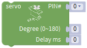，and place it into “do” block，set to pin 9 and delay in 50ms →

\*\*\*\*\*\*\*\*\*\*\*\*\*\*\*\*\*\*\*\*\*\*\*\*\*\*\*\*\*\*\*\*\*\*\*\*\*\*\*\*\*\*\*\*\*\*\*\*\*\*\*\*\*\*\*\*\*\*\*\*\*\*\*\*\*\*\*\*\*\*\*\*\*\*\*\*\*\*\*\*\*\*\*

When pres and hold button 2 for long time(more than 1500ms), buzzer will sound, 1602LCD will display“wait”. Then need to judge if the button2 is pressed, if it it, the signal 0 will be sent.

Drag out , ，，，.

Then we get code string:++++=

\*\*\*\*\*\*\*\*\*\*\*\*\*\*\*\*\*\*\*\*\*\*\*\*\*\*\*\*\*\*\*\*\*\*\*\*\*\*\*\*\*\*\*\*\*\*\*\*\*\*\*\*\*\*\*\*\*\*\*\*\*\*\*\*\*\*\*\*\*\*\*\*\*\*\*\*\*\*\*\*\*\*\*

Duplicateonce,+ =;

Copy blockonce and leave it into “do” block of ，100ms is added when press the button 2.

\*\*\*\*\*\*\*\*\*\*\*\*\*\*\*\*\*\*\*\*\*\*\*\*\*\*\*\*\*\*\*\*\*\*\*\*\*\*\*\*\*\*\*\*\*\*\*\*\*\*\*\*\*\*\*\*\*\*\*\*\*\*\*\*\*\*\*\*\*\*\*\*\*\*\*\*\*\*\*\*\*\*\*

+=

\*\*\*\*\*\*\*\*\*\*\*\*\*\*\*\*\*\*\*\*\*\*\*\*\*\*\*\*\*\*\*\*\*\*\*\*\*\*\*\*\*\*\*\*\*\*\*\*\*\*\*\*\*\*\*\*\*\*\*\*\*\*\*\*\*\*\*\*\*\*\*\*\*\*\*\*\*\*\*\*\*\*\*

Click “variables” →, ，enter “math” →， move out block;

+++=.

\*\*\*\*\*\*\*\*\*\*\*\*\*\*\*\*\*\*\*\*\*\*\*\*\*\*\*\*\*\*\*\*\*\*\*\*\*\*\*\*\*\*\*\*\*\*\*\*\*\*\*\*\*\*\*\*\*\*\*\*\*\*\*\*\*\*\*\*\*\*\*\*\*\*\*\*\*\*\*\*\*\*\*

Drag outblock and leave it beneath the code string ，→；

\*\*\*\*\*\*\*\*\*\*\*\*\*\*\*\*\*\*\*\*\*\*\*\*\*\*\*\*\*\*\*\*\*\*\*\*\*\*\*\*\*\*\*\*\*\*\*\*\*\*\*\*\*\*\*\*\*\*\*\*\*\*\*\*\*\*\*\*\*\*\*\*\*\*\*\*\*\*\*\*\*\*\*

click blue gear icon，appear edit box，move blockintoblock，so the blockturns into.

\*\*\*\*\*\*\*\*\*\*\*\*\*\*\*\*\*\*\*\*\*\*\*\*\*\*\*\*\*\*\*\*\*\*\*\*\*\*\*\*\*\*\*\*\*\*\*\*\*\*\*\*\*\*\*\*\*\*\*\*\*\*\*\*\*\*\*\*\*\*\*\*\*\*\*\*\*\*\*\*\*\*\*

Move out, ,, change “=” into “≥”, change 0 into 15, then we get block:++=(15 means 1500ms).

Enter“Control Output”→，passive buzzer is connected to digital 3, so set pin 3, and NOTE_C5；→;

\*\*\*\*\*\*\*\*\*\*\*\*\*\*\*\*\*\*\*\*\*\*\*\*\*\*\*\*\*\*\*\*\*\*\*\*\*\*\*\*\*\*\*\*\*\*\*\*\*\*\*\*\*\*\*\*\*\*\*\*\*\*\*\*\*\*\*\*\*\*\*\*\*\*\*\*\*\*\*\*\*\*\*

Click "module" → ”Display_module”→ ， tap drop-down icon to select “clear” → ;

Copy twice, change “password：” into“wait”, then get code string:

\*\*\*\*\*\*\*\*\*\*\*\*\*\*\*\*\*\*\*\*\*\*\*\*\*\*\*\*\*\*\*\*\*\*\*\*\*\*\*\*\*\*\*\*\*\*\*\*\*\*\*\*\*\*\*\*\*\*\*\*\*\*\*\*\*\*\*\*\*\*\*\*\*\*\*\*\*\*\*\*\*\*\*

“Control Output”→，set to pin 3.
The button will vibrate when pressing and releasing. Several distinct digital signals will be output. In order to eliminate the vibration, we could delay time for a while. Then move out block, set to 10ms().

\*\*\*\*\*\*\*\*\*\*\*\*\*\*\*\*\*\*\*\*\*\*\*\*\*\*\*\*\*\*\*\*\*\*\*\*\*\*\*\*\*\*\*\*\*\*\*\*\*\*\*\*\*\*\*\*\*\*\*\*\*\*\*\*\*\*\*\*\*\*\*\*\*\*\*\*\*\*\*\*\*\*\*

\*\*\*\*\*\*\*\*\*\*\*\*\*\*\*\*\*\*\*\*\*\*\*\*\*\*\*\*\*\*\*\*\*\*\*\*\*\*\*\*\*\*\*\*\*\*\*\*\*\*\*\*\*\*\*\*\*\*\*\*\*\*\*\*\*\*\*\*\*\*\*\*\*\*\*\*\*\*\*\*\*\*\*

1602LCD shows the password, so we need to initialize 1602 LCD.

Then need to initialize 1602LCD, replicate block, move it into setup block.

;

Move outand blocks.

Copy once, and , move blocks in the following figure:

\*\*\*\*\*\*\*\*\*\*\*\*\*\*\*\*\*\*\*\*\*\*\*\*\*\*\*\*\*\*\*\*\*\*\*\*\*\*\*\*\*\*\*\*\*\*\*\*\*\*\*\*\*\*\*\*\*\*\*\*\*\*\*\*\*\*\*\*\*\*\*\*\*\*\*\*\*\*\*\*\*\*\*

**Buzzer will alarm when the poisonous gas is detected.**

Drag out ，change “procedure” into “auto_sensor”, then get .

For creating variable ,  and  are needed. Then combine them, and modify “item” into “gas”, get block:,  and exist in variable block.

\*\*\*\*\*\*\*\*\*\*\*\*\*\*\*\*\*\*\*\*\*\*\*\*\*\*\*\*\*\*\*\*\*\*\*\*\*\*\*\*\*\*\*\*\*\*\*\*\*\*\*\*\*\*\*\*\*\*\*\*\*\*\*\*\*\*\*\*\*\*\*\*\*\*\*\*\*\*\*\*\*\*\*

Move out , .

++=

\*\*\*\*\*\*\*\*\*\*\*\*\*\*\*\*\*\*\*\*\*\*\*\*\*\*\*\*\*\*\*\*\*\*\*\*\*\*\*\*\*\*\*\*\*\*\*\*\*\*\*\*\*\*\*\*\*\*\*\*\*\*\*\*\*\*\*\*\*\*\*\*\*\*\*\*\*\*\*\*\*\*\*

If the gas concentration value is more than 1000, the buzzer will emit “tick, tick”, otherwise, it won’t.

Drag out, click blue gear icon，appear edit box，move blockintoblock，so the blockturns into. Leave it beneath the block .

\*\*\*\*\*\*\*\*\*\*\*\*\*\*\*\*\*\*\*\*\*\*\*\*\*\*\*\*\*\*\*\*\*\*\*\*\*\*\*\*\*\*\*\*\*\*\*\*\*\*\*\*\*\*\*\*\*\*\*\*\*\*\*\*\*\*\*\*\*\*\*\*\*\*\*\*\*\*\*\*\*\*\*

Drag out ,,, change “=” into “＞”, 0 into 1000.

+++=

Then we create variable and in same way.

\*\*\*\*\*\*\*\*\*\*\*\*\*\*\*\*\*\*\*\*\*\*\*\*\*\*\*\*\*\*\*\*\*\*\*\*\*\*\*\*\*\*\*\*\*\*\*\*\*\*\*\*\*\*\*\*\*\*\*\*\*\*\*\*\*\*\*\*\*\*\*\*\*\*\*\*\*\*\*\*\*\*\*

Select , ; change 0 into 1, ++=

\*\*\*\*\*\*\*\*\*\*\*\*\*\*\*\*\*\*\*\*\*\*\*\*\*\*\*\*\*\*\*\*\*\*\*\*\*\*\*\*\*\*\*\*\*\*\*\*\*\*\*\*\*\*\*\*\*\*\*\*\*\*\*\*\*\*\*\*\*\*\*\*\*\*\*\*\*\*\*\*\*\*\*

Then+=

Drag out,, copy  once,

+++=

\*\*\*\*\*\*\*\*\*\*\*\*\*\*\*\*\*\*\*\*\*\*\*\*\*\*\*\*\*\*\*\*\*\*\*\*\*\*\*\*\*\*\*\*\*\*\*\*\*\*\*\*\*\*\*\*\*\*\*\*\*\*\*\*\*\*\*\*\*\*\*\*\*\*\*\*\*\*\*\*\*\*\*

If the poisonous gas concentration is higher than 1000, “gas” turns into “danger” on App. Selectto display the data.

Click “Text”→， set to “danger”，+=

\*\*\*\*\*\*\*\*\*\*\*\*\*\*\*\*\*\*\*\*\*\*\*\*\*\*\*\*\*\*\*\*\*\*\*\*\*\*\*\*\*\*\*\*\*\*\*\*\*\*\*\*\*\*\*\*\*\*\*\*\*\*\*\*\*\*\*\*\*\*\*\*\*\*\*\*\*\*\*\*\*\*\*

Enter“Control Output”→， set pin 3 and NOTE_A4, then get block:, add delay block , set to 100ms.

Select，set to pin 3 and delay in 100ms. +++=

\*\*\*\*\*\*\*\*\*\*\*\*\*\*\*\*\*\*\*\*\*\*\*\*\*\*\*\*\*\*\*\*\*\*\*\*\*\*\*\*\*\*\*\*\*\*\*\*\*\*\*\*\*\*\*\*\*\*\*\*\*\*\*\*\*\*\*\*\*\*\*\*\*\*\*\*\*\*\*\*\*\*\*

Copy code stringonce， and set last 100ms to 300ms.
Copyonce, +=

\*\*\*\*\*\*\*\*\*\*\*\*\*\*\*\*\*\*\*\*\*\*\*\*\*\*\*\*\*\*\*\*\*\*\*\*\*\*\*\*\*\*\*\*\*\*\*\*\*\*\*\*\*\*\*\*\*\*\*\*\*\*\*\*\*\*\*\*\*\*\*\*\*\*\*\*\*\*\*\*\*\*\*

In case of the poisonous gas concentration is less than 10, the loop is ended. Move out ,,, , change “=” into “＜”, 0 into 10.

And +++=

Drag ,. ++=

\*\*\*\*\*\*\*\*\*\*\*\*\*\*\*\*\*\*\*\*\*\*\*\*\*\*\*\*\*\*\*\*\*\*\*\*\*\*\*\*\*\*\*\*\*\*\*\*\*\*\*\*\*\*\*\*\*\*\*\*\*\*\*\*\*\*\*\*\*\*\*\*\*\*\*\*\*\*\*\*\*\*\*

Click “Control” →， +=

Copy once, add it to complete the whole code string.

\*\*\*\*\*\*\*\*\*\*\*\*\*\*\*\*\*\*\*\*\*\*\*\*\*\*\*\*\*\*\*\*\*\*\*\*\*\*\*\*\*\*\*\*\*\*\*\*\*\*\*\*\*\*\*\*\*\*\*\*\*\*\*\*\*\*\*\*\*\*\*\*\*\*\*\*\*\*\*\*\*\*\*

\*\*\*\*\*\*\*\*\*\*\*\*\*\*\*\*\*\*\*\*\*\*\*\*\*\*\*\*\*\*\*\*\*\*\*\*\*\*\*\*\*\*\*\*\*\*\*\*\*\*\*\*\*\*\*\*\*\*\*\*\*\*\*\*\*\*\*\*\*\*\*\*\*\*\*\*\*\*\*\*\*\*\*

**Photocell sensor and PIR motion sensors control white LED.**

Then we use same way to create variable  and .

Drag out ，→， then  and  will appear in “variables”.

\*\*\*\*\*\*\*\*\*\*\*\*\*\*\*\*\*\*\*\*\*\*\*\*\*\*\*\*\*\*\*\*\*\*\*\*\*\*\*\*\*\*\*\*\*\*\*\*\*\*\*\*\*\*\*\*\*\*\*\*\*\*\*\*\*\*\*\*\*\*\*\*\*\*\*\*\*\*\*\*\*\*\*

Move into “do: block
Click “Analog Read” →, photocell sensor is linked with A1, so set to A1. +=.

\*\*\*\*\*\*\*\*\*\*\*\*\*\*\*\*\*\*\*\*\*\*\*\*\*\*\*\*\*\*\*\*\*\*\*\*\*\*\*\*\*\*\*\*\*\*\*\*\*\*\*\*\*\*\*\*\*\*\*\*\*\*\*\*\*\*\*\*\*\*\*\*\*\*\*\*\*\*\*\*\*\*\*

 When the light intensity is less than 300 and PIR motion sensor detects people at same time, LED will light on, otherwise, LED is off.

Drag, →

\*\*\*\*\*\*\*\*\*\*\*\*\*\*\*\*\*\*\*\*\*\*\*\*\*\*\*\*\*\*\*\*\*\*\*\*\*\*\*\*\*\*\*\*\*\*\*\*\*\*\*\*\*\*\*\*\*\*\*\*\*\*\*\*\*\*\*\*\*\*\*\*\*\*\*\*\*\*\*\*\*\*\*

Move out , , , change 0 into 300, “=” into “＜”;

+++=

\*\*\*\*\*\*\*\*\*\*\*\*\*\*\*\*\*\*\*\*\*\*\*\*\*\*\*\*\*\*\*\*\*\*\*\*\*\*\*\*\*\*\*\*\*\*\*\*\*\*\*\*\*\*\*\*\*\*\*\*\*\*\*\*\*\*\*\*\*\*\*\*\*\*\*\*\*\*\*\*\*\*\*

Enter “Variables” →， +=

\*\*\*\*\*\*\*\*\*\*\*\*\*\*\*\*\*\*\*\*\*\*\*\*\*\*\*\*\*\*\*\*\*\*\*\*\*\*\*\*\*\*\*\*\*\*\*\*\*\*\*\*\*\*\*\*\*\*\*\*\*\*\*\*\*\*\*\*\*\*\*\*\*\*\*\*\*\*\*\*\*\*\*

Select， set to pin 2, then +=

\*\*\*\*\*\*\*\*\*\*\*\*\*\*\*\*\*\*\*\*\*\*\*\*\*\*\*\*\*\*\*\*\*\*\*\*\*\*\*\*\*\*\*\*\*\*\*\*\*\*\*\*\*\*\*\*\*\*\*\*\*\*\*\*\*\*\*\*\*\*\*\*\*\*\*\*\*\*\*\*\*\*\*

Move out block ，

+ = ，next to judge if there is person nearby,  is needed. If it is，white LED will be on, conversely, turn off.

\*\*\*\*\*\*\*\*\*\*\*\*\*\*\*\*\*\*\*\*\*\*\*\*\*\*\*\*\*\*\*\*\*\*\*\*\*\*\*\*\*\*\*\*\*\*\*\*\*\*\*\*\*\*\*\*\*\*\*\*\*\*\*\*\*\*\*\*\*\*\*\*\*\*\*\*\*\*\*\*\*\*\*

Select ,, , modify 0 into 1.
+++=;

\*\*\*\*\*\*\*\*\*\*\*\*\*\*\*\*\*\*\*\*\*\*\*\*\*\*\*\*\*\*\*\*\*\*\*\*\*\*\*\*\*\*\*\*\*\*\*\*\*\*\*\*\*\*\*\*\*\*\*\*\*\*\*\*\*\*\*\*\*\*\*\*\*\*\*\*\*\*\*\*\*\*\*

Enter“Control Output”→, white LED is attached to digital 13, so set to 13→，copy this block once and set to LOW.

\*\*\*\*\*\*\*\*\*\*\*\*\*\*\*\*\*\*\*\*\*\*\*\*\*\*\*\*\*\*\*\*\*\*\*\*\*\*\*\*\*\*\*\*\*\*\*\*\*\*\*\*\*\*\*\*\*\*\*\*\*\*\*\*\*\*\*\*\*\*\*\*\*\*\*\*\*\*\*\*\*\*\*

**When steam sensor detects water, servo 2 will rotate and make window closed; conversely, the window will be open.**

Combine and , displace “value” with “water” →；then the variable  and are created.

\*\*\*\*\*\*\*\*\*\*\*\*\*\*\*\*\*\*\*\*\*\*\*\*\*\*\*\*\*\*\*\*\*\*\*\*\*\*\*\*\*\*\*\*\*\*\*\*\*\*\*\*\*\*\*\*\*\*\*\*\*\*\*\*\*\*\*\*\*\*\*\*\*\*\*\*\*\*\*\*\*\*\*

Move block into do block.
Enter “Analog Read” → , steam sensor is connected to A3, so set to pin A3,+=

\*\*\*\*\*\*\*\*\*\*\*\*\*\*\*\*\*\*\*\*\*\*\*\*\*\*\*\*\*\*\*\*\*\*\*\*\*\*\*\*\*\*\*\*\*\*\*\*\*\*\*\*\*\*\*\*\*\*\*\*\*\*\*\*\*\*\*\*\*\*\*\*\*\*\*\*\*\*\*\*\*\*\*

In this lesson, servo 2 will rotate(window is closed) when the analog value of steam is greater than 800, otherwise, the window will be open.
Selectand place it into do block of，click blue gear icon，appear edit box，move blockintoblock，so the blockturns into,

\*\*\*\*\*\*\*\*\*\*\*\*\*\*\*\*\*\*\*\*\*\*\*\*\*\*\*\*\*\*\*\*\*\*\*\*\*\*\*\*\*\*\*\*\*\*\*\*\*\*\*\*\*\*\*\*\*\*\*\*\*\*\*\*\*\*\*\*\*\*\*\*\*\*\*\*\*\*\*\*\*\*\*

Drag out block,, ,. Change “=” into “＞” and 0 into 800,++,+=

\*\*\*\*\*\*\*\*\*\*\*\*\*\*\*\*\*\*\*\*\*\*\*\*\*\*\*\*\*\*\*\*\*\*\*\*\*\*\*\*\*\*\*\*\*\*\*\*\*\*\*\*\*\*\*\*\*\*\*\*\*\*\*\*\*\*\*\*\*\*\*\*\*\*\*\*\*\*\*\*\*\*\*

Then we need to create another variable “flag2” →→，.
Selectand, change 0 into 1, then ++=

\*\*\*\*\*\*\*\*\*\*\*\*\*\*\*\*\*\*\*\*\*\*\*\*\*\*\*\*\*\*\*\*\*\*\*\*\*\*\*\*\*\*\*\*\*\*\*\*\*\*\*\*\*\*\*\*\*\*\*\*\*\*\*\*\*\*\*\*\*\*\*\*\*\*\*\*\*\*\*\*\*\*\*

+=

\*\*\*\*\*\*\*\*\*\*\*\*\*\*\*\*\*\*\*\*\*\*\*\*\*\*\*\*\*\*\*\*\*\*\*\*\*\*\*\*\*\*\*\*\*\*\*\*\*\*\*\*\*\*\*\*\*\*\*\*\*\*\*\*\*\*\*\*\*\*\*\*\*\*\*\*\*\*\*\*\*\*\*

Move out  ,and , change 0 into 1. +++=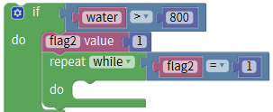.

\*\*\*\*\*\*\*\*\*\*\*\*\*\*\*\*\*\*\*\*\*\*\*\*\*\*\*\*\*\*\*\*\*\*\*\*\*\*\*\*\*\*\*\*\*\*\*\*\*\*\*\*\*\*\*\*\*\*\*\*\*\*\*\*\*\*\*\*\*\*\*\*\*\*\*\*\*\*\*\*\*\*\*

When the analog value of steam is greater than 800, the “water” is replaced by will “rain” on app.
+=.

\*\*\*\*\*\*\*\*\*\*\*\*\*\*\*\*\*\*\*\*\*\*\*\*\*\*\*\*\*\*\*\*\*\*\*\*\*\*\*\*\*\*\*\*\*\*\*\*\*\*\*\*\*\*\*\*\*\*\*\*\*\*\*\*\*\*\*\*\*\*\*\*\*\*\*\*\*\*\*\*\*\*\*

Click “Text” → , modify “hello” into “rain”，+=.

\*\*\*\*\*\*\*\*\*\*\*\*\*\*\*\*\*\*\*\*\*\*\*\*\*\*\*\*\*\*\*\*\*\*\*\*\*\*\*\*\*\*\*\*\*\*\*\*\*\*\*\*\*\*\*\*\*\*\*\*\*\*\*\*\*\*\*\*\*\*\*\*\*\*\*\*\*\*\*\*\*\*\*

Click “Drive_module” → ，servo is connected to digital 10, then set to pin 10 and 180°，delay in 300ms. Then we get block:, +=

\*\*\*\*\*\*\*\*\*\*\*\*\*\*\*\*\*\*\*\*\*\*\*\*\*\*\*\*\*\*\*\*\*\*\*\*\*\*\*\*\*\*\*\*\*\*\*\*\*\*\*\*\*\*\*\*\*\*\*\*\*\*\*\*\*\*\*\*\*\*\*\*\*\*\*\*\*\*\*\*\*\*\*

Then add delay block, set to 100ms, need to initialize serve 2 firstly, copy block and place it into setup block, set to pin 10 and 10°， delay in 300ms.
If the analog value detected is less than 30, the loop will stop，copyonce.

\*\*\*\*\*\*\*\*\*\*\*\*\*\*\*\*\*\*\*\*\*\*\*\*\*\*\*\*\*\*\*\*\*\*\*\*\*\*\*\*\*\*\*\*\*\*\*\*\*\*\*\*\*\*\*\*\*\*\*\*\*\*\*\*\*\*\*\*\*\*\*\*\*\*\*\*\*\*\*\*\*\*\*

+=

\*\*\*\*\*\*\*\*\*\*\*\*\*\*\*\*\*\*\*\*\*\*\*\*\*\*\*\*\*\*\*\*\*\*\*\*\*\*\*\*\*\*\*\*\*\*\*\*\*\*\*\*\*\*\*\*\*\*\*\*\*\*\*\*\*\*\*\*\*\*\*\*\*\*\*\*\*\*\*\*\*\*\*

Separately drag out ,, , , change “=” into “＜”, 0 into 30. +++=

Drag out and,++=.

Enter ”Control” →, +=;

\*\*\*\*\*\*\*\*\*\*\*\*\*\*\*\*\*\*\*\*\*\*\*\*\*\*\*\*\*\*\*\*\*\*\*\*\*\*\*\*\*\*\*\*\*\*\*\*\*\*\*\*\*\*\*\*\*\*\*\*\*\*\*\*\*\*\*\*\*\*\*\*\*\*\*\*\*\*\*\*\*\*\*

Move  block into “else” block, drag out block.
Select and , change ‘a’ into ‘u’, “=” into “≠”; then get ++=.

\*\*\*\*\*\*\*\*\*\*\*\*\*\*\*\*\*\*\*\*\*\*\*\*\*\*\*\*\*\*\*\*\*\*\*\*\*\*\*\*\*\*\*\*\*\*\*\*\*\*\*\*\*\*\*\*\*\*\*\*\*\*\*\*\*\*\*\*\*\*\*\*\*\*\*\*\*\*\*\*\*\*\*

Copyonce，change u into n.

++=;

\*\*\*\*\*\*\*\*\*\*\*\*\*\*\*\*\*\*\*\*\*\*\*\*\*\*\*\*\*\*\*\*\*\*\*\*\*\*\*\*\*\*\*\*\*\*\*\*\*\*\*\*\*\*\*\*\*\*\*\*\*\*\*\*\*\*\*\*\*\*\*\*\*\*\*\*\*\*\*\*\*\*\*

“Control Output”→，set to pin 10，0°，delay in 10ms.

\*\*\*\*\*\*\*\*\*\*\*\*\*\*\*\*\*\*\*\*\*\*\*\*\*\*\*\*\*\*\*\*\*\*\*\*\*\*\*\*\*\*\*\*\*\*\*\*\*\*\*\*\*\*\*\*\*\*\*\*\*\*\*\*\*\*\*\*\*\*\*\*\*\*\*\*\*\*\*\*\*\*\*

**Now, we design the code that buzzer alarms when deprived of water.**

Create variable andfirst→,

Then they are founded in variables block.

，+=,

\*\*\*\*\*\*\*\*\*\*\*\*\*\*\*\*\*\*\*\*\*\*\*\*\*\*\*\*\*\*\*\*\*\*\*\*\*\*\*\*\*\*\*\*\*\*\*\*\*\*\*\*\*\*\*\*\*\*\*\*\*\*\*\*\*\*\*\*\*\*\*\*\*\*\*\*\*\*\*\*\*\*\*

Enter “Analog Read”→，soil sensor is linked with A2 , then+=，when the soil humidity value is less than 300, the buzzer will alarm with the “tick,tick” sound. On the contrary, when soil humidity value is equivalent to or less than 10, the loop is ended.

\*\*\*\*\*\*\*\*\*\*\*\*\*\*\*\*\*\*\*\*\*\*\*\*\*\*\*\*\*\*\*\*\*\*\*\*\*\*\*\*\*\*\*\*\*\*\*\*\*\*\*\*\*\*\*\*\*\*\*\*\*\*\*\*\*\*\*\*\*\*\*\*\*\*\*\*\*\*\*\*\*\*\*

Drag out , place it into do block of 
click blue gear icon，appear edit box，move blockintoblock，so the blockturns into.
Move out, ,, ; alter “=” into “\<”,0 into 300, then get code string:++=.

\*\*\*\*\*\*\*\*\*\*\*\*\*\*\*\*\*\*\*\*\*\*\*\*\*\*\*\*\*\*\*\*\*\*\*\*\*\*\*\*\*\*\*\*\*\*\*\*\*\*\*\*\*\*\*\*\*\*\*\*\*\*\*\*\*\*\*\*\*\*\*\*\*\*\*\*\*\*\*\*\*\*\*

Then copy again, modify“\<” into “\>”, “300” into “10”→

\*\*\*\*\*\*\*\*\*\*\*\*\*\*\*\*\*\*\*\*\*\*\*\*\*\*\*\*\*\*\*\*\*\*\*\*\*\*\*\*\*\*\*\*\*\*\*\*\*\*\*\*\*\*\*\*\*\*\*\*\*\*\*\*\*\*\*\*\*\*\*\*\*\*\*\*\*\*\*\*\*\*\*

Combine these blocks: ++=.

Next let’s create another variable “flag3”();

\*\*\*\*\*\*\*\*\*\*\*\*\*\*\*\*\*\*\*\*\*\*\*\*\*\*\*\*\*\*\*\*\*\*\*\*\*\*\*\*\*\*\*\*\*\*\*\*\*\*\*\*\*\*\*\*\*\*\*\*\*\*\*\*\*\*\*\*\*\*\*\*\*\*\*\*\*\*\*\*\*\*\*

You could refer to the method in the previous lessons.
Move  and out, modify 0 into 1. + +=.
+=.

\*\*\*\*\*\*\*\*\*\*\*\*\*\*\*\*\*\*\*\*\*\*\*\*\*\*\*\*\*\*\*\*\*\*\*\*\*\*\*\*\*\*\*\*\*\*\*\*\*\*\*\*\*\*\*\*\*\*\*\*\*\*\*\*\*\*\*\*\*\*\*\*\*\*\*\*\*\*\*\*\*\*\*

Drag out , and copyblock;

+++=

\*\*\*\*\*\*\*\*\*\*\*\*\*\*\*\*\*\*\*\*\*\*\*\*\*\*\*\*\*\*\*\*\*\*\*\*\*\*\*\*\*\*\*\*\*\*\*\*\*\*\*\*\*\*\*\*\*\*\*\*\*\*\*\*\*\*\*\*\*\*\*\*\*\*\*\*\*\*\*\*\*\*\*

If soil humidity analog value is greater than 800, the soil will turn into “hydropenia” on APP, move out ,+=

\*\*\*\*\*\*\*\*\*\*\*\*\*\*\*\*\*\*\*\*\*\*\*\*\*\*\*\*\*\*\*\*\*\*\*\*\*\*\*\*\*\*\*\*\*\*\*\*\*\*\*\*\*\*\*\*\*\*\*\*\*\*\*\*\*\*\*\*\*\*\*\*\*\*\*\*\*\*\*\*\*\*\*

Copyonce，change “hello” into “hydropenia, →，

\*\*\*\*\*\*\*\*\*\*\*\*\*\*\*\*\*\*\*\*\*\*\*\*\*\*\*\*\*\*\*\*\*\*\*\*\*\*\*\*\*\*\*\*\*\*\*\*\*\*\*\*\*\*\*\*\*\*\*\*\*\*\*\*\*\*\*\*\*\*\*\*\*\*\*\*\*\*\*\*\*\*\*

Click“Control Output”→， set to pin3, NOTE_A4 and 1/8 beat, +=;

\*\*\*\*\*\*\*\*\*\*\*\*\*\*\*\*\*\*\*\*\*\*\*\*\*\*\*\*\*\*\*\*\*\*\*\*\*\*\*\*\*\*\*\*\*\*\*\*\*\*\*\*\*\*\*\*\*\*\*\*\*\*\*\*\*\*\*\*\*\*\*\*\*\*\*\*\*\*\*\*\*\*\*

Addblock, set to 100ms,
Replicateand , then get code string:

\*\*\*\*\*\*\*\*\*\*\*\*\*\*\*\*\*\*\*\*\*\*\*\*\*\*\*\*\*\*\*\*\*\*\*\*\*\*\*\*\*\*\*\*\*\*\*\*\*\*\*\*\*\*\*\*\*\*\*\*\*\*\*\*\*\*\*\*\*\*\*\*\*\*\*\*\*\*\*\*\*\*\*

Duplicatecode string，and set the last 100ms to 300ms.
Copy once, the following code string is for your reference:

\*\*\*\*\*\*\*\*\*\*\*\*\*\*\*\*\*\*\*\*\*\*\*\*\*\*\*\*\*\*\*\*\*\*\*\*\*\*\*\*\*\*\*\*\*\*\*\*\*\*\*\*\*\*\*\*\*\*\*\*\*\*\*\*\*\*\*\*\*\*\*\*\*\*\*\*\*\*\*\*\*\*\*However, when the analog value is less than or equivalent to 10, the loop will stop. Drag out, +=

\*\*\*\*\*\*\*\*\*\*\*\*\*\*\*\*\*\*\*\*\*\*\*\*\*\*\*\*\*\*\*\*\*\*\*\*\*\*\*\*\*\*\*\*\*\*\*\*\*\*\*\*\*\*\*\*\*\*\*\*\*\*\*\*\*\*\*\*\*\*\*\*\*\*\*\*\*\*\*\*\*\*\*

Move out ,,,; modify 0 into 10, “=” into “≤”.

Then ++++=.

\*\*\*\*\*\*\*\*\*\*\*\*\*\*\*\*\*\*\*\*\*\*\*\*\*\*\*\*\*\*\*\*\*\*\*\*\*\*\*\*\*\*\*\*\*\*\*\*\*\*\*\*\*\*\*\*\*\*\*\*\*\*\*\*\*\*\*\*\*\*\*\*\*\*\*\*\*\*\*\*\*\*\*

Drag outand .

++ =

\*\*\*\*\*\*\*\*\*\*\*\*\*\*\*\*\*\*\*\*\*\*\*\*\*\*\*\*\*\*\*\*\*\*\*\*\*\*\*\*\*\*\*\*\*\*\*\*\*\*\*\*\*\*\*\*\*\*\*\*\*\*\*\*\*\*\*\*\*\*\*\*\*\*\*\*\*\*\*\*\*\*\*

Replicate block;

\*\*\*\*\*\*\*\*\*\*\*\*\*\*\*\*\*\*\*\*\*\*\*\*\*\*\*\*\*\*\*\*\*\*\*\*\*\*\*\*\*\*\*\*\*\*\*\*\*\*\*\*\*\*\*\*\*\*\*\*\*\*\*\*\*\*\*\*\*\*\*\*\*\*\*\*\*\*\*\*\*\*\*

Click “functions”→, add , the whole code string is below:

Click “variable” to drag , +=. \*\*\*\*\*\*\*\*\*\*\*\*\*\*\*\*\*\*\*\*\*\*\*\*\*\*\*\*\*\*\*\*\*\*\*\*\*\*\*\*\*\*\*\*\*\*\*\*\*\*\*\*\*\*\*\*\*\*\*\*\*\*\*\*\*\*\*\*\*\*\*\*\*\*\*\*\*\*\*\*\*\*\*

**There are different icons on App, you could use them to make smart home to perform distinct function.**

Drag out ，change “procedure” into “pwm_control”, then get block.

\*\*\*\*\*\*\*\*\*\*\*\*\*\*\*\*\*\*\*\*\*\*\*\*\*\*\*\*\*\*\*\*\*\*\*\*\*\*\*\*\*\*\*\*\*\*\*\*\*\*\*\*\*\*\*\*\*\*\*\*\*\*\*\*\*\*\*\*\*\*\*\*\*\*\*\*\*\*\*\*\*\*\*

Need to make a “choice” judgement. We use block，drag out , click blue icon，appear edit box, draginto block，the get block, move3 times into →(). Then get . +=.

\*\*\*\*\*\*\*\*\*\*\*\*\*\*\*\*\*\*\*\*\*\*\*\*\*\*\*\*\*\*\*\*\*\*\*\*\*\*\*\*\*\*\*\*\*\*\*\*\*\*\*\*\*\*\*\*\*\*\*\*\*\*\*\*\*\*\*\*\*\*\*\*\*\*\*\*\*\*\*\*\*\*\*

Move outblock,+ = 

\*\*\*\*\*\*\*\*\*\*\*\*\*\*\*\*\*\*\*\*\*\*\*\*\*\*\*\*\*\*\*\*\*\*\*\*\*\*\*\*\*\*\*\*\*\*\*\*\*\*\*\*\*\*\*\*\*\*\*\*\*\*\*\*\*\*\*\*\*\*\*\*\*\*\*\*\*\*\*\*\*\*\*

control the door(the angle of servo 1), door shows the corresponding value.
Move out blockinto “case” block，when drag and release button, signal “t 50 \##” will be transmitted to Bluetooth module，（t: incipient character, 50 implies the angel of servo 1,\##: end character）

\*\*\*\*\*\*\*\*\*\*\*\*\*\*\*\*\*\*\*\*\*\*\*\*\*\*\*\*\*\*\*\*\*\*\*\*\*\*\*\*\*\*\*\*\*\*\*\*\*\*\*\*\*\*\*\*\*\*\*\*\*\*\*\*\*\*\*\*\*\*\*\*\*\*\*\*\*\*\*\*\*\*\*

Next to produce the variable , and are needed, click drop-down triangle to select “string”, delete “hello”, change “item” into servo1→. Thus, is created.

\*\*\*\*\*\*\*\*\*\*\*\*\*\*\*\*\*\*\*\*\*\*\*\*\*\*\*\*\*\*\*\*\*\*\*\*\*\*\*\*\*\*\*\*\*\*\*\*\*\*\*\*\*\*\*\*\*\*\*\*\*\*\*\*\*\*\*\*\*\*\*\*\*\*\*\*\*\*\*\*\*\*\*

Follow the same way to create variable  and ().

\*\*\*\*\*\*\*\*\*\*\*\*\*\*\*\*\*\*\*\*\*\*\*\*\*\*\*\*\*\*\*\*\*\*\*\*\*\*\*\*\*\*\*\*\*\*\*\*\*\*\*\*\*\*\*\*\*\*\*\*\*\*\*\*\*\*\*\*\*\*\*\*\*\*\*\*\*\*\*\*\*\*\*

Dragand into case‘t’，

Enter “serial port”→，combine this block with , alter ‘a’ into ‘\##’，. The angle of servo1 is integer, therefore, the string is supposed to transfer into integer.

\*\*\*\*\*\*\*\*\*\*\*\*\*\*\*\*\*\*\*\*\*\*\*\*\*\*\*\*\*\*\*\*\*\*\*\*\*\*\*\*\*\*\*\*\*\*\*\*\*\*\*\*\*\*\*\*\*\*\*\*\*\*\*\*\*\*\*\*\*\*\*\*\*\*\*\*\*\*\*\*\*\*\*

Click “Tex” to drag out  into ;

Drag out , ++=

;

\*\*\*\*\*\*\*\*\*\*\*\*\*\*\*\*\*\*\*\*\*\*\*\*\*\*\*\*\*\*\*\*\*\*\*\*\*\*\*\*\*\*\*\*\*\*\*\*\*\*\*\*\*\*\*\*\*\*\*\*\*\*\*\*\*\*\*\*\*\*\*\*\*\*\*\*\*\*\*\*\*\*\*

Placeinto case‘t ’，set to pin 9, delay in 300ms; drag out ;

+=

restrains the windows(servo 2). Window displays the corresponding value,
Click “Text” →into “case” block，when drag and release button, signal “u 34 \##” will be sent to Bluetooth module,alter ‘a’ into ‘u’（u: incipient character, 34 stands for angle of servo 2,\##: end character), create two variables to save the angle data of servo 2.

\*\*\*\*\*\*\*\*\*\*\*\*\*\*\*\*\*\*\*\*\*\*\*\*\*\*\*\*\*\*\*\*\*\*\*\*\*\*\*\*\*\*\*\*\*\*\*\*\*\*\*\*\*\*\*\*\*\*\*\*\*\*\*\*\*\*\*\*\*\*\*\*\*\*\*\*\*\*\*\*\*\*\*

Next, follow the same way to establish the variable  and .
Drag out and , delete “hello”. Alter “item” into “servo2”，click drop-down triangle to select string. (), then we get block，

\*\*\*\*\*\*\*\*\*\*\*\*\*\*\*\*\*\*\*\*\*\*\*\*\*\*\*\*\*\*\*\*\*\*\*\*\*\*\*\*\*\*\*\*\*\*\*\*\*\*\*\*\*\*\*\*\*\*\*\*\*\*\*\*\*\*\*\*\*\*\*\*\*\*\*\*\*\*\*\*\*\*\*

Follow the same way() to produce block. Then we get block.
Move out  and , +=

\*\*\*\*\*\*\*\*\*\*\*\*\*\*\*\*\*\*\*\*\*\*\*\*\*\*\*\*\*\*\*\*\*\*\*\*\*\*\*\*\*\*\*\*\*\*\*\*\*\*\*\*\*\*\*\*\*\*\*\*\*\*\*\*\*\*\*\*\*\*\*\*\*\*\*\*\*\*\*\*\*\*\*

Copy block, the angle of servo 2 is integer, convert character into integer, replicateand .

\*\*\*\*\*\*\*\*\*\*\*\*\*\*\*\*\*\*\*\*\*\*\*\*\*\*\*\*\*\*\*\*\*\*\*\*\*\*\*\*\*\*\*\*\*\*\*\*\*\*\*\*\*\*\*\*\*\*\*\*\*\*\*\*\*\*\*\*\*\*\*\*\*\*\*\*\*\*\*\*\*\*\*

+++=

\*\*\*\*\*\*\*\*\*\*\*\*\*\*\*\*\*\*\*\*\*\*\*\*\*\*\*\*\*\*\*\*\*\*\*\*\*\*\*\*\*\*\*\*\*\*\*\*\*\*\*\*\*\*\*\*\*\*\*\*\*\*\*\*\*\*\*\*\*\*\*\*\*\*\*\*\*\*\*\*\*\*\*

Copy , set to pin 10, delay in 300ms duplicate once, combine this two blocks →.

\*\*\*\*\*\*\*\*\*\*\*\*\*\*\*\*\*\*\*\*\*\*\*\*\*\*\*\*\*\*\*\*\*\*\*\*\*\*\*\*\*\*\*\*\*\*\*\*\*\*\*\*\*\*\*\*\*\*\*\*\*\*\*\*\*\*\*\*\*\*\*\*\*\*\*\*\*\*\*\*\*\*\*

\*\*\*\*\*\*\*\*\*\*\*\*\*\*\*\*\*\*\*\*\*\*\*\*\*\*\*\*\*\*\*\*\*\*\*\*\*\*\*\*\*\*\*\*\*\*\*\*\*\*\*\*\*\*\*\*\*\*\*\*\*\*\*\*\*\*\*\*\*\*\*\*\*\*\*\*\*\*\*\*\*\*\*

decides the yellow LED brightness，led2 displays the corresponding PWM value.
Dragblock into case，when drag and release button, signal “v 100 \##” will be sent to Bluetooth module, modify ‘a’ into ‘v’（v:incipient character, 100 represents the PWM value of led2, \##: end character)，next to create two variables to save PWM value of LED（led2).

\*\*\*\*\*\*\*\*\*\*\*\*\*\*\*\*\*\*\*\*\*\*\*\*\*\*\*\*\*\*\*\*\*\*\*\*\*\*\*\*\*\*\*\*\*\*\*\*\*\*\*\*\*\*\*\*\*\*\*\*\*\*\*\*\*\*\*\*\*\*\*\*\*\*\*\*\*\*\*\*\*\*\*

restrains the windows(servo 2). Window displays the corresponding value,
when drag and release button, signal “u 34 \##” will be sent to Bluetooth module, alter ‘a’ into ‘u’（u: incipient character, 34 stands for angle of servo 2,\##: end character), create two variables to save the angle data of servo 2.

\*\*\*\*\*\*\*\*\*\*\*\*\*\*\*\*\*\*\*\*\*\*\*\*\*\*\*\*\*\*\*\*\*\*\*\*\*\*\*\*\*\*\*\*\*\*\*\*\*\*\*\*\*\*\*\*\*\*\*\*\*\*\*\*\*\*\*\*\*\*\*\*\*\*\*\*\*\*\*\*\*\*\*

Move out  and ; combine these blocks, alter “item” into“led2”, get and create variable. According to same method we get , then  is created.

\*\*\*\*\*\*\*\*\*\*\*\*\*\*\*\*\*\*\*\*\*\*\*\*\*\*\*\*\*\*\*\*\*\*\*\*\*\*\*\*\*\*\*\*\*\*\*\*\*\*\*\*\*\*\*\*\*\*\*\*\*\*\*\*\*\*\*\*\*\*\*\*\*\*\*\*\*\*\*\*\*\*\*

Click“Variables”to get blockand . Place them into case‘v’，

\*\*\*\*\*\*\*\*\*\*\*\*\*\*\*\*\*\*\*\*\*\*\*\*\*\*\*\*\*\*\*\*\*\*\*\*\*\*\*\*\*\*\*\*\*\*\*\*\*\*\*\*\*\*\*\*\*\*\*\*\*\*\*\*\*\*\*\*\*\*\*\*\*\*\*\*\*\*\*\*\*\*\*

Copyonce, +=. The PWM value is integer, need to convert character into integer. Therefore, drag from “Text” and place into . And move out.

\*\*\*\*\*\*\*\*\*\*\*\*\*\*\*\*\*\*\*\*\*\*\*\*\*\*\*\*\*\*\*\*\*\*\*\*\*\*\*\*\*\*\*\*\*\*\*\*\*\*\*\*\*\*\*\*\*\*\*\*\*\*\*\*\*\*\*\*\*\*\*\*\*\*\*\*\*\*\*\*\*\*\*

++=.
Move out block into case‘v’ block, yellow LED is linked with digital 5(PWM port), set to pin 5 . Then combine block  with .

\*\*\*\*\*\*\*\*\*\*\*\*\*\*\*\*\*\*\*\*\*\*\*\*\*\*\*\*\*\*\*\*\*\*\*\*\*\*\*\*\*\*\*\*\*\*\*\*\*\*\*\*\*\*\*\*\*\*\*\*\*\*\*\*\*\*\*\*\*\*\*\*\*\*\*\*\*\*\*\*\*\*\*

+ =;
decides the speed of fan, “fans” shows the corresponding PWM value.

\*\*\*\*\*\*\*\*\*\*\*\*\*\*\*\*\*\*\*\*\*\*\*\*\*\*\*\*\*\*\*\*\*\*\*\*\*\*\*\*\*\*\*\*\*\*\*\*\*\*\*\*\*\*\*\*\*\*\*\*\*\*\*\*\*\*\*\*\*\*\*\*\*\*\*\*\*\*\*\*\*\*\*

Dragblock into case，when drag and release button, signal “w 153 \##” will be transmitted to Bluetooth module, modify ‘a’ into ‘w’（w:incipient character, 153 represents the PWM value of led2, \##: end character)，next to create two variables to save PWM value of LED（led2).
We use same way to produce variable  and 
through .

\*\*\*\*\*\*\*\*\*\*\*\*\*\*\*\*\*\*\*\*\*\*\*\*\*\*\*\*\*\*\*\*\*\*\*\*\*\*\*\*\*\*\*\*\*\*\*\*\*\*\*\*\*\*\*\*\*\*\*\*\*\*\*\*\*\*\*\*\*\*\*\*\*\*\*\*\*\*\*\*\*\*\*

Click“Variables”to drag out blockand into case‘w’，
Copy again. +=. The PWM value is integer, so need to transfer character into integer.

\*\*\*\*\*\*\*\*\*\*\*\*\*\*\*\*\*\*\*\*\*\*\*\*\*\*\*\*\*\*\*\*\*\*\*\*\*\*\*\*\*\*\*\*\*\*\*\*\*\*\*\*\*\*\*\*\*\*\*\*\*\*\*\*\*\*\*\*\*\*\*\*\*\*\*\*\*\*\*\*\*\*\*

Click “Text” to move out block, and drag out .
++= ;

\*\*\*\*\*\*\*\*\*\*\*\*\*\*\*\*\*\*\*\*\*\*\*\*\*\*\*\*\*\*\*\*\*\*\*\*\*\*\*\*\*\*\*\*\*\*\*\*\*\*\*\*\*\*\*\*\*\*\*\*\*\*\*\*\*\*\*\*\*\*\*\*\*\*\*\*\*\*\*\*\*\*\*

Click “Drive_module”→，put this block into case‘t ’，it can alter pwm value to decide the rotation speed of fan.
INA and INB pin of fan are linked with digital 7 and 6. Set to pin 7and LOW for INA, which can make fan turn clockwise and blow outward. Set INB to pin 6(PWM port), move out  from “Variables”+=.

\*\*\*\*\*\*\*\*\*\*\*\*\*\*\*\*\*\*\*\*\*\*\*\*\*\*\*\*\*\*\*\*\*\*\*\*\*\*\*\*\*\*\*\*\*\*\*\*\*\*\*\*\*\*\*\*\*\*\*\*\*\*\*\*\*\*\*\*\*\*\*\*\*\*\*\*\*\*\*\*\*\*\*

Need to initialize fan first, copy again and place it into “setup” block. In initial status, fan stops turning, set INA to pin 7, HIGH and INB to pin6, HIGH.

The code of function of door, window, led2 and fan is completed.

Enter “variables” to select block,+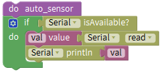=.

\*\*\*\*\*\*\*\*\*\*\*\*\*\*\*\*\*\*\*\*\*\*\*\*\*\*\*\*\*\*\*\*\*\*\*\*\*\*\*\*\*\*\*\*\*\*\*\*\*\*\*\*\*\*\*\*\*\*\*\*\*\*\*\*\*\*\*\*\*\*\*\*\*\*\*\*\*\*\*\*\*\*\*

Next to compete the rest code. Click**，**photocell sensor starts detecting light intensity. “light” shows the detected data.

Move blockinto “case” block，the signal “h” will be transmitted when click**** icon.

\*\*\*\*\*\*\*\*\*\*\*\*\*\*\*\*\*\*\*\*\*\*\*\*\*\*\*\*\*\*\*\*\*\*\*\*\*\*\*\*\*\*\*\*\*\*\*\*\*\*\*\*\*\*\*\*\*\*\*\*\*\*\*\*\*\*\*\*\*\*\*\*\*\*\*\*\*\*\*\*\*\*\*

Drag and . add delay block and set to 100ms.++++=;

\*\*\*\*\*\*\*\*\*\*\*\*\*\*\*\*\*\*\*\*\*\*\*\*\*\*\*\*\*\*\*\*\*\*\*\*\*\*\*\*\*\*\*\*\*\*\*\*\*\*\*\*\*\*\*\*\*\*\*\*\*\*\*\*\*\*\*\*\*\*\*\*\*\*\*\*\*\*\*\*\*\*\*

**Click，gas sensor starts detecting data, “gas” shows the detected data.**

Move blockinto “case” block，tapicon，the signal “i” will be transmitted alter ‘a’ into ‘i’，drag out and , add delay block and set to 100ms.++++=

\*\*\*\*\*\*\*\*\*\*\*\*\*\*\*\*\*\*\*\*\*\*\*\*\*\*\*\*\*\*\*\*\*\*\*\*\*\*\*\*\*\*\*\*\*\*\*\*\*\*\*\*\*\*\*\*\*\*\*\*\*\*\*\*\*\*\*\*\*\*\*\*\*\*\*\*\*\*\*\*\*\*\*

**Click，soil humidity sensor starts detecting the data, “soil” shows the detected data.**

Move blockinto “case” block，tapicon，the signal ‘j’ will be sent, alter ‘a’ into ‘j’，drag out and , add delay block and set to 100ms.++++=.

\*\*\*\*\*\*\*\*\*\*\*\*\*\*\*\*\*\*\*\*\*\*\*\*\*\*\*\*\*\*\*\*\*\*\*\*\*\*\*\*\*\*\*\*\*\*\*\*\*\*\*\*\*\*\*\*\*\*\*\*\*\*\*\*\*\*\*\*\*\*\*\*\*\*\*\*\*\*\*\*\*\*\*

**Click，steam sensor starts detecting the data, water displays the detected data.**

Move blockinto “case” block, tapicon, the signal ‘k’ will be sent，change ‘a’ into ‘k’，drag out and , add delay block and set to 100ms. ++++=

\*\*\*\*\*\*\*\*\*\*\*\*\*\*\*\*\*\*\*\*\*\*\*\*\*\*\*\*\*\*\*\*\*\*\*\*\*\*\*\*\*\*\*\*\*\*\*\*\*\*\*\*\*\*\*\*\*\*\*\*\*\*\*\*\*\*\*\*\*\*\*\*\*\*\*\*\*\*\*\*\*\*\*

**Click to open and close the door.**

Move blockinto “case” block，click，the signal ‘l’ will be sent，modify ‘a’ into ‘l’，
Move  block from “Drive_module” block, place it into case‘l’，servo 1 controlling the door is linked with digital 9, set to pin 9, 180° and delay in 500ms
++=

\*\*\*\*\*\*\*\*\*\*\*\*\*\*\*\*\*\*\*\*\*\*\*\*\*\*\*\*\*\*\*\*\*\*\*\*\*\*\*\*\*\*\*\*\*\*\*\*\*\*\*\*\*\*\*\*\*\*\*\*\*\*\*\*\*\*\*\*\*\*\*\*\*\*\*\*\*\*\*\*\*\*\*

Move blockinto “case” block，click  again to close the door，the signal ‘m’ will be sent, change ‘a’ into ‘m’.
Duplicate  block and place it into case‘m’, set to0°.

++=；

\*\*\*\*\*\*\*\*\*\*\*\*\*\*\*\*\*\*\*\*\*\*\*\*\*\*\*\*\*\*\*\*\*\*\*\*\*\*\*\*\*\*\*\*\*\*\*\*\*\*\*\*\*\*\*\*\*\*\*\*\*\*\*\*\*\*\*\*\*\*\*\*\*\*\*\*\*\*\*\*\*\*\*

**Click to open and close window.**

Move blockinto “case” block，click  to open the window，the signal ‘n’ will be transmitted, change ‘a’ into ‘n’.
Move  block from “Drive_module” block, place it into case‘n’，the servo 2 controlling the window is linked with digital 10, set to pin 10, 180° and delay in 500ms.

++=

\*\*\*\*\*\*\*\*\*\*\*\*\*\*\*\*\*\*\*\*\*\*\*\*\*\*\*\*\*\*\*\*\*\*\*\*\*\*\*\*\*\*\*\*\*\*\*\*\*\*\*\*\*\*\*\*\*\*\*\*\*\*\*\*\*\*\*\*\*\*\*\*\*\*\*\*\*\*\*\*\*\*\*

Move blockinto “case” block, tapagain to close the window, then the signal ‘o’ will be sent, alter ‘a’ into ‘o’.
Replicate and place it into case‘o’，set to 0°.

++=

\*\*\*\*\*\*\*\*\*\*\*\*\*\*\*\*\*\*\*\*\*\*\*\*\*\*\*\*\*\*\*\*\*\*\*\*\*\*\*\*\*\*\*\*\*\*\*\*\*\*\*\*\*\*\*\*\*\*\*\*\*\*\*\*\*\*\*\*\*\*\*\*\*\*\*\*\*\*\*\*\*\*\*

**Click to turn on and off LED.**

Move blockinto “case” block, tap, then the signal ‘p’ will be sent, alter ‘a’ into ‘p’.
Enter“Control Output”→. Yellow LED is connected to digital 5, so set to pin 5 and HIGH →.

\*\*\*\*\*\*\*\*\*\*\*\*\*\*\*\*\*\*\*\*\*\*\*\*\*\*\*\*\*\*\*\*\*\*\*\*\*\*\*\*\*\*\*\*\*\*\*\*\*\*\*\*\*\*\*\*\*\*\*\*\*\*\*\*\*\*\*\*\*\*\*\*\*\*\*\*\*\*\*\*\*\*\*

Clickagain to turn off LED. Move blockinto “case” block, the signal ‘q’ will be sent, modify ‘a’ into ‘q’，then duplicate again and place it into , set to LOW.

\*\*\*\*\*\*\*\*\*\*\*\*\*\*\*\*\*\*\*\*\*\*\*\*\*\*\*\*\*\*\*\*\*\*\*\*\*\*\*\*\*\*\*\*\*\*\*\*\*\*\*\*\*\*\*\*\*\*\*\*\*\*\*\*\*\*\*\*\*\*\*\*\*\*\*\*\*\*\*\*\*\*\*

**Click to turn on and off fan.**

，tapicon, then the signal ‘r’ will be transmitted，change ‘a ’ into ‘ r ’，
Drag out the block  from “Drive_module” into case‘r’. INA and INB of fan are linked with digital 7 and 6. Set INA to 7, HIGH and INB to 6，LOW. ()

\*\*\*\*\*\*\*\*\*\*\*\*\*\*\*\*\*\*\*\*\*\*\*\*\*\*\*\*\*\*\*\*\*\*\*\*\*\*\*\*\*\*\*\*\*\*\*\*\*\*\*\*\*\*\*\*\*\*\*\*\*\*\*\*\*\*\*\*\*\*\*\*\*\*\*\*\*\*\*\*\*\*\*

To turn off fan, just click  again.
Move blockinto “case” block，clickagain，the signal ‘s’ will be sent，modify ‘a’ into ‘s’;
Copy once and move into case‘s’. Set INB to LOW.

Finish and upload the whole code of smart home kit, then cooperate it via app.

**Note：in the Mixly page, the Initial code should be higher than the rest of code, otherwise, the whole code can’t be uploaded.**

**And remove Bluetooth module before uploading test code, otherwise, the complete code still can’t be uploaded.**

**Connect with Bluetooth module after uploading test code, pair and connect to App.**

**Test Result：**

Through app, we can control the various sensors or modules and make smart home to perform the corresponding function.

